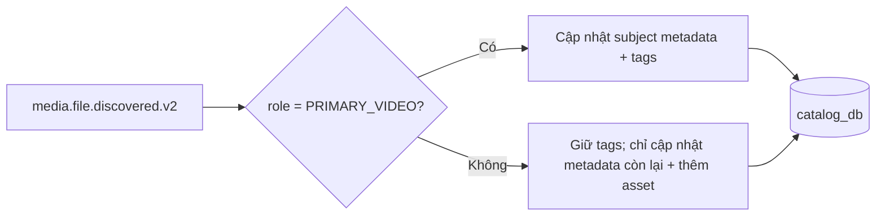

# FT-040 — Primary video tag ownership — Design

## Quyết định

`tagNames` trong `media.file.discovered.v2` là metadata cấp subject nhưng chỉ có
authority khi event có `role=PRIMARY_VIDEO`. Catalog vẫn xử lý các metadata khác
theo hành vi hiện tại và vẫn thêm asset phụ. Khi event không phải primary video,
Catalog giữ nguyên `tagNames` hiện có.

## Contract và consistency

Không đổi event version hoặc payload. Đây là semantic clarification tương thích
ngược: producer cũ vẫn gửi cùng field, consumer mới bỏ qua `tagNames` của asset
phụ. Catalog tiếp tục dedupe theo `eventId` và ghi outbox cùng transaction.

## Rủi ro và rollback

Rủi ro chính là dữ liệu legacy đã bị xóa tag; code fix không tự phục hồi dữ liệu.
Rollback chỉ cần revert consumer/domain change; không có migration.
