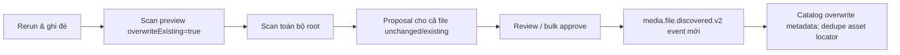

# FT-041 — Scan rerun overwrite — Design

## Quyết định

`POST /api/v2/scans/previews` nhận field additive `overwriteExisting` mặc định `false`.
Khi `true`, Scan materialize toàn bộ staging vào reconciliation set và giữ proposal
`EXACT_ASSET_EXISTS`. Review/approval và transactional outbox vẫn là write gate.

## Contract và consistency

REST thay đổi additive; client cũ không gửi field tiếp tục scan changed-only. Kafka
payload/version không đổi. Approval của proposal rerun tạo `eventId` mới nên Catalog
không loại bởi processed-event dedupe. Canonical mutation và Catalog outbox vẫn cùng transaction.

## Failure và rollback

Rerun có workload lớn tương đương cold scan; vẫn dùng chunk, lease và bounded Catalog
policy hiện có. Rollback bằng bỏ field/action; không có migration hay data rollback.
