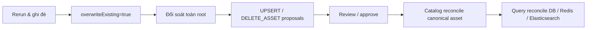

# FT-041 — Scan rerun overwrite — Design

## Quyết định

`POST /api/v2/scans/previews` nhận field additive `overwriteExisting`, mặc định `false`.
Khi `true`, Scan materialize toàn bộ staging và phát hiện inventory `PRESENT → MISSING`.
Review/approval và transactional outbox vẫn là write gate.

## Contract và consistency

File còn tồn tại dùng `media.file.discovered.v2`. File biến mất tạo `DELETE_ASSET`; sau approve
Scan phát `media.file.removed.v1` theo locator. Catalog xóa asset, phát snapshot changed nếu subject
còn asset hoặc `media.subject.deleted.v1` nếu asset cuối cùng biến mất. Query dùng durable search
outbox để xóa Elasticsearch và evict Redis sau commit.

Tombstone locator tại Catalog và tombstone version tại Query chặn event cũ đến đảo thứ tự làm
asset/subject sống lại. Mọi consumer dedupe theo `eventId`; mutation và outbox cùng transaction.

## Failure và rollback

Rerun có workload tương đương cold scan, vẫn dùng chunk/lease hiện có. Migration là append-only và
không xóa dữ liệu. Dừng consumer mới sẽ giữ event trong Kafka/outbox để xử lý lại sau khi khôi phục.
