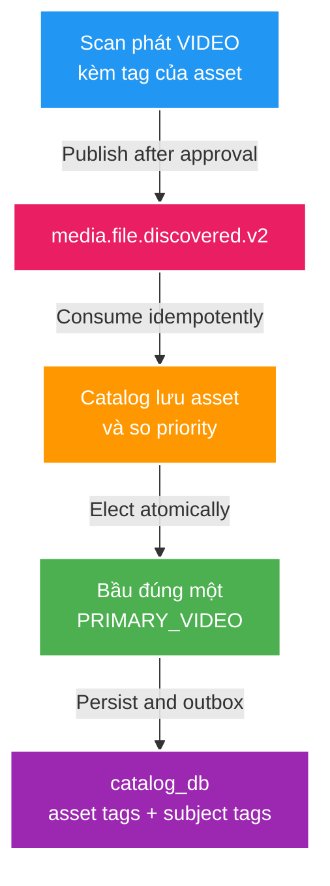

# FT-042 — Primary video election — Design

## High Level Design

## Quyết định nghiệp vụ

Priority chỉ có hai mức: video không tag cao hơn video có tag. Nếu chưa có primary thì
candidate video đầu tiên thắng. Nếu priority bằng nhau thì giữ primary hiện tại. Marker như
`Best` chỉ là tag của file, không tự xác định nguồn gốc hay derivative.

Catalog là owner election vì chỉ Catalog thấy toàn bộ asset của subject. Election, đổi role,
materialize subject tags và outbox nằm trong cùng transaction. Khi xóa primary, Catalog chạy lại
cùng comparator trên các video còn lại.

## Contract và compatibility

Giữ event type `media.file.discovered.v2`. Producer mới gửi `role=VIDEO`; consumer chấp nhận cả
`VIDEO` và legacy `PRIMARY_VIDEO`. `tagNames` được làm rõ là tags của video candidate; Catalog
materialize subject tags từ primary được bầu. Đây là semantic evolution tương thích payload.

## Data ownership và migration

Catalog thêm `media_asset_tag(subject_id, asset_id, display_name)` trong `catalog_db`. Không có
cross-database write. Migration chỉ thêm bảng; dữ liệu hiện hữu không tự backfill trong task này.

## Failure, idempotency và rollback

Catalog vẫn dedupe theo `eventId`. Unique partial index tiếp tục bảo đảm tối đa một
`PRIMARY_VIDEO`. Rollback code có thể giữ bảng mới không sử dụng; producer cũ vẫn tương thích.
