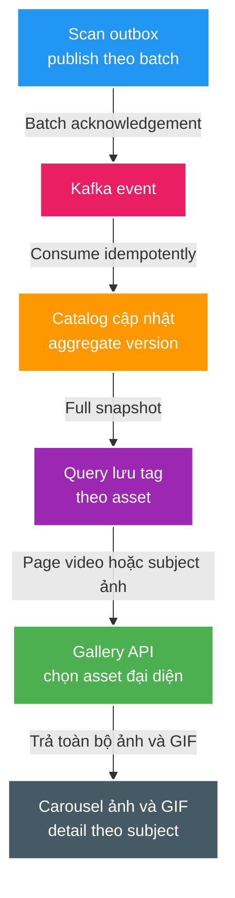

# FT-043 — Video Gallery và throughput event — Design

## High Level Design

## Business và ownership

`media_asset.tagNames` là canonical tag của từng video. `media_subject.tagNames` được giữ để tương thích contract cũ,
nhưng Gallery mới không đọc hoặc lọc theo trường này. Subject là aggregate liên kết video, image và GIF.

Gallery chọn card theo video asset trong đúng `storageKey` được yêu cầu. Nếu một subject có asset trong root nhưng
không có video trong chính root đó, Gallery tạo đúng một card cho subject và chọn asset đại diện theo thứ tự `IMAGE`,
rồi `GIF`, rồi path và UUID. Cách fallback theo subject tránh biến album năm ảnh thành năm card trùng metadata.

Card hydrate selected video nếu có và toàn bộ `IMAGE`/`GIF` cùng subject theo role/path/UUID. Vì ảnh bìa và GIF có
thể nằm ở root liên kết khác video, response không cắt danh sách theo `rootKey`; `rootKey` chỉ quyết định card nào
tham gia page. `thumbnailAssetId` trỏ tới ảnh/GIF đầu tiên; `videoAssetId` là `null` cho card ảnh. Detail vẫn lấy theo
`subjectId` và trả toàn bộ asset.

## Contract và compatibility

- Thêm additive `tagNames` vào `AssetSnapshot` của `media.subject.changed.v1`; consumer cũ bỏ qua field mới.
- Giữ `GET /api/v2/query/videos` để tương thích FE; mở rộng semantics thành Gallery page gồm video card và fallback
  subject card cho root chỉ có ảnh/GIF.
- `id` là asset đại diện ổn định; `videoAssetId` trở thành nullable. `assets` mở rộng additive từ compact pair sang
  selected video cộng toàn bộ `IMAGE`/`GIF`, nên consumer cũ vẫn có thể bỏ qua phần tử dư.
- Query thêm bảng collection tag theo asset và index phục vụ root/role.

## Throughput, failure và idempotency

Outbox publisher gửi toàn bộ claimed batch trước, sau đó chờ acknowledgement theo từng future. Kafka vẫn giữ ordering
theo partition key; database đánh dấu từng outbox record độc lập. Catalog chủ động làm dirty parent khi child asset đổi,
để `@Version` không bị tái sử dụng và unique `(subject_id, subject_version)` không biến record hợp lệ thành poison event.
Đổi primary có thể cần hai flush để thỏa unique partial index tại từng statement; contract chỉ yêu cầu version tăng đơn điệu,
không yêu cầu liên tiếp không có khoảng trống.
