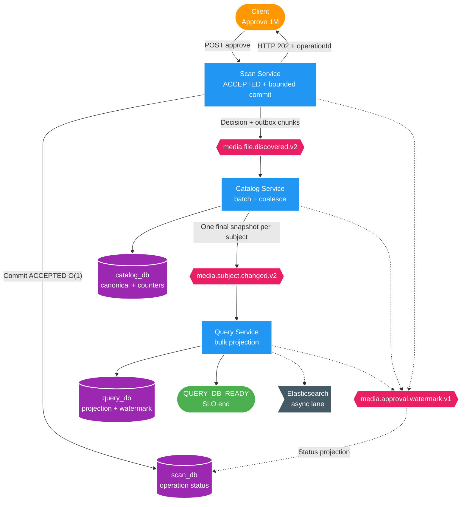

# FT-044 — Design: SC-01 BT-09A Operation Contract & Watermark

## 1. High Level Design

Diagram trả lời câu hỏi: operation đi từ lúc được accept tới `QUERY_DB_READY` bằng completion manifest
cardinality thấp như thế nào?



## 2. Lifecycle và ownership

| Stage | Durable owner | Contract |
| --- | --- | --- |
| `ACCEPTED` | Scan | Operation row commit O(1), trả HTTP `202`; đây là SLO start. |
| `APPROVAL_COMMITTED` | Scan | `scanCommittedRecordCount = expectedRecordCount`; decision + outbox atomic theo chunk. |
| `CATALOG_COMMITTED` | Catalog | Đủ unique discovery event; final snapshot count được chốt sau coalesce. |
| `QUERY_DB_READY` | Query | Đủ unique subject snapshot, Query DB + watermark + search outbox commit; SLO end. |
| `SEARCH_READY` | Query search worker | Elasticsearch đã index đủ; không chặn Query DB. |

Scan là owner tracking API và giữ projection trạng thái trong `scan_db`. Catalog/Query không ghi ngược
`scan_db`; mỗi stage phát transactional control event. `queryDbReadyAt` là timestamp Query commit, không phải
timestamp Scan consume control event.

## 3. Completion protocol tối ưu SLO

- `media.approval.watermark.v1` dùng key `operationId`, chỉ có O(stage) event cho mỗi operation.
- Progress counter flush theo bounded batch, không update per-record.
- Scan manifest mang `expectedRecordCount`; Catalog chờ unique processed count bằng expected count.
- Catalog phát đúng một v2 snapshot cho mỗi affected subject, sau đó manifest mang `expectedSubjectCount`.
- Query dedupe theo `eventId`, đếm unique `(operationId, subjectId)` và chỉ ready khi count bằng expected.
- Manifest/data nằm ở topic khác nhau có thể đến lệch thứ tự; equality gate giải quyết hội tụ, không giả định
  global Kafka ordering.

## 4. Event v2 và idempotency

`media.subject.changed.v2` là full final snapshot và là runtime target duy nhất. Payload bắt buộc có
`operationId`, `batchId`, `subjectId`, `subjectVersion`; tracing nằm ở optional Kafka headers.

Query target upsert:

```sql
ON CONFLICT (subject_id) DO UPDATE
SET ...
WHERE EXCLUDED.subject_version > query_subject.projection_version;
```

Duplicate cùng version là no-op; không dùng `>=`. Study project thay thẳng v1 bằng v2 ở BT-09D/E,
không dual-publish và reset local topic/projection trước qualification.

## 5. Cache, DLT và terminal state

- Query không `DEL` cache theo từng subject. Projection commit tạo cache generation mới; Redis switch O(1).
- Redis lỗi thì cache bypass/fallback Query PostgreSQL, không chặn `QUERY_DB_READY`.
- Poison event đi DLT để batch khác tiếp tục nhưng operation chuyển `BLOCKED`; unresolved DLT cấm ready.
- Replay hội tụ bằng event dedupe + version guard. Unrecoverable operation chuyển `FAILED`; user cancellation
  chuyển `CANCELLED`.

## 6. Tracking API

- `POST /api/v2/scans/runs/{scanRunId}/approve` → `202 OperationAccepted`.
- `GET /api/v2/scans/operations/{operationId}/status` → durable status projection.

Ví dụ hợp SLO:

```json
{
  "operationId": "019ffb4f-2222-7aaa-8bbb-222222222222",
  "status": "QUERY_DB_READY",
  "expectedRecordCount": 1000000,
  "scanCommittedRecordCount": 1000000,
  "catalogProcessedRecordCount": 1000000,
  "expectedSubjectCount": 148321,
  "queryProjectedSubjectCount": 148321,
  "unresolvedDltCount": 0,
  "acceptedAt": "2026-08-15T22:00:00Z",
  "queryDbReadyAt": "2026-08-15T22:00:25Z"
}
```
