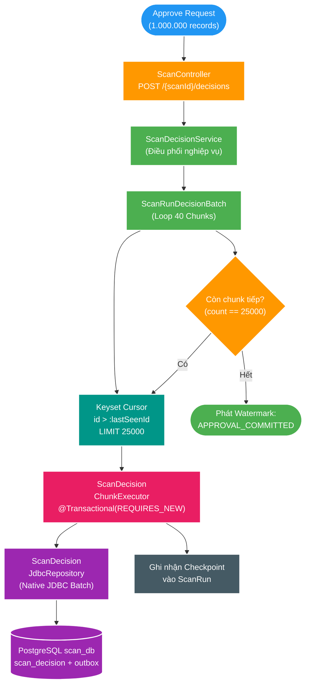

# FT-045 — Design: Scan Decision & Outbox Chunking (BT-09B)

Status: `IN-REVIEW`  
Owner: `scan-service`  
Module: `apps/scan-service/src/main/java/com/filemngt/v2/scan/application/decision/`  
Persistence: `apps/scan-service/src/main/java/com/filemngt/v2/scan/adapter/out/persistence/decision/`


---

## 1. High Level Architecture & Data Flow



---

## 2. Thiết kế chi tiết từng thành phần

### 2.1. `ScanDecisionJdbcRepository` (Native JDBC Batching)
Thay vì sử dụng Spring Data JPA Repository hydrate Entity vào Hibernate Session:
- Đọc theo Keyset Cursor siêu nhẹ dạng DTO / Record:
  ```sql
  SELECT id, scan_run_id, relative_path, file_size_bytes, modified_at, proposal_type, metadata_json
  FROM scan_proposal
  WHERE scan_run_id = :scanId AND id > :cursorId
  ORDER BY id ASC
  LIMIT 25000;
  ```
- Thực thi Batch Insert vào `scan_decision`:
  ```sql
  INSERT INTO scan_decision (proposal_id, decision, event_id, decided_at)
  VALUES (?, ?, ?, ?)
  ON CONFLICT (proposal_id) DO NOTHING;
  ```
- Thực thi Batch Insert vào `scan_outbox_event` (chỉ khi `decision = 'APPROVE'`):
  ```sql
  INSERT INTO scan_outbox_event (id, aggregate_type, aggregate_id, event_type, payload, created_at, published_at)
  VALUES (?, 'SCAN_PROPOSAL', ?, 'media.file.discovered.v2', ?::jsonb, ?, NULL)
  ON CONFLICT (id) DO NOTHING;
  ```

---

### 2.2. `ScanDecisionChunkExecutor` (Transaction Isolation)
- Đảm bảo tính cô lập độc lập của từng chunk với `@Transactional(propagation = Propagation.REQUIRES_NEW)`.
- Thực hiện:
  1. Lấy 25.000 proposals tiếp theo qua cursor.
  2. Lọc Idempotency (bỏ qua proposal đã có decision).
  3. Sinh UUIDv7 cho các event của proposal được duyệt (`APPROVE`).
  4. Thực thi Native JDBC Batch cho cả `scan_decision` và `scan_outbox_event`.
  5. Commit Transaction $\implies$ Giải phóng buffer pool, ghi nhận WAL 30MB.
  6. Trả về `lastProcessedId` và số lượng bản ghi đã xử lý.

---

### 2.3. `ScanRunDecisionBatch` (Orchestrator)
- Điều phối vòng lặp:
  ```java
  UUID cursor = null;
  int totalDecided = 0;
  while (true) {
      ChunkResult result = chunkExecutor.executeChunk(scanId, decision, cursor, 25000);
      totalDecided += result.decidedCount();
      if (result.isLastChunk()) {
          break;
      }
      cursor = result.lastId();
  }
  // Cập nhật watermark APPROVAL_COMMITTED
  watermarkPublisher.publishApprovalCommitted(scanId, totalDecided);
  ```

---

## 3. Failure Modes, Idempotency & Recovery

| Failure Scenario | Cơ chế xử lý & Invariant bảo vệ |
| :--- | :--- |
| **Crash giữa chừng (ví dụ ở Chunk 15/40)** | 14 chunks trước đó đã commit bền vững. Khi retry, Keyset Cursor tiếp tục từ proposal chưa có decision, không xử lý lại 14 chunks cũ. |
| **Duplicate HTTP Request** | `ON CONFLICT (proposal_id) DO NOTHING` bảo đảm không sinh trùng decision hay trùng outbox event. |
| **PostgreSQL Out of Disk / Timeout** | Mỗi chunk timeout cục bộ 5 giây; rollback chỉ ảnh hưởng tối đa 25.000 records của chunk hiện tại. |
| **Lease Fence Expiry** | Trước khi chạy chunk, kiểm tra lease active của scan run; nếu mất lease thì dừng ngay lập tức. |
