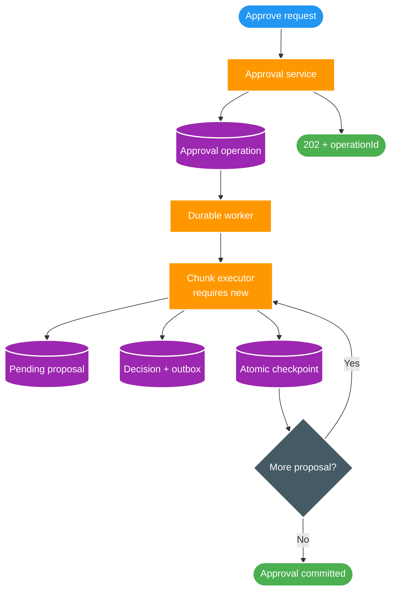

# FT-045 — Design: Durable Scan Approval & Decision Chunking

Owner: `scan-service`
Database: `scan_db`
Contract: `scan-v1.yaml`, `media.file.discovered.v2`, `media.file.removed.v1`

## 1. High Level Design

Sơ đồ trả lời câu hỏi: request approve rời HTTP như thế nào nhưng vẫn commit đủ decision/outbox và tự
phục hồi sau restart?

| Thành phần | Trách nhiệm |
| --- | --- |
| Approval service | Khóa scan run, chặn active duplicate, đếm pending và commit `ACCEPTED`. |
| Durable worker | Claim/reclaim operation, điều phối liên tục các chunk, retry có giới hạn. |
| Chunk executor | Transaction riêng cho read → decision/outbox → projection → checkpoint. |
| Operation row | Source of truth cho cursor, count, lease, attempt và terminal state. |

## 2. Data model và ownership

Migration FT-045 tạo `scan_approval_operation` trong `scan_db`:

- Identity: `id`, `scan_run_id`.
- Lifecycle: `status`, `accepted_at`, `started_at`, `approval_committed_at`, `finished_at`.
- Progress: `expected_record_count`, `scan_committed_record_count`, `source_batch_count`,
  `last_proposal_id`.
- Recovery: `lease_owner`, `lease_until`, `attempt_count`, `last_error`, `failure_code`.
- Future status projection fields: Catalog/Query/Search counters và `unresolved_dlt_count`.

Partial unique index trên `scan_run_id` chặn hai operation `ACCEPTED`/`RUNNING`. Claim index bao phủ
`ACCEPTED` và `RUNNING` có lease hết hạn. `scan_decision` và `scan_outbox_event` nhận nullable
`operation_id`; outbox nhận thêm `batch_id`. Các row từ single-decision cũ vẫn hợp lệ với metadata null.

Không có cross-database read/write. Catalog và Query chỉ nhận metadata qua Kafka ở lát sau.

## 3. Transaction và chunk algorithm

`ScanRunDecisionBatch` không mang transaction. Nó được worker gọi và gọi sang bean
`ScanDecisionChunkExecutor`; external proxy call bảo đảm `REQUIRES_NEW` thực sự có hiệu lực.

Mỗi chunk:

1. Lock operation row; xác minh `status=RUNNING`, đúng `lease_owner`, lease còn hạn.
2. Đọc tối đa `chunkSize` proposal `PENDING` bằng
   `id > :lastProposalId ORDER BY id LIMIT :chunkSize`.
3. Nếu batch rỗng, chỉ chuyển `APPROVAL_COMMITTED` khi committed count bằng expected count.
4. Với batch có dữ liệu, tạo event ID một lần; cùng ID được ghi vào decision và outbox.
5. Batch ID là `scan-output-%05d`, lấy từ `source_batch_count + 1`; retry transaction bị rollback giữ cùng
   ordinal.
6. Batch insert decision và outbox, set-based update review projection, rồi conditional update checkpoint
   và gia hạn lease trong cùng transaction.
7. Conditional checkpoint update trả `0` nghĩa worker mất fence; toàn chunk rollback.

Không dùng `ON CONFLICT DO NOTHING` để che race. Active operation guard ngăn mutation cạnh tranh; unique
constraint vẫn là safety net và conflict làm rollback transaction.

## 4. API và event contract

- `POST /api/v2/scans/runs/{scanRunId}/approve` trả `202 ApprovalOperationAccepted`.
- `GET /api/v2/scans/operations/{operationId}/status` trả durable projection.
- `media.file.discovered.v2` và `media.file.removed.v1` nhận thêm nullable `operationId`, `batchId` để giữ
  compatibility cho single decision; chúng bắt buộc non-null đối với event do approval operation tạo.
- Partition key hiện hành không đổi. `operationId` không thay thế business ordering key.

`APPROVAL_COMMITTED` trong FT-045 là durable local stage state. BT-09C ghi/publish control watermark và
drain data outbox liên tục; HTTP không chờ Kafka.

## 5. Control-flow partitions

| Partition | Kết quả/side effect |
| --- | --- |
| Scan run không tồn tại/chưa terminal | `404`/`409`, không tạo operation. |
| Active operation đã tồn tại | `409`, không đếm hoặc tạo duplicate. |
| `expectedRecordCount=0` | Worker claim rồi commit `APPROVAL_COMMITTED`, `sourceBatchCount=0`. |
| `1..chunkSize` | Một chunk commit, lần read kế tiếp rỗng và terminal equality gate. |
| Exact multiple | N chunk đầy + một boundary read rỗng; không sinh empty batch side effect. |
| Partial chunk | Commit phần còn lại rồi terminal ở boundary read kế tiếp. |
| Crash trước commit | Chunk rollback; lease hết hạn và worker khác đọc lại cùng cursor/batch ordinal. |
| Crash sau commit | Cursor/count đã commit cùng data; reclaim bắt đầu từ checkpoint kế tiếp. |
| Timeout/lease loss | Rollback chunk; retry có giới hạn, sau đó `FAILED`. |
| Cardinality mismatch | Không phát ready; operation retry/`FAILED` với failure code ổn định. |

## 6. Liveness và vận hành

- Budget: statement/transaction timeout `5s` < lease `30s` < total operation deadline `120s`.
- Mỗi chunk renew lease. Scheduler ngừng nhận việc khi application shutdown; không chủ động release lease
  trong `@PreDestroy`. Restart dùng lease expiry để reclaim.
- Log mang `operationId`, `scanRunId`, batch ordinal và committed count; không log payload/path.
- Metric/benchmark qualification thuộc BT-09G; các số 90ms/chunk, WAL/chunk hoặc 5s chỉ là hypothesis/budget
  trước runtime evidence.

## 7. Rollback

Rollback source bằng revert producer/API/worker cùng migration kế tiếp; không sửa migration đã áp dụng.
Vì study environment cho phép reset local data/topic, event payload v2 không cần dual-publish. Operation
đang `ACCEPTED`/`RUNNING` phải được chuyển `CANCELLED` hoặc để worker cũ kết thúc trước rollback runtime.
