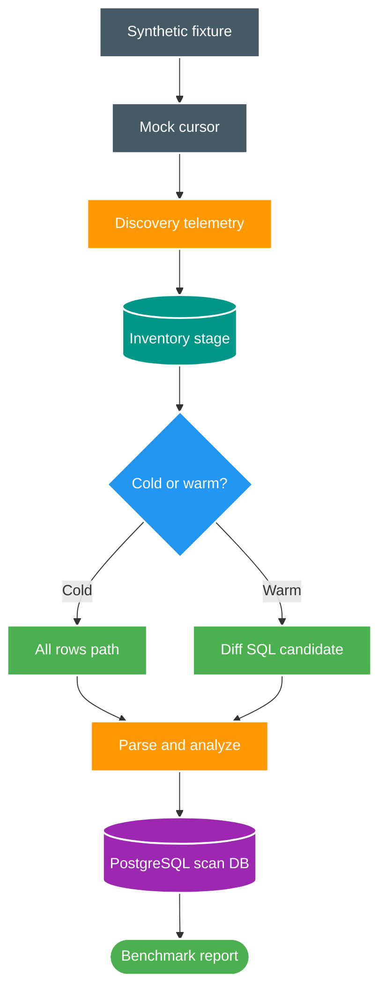

# FT-046 — Design: Scan-Core Pipeline Optimization & Benchmark Evidence

Status: `READY`  
Owner: `scan-service`  
Module: `apps/scan-service/`

## 1. Thiết kế tổng quát

Benchmark loại filesystem và Catalog I/O bằng fixture/cursor mock, nhưng vẫn chạy production orchestration, parsing, reconciliation và PostgreSQL persistence của Scan Service.

## 2. Data và query ownership

`scan-service` sở hữu `scan_inventory_stage`, `scan_inventory_diff_stage` và `scan_file_inventory`. FT chỉ thay đổi cách đo hoặc chọn SQL trong boundary này. PostgreSQL vẫn là source of truth; staging vẫn là scratch state và phải cleanup theo run.

SQL diff mới phải bảo toàn điều kiện hiện tại: một row chỉ được coi là unchanged khi cùng identity, `state = 'PRESENT'`, cùng size và cùng modified time. Không chấp nhận anti-join chỉ kiểm tra row không tồn tại.

Sau khi materialize, `scan_inventory_diff_stage.is_new` là phân loại cố định của từng row trong scan run:

- `true`: inventory chưa tồn tại; chỉ được xử lý bởi nhánh `INSERT`.
- `false`: inventory đã tồn tại nhưng missing hoặc metadata/state thay đổi; chỉ được xử lý bởi nhánh `UPDATE`.

Việc phân loại chỉ join `scan_file_inventory` một lần trong `prepareReconciliation`. Các chunk reconciliation sau đó đọc stage theo keyset range và không lặp lại anti-join inventory.

## 3. Failure và consistency

- Mỗi chunk tiếp tục giữ transaction boundary hiện tại.
- Checkpoint chỉ tăng sau commit thành công.
- `is_new` được ghi cùng transaction materialize và không thay đổi trong các chunk sau đó.
- SQL candidate sai row count hoặc làm mất modified/missing case phải bị loại.
- Benchmark failure phải chứng minh staging cleanup, cursor close và terminal state.
- Không dùng số đo mock I/O để kết luận filesystem hoặc cross-service SLO.

## 4. Quyết định trì hoãn

Cold direct-stream và producer-consumer pipeline chưa thuộc FT này. Chúng chỉ mở sau khi có phase timing chính xác và regression evidence cho retry, lease fencing, ordering và bounded memory.
