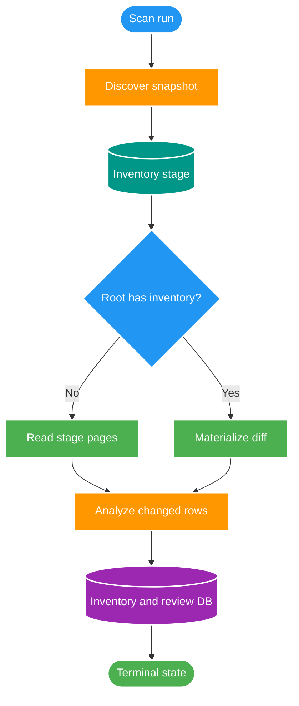

# FT-047 — Design: Scan-Core Cold Path Without Diff Stage

Status: `READY`  
Owner: `scan-service`  
Persistence owner: `scan_db`

## 1. High-level flow

## 2. Invariant

`scan_inventory_stage` vẫn là complete snapshot cho run. Chỉ `scan_inventory_diff_stage` được bỏ qua khi root được xác nhận không có inventory. Warm path không được dùng cold shortcut.

Mỗi analyzed page vẫn đi qua chunk transaction hiện tại: inventory write, proposal/issue COPY và checkpoint phải commit cùng nhau. Finalization vẫn dùng snapshot để xử lý missing semantics khi áp dụng.

## 3. Failure và retry

- Nếu root inventory được tạo bởi run khác sau mode decision, root-level scan exclusivity hoặc conditional mode check phải ngăn cold write sai semantics.
- Nếu chunk rollback, stage snapshot vẫn còn đủ để retry.
- Nếu lease mất, chunk hiện tại rollback và run chuyển terminal theo failure handler.
- Cleanup phải xóa stage và diff stage theo run, kể cả cold path không có diff rows.

## 4. Rủi ro

Rủi ro chính là mode decision race và retry sau partial persistence. FT không được mở rộng thành direct-stream cho tới khi hai rủi ro này có test evidence.
