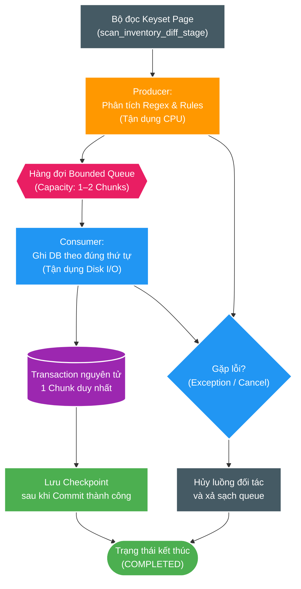

# FT-048 — Thiết kế: Phân tích & Đồng bộ Pipeline Gối đầu (Scan-Core Pipelined Reconciliation)

Trạng thái: `READY`  
Owner: `scan-service`

## 1. Luồng kiến trúc tổng thể (High-level flow)

## 2. Mô hình nhất quán (Consistency model)

- Hàng đợi (Queue) chỉ mang các đối tượng chunk bất biến (immutable) đã được CPU phân tích xong.
- Consumer là thành phần duy nhất được phép gọi `ScanChunkCommitter` để ghi vào cơ sở dữ liệu.
- Thứ tự `chunkIndex` là tuyệt đối nghiêm ngặt; chunk sau không bao giờ được phép checkpoint trước khi chunk trước commit thành công.
- Việc gia hạn Lease (Heartbeat) bám sát tiến độ đã commit thật vào DB. Việc CPU parse xong một chunk trong bộ nhớ không được tính là tiến độ bền vững.
- Dung lượng hàng đợi (Queue capacity) thuộc ngân sách bộ nhớ Heap và bắt buộc phải được đo đạc, giới hạn chặt chẽ (mặc định 1–2 chunk).

## 3. Quản lý sự cố và độ sống còn (Failure and liveness)

- **Khi Producer gặp lỗi (Exception)**: Hủy ngay toàn bộ công việc đang chờ trong queue và các tác vụ đang chạy, sau đó kích hoạt luồng xử lý thất bại hiện có để chuyển run sang `FAILED`.
- **Khi Consumer gặp lỗi (Exception)**: Dừng ngay việc nạp thêm dữ liệu từ Producer và ngăn chặn xuất bản các checkpoint phía sau.
- **Khi hết hạn Lease (Lease Expiry)**: Lập tức rào chắn (fence) transaction hiện tại; toàn bộ kết quả của Producer quá hạn bị hủy bỏ.
- **Khi tắt ứng dụng (Graceful Shutdown)**: Dừng nhận dữ liệu mới, xả sạch hoặc hủy theo chính sách, và tuyệt đối không bao giờ báo thành công nếu chưa đối soát đầy đủ mọi chunk đã commit.

## 4. Rủi ro & Điều kiện đánh đổi (Risk)

- Việc chạy gối đầu (Overlap) có thể mang lại lợi ích không đáng kể nếu thời gian ghi đĩa của PostgreSQL chiếm ưu thế tuyệt đối ($> 80-90\%$).
- Tính năng này bắt buộc phải bị từ chối hoặc hoãn lại nếu chi phí bộ nhớ queue, áp lực gia hạn lease hoặc chi phí đồng bộ luồng (coordination overhead) lớn hơn lợi ích đo đạc thực tế mang lại.
