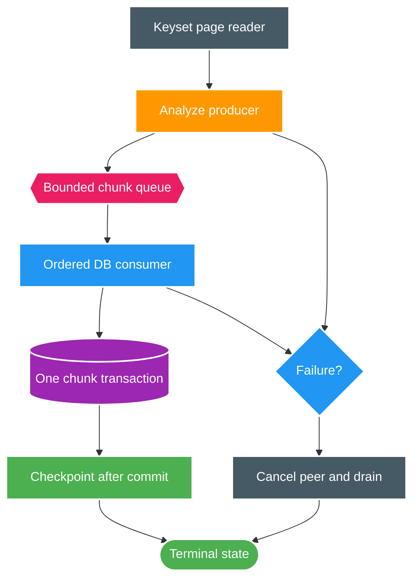

# FT-048 — Design: Scan-Core Pipelined Reconciliation

Status: `READY`  
Owner: `scan-service`

## 1. High-level flow

## 2. Consistency model

The queue carries analyzed, immutable chunk data. The consumer is the only component allowed to call the chunk committer. `chunkIndex` ordering is explicit; a later chunk cannot checkpoint before an earlier chunk commits.

Lease renewal follows committed progress. Parsing a chunk does not make it durable progress. Queue capacity is part of the memory budget and must be measured.

## 3. Failure and liveness

- Producer exception cancels queued and in-flight work, then invokes the existing failure path.
- Consumer exception stops new production and prevents later checkpoint publication.
- Lease expiry fences the current transaction; stale producer output is discarded.
- Shutdown stops intake, drains or cancels according to policy, and never reports success before all committed chunks are accounted for.

## 4. Risk

Overlap may be negligible when PostgreSQL persistence dominates. The feature must be rejected or deferred if queue memory, lease pressure or coordination cost exceeds the measured gain.
