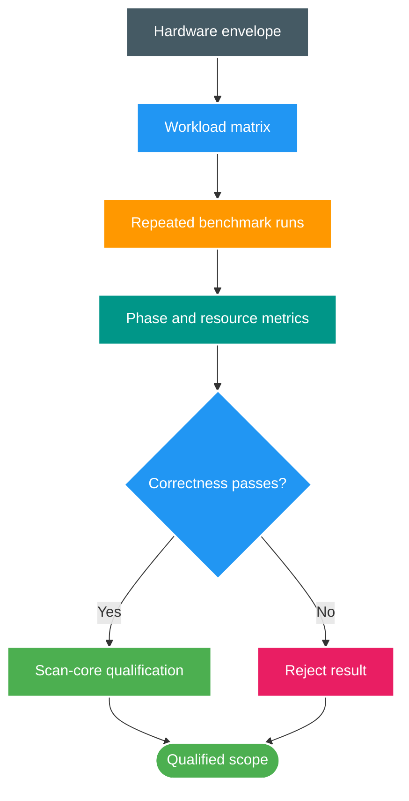

# FT-049 — Design: Scan-Core Scale Qualification

Status: `READY`  
Owner: `scan-service`

## 1. Qualification flow

## 2. Evidence boundary

The benchmark includes production Scan Service orchestration, synthetic cursor, parsing, reconciliation and PostgreSQL persistence. Filesystem and Catalog I/O remain excluded by design. The report must state this boundary beside every headline number.

The result is a capacity observation for one environment, not a universal production SLO. Cross-service approval readiness requires a separate end-to-end benchmark with operation watermark and downstream backlog evidence.

## 3. Decision rules

- Correctness failure invalidates the performance result.
- A single fast run is not a qualification.
- Cold and warm results are separate populations.
- Improvements must be compared against the immediately preceding FT implementation.
- A regression in warm reconciliation cannot be hidden by a faster cold run.
