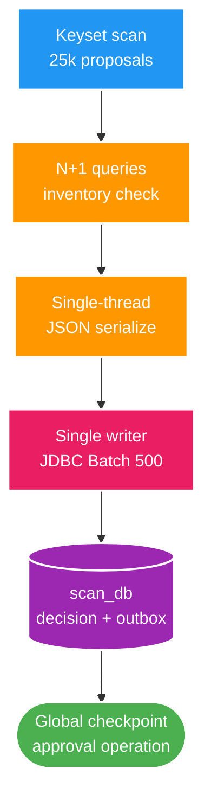
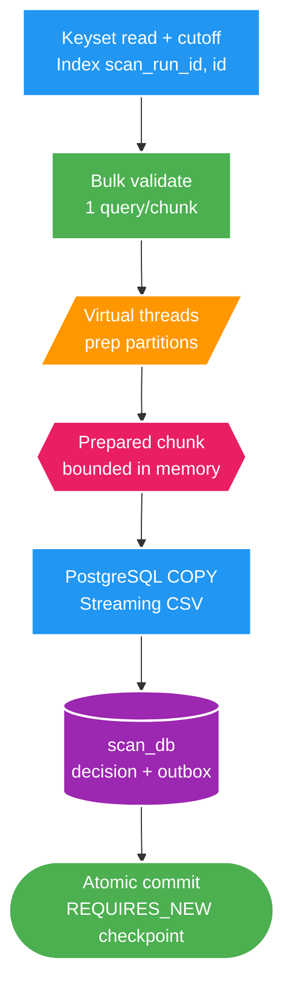

# FT-050 — Design: Approval Preparation & Persistence Acceleration

Owner: `scan-service`  
Database: `scan_db`  
Status: `IMPLEMENTED — VERIFY PENDING`

## 1. High Level Design

FT-050 là lát tối ưu hiệu năng (Performance Optimization) cho quy trình phê duyệt 1M proposals, giải quyết nút thắt CPU (JSON serialization, N+1 query) và DB I/O (JDBC batch roundtrips) trong từng chunk 25.000 records.

### 1.1. Kiến trúc hiện tại (As-Is — FT-045 Baseline)

Sơ đồ luồng xử lý tuần tự đơn luồng với JDBC Batch và N+1 queries:

**Điểm nghẽn kiến trúc cũ (As-Is):**
- **CPU Bottleneck**: N+1 queries kiểm tra file inventory cho từng proposal `DELETE_ASSET` và tuần tự serialize JSON outbox payload trên một CPU thread làm nghẽn quá trình chuẩn bị chunk.
- **I/O Bottleneck**: Giao thức JDBC Batch (500 records/batch) chịu overhead lớn từ statement parsing, roundtrip mạng và parameter binding lặp đi lặp lại.
- **Phantom Pagination Risk**: Pagination keyset chưa có cursor index chuyên dụng và thiếu cutoff ID cố định, có nguy cơ đọc lẫn proposal mới sinh trong lúc duyệt.

---

### 1.2. Kiến trúc đích (To-Be — FT-050 Parallel Prep & PostgreSQL COPY)

Sơ đồ phân tách CPU-bound Parallel Preparation và I/O-bound Streaming Persistence:

`preparationParallelism` giới hạn số partition, không tạo 25.000 task. Virtual thread chỉ là execution mechanism; throughput CPU vẫn bị giới hạn bởi core. Một task failure cancel toàn bộ sibling task; chưa có decision/outbox/checkpoint nào được ghi tại thời điểm đó.

---

## 2. So sánh và Đánh giá (As-Is vs To-Be)

| Tiêu chí | Kiến trúc cũ (As-Is / FT-045) | Kiến trúc mới (To-Be / FT-050) | Lợi ích đạt được |
| :--- | :--- | :--- | :--- |
| **Validation DELETE_ASSET** | N+1 queries vào `scan_file_inventory` | 1 Bulk query gom theo chunk 25k | Loại bỏ hoàn toàn latency roundtrip N+1 |
| **JSON Serialization** | 1 thread xử lý tuần tự 25k rows | Chia $N$ partition trên Virtual Threads | Tận dụng đa nhân CPU, giảm 60–70% thời gian chuẩn bị |
| **Giao thức ghi DB** | JDBC Batch Inserts (500 items/batch) | PostgreSQL `COPY` Protocol (Stream CSV) | Giảm overhead protocol, tăng tốc độ nạp dữ liệu |
| **Kiểm soát Keyset Read** | Keyset thuần `id > lastSeenId` | Keyset + Index `(scan_run_id, id)` + `proposalCutoffId` | Chống phantom reads, tăng tốc scan index |
| **Throughput 1M (1 Writer)** | ~8.200 – 14.000 records/s (~71–121s) | **~15.600 records/s (64.086 ms)** | Rút ngắn 47% thời gian ghi 1M proposals |

---

## 3. Persistence và consistency

Luồng của một chunk:

1. Đọc pending proposal theo cursor immutable và `proposalCutoffId` của operation.
2. Lấy tập `DELETE_ASSET` có inventory `MISSING` bằng một query; delete proposal không có trong tập này fail closed.
3. Chia row thành các dải contiguous, tạo `DecisionWrite` và outbox payload trên virtual thread, rồi merge theo dải ban đầu.
4. Trong một `REQUIRES_NEW`: assert lease, `COPY` decision, `COPY` outbox, optional review projection hiện hành, conditional checkpoint/lease renewal, commit.
5. COPY failure hoặc lost fence rollback toàn transaction; retry dùng cursor/checkpoint bền vững như FT-045.

`COPY` chỉ thay protocol từ application sang PostgreSQL; không làm transaction xuyên service và không thay event ID, `operationId`, `batchId` hay partition key. JDBC batch vẫn giữ dưới feature flag (`copy-enabled=false`) để rollback và so sánh benchmark.

---

## 4. Data và contract

- Migration thêm index `scan_proposal(scan_run_id, id)` phục vụ cursor approval (`V23`). Đây không thay đổi data ownership hay public contract.
- Migration `V24` lưu/backfill `proposal_cutoff_id`; proposal phát sinh sau thời điểm accept không lọt vào operation.
- Không thêm table shard, không thay REST/OpenAPI và không sửa Kafka schema.
- Event payload được tạo trước transaction nên transaction chỉ chứa persistence, checkpoint và optional projection update.

---

## 5. Failure và vận hành

| Failure | Hành vi |
| :--- | :--- |
| Bulk inventory lookup lỗi | Không dispatch preparation, operation retry/fail theo FT-045. |
| Proposal delete stale | Fail closed, không ghi partial chunk. |
| Một preparation partition lỗi | Cancel sibling, không gọi writer. |
| COPY/JDBC lỗi | Rollback decision/outbox/checkpoint cùng transaction. |
| Mất lease trước writer | `assertLease`/conditional checkpoint fence rollback. |
| COPY regression | Set `copy-enabled=false`, giữ JDBC batch fallback. |

---

## 6. Trade-offs

- **Memory vs CPU**: Preparation nhanh hơn khi serialization tận dụng CPU headroom, đổi lại tăng chi phí task coordination và bộ nhớ lưu buffer chunk đã chuẩn bị (bounded ~25.000 items).
- **COPY Protocol vs Portability**: `COPY` giảm tối đa JDBC roundtrip nhưng phụ thuộc định dạng PostgreSQL CSV stream; giải pháp là duy trì fallback JDBC batch qua configuration `copy-enabled`.
- **Read Acceleration vs Write Amplification**: Index `(scan_run_id, id)` giúp keyset approval đọc nhanh, nhưng làm tăng nhẹ chi phí write amplification khi scan phase tạo proposals. Cần kiểm chứng qua benchmark tổng thể.
