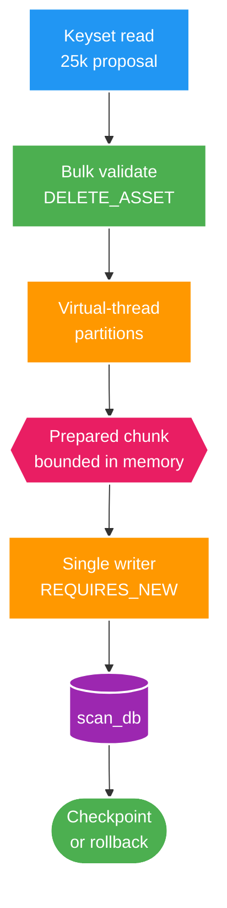

# FT-050 — Design: Approval Preparation & Persistence Acceleration

Owner: `scan-service`  
Database: `scan_db`  
Status: `IMPLEMENTED — VERIFY PENDING`

## 1. High Level Design

Sơ đồ trả lời: làm sao overlap CPU preparation của một chunk với nhiều core nhưng vẫn chỉ có một writer
transactional và không làm proposal/event mất thứ tự?

`preparationParallelism` giới hạn số partition, không tạo 25.000 task. Virtual thread chỉ là execution
mechanism; throughput CPU vẫn bị giới hạn bởi core. Một task failure cancel toàn bộ sibling task; chưa có
decision/outbox/checkpoint nào được ghi tại thời điểm đó.

## 2. Persistence và consistency

Luồng của một chunk:

1. Đọc pending proposal theo cursor immutable và `proposalCutoffId` của operation.
2. Lấy tập `DELETE_ASSET` có inventory `MISSING` bằng một query; delete proposal không có trong tập này fail
   closed.
3. Chia row thành các dải contiguous, tạo `DecisionWrite` và outbox payload trên virtual thread, rồi merge theo
   dải ban đầu.
4. Trong một `REQUIRES_NEW`: assert lease, `COPY` decision, `COPY` outbox, optional review projection hiện
   hành, conditional checkpoint/lease renewal, commit.
5. COPY failure hoặc lost fence rollback toàn transaction; retry dùng cursor/checkpoint bền vững như FT-045.

`COPY` chỉ thay protocol từ application sang PostgreSQL; không làm transaction xuyên service và không thay
event ID, `operationId`, `batchId` hay partition key. JDBC batch vẫn giữ dưới feature flag để rollback và
so sánh benchmark.

## 3. Data và contract

- Migration thêm index `scan_proposal(scan_run_id, id)` phục vụ cursor approval. Đây không thay đổi data
  ownership hay public contract.
- Migration `V24` lưu/backfill `proposal_cutoff_id`; proposal phát sinh sau thời điểm accept không lọt vào operation.
- Không thêm table shard, không thay REST/OpenAPI và không sửa Kafka schema.
- Event payload được tạo trước transaction nên transaction chỉ chứa persistence, checkpoint và optional
  projection update.

## 4. Failure và vận hành

| Failure | Hành vi |
| --- | --- |
| Bulk inventory lookup lỗi | Không dispatch preparation, operation retry/fail theo FT-045. |
| Proposal delete stale | Fail closed, không ghi partial chunk. |
| Một preparation partition lỗi | Cancel sibling, không gọi writer. |
| COPY/JDBC lỗi | Rollback decision/outbox/checkpoint cùng transaction. |
| Mất lease trước writer | `assertLease`/conditional checkpoint fence rollback. |
| COPY regression | Set `copy-enabled=false`, giữ JDBC batch fallback. |

## 5. Trade-offs

- Preparation nhanh hơn khi evidence/serialization có CPU headroom, đổi lại thêm task coordination và một
  chunk prepared trong memory.
- COPY giảm JDBC roundtrip, đổi lại phụ thuộc PostgreSQL CSV encoding; fallback JDBC giữ rollback an toàn.
- Index giúp keyset approval, đổi lại tăng write amplification khi scan tạo proposal; phải benchmark cả hai
  workload trước khi kết luận.
