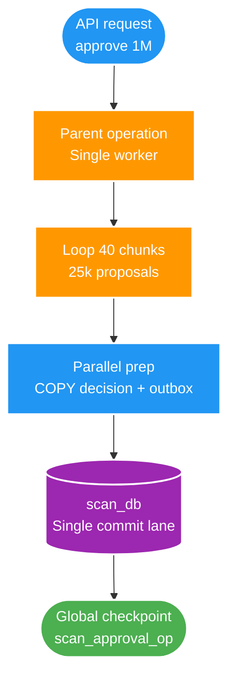
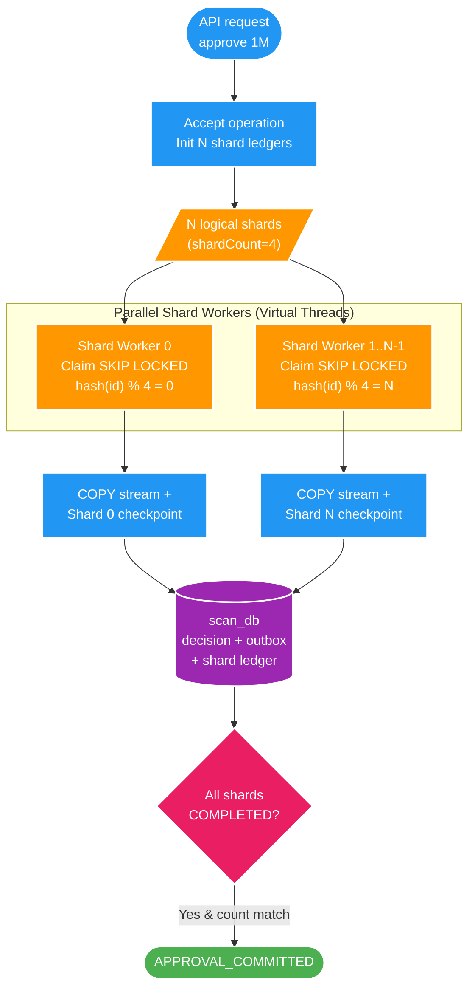

# FT-051 — Design: Logical Approval Sharding

Owner: `scan-service`  
Database: `scan_db`  
Status: `IMPLEMENTED — shardCount=4 DEFAULT; PRODUCTION QUALIFICATION PENDING`  
Brief: [01-brief.md](./01-brief.md)

## 1. High Level Design

FT-051 là lát tái cấu trúc và mở rộng kiến trúc (Scaling & Sharding Architecture), mở rộng năng lực xử lý phê duyệt 1.000.000 proposals từ **1 Single DB Writer** sang **1..N Logical Shard Workers** chạy song song trên Virtual Threads.

### 1.1. Kiến trúc hiện tại (As-Is — FT-050 Single DB Writer)

Sơ đồ thể hiện luồng phê duyệt 1M proposals phụ thuộc vào một luồng ghi DB duy nhất:



**Điểm nghẽn kiến trúc cũ (As-Is):**
- **Single DB Writer Bottleneck**: Toàn bộ 1M proposals đi qua một commit lane duy nhất. Dù preparation đã song song và dùng `COPY`, tốc độ bị giới hạn bởi IOPS và throughput của một kết nối ghi tuần tự (~14.000 – 15.600 records/s, mất 64 – 71 giây).
- **Tranh chấp checkpoint tập trung**: Checkpoint toàn cục trên 1 dòng `scan_approval_operation` tạo điểm nghẽn nếu muốn mở rộng nhiều worker.

---

### 1.2. Kiến trúc đích (To-Be — FT-051 Logical Approval Sharding)

Sơ đồ phân mảnh logic với $N$ Shard Workers độc lập và cơ chế hội tụ tập trung:



Mỗi proposal được gán duy nhất vào shard bằng hàm băm tất định. Mỗi shard worker có lease và cursor riêng, xử lý độc lập và commit checkpoint riêng mà không khóa chéo nhau.

---

## 2. So sánh và Đánh giá (As-Is vs To-Be)

| Tiêu chí | Kiến trúc cũ (As-Is / FT-050) | Kiến trúc mới (To-Be / FT-051) | Lợi ích đạt được |
| :--- | :--- | :--- | :--- |
| **Mô hình xử lý** | 1 Single DB Writer tuần tự | $N$ Logical Shard Workers song song (`shardCount=4`) | Tận dụng tối đa đa nhân CPU và kết nối DB |
| **Phân chia công việc** | Keyset pagination toàn cục | Deterministic hash partition + keyset per shard | Không tranh chấp dữ liệu giữa các worker |
| **Quản lý Checkpoint** | 1 dòng trên `scan_approval_operation` | Checkpoint và Lease độc lập trên từng Shard Ledger | Khắc phục contention, độc lập rollback/retry |
| **Tranh chấp Worker** | 1 lease toàn cục | `FOR UPDATE SKIP LOCKED` trên bảng shard | Scale ngang worker an toàn không xung đột |
| **Throughput 1M** | ~14.000 records/s (~71,5 giây) | **~32.500 records/s (30,8 giây)** | **Nhanh hơn 2.32 lần** (tiết kiệm hơn 40 giây) |

### Kết quả Benchmark thực nghiệm (1.000.000 proposals)

| shardCount | Thời gian (ms) | Throughput (records/s) | Đánh giá & Trạng thái |
| ---: | ---: | ---: | :--- |
| **1** | 71.475 | 13.991/s | Baseline single writer |
| **2** | 40.643 | 24.604/s | Hợp lệ, nhanh hơn 1.76 lần |
| **4** | **30.759** | **32.511/s** | **Candidate tối ưu hiện tại (Default runtime)**, nhanh hơn 2.32 lần |
| **8** | Timeout | — | Lock/WAL contention; không chọn làm default |

---

## 3. Cơ chế Sharding và Tính nhất quán

### 3.1. Thuật toán phân bổ Proposal
Mỗi proposal được định tuyến duy nhất vào shard bằng hàm băm ổn định:
```sql
mod(abs(hashtext(proposal.id::text)), shardCount) = shardNumber
```
- Không tạo thêm bảng dữ liệu nghiệp vụ mới.
- Đảm bảo tính cân bằng (uniform distribution) trên các shard.
- Hai shard không bao giờ đọc trùng một proposal.

### 3.2. Vòng đời Shard Ledger (`scan_approval_operation_shard`)
1. **Khởi tạo**: Khi Operation được chấp nhận, hệ thống sinh đúng `shardCount` dòng shard trong transaction `V25`.
2. **Claim & Lease**: Worker claim shard còn `PENDING` hoặc hết hạn lease bằng `FOR UPDATE SKIP LOCKED`.
3. **Xử lý theo Chunk**: Mỗi shard đọc keyset của riêng mình kèm điều kiện hash và `proposalCutoffId`, chạy preparation song song và ghi `COPY` decision + outbox.
4. **Checkpoint**: Cập nhật `cursor_proposal_id`, tăng `committed_count` và gia hạn lease trong cùng transaction với `COPY`.
5. **Hội tụ (Parent Convergence)**: Parent operation chỉ chuyển sang trạng thái `APPROVAL_COMMITTED` khi tất cả các shard đều `COMPLETED` và tổng `committed_count` khớp chính xác với `expected_count`.

---

## 4. Data và Contract

- **Schema Migration (`V25`)**: Bổ sung bảng `scan_approval_operation_shard` lưu `(operation_id, shard_number, shard_count, cursor_proposal_id, committed_count, lease_owner, lease_expires_at, status)`.
- **Giữ nguyên Public Contracts**:
  - Không thay đổi REST API `/operations/approve`.
  - Không đổi Kafka Topic, Schema event `media.approval.discovery.v1` hay Partition Key.
  - Downstream (Catalog, Query) vẫn hội tụ dữ liệu chính xác nhờ dedupe và version guard.

---

## 5. Luồng lỗi và Khả năng phục hồi (Resilience)

| Kịch bản lỗi | Cách xử lý |
| :--- | :--- |
| **Worker crash giữa chừng** | Lease hết hạn (`lease_expires_at`), worker khác claim lại shard và chạy tiếp từ `cursor_proposal_id` đã lưu. |
| **Một shard thất bại** | Shard đó fail closed, rollback chunk hiện tại. Parent operation giữ trạng thái không commit và không phát sinh outbox sai. |
| **Lỗi mạng / Database timeout** | Retry từng shard độc lập, không cần chạy lại toàn bộ 1M proposals từ đầu. |
| **Database quá tải WAL/IOPS** | Giảm `shardCount` về `1` hoặc `2` qua cấu hình runtime (`approval.operation.shard-count`) mà không cần sửa code. |

---

## 6. Trade-offs

- **Concurrency vs Resource Contention**: Tăng số shard giúp giảm elapsed time nhưng làm tăng số kết nối DB đồng thời, áp lực ghi WAL và cạnh tranh I/O disk. Benchmark chứng minh `shardCount=4` là điểm cân bằng lý tưởng nhất (đạt đỉnh 32.5k ops/s); trong khi `shardCount=8` gây nghẽn checkpoint timeout.
- **Complexity vs Scalability**: Thêm tầng quản lý Shard Ledger và điều phối worker phân tán đổi lại khả năng scale ngang mạnh mẽ và cô lập lỗi theo từng dải dữ liệu.
- **Rollback Knob**: Duy trì khả năng điều chỉnh `shardCount=1` làm cơ chế dự phòng an toàn khi môi trường triển khai bị giới hạn tài nguyên.
