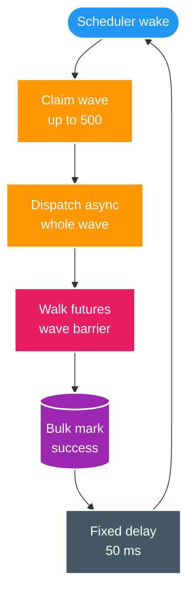
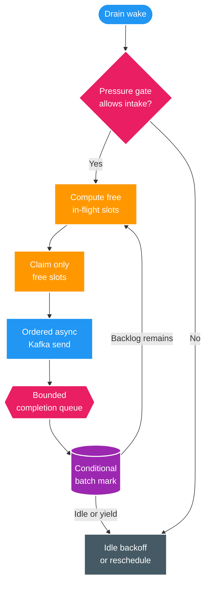

# FT-052 — Design: Outbox Continuous Drain & Bounded Relay

Owner: `scan-service`  
Database: `scan_db`  
Status: `READY FOR IMPLEMENTATION`  
Contract impact: không đổi `media.file.discovered.v2`

## 1. Baseline và bottleneck

Baseline source hiện tại không còn publish tuần tự hoàn toàn: `ScanOutboxPublisher` claim tối đa 500 record,
gọi `publishAsync()` cho cả wave, rồi `join()` từng future và bulk mark success. Tuy vậy nó vẫn có các giới hạn:

- refill chỉ xảy ra sau khi toàn bộ wave đã được duyệt acknowledgement và method kết thúc;
- scheduler luôn chèn `fixedDelay` 50 ms giữa hai wave dù backlog còn lớn;
- `batchSize` đồng thời là claim size và in-flight bound, chưa có lease-budget validation;
- send timeout 5 giây hard-code, trong khi Kafka producer delivery deadline chưa được align;
- failure mark còn theo từng record và chưa có pressure gate bảo vệ approval producer;
- metrics chưa có in-flight, acknowledgement latency, publish rate, lease mismatch và tail-drain.

### 1.1. As-Is



| Thành phần | Hành vi hiện tại | Throughput tax/risk |
| --- | --- | --- |
| Claim | Một wave tối đa 500 | Không refill theo slot vừa hoàn tất |
| Ack | Async send nhưng duyệt future theo wave | Slow ack kéo dài vòng wave |
| Scheduler | Delay 50 ms sau mỗi invocation | Delay nhân với số wave |
| Lease | 30 giây hard-code | Không chứng minh deadline luôn nằm trong lease |
| Failure | Release từng event sau terminal failure | Có duplicate hợp lệ; thiếu breaker/backpressure |

## 2. Kiến trúc đích

Coordinator giữ một cửa sổ application in-flight bounded. Nó claim đúng số slot trống, dispatch theo thứ tự
outbox, nhận completion vào queue bounded, batch-persist kết quả rồi refill ngay. Scheduler chỉ là wake-up/idle
backoff; khi backlog còn dữ liệu, một time slice drain không ngủ giữa các refill.



| Component | Trách nhiệm |
| --- | --- |
| `ScanOutboxDrainCoordinator` | Điều khiển time slice, slot, claim, completion, refill và shutdown |
| `OutboxInFlightWindow` | Hard bound event đang chờ ack; không tạo unbounded futures/tasks |
| `OutboxLeaseBudgetPolicy` | Validate producer/ack/DB-mark deadline nhỏ hơn lease |
| `ScanOutboxClaimService` | Claim đúng free slots trong transaction ngắn bằng `SKIP LOCKED` |
| `KafkaOutboxMessagePublisher` | Trả `CompletionStage`, giữ tracing headers và timeout từ config |
| `OutboxPressureGate` | Hysteresis pause/resume bulk approval claim; interactive lane không bị chặn |
| `ScanOutboxMetrics` | Rate, age, in-flight, ack latency, pressure và fence mismatch |

## 3. Drain algorithm và boundedness

Một time slice thực hiện:

1. Nếu shutdown/breaker/pressure policy yêu cầu dừng intake, không claim thêm.
2. Drain completion queue, gom success IDs và failure result tới `completionFlushSize` hoặc
   `completionFlushInterval`, rồi conditional persist.
3. Tính `freeSlots = maxInFlightEvents - currentInFlight`; nếu dương, claim tối đa
   `min(freeSlots, claimSize)` theo `(created_at, id)`.
4. Dispatch ngay toàn bộ record vừa claim; callback chỉ ghi completion vào queue và cập nhật timer, không mở
   transaction DB trên Kafka callback thread.
5. Nếu còn in-flight nhưng chưa có completion, chờ tối đa tới acknowledgement deadline gần nhất; không busy-spin.
6. Khi có slot trống, refill ngay. Chỉ idle backoff khi query claim rỗng và in-flight bằng 0; time slice có
   giới hạn để scheduler/lifecycle có điểm quan sát shutdown.

Hard bound trên heap xấp xỉ:

```text
maxInFlightEvents × (entity metadata + payload + future/completion metadata)
+ completionFlushSize × completion result
```

`maxInFlightEvents` là app-level event window, không đồng nghĩa Kafka
`max.in.flight.requests.per.connection` (số request batch trên mỗi connection).

## 4. Capacity model và target

Relay phải chạy đồng thời với FT-051. Do đó capacity chính là giữ up-rate lớn hơn tốc độ outbox được tạo:

```text
requiredPublishRate >= p95OutboxCommitRate × headroomFactor
tailDrainSeconds = pendingAtFinalCommit / sustainedPublishRate
```

Baseline FT-051 khoảng `32.511 records/s`; initial qualification dùng headroom `1,2`, tức candidate target
`>= 39.000 records/s`. Con số này là benchmark target cho profile local hiện tại, không phải production sizing.

Initial app window được ước lượng bằng bandwidth-delay product:

```text
candidateMaxInFlight = ceil(targetPublishRate × brokerAckP95Seconds × headroomFactor)
```

Giữ default ban đầu 500 để A/B với baseline hiện hành; chỉ tăng sau khi đo ack p95, producer buffer, heap,
network, Kafka broker và Catalog lag. Không lấy cứng 2.000–5.000 từ tài liệu capsule cũ.

## 5. Lease, deadline và failure

### 5.1. Lease budget

Coordinator không claim trước work chưa có slot dispatch, nên queue-wait sau claim gần bằng 0. Startup phải
reject cấu hình không thỏa:

```text
producerDeliveryTimeout
+ acknowledgementSlack
+ conditionalMarkBudget
+ safetyMargin
< leaseDuration
```

`KafkaTemplate.send()` trả `CompletableFuture`; completion callback là boundary broker success/failure.
Kafka `delivery.timeout.ms` phải nhỏ hơn acknowledgement deadline của relay để tránh relay release lease trong
khi producer vẫn âm thầm retry. Candidate cấu hình phải được fault-test, không xem 5 giây hard-code hiện tại là
giá trị tối ưu.

### 5.2. Delivery và ordering

- Publish luôn ngoài DB transaction; broker ack và DB mark không phải một atomic commit.
- Producer ghi rõ `enable.idempotence=true`, `acks=all`, retries dương và
  `max.in.flight.requests.per.connection <= 5`. Đây là guard để Kafka giữ thứ tự các send theo partition khi
  producer retry nội bộ.
- Application dispatch outbox theo `(createdAt, id)` và giữ nguyên `partitionKey`. Nhiều key có thể song song;
  cùng key vẫn được Kafka map về cùng partition.
- Ack thành công nhưng mark lỗi dẫn tới duplicate khi reclaim; `eventId` dedupe là correctness boundary.
- Terminal delivery failure mở breaker và dừng claim mới. Ordering qua manual replay/failover không được coi là
  strict; BT-09D/BT-09F phải chịu duplicate/out-of-order bằng deterministic merge, idempotency/version guard.

### 5.3. Backpressure

`OutboxPressureGate` sample/cached theo interval ngắn và dùng hysteresis:

- pause bulk shard claim khi oldest pending age vượt high watermark, in-flight bão hòa kéo dài hoặc failure
  rate/broker ack latency vượt ngưỡng;
- resume khi age và saturation xuống low watermark trong một ổn định window;
- operation giữ non-terminal và tiếp tục sau resume; interactive single decision vẫn được ghi outbox;
- nếu Kafka outage kéo dài, outbox là durable buffer nhưng quota/oldest age phải alert; không dùng heap làm queue.

## 6. Observability và shutdown

Metrics tối thiểu:

- `scan.outbox.pending`, `scan.outbox.oldest.pending.age`;
- claimed/published/failed rate và broker acknowledgement timer;
- current/max in-flight, completion queue depth, drain cycle/tail duration;
- pressure state/pause duration, breaker state và conditional-mark owner mismatch.

Log theo batch/time slice với count, duration và owner; không log payload/path/partition key. Shutdown dừng intake,
drain completion trong bounded grace period, persist kết quả đã biết và để lease expiry reclaim phần còn lại.

## 7. Contract, compatibility và rollback

- Không đổi topic, payload, partition key, operation watermark hay DB ownership; không cần sửa event contract/ADR.
- Legacy wave publisher được giữ sau feature flag để rollback runtime trong giai đoạn qualification.
- Schema hiện tại đã có partial pending index và lease columns; chỉ thêm migration nếu `EXPLAIN` chứng minh claim
  query mới cần index khác. Không tạo migration phòng hờ.

## 8. Trade-offs

| Quyết định | Lợi ích | Đánh đổi/guardrail |
| --- | --- | --- |
| Continuous refill | Bỏ idle gap và wave barrier | Coordinator/lifecycle phức tạp hơn |
| Bounded app window | Throughput cao nhưng heap hữu hạn | Cần benchmark theo payload/ack latency |
| Batch conditional mark | Ít DB roundtrip | Duplicate window lớn hơn nếu crash trước mark |
| Idempotent producer | Giữ ordering khi producer retry | Không biến outbox thành exactly-once |
| Pressure hysteresis | Bảo vệ Kafka/Catalog và interactive lane | Bulk approval có thể tạm chậm |
| Overlap approval/relay | Tail nhỏ dù có 1M event | Cần đo phase timestamp/watermark chính xác |

## 9. Production-readiness gate

ADLC status `READY` chỉ có nghĩa thiết kế đủ để triển khai. Messaging pipeline vẫn **`NOT READY` cho
production/cutover** tới khi có evidence:

| Pillar | Design status | Gate còn thiếu |
| --- | --- | --- |
| Operational Excellence | `PARTIAL` | Dashboard/alert, runbook breaker/reclaim/rollback |
| Security | `PASS` trong scope | Không thêm endpoint/secret/payload log |
| Reliability | `PARTIAL` | Crash-after-ack, lease expiry, duplicate, shutdown, broker outage |
| Performance Efficiency | `MISSING` evidence | Scale ladder, ack p95/p99, backlog/tail, DB/Kafka saturation |
| Cost Optimization | `PARTIAL` | CPU/network/DB write cost theo window/batch |
| Sustainability | `PARTIAL` | Chứng minh không busy-spin/poll/republish vô ích |

Reference corpus chỉ hỗ trợ nguyên tắc: Stripe nhấn mạnh async path cần observability/reconciliation riêng;
Uber nhấn mạnh non-blocking failure isolation và idempotent replay. Đây không phải proof throughput của project.

