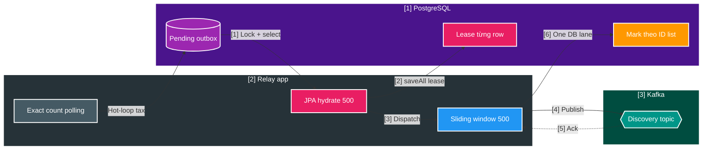
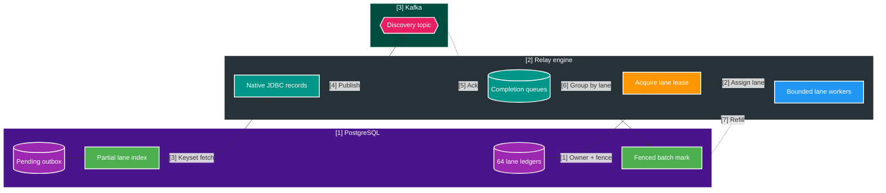

# FT-053 — Lane-Fenced Outbox Data Plane — Design

Owner: `scan-service`  
Brief: [01-brief.md](./01-brief.md)  
Database: `scan_db`  
Contract impact: không đổi REST/Kafka payload/topic

## High Level Design

### Kiến trúc hiện tại — FT-052 per-event lease/JPA data plane



FT-052 sửa control loop nhưng chưa đổi hình dạng I/O. Với 1M event, relay vẫn ghi lease một lần và ghi
published một lần trên từng row, đồng thời tạo entity/dirty-check overhead. Immediate-ack benchmark chỉ đạt
`5.387 records/s`, nên tăng Kafka partition không xử lý được failure boundary đã quan sát.

### Kiến trúc đích — virtual lane lease + native data plane



## Quyết định và so sánh

| Tiêu chí | FT-052 hiện tại | FT-053 target |
| --- | --- | --- |
| Unit of ownership | Lease trên từng event | Lease/fence trên 64 virtual lane |
| Claim write | `SELECT FOR UPDATE` + entity mutation + `saveAll()` | Claim một ledger row; event fetch read-only |
| Read model | Full JPA entity | Compact native `OutboxRelayRecord` |
| Parallelism | Một coordinator/DB mark lane | Bounded physical workers trên các virtual lane |
| Completion mark | JPQL `id in :ids` | Native array/staging batch, fenced theo lane |
| Hot-loop pending | Exact `count(*)` trong benchmark | In-process remaining counter; exact count ngoài timing |
| 25k evidence | `5.387 records/s` | Calibration only |
| 1M gate | Aborted | `>= 30.000 records/s`, `<= 33.334 ms` |
| Rollback | Legacy wave | FT-052 continuous drain |

### [D1] 64 virtual lane ổn định

Mỗi event được ánh xạ bằng fixed deterministic hash của `partition_key` vào `0..63`. Số virtual lane cố định,
trong khi `workerConcurrency` là runtime tuning độc lập. Nhờ vậy có thể chạy 2, 4 hoặc 8 physical workers mà
không remap backlog hay đổi Kafka key.

Không thêm business shard/table. Event vẫn nằm trong `scan_outbox_event`; lane chỉ là relay scheduling unit.
Partial expression index candidate:

```sql
(get_byte(decode(md5(partition_key), 'hex'), 0) & 63), created_at, id
WHERE published_at IS NULL
```

Đây là candidate cần golden hash test, `EXPLAIN (ANALYZE, BUFFERS)` và lock/write-cost evidence; không coi
câu SQL trong design là migration đã được phê chuẩn.

### [D2] Lane ledger và fencing

`scan_outbox_relay_lane` có tối thiểu:

| Column | Ý nghĩa |
| --- | --- |
| `lane_id` | `0..63`, primary key |
| `lease_owner` | Relay instance hiện giữ lane |
| `lease_until` | Deadline reclaim |
| `fence_token` | Tăng đơn điệu mỗi lần acquire/takeover |
| `last_heartbeat_at` | Liveness/operability |

Worker claim ledger row bằng transaction ngắn và `SKIP LOCKED`. Fetch event không update lease từng row.
Mọi success/failure mark phải join/guard với ledger đang có đúng `laneId`, `owner`, `fenceToken` và lease còn
hạn. Owner cũ hết lease không thể ghi published dù Kafka callback đến muộn.

### [D3] Native projection và set-based completion

Persistence adapter trả compact record chỉ gồm `id`, `eventType`, `partitionKey`, `payload`, `correlationId`,
`traceparent`, `createdAt`. Không attach persistence context và không dirty-check entity.

Completion được giữ trong bounded queue riêng theo lane. Flush dùng native UUID array hoặc staging/COPY sau A/B:

- UUID array ưu tiên cho page 2k–5k vì đơn giản và một roundtrip;
- staging/COPY chỉ chọn khi array mark chứng minh là bottleneck ở 10k+;
- không mở một transaction trong Kafka callback thread;
- slot chỉ được release sau khi fenced mark thành công hoặc completion được chuyển sang failure state rõ ràng.

### [D4] Control plane tách khỏi data plane

- Exact pending count và oldest age được sample/cached theo interval cho metric/pressure gate, không nằm trong
  refill loop.
- Data plane refill dựa trên free slot, fetch result và completion counter.
- Empty lane dùng adaptive idle backoff; backlog còn đầy không sleep/busy-spin.
- Lane heartbeat, lease renewal và completion flush có deadline budget nhỏ hơn lease duration.

### [D5] Capacity policy

Tuning matrix bắt buộc đo thay vì hard-code:

| Biến | Candidate |
| --- | --- |
| `workerConcurrency` | `1 / 2 / 4 / 8` |
| `fetchSize` | `500 / 2.000 / 5.000 / 10.000` |
| `maxInFlightPerWorker` | tính từ broker ack p95 và memory budget |
| `completionFlushSize` | `500 / 2.000 / 5.000` |

Chọn cấu hình nhỏ nhất đạt `>= 30.000 records/s` mà chưa chạm saturation knee của DB pool, WAL, CPU, heap,
producer buffer hoặc broker. Không chọn cấu hình có throughput cao nhất nếu p99 ack, duplicate window hoặc
resource cost tăng mất kiểm soát.

## Domain và data ownership

- `scan-service` là owner duy nhất của `scan_outbox_event` và lane ledger trong `scan_db`.
- Decision + outbox creation vẫn atomic trong approval chunk; FT-053 chỉ thay relay sau commit.
- Không join/ghi database của Catalog hoặc Query.
- `published_at` vẫn là durable source of truth cho relay completion và retention.
- Per-event lease columns được giữ trong compatibility window; lane relay không dùng chúng trên hot path.

## REST/event contract

Không đổi:

- `media.file.discovered.v2`, topic cùng tên, key `region:subjectType:identityKey`;
- `media.file.removed.v1`, key `storageKey:relativePath`;
- payload, `eventId`, `operationId`, `batchId`, correlation ID và W3C `traceparent`;
- at-least-once delivery và Catalog dedupe theo `eventId`.

Vì chỉ thêm internal `scan_db` scheduling metadata, không cần event version hoặc ADR mới. Migration vẫn phải
append-only và chỉ được chạy khi người dùng cấp quyền.

## Luồng lỗi, idempotency và consistency

| Failure | Hành vi bắt buộc |
| --- | --- |
| Crash trước broker ack | Lane hết lease; owner mới republish pending event |
| Ack thành công, crash trước mark | Republish cùng `eventId`; Catalog dedupe |
| Callback owner cũ đến muộn | Fenced mark trả 0; tăng `fence_mismatch`, không ghi published |
| Một event send lỗi | Mở breaker cho lane hoặc instance theo policy; không block vô hạn worker khác |
| Kafka outage | Dừng claim lane mới, giữ backlog trong DB, pressure gate pause bulk approval |
| Lane skew | Work stealing giữa physical workers; không thay hash/lane count trong backlog |
| Shutdown | Stop acquire, flush completion trong grace period, release/expire lane an toàn |

Delivery vẫn là eventual consistency. Không có atomic commit giữa broker ack và `published_at`; duplicate là
failure mode hợp lệ, data loss không hợp lệ.

## Hiệu năng, quan sát và bảo mật tối thiểu

Metrics tối thiểu:

- throughput theo fetch/dispatch/ack/mark và end-to-end relay;
- lane backlog estimate, oldest age, skew, lease age, takeover và fence mismatch;
- in-flight/completion depth theo worker, không gắn event ID/path làm metric label;
- native fetch/mark timer, rows/roundtrip, pool wait, WAL bytes, CPU, heap và producer buffer;
- broker ack p50/p95/p99 khi đủ observations, retry/error rate và tail drain.

Log theo lane/batch với count/duration/owner hash; không log payload, absolute path hoặc partition key. Không thêm
endpoint hay secret. Database role hiện tại tiếp tục chỉ có quyền trên `scan_db`.

## Evidence từ corpus và giới hạn áp dụng

- Databus củng cố việc tách DB relay/log khỏi consumer projection và yêu cầu bootstrap/replay cho consumer tụt
  lâu. FT-053 chỉ tối ưu relay; không tự tạo commit-order CDC hoặc bootstrap cho Catalog.
- Uber Kafka củng cố non-blocking failure isolation, DLT/replay và idempotent consumer khi có duplicate hoặc
  out-of-order. Điều này hỗ trợ fence/retry design, không chứng minh throughput.
- Stripe usage billing củng cố việc tách fast path khỏi durable slow path và cần observability/reconciliation
  riêng cho async ingestion. Lane data plane và pressure control plane áp dụng nguyên tắc này trong phạm vi Scan.

Các nguồn trên là industry evidence, không phải proof đạt `30.000 records/s`; chỉ benchmark project mới đóng
performance gate.

## Trade-offs và phương án không chọn

| Phương án | Quyết định | Lý do |
| --- | --- | --- |
| Chỉ tăng window 500 → 5k | Không chọn làm kiến trúc | Không bỏ per-row lease/JPA write; tăng heap/transaction risk |
| Native `UPDATE ... RETURNING` per-event lease | Giữ làm bridge/A-B | Bỏ hydration nhưng vẫn ghi lease trên 1M row |
| Lane-level lease + native fetch/mark | Chọn | Bỏ claim write từng event, scale bounded, rollback được |
| Debezium/log-based CDC | Deferred | Thêm platform/offset/bootstrap/runbook boundary ngoài FT-053 |
| Exactly-once DB ↔ Kafka | Không chọn | Không có atomic boundary; at-least-once + dedupe đơn giản và đúng failure model |
