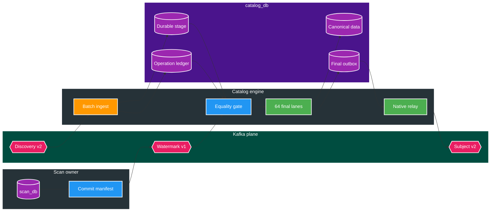

# FT-054 — Operation-Scoped Catalog Coalescing — Design

Owner chính: `catalog-service`

Owner hỗ trợ: `scan-service` cho completion manifest

Brief: [01-brief.md](./01-brief.md)

Contract impact: hiện thực hóa `media.approval.watermark.v1` và `media.subject.changed.v2`; không đổi REST

## High Level Design

### Kiến trúc hiện tại — record-at-a-time và event amplification


Hình dạng hiện tại có cost gần `O(input events)` cho transaction, aggregate load/save, version increment và
outbox output. Một subject xuất hiện trong 10 Kafka poll vẫn bị materialize ít nhất 10 lần; coalesce trong
từng poll chỉ giảm hằng số, không bảo đảm one-final-snapshot theo operation.

### Kiến trúc đích — durable operation coalescing data plane



## Quyết định và so sánh

| Tiêu chí | Hiện tại | FT-054 target |
| --- | --- | --- |
| Kafka entry | Một `ConsumerRecord` | Batch listener, internal slice bounded theo count + bytes |
| Dedupe | `existsById` từng event | Temp `COPY` + set-based `ON CONFLICT DO NOTHING` |
| Coalesce scope | Một record | Toàn operation, không phụ thuộc poll/batchId |
| Intermediate state | Java/JPA transaction | Durable logged staging trong `catalog_db` |
| Subject write | N lần theo asset | Một canonical merge mỗi `(operationId, subjectId)` |
| Version | Tăng theo mutation | Tăng tối đa một lần nếu final aggregate đổi |
| Output | Snapshot v1 trung gian | Một final `media.subject.changed.v2` mỗi subject |
| Completion | Không có equality gate | Manifest + exact durable counters + DLT gate |
| Outbox relay | JPA claim 500 + fixed delay | Native lane fence + continuous bounded refill |
| 1M gate | Chưa có | Canonical phase `<= 10s`, output relay `<= 2s` |

### [D1] Coalesce toàn operation bằng durable staging

Không giữ 1.000.000 event trong heap và không xem một Kafka poll là operation boundary. Batch listener chỉ
làm fast ingest path:

```text
deserialize + validate bounded slice
→ COPY vào transaction-local temp table
→ INSERT durable stage ON CONFLICT(event_id) DO NOTHING
→ UPSERT affected-subject workset từ đúng rows vừa insert
→ tăng received_record_count theo operation một lần mỗi slice
→ COMMIT
→ listener return và Kafka mới commit offset
```

`catalog_discovery_stage` là bảng logged vì offset có thể được commit sau transaction; `UNLOGGED` sẽ làm mất
replay boundary sau crash. Row giữ typed projection cần cho merge, không giữ JPA entity. Primary key
`event_id` là dedupe kỹ thuật; index `(operation_id, subject_lane, subject_key, source_partition,
source_offset)` phục vụ finalizer.

Internal slice bị chặn đồng thời bởi `maxRecords` và `maxBytes`; default candidate lần đầu là 2.000 record và
16 MiB. Đây là bounded working set, không phải business chunk cố định. Giá trị cuối được chọn trong matrix của
chính FT-054 và ghi lại vào Plan/result trước khi `DONE`.

### [D2] Completion manifest là equality gate, không phải ordering assumption

Scan phát `APPROVAL_COMMITTED` bằng cùng transactional outbox với durable operation transition. Data topic và
control topic có thể đến theo bất kỳ thứ tự nào:

- data đến trước: Catalog tạo operation ledger với `expectedRecordCount = null` và tiếp tục ingest;
- manifest đến trước: ledger biết expected count nhưng giữ `INGESTING`;
- chỉ khi `receivedRecordCount = expectedDiscoveryRecordCount`, `expectedRemovalRecordCount = 0`, manifest
  sequence `10` đã durable và
  `unresolvedDltCount = 0`, operation mới sang `READY_TO_COALESCE`;
- `receivedRecordCount > expectedDiscoveryRecordCount`, mismatch `scanRunId` hoặc removal count lớn hơn 0 là
  invariant breach và chuyển `BLOCKED`, không đoán completion.

Watermark event dedupe theo `eventId`; stage chỉ tiến khi `stageSequence` lớn hơn. Scan outbox có unique guard
cho `(operationId, batchId=approval-watermark-10)` để retry completion không tạo manifest thứ hai.

### [D3] Stable subject workset và 64 logical lane

`subjectKey = region + ':' + subjectType + ':' + identityKey`, đúng partition key contract. Stable lane:

```text
lane = firstByte(md5(subjectKey)) & 63
```

64 là logical scheduling unit, không phải 64 thread. Default physical workers bắt đầu ở 4; worker claim lane
bằng `owner + leaseUntil + monotonic fenceToken`, xử lý bounded subject page rồi checkpoint cursor. Workset đã
đóng khi equality gate mở nên keyset cursor không bỏ sót subject mới.

Mọi canonical write, outbox insert và lane checkpoint trong một chunk phải kiểm tra fence hiện hành. Callback
hoặc worker cũ không thể commit sau takeover. Concurrency cuối cùng được chọn từ saturation curve của DB
pool/WAL/CPU, không theo số core mặc định.

### [D4] Deterministic reducer giữ business semantics

Các event của cùng subject được reduce theo `(sourcePartition, sourceOffset, eventId)`; contract key bảo đảm
same subject đi cùng Kafka partition trong healthy path. Partition count không được đổi khi còn backlog.

- Asset identity là `(storageKey, relativePath)`; duplicate locator chỉ tạo một canonical asset.
- Scalar metadata và actress set lấy từ valid event cuối theo source order, tương đương hành vi tuần tự hiện tại.
- Video tag nằm trên asset. Existing primary được giữ nếu candidate có cùng priority; video không tag thắng
  video có tag; giữa các candidate cùng priority, event sớm nhất thắng.
- Subject `tagNames` materialize từ final primary; non-video event không có quyền thay primary tags.
- Locator tombstone có `removedAt >= event.timestamp` loại discovery cũ; discovery mới hơn có thể xóa tombstone
  trong cùng canonical transaction.
- Nếu final aggregate không đổi, processed/workset vẫn hoàn tất nhưng không tăng version và không phát snapshot.
- Nếu final aggregate đổi, version tăng đúng một lần cho operation, bất kể subject có bao nhiêu asset input.

Reducer không hydrate từng JPA aggregate. SQL set-based resolve/create subject IDs, upsert assets/tags,
replace subject metadata collections và insert new actresses. `master_data_registry` version chỉ bump một lần
cho bounded chunk có actress mới, không một lần mỗi event.

### [D5] Final snapshot và watermark cùng transactional outbox

Sau canonical merge, PostgreSQL dựng final JSON từ canonical rows theo subject page và insert outbox set-based.
Generated payload phải deserialize được bằng shared `MediaSubjectChangedV2` contract test.

- `eventId`: UUIDv7 mới, durable trong outbox;
- `partitionKey`: `subjectId`;
- `operationId`: input operation;
- `batchId`: deterministic `catalog-output-{lane}-{ordinal}`;
- unique guard: `(operationId, subjectId, eventType)` cho snapshot v2;
- maximum serialized payload: 900 KiB; vượt giới hạn tạo failure `SUBJECT_SNAPSHOT_TOO_LARGE` và operation
  `BLOCKED`, không insert payload mà broker mặc định không nhận được.

Khi mọi lane hoàn tất, final transaction kiểm tra:

```text
receivedRecordCount = expectedDiscoveryRecordCount
AND expectedRemovalRecordCount = 0
AND completedWorksetCount = affectedSubjectCount
AND finalSnapshotCount = expectedSubjectCount = changedSubjectCount
AND unresolvedDltCount = 0
```

Transaction đó chuyển operation sang `CATALOG_COMMITTED` và insert watermark stage 20. Watermark có thể được
Kafka publish trước một số data snapshot do khác partition/lane; BT-09E phải dùng equality gate, không dựa vào
global topic ordering.

### [D6] Catalog output relay đi thẳng tới final data plane

FT-054 không giữ fixed-delay/JPA publisher làm target. Catalog outbox dùng luôn cấu trúc đã chứng minh ceiling
ở FT-053 nhưng có implementation owner riêng:

- 64 virtual relay lane theo stable hash của `partitionKey`;
- lane-level lease/fence, native compact fetch và set-based mark;
- bounded global/per-worker in-flight, `KafkaTemplate.send()` async và completion queue;
- refill ngay khi durable mark giải phóng slot; empty lane adaptive backoff;
- exact pending count chỉ sample ở control plane, không nằm trong hot refill loop;
- feature flag mutual exclusion bảo đảm legacy publisher và FT-054 relay không cùng active.

Đây là phần bắt buộc của one-shot BT-09D: tạo ít outbox hơn nhưng để publisher fixed-delay vẫn không đạt
Catalog relay budget 2 giây.

## Domain và data ownership

### `scan_db`

- Scan vẫn sở hữu approval operation và discovery outbox.
- Additive migration cho phép operation control event không có `proposalId`, kèm check constraint phân biệt
  data event và watermark.
- Scan không đọc/ghi `catalog_db`.

### `catalog_db`

Các bảng/column additive dự kiến:

| Artifact | Trách nhiệm |
| --- | --- |
| `catalog_approval_operation` | Manifest, exact counters, status, DLT count, terminal timestamps |
| `catalog_discovery_stage` | Durable typed input, dedupe `eventId`, source coordinate |
| `catalog_operation_subject` | Unique affected subject, accumulator/workset, final outcome |
| `catalog_operation_lane` | 64 lane, owner/lease/fence/cursor/counters |
| `catalog_outbox_relay_lane` | Native output relay ownership/fencing |
| `catalog_outbox_event.operation_id/batch_id` | V2 snapshot và watermark traceability |

Canonical `media_subject`, `media_asset`, tag/actress tables vẫn là source of truth. Stage/workset chỉ là
durable processing state có retention/purge sau reconciliation; không trở thành public read model.

Query không bị truy cập hoặc thay đổi trong FT-054.

## REST/event contract

### Kafka input

- `media.file.discovered.v2`: key `region:subjectType:identityKey`, required `operationId`/`batchId` cho bulk.
- `media.approval.watermark.v1`: key `operationId`; FT-054 consume stage 10 và phát stage 20.
- Stage 10 thêm additive `expectedDiscoveryRecordCount`/`expectedRemovalRecordCount`; tổng hai field phải bằng
  `expectedRecordCount`. Catalog dùng discovery count làm equality gate và block mixed workload rõ ràng.
- Listener batch dùng Spring Kafka batch factory. Official Spring Kafka docs xác nhận batch listener nhận
  `List<ConsumerRecord<...>>`; `BatchListenerFailedException` chỉ rõ failed record để error handler commit
  phần trước lỗi, retry/recover record lỗi và tiếp tục batch.

Vì error handler có thể commit offset của record đứng trước poison record, handler phải persist thành công
valid prefix trước khi ném `BatchListenerFailedException`. Cấm validate toàn poll, chưa ghi prefix nào rồi ném
lỗi ở giữa batch. Validation/schema error là non-retryable và đi DLT ngay; lỗi DB retryable rollback current
slice để Kafka redeliver. Payload hỏng tới mức không đọc được `operationId` được DLT theo source coordinate;
operation thiếu record sẽ timeout sang `BLOCKED/CATALOG_INPUT_MISSING`, không treo `INGESTING` vô hạn.

### Kafka output

- `media.subject.changed.v2`: key `subjectId`, final full snapshot, one per `(operationId, subjectId)`.
- `media.approval.watermark.v1`: stage `CATALOG_COMMITTED`, sequence `20`, key `operationId`.
- Không dual-publish `media.subject.changed.v1` cho SC-01 operation. Legacy/single-decision path chỉ tồn tại
  sau feature flag rollback và không được chạy đồng thời với operation batch path.

Không đổi REST/OpenAPI. Consistency vẫn eventual; Scan tracking API chỉ materialize status sau khi consume
watermark và không được tính timestamp đó làm SLO end.

## Luồng lỗi, idempotency và consistency

| Failure | Hành vi bắt buộc |
| --- | --- |
| Duplicate input | Stage conflict no-op; counter không tăng |
| Manifest đến sớm/muộn | Equality gate chờ đủ hai phía |
| Poison payload | Record-level retry/DLT; operation `BLOCKED`, partition không kẹt vô hạn |
| Crash trước ingest commit | Kafka redelivery toàn phần; no durable effect |
| Crash sau ingest commit | Kafka redelivery dedupe; không tăng counter |
| Finalizer mất lease | Transaction/fence rollback; owner mới tiếp tục từ cursor |
| Canonical commit rồi crash | Outbox/workset/checkpoint đã atomic; không lặp business effect |
| Broker ack rồi mark lỗi | Republish cùng eventId; Query dedupe/version guard |
| Oversized snapshot | Durable `BLOCKED`; không gửi message chắc chắn bị broker reject |
| Output backlog tăng | Pause lane finalization/ingest theo hysteresis; không tăng heap vô hạn |
| DLT chưa resolve | Cấm `CATALOG_COMMITTED` |

At-least-once được giữ ở cả hai Kafka boundary. Không có distributed transaction; correctness dựa vào local
atomicity, unique key, operation equality gate, lane fence và downstream version guard.

## Hiệu năng, quan sát và bảo mật tối thiểu

Metrics phase-level, label cardinality thấp:

- ingest records/bytes, deserialize/COPY/dedupe/ledger duration;
- operation received/expected, staging bytes/oldest age, unique subject/fan-out;
- lane claim/fence mismatch, reducer/load/write/outbox duration, rows/roundtrip;
- canonical transaction p50/p95/p99, DB pool wait, lock wait, WAL bytes, CPU/heap/GC;
- snapshot count/bytes, amplification ratio, oversized count;
- output fetch/dispatch/ack/mark throughput, producer buffer wait, Kafka lag;
- DLT unresolved, blocked operation và completion latency.

Log chỉ ghi operation/lane/batch/count/duration và owner hash. Không log payload, identity key, actress name,
relative path hoặc absolute path. Database role tiếp tục chỉ có quyền trên `catalog_db`.

## Evidence tham khảo và giới hạn áp dụng

- Stripe usage-billing corpus củng cố việc tách fast ingest path khỏi durable reconciliation/finalization và
  yêu cầu ledger cho delayed/out-of-order events. FT-054 áp dụng bằng batch ingest + operation ledger; nguồn
  này không chứng minh target 100k records/s.
- Uber Kafka reprocessing corpus củng cố non-blocking DLT isolation và idempotent consumer khi replay làm đổi
  ordering. FT-054 áp dụng record-level batch failure + durable dedupe; không sao chép topology retry nguyên xi.
- Spring Kafka docs hiện hành xác nhận batch listener và `BatchListenerFailedException` semantics. Đây là API
  evidence, không phải capacity evidence.

Chỉ benchmark 1M của project với payload, schema, hardware và Kafka thật mới đóng performance gate.

## Trade-offs và phương án không chọn

| Phương án | Quyết định | Lý do |
| --- | --- | --- |
| Chỉ đổi listener sang batch | Không chọn | Same subject vẫn trải qua nhiều poll; vẫn phát snapshot trung gian |
| Giữ toàn operation trong RAM | Không chọn | Không bounded, crash mất state, 1M/hot-key dễ OOM |
| Durable operation staging + set-based merge | Chọn | Global coalescing, replay/fence rõ, giảm canonical/outbox amplification |
| Kafka Streams state store | Không chọn | Thêm platform/restore/rebalance ownership không cần thiết cho một DB owner |
| JPA `saveAll()` sau group | Không chọn làm hot path | Vẫn hydration/dirty-check/N+1 collection cost |
| Direct publish sau canonical write | Không chọn | Mất local atomicity khi broker lỗi |
| Giữ Catalog fixed-delay outbox | Chỉ rollback | Minimum idle time phá relay budget ở cardinality lớn |
| Chunk một subject snapshot v2 | Không chọn | Đổi downstream contract; dùng byte envelope + BLOCKED rõ ràng |
