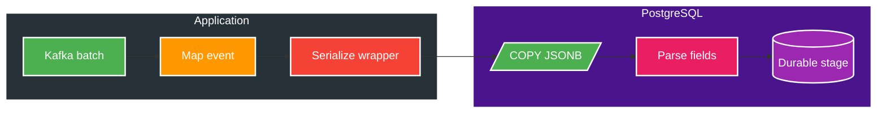
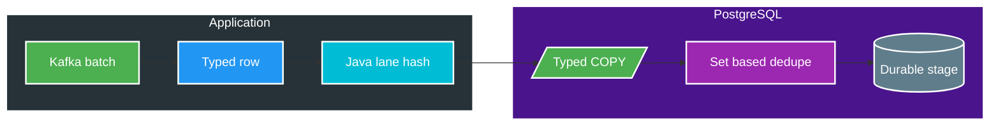

# FT-055 — BT-09D1 Catalog Typed Fast Ingest — Design

Owner: `catalog-service`
Brief: [01-brief.md](./01-brief.md)

## High Level Design

### Kiến trúc hiện tại (As-Is)

Mỗi row hiện bị serialize thành wrapper JSON, sau đó SQL lại trích/cast các field routing và tính MD5 lane. Baseline mới nhất của candidate FT-054 là 25K trong `5.781 ms`; `stageSql` khoảng `1.211 ms` và là bottleneck ingest chính.

### Kiến trúc đích (To-Be)

## Quyết định và So sánh (Trade-offs)

| Thuộc tính | FT-054 hiện tại | FT-055 đích |
| --- | --- | --- |
| COPY envelope | Một cột wrapper `payload jsonb` | Typed scalar columns + raw payload JSON |
| Routing fields | PostgreSQL parse/cast từ wrapper JSON | Java map một lần, COPY đúng type |
| Subject lane | MD5 trong stage SQL | Stable hash trong Java, SQL/Java golden vector |
| Dedupe | `ON CONFLICT(event_id)` | Giữ nguyên durable dedupe |
| Workset/counter | Chỉ từ `RETURNING` rows mới | Giữ nguyên invariant |

Typed COPY giảm parse/round-trip nhưng tăng coupling với schema temp ingest. Coupling này nằm trong persistence adapter và được bảo vệ bằng integration test cardinality/type; durable schema và event contract không đổi.

## Domain và data ownership

`catalog-service` sở hữu `catalog_discovery_stage`, operation metadata và transaction ingest trong `catalog_db`. Temp ingest row gồm typed routing fields, `subjectLane` và raw event payload. Không truy cập database service khác.

## REST/event contract

Không đổi topic hoặc schema `media.file.discovered.v2`. D1 chỉ đổi representation nội bộ từ wrapper JSON sang typed COPY row. Output của D1 vẫn là durable Catalog stage; canonical snapshot thuộc D2/D3 và relay thuộc D4.

## Luồng lỗi, idempotency và consistency

COPY, durable insert, workset insert và received-counter update nằm trong cùng bounded transaction. Retry cùng `eventId` phải hội tụ về một row; operation/scanRun mismatch bị từ chối. Valid prefix có thể commit trước poison record nhưng sẽ được redeliver an toàn nhờ dedupe; offset không được vượt qua record chưa durable.

## Hiệu năng, quan sát và bảo mật tối thiểu

Đo mapping/encoding, COPY, stage SQL, duplicate, records/bytes, transaction và failure; không log payload, absolute path, subject identity hoặc secret. Gate 25K và 1M dùng boundary trong Brief. Benchmark local chỉ là evidence của pipeline phase, không phải production SLO.
