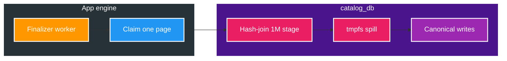
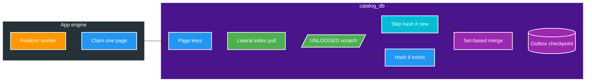

# FT-056 — BT-09D2 Catalog Set-Based CTE Merge — Design

Owner: `catalog-service`
Brief: [01-brief.md](./01-brief.md)

## High Level Design

Đây là tối ưu SQL merge bên trong function finalizer hiện có: giữ page, fence và canonical writes;
bỏ per-page DDL storm. Worker Java `CatalogOperationFinalizer` (claim một page rồi `release`) không đổi
— đó là BT-09D3.

### Kiến trúc hiện tại (As-Is — V19/V20)

| Nút | Vai trò |
| --- | --- |
| Finalizer worker | 4 physical worker, claim 64 logical lane |
| Claim one page | `acquire` → `catalog_finalize_operation_page` → `release` |
| Hash-join 1M stage | V20: `FROM catalog_discovery_stage JOIN page` lặp 4 lần; planner seq-scan toàn bộ event |
| tmpfs spill | 1M jsonb × 4 worker làm đầy Docker tmpfs → `DataAccessResourceFailureException` |
| Canonical writes | Insert/update subject, asset, tag, actress, primary, outbox |

V19 nhanh hơn V20 ở 25K vì `ANALYZE` temp table ép nested-loop; V19 vẫn timeout 1M vì DDL + scan stage. V20 bỏ DDL nhưng mất stats nên hash-join 1M JSON.

### Kiến trúc đích (To-Be — V21)

| Nút | Vai trò |
| --- | --- |
| Page keys | Workset `PENDING` của đúng một lane, `FOR UPDATE` |
| Lateral index pull | `CROSS JOIN LATERAL` theo `subject_key`; dùng `idx_catalog_discovery_stage_operation_subject_order` |
| UNLOGGED scratch | Event/latest/asset keyed `(operation_id, lane_id)`; không DDL trong page loop |
| Skip hash if new | Subject mới luôn đổi; snapshot dựng một lần; version `0` |
| Hash if exists | Chỉ subject đã có mới so `before_hash`/`after_hash` |
| Set-based merge | Cùng reducer FT-054 [D4]: locator, primary, tags, tombstone |
| Outbox checkpoint | Unique `(operationId, subjectId, eventType)` + fence trước commit |

Function signature, `statement_timeout` và `CatalogOperationPageStore.finalizePage` giữ nguyên.

## Quyết định và So sánh (Trade-offs)

| Thuộc tính | V19 / V20 | FT-056 đích (V21) |
| --- | --- | --- |
| Working set page | V19: 7 `CREATE TEMP`; V20: UNLOGGED nhưng `FROM stage JOIN page` | UNLOGGED + `LATERAL` từ page key; một lần kéo event |
| Index/ANALYZE | V19: 4 index + 5 `ANALYZE` mỗi page | Index migrate một lần; không DDL trong function |
| Stage access | Hash-join / seq-scan toàn bộ operation | Nested-loop index `(operation_id, subject_key)` |
| Subject mới | `before_hash` null; vẫn `after_hash` JSON | Bỏ hash so sánh; luôn emit snapshot |
| Subject đã có | Hash trước/sau; no-op không outbox | Giữ `catalog_subject_state_json` để parity hash |
| Claim/lease | Một page / một claim | Giữ — D3 mới đổi |
| Event/outbox contract | `media.subject.changed.v2` | Không đổi |
| Gate | 25K V20 `2.633 s` / avg `129 ms`; 1M gãy connection | `pageExec` median `< 5 ms`; 100K subject `<= 5 s` — chưa tuyên bố |

V20 UNLOGGED không đủ: planner không có `ANALYZE` page scratch nên hash-join `catalog_discovery_stage`
(1M jsonb) lặp 4 lần/page. Calibration 25K `mergeMs=2.633 s` / pageExec avg `129 ms` (chậm hơn V19
`2.032 s` / `106 ms`); 1M `DataAccessResourceFailureException` trên tmpfs. V21 không `CREATE TEMP`
trong page loop và không seq-scan stage.

Không tách stored procedure thành nhiều function chỉ để giảm dòng: một page = một transaction fence.
Nếu body vượt 500 dòng, Plan ghi ngoại lệ stored-proc; không tách làm nhiều round-trip.

## Domain và data ownership

`catalog-service` sở hữu `catalog_db`: `catalog_discovery_stage`, `catalog_finalize_event`, `catalog_operation_subject`,
`catalog_operation_lane`, `catalog_approval_operation`, `media_subject` / `media_asset` / tags /
actresses, `catalog_removed_asset_locator`, `catalog_outbox_event`. Không đọc/ghi database service khác.

Reducer giữ [FT-054 Design D4](../054-catalog-operation-coalescing/02-design.md): thứ tự
`(sourcePartition, sourceOffset, eventId)`; locator `(storageKey, relativePath)`; primary election
(video không tag thắng, giữ primary hiện tại khi cùng priority); `tagNames` từ primary; tombstone
`removedAt >= event.timestamp`.

## REST/event contract

Không đổi REST, không đổi schema `media.subject.changed.v2` hay `media.approval.watermark.v1`.
Output vẫn transactional outbox; Query không thuộc D2.

## Luồng lỗi, idempotency và consistency

- Mất fence trước/trong checkpoint → exception, Java release, retry claim; không commit canonical dở.
- Snapshot vượt `maximum-snapshot-bytes` (900 KiB) → workset `FAILED`, operation `BLOCKED`, không insert outbox.
- Unique outbox `(operation_id, subject_id, event_type)` chặn duplicate snapshot khi retry cùng operation.
- Cardinality: `checkpoint_count = processed_count`; `inserted_snapshot_count = changed_count`.
- Subject mới retry: `ON CONFLICT` subject/asset + unique outbox hội tụ một canonical effect.
- Subject cũ không đổi: workset `COMPLETED`, `changed = false`, không tăng version, không outbox.

## Hiệu năng, quan sát và bảo mật tối thiểu

Đồng hồ D2: `FinalizerSnapshot.pageExec` (median/p95/max) và wall-clock từ `READY_TO_COALESCE` tới
workset hoàn tất. `acquireMillis` / Kafka ingest / relay / `QUERY_DB_READY` không được cộng vào gate.

Calibration: 2.500 subject (25K event đã stage). Qualification: 100.000 subject. Run manifest ghi
page size, worker count, pool, `work_mem`, `statement_timeout`, CPU/RAM/storage. Testcontainers là
correctness; throughput chỉ trên qualification environment đã khóa.

Không claim `SLI-03` hay Catalog phase `<= 10 s` (ngân sách D1+D2+D3; D4 mới đóng).
