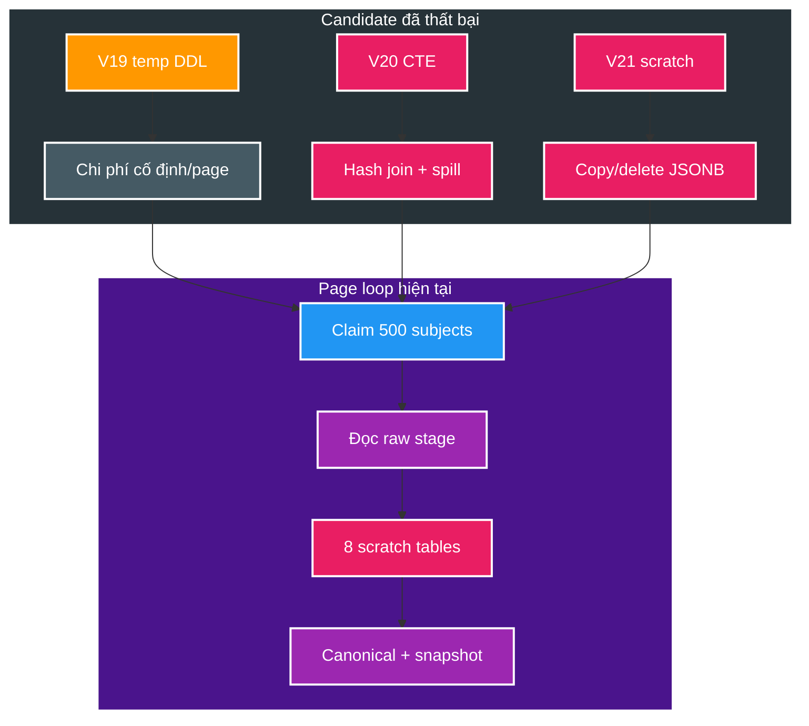
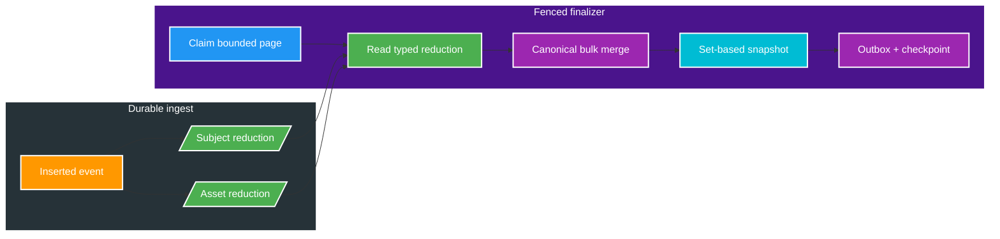

# FT-056 — BT-09D2 Catalog Set-Based CTE Merge — Design

Owner: `catalog-service`
Brief: [01-brief.md](./01-brief.md)

## High Level Design

Đây là tối ưu data path của finalizer: giữ page, fence và canonical writes nhưng thay raw-stage/scratch flow
bằng durable typed reduction. Worker Java `CatalogOperationFinalizer` vẫn claim một page rồi `release`;
continuous drain vẫn thuộc BT-09D3.

### Kiến trúc hiện tại (As-Is — V19/V20/V21)

| Nút | Vai trò |
| --- | --- |
| V19 | Temp DDL/INDEX/ANALYZE mỗi page; calibration tốt hơn V20/V21 nhưng 1M vẫn timeout. |
| V20 | Bỏ DDL nhưng planner hash-join/seq-scan raw stage và gãy connection ở 1M. |
| V21 | Ép page-key pull nhưng copy raw JSONB qua 8 UNLOGGED scratch table và dọn bằng `DELETE` mỗi page. |
| Page loop | 64 lane, page 500, 4 worker; canonical reducer gồm nhiều statement và dựng snapshot sau write. |

V19 nhanh hơn V20 ở 25K vì `ANALYZE` temp table ép nested-loop; V19 vẫn timeout 1M. V21 cũng chậm hơn
V19 theo run người dùng ngày 2026-08-22 và 1M vẫn timeout. Chưa có phase log trong repo nên nguyên nhân V21
được coi là hypothesis, không phải kết luận benchmark.

### Kiến trúc đích (To-Be — V22)

| Nút | Vai trò |
| --- | --- |
| Subject reduction | Một row mới nhất/subject, typed metadata + source order; logged và rebuild được từ raw stage. |
| Asset reduction | Một row thắng/locator, typed role/tag/timestamp + metadata cần khi asset thành primary; cập nhật atomic chỉ từ event ingest mới. |
| Typed read | Finalizer không copy raw payload sang global scratch và không parse/cast cùng field nhiều lần. |
| Canonical merge | Bulk subject/asset/tag/primary/metadata trên page; subject mới bỏ `before_hash`. |
| Set-based snapshot | Dựng post-state một lần/subject; không gọi correlated state function nhiều lần. |
| Outbox checkpoint | Fence/cardinality/unique outbox giữ trong cùng bounded transaction. |

Function signature, `statement_timeout` và `CatalogOperationPageStore.finalizePage` giữ nguyên.

## Quyết định và So sánh (Trade-offs)

| Thuộc tính | V19 / V20 / V21 | FT-056 đích (V22) |
| --- | --- | --- |
| Working set page | V19 temp DDL; V20 CTE; V21 8 global scratch table | Typed reduction, không scratch copy/delete trong page |
| Index/ANALYZE | V19 tạo mỗi page; V20/V21 index migrate một lần | PK/index theo `(operation_id, lane_id, subject_key[, locator])` |
| Stage access | Raw JSONB được scan/copy/parse trong finalizer | Raw stage là audit/rebuild; hot path đọc typed reduction |
| Subject mới | `before_hash` null; vẫn `after_hash` JSON | Bỏ hash so sánh; luôn emit snapshot |
| Subject đã có | Hash trước/sau; no-op không outbox | Giữ `catalog_subject_state_json` để parity hash |
| Claim/lease | Một page / một claim | Giữ — D3 mới đổi |
| Event/outbox contract | `media.subject.changed.v2` | Không đổi |
| Gate | V19–V21 đều timeout 1M | Recovery `< 60 s`; lịch sử `<= 5 s` là stretch target |

V22 chấp nhận thêm write amplification nhỏ trong D1 để bỏ parse/sort/copy JSONB khỏi D2. Reduction phải nằm
cùng transaction durable ingest, chỉ nhận event thực sự `INSERT` thành công và dùng source-order tuple để
idempotent. Với operation đã stage trước V22, một rebuild set-based từ raw stage phải tạo cùng kết quả.

Page size không được quyết định trước bằng cảm tính. Qualification chạy `500 → 1.000 → 2.000`, chọn giá trị
nhỏ nhất đạt recovery gate và giữ transaction p95 dưới 1/3 lease. Claim-per-page vẫn giữ nguyên nên D3 không
bị nhập lẫn vào candidate này.

Một page vẫn là một transaction fence. Có thể tách helper SQL thuần theo phase để giữ mỗi file dưới 500 dòng,
nhưng finalizer gọi chúng trong cùng transaction; không tạo thêm application round-trip hay commit trung gian.

## Domain và data ownership

`catalog-service` sở hữu `catalog_db`: `catalog_discovery_stage`, `catalog_operation_subject_reduction`,
`catalog_operation_asset_reduction`, `catalog_operation_subject`, `catalog_operation_lane`,
`catalog_approval_operation`, `media_subject` / `media_asset` / tags / actresses,
`catalog_removed_asset_locator`, `catalog_outbox_event`. Không đọc/ghi database service khác.

Reducer giữ [FT-054 Design D4](../054-catalog-operation-coalescing/02-design.md): thứ tự và null semantics của
`(sourcePartition, sourceOffset, eventId)`; locator `(storageKey, relativePath)`; primary election
(video không tag thắng, giữ primary hiện tại khi cùng priority); `tagNames` từ primary; tombstone
`removedAt >= event.timestamp`.

## REST/event contract

Không đổi REST, không đổi schema `media.subject.changed.v2` hay `media.approval.watermark.v1`.
Output vẫn transactional outbox; Query không thuộc D2.

## Luồng lỗi, idempotency và consistency

- Mất fence trước/trong checkpoint → exception, Java release, retry claim; không commit canonical dở.
- Reduction update chỉ nhận event vừa insert thành công vào durable stage; duplicate không đổi projection.
- Source-order tuple `(sourcePartition, sourceOffset, eventId)` quyết định winner; rebuild từ raw stage phải cho
  cùng checksum/cardinality với ingest-maintained reduction trước khi operation được finalize.
- Snapshot vượt `maximum-snapshot-bytes` (900 KiB) → workset `FAILED`, operation `BLOCKED`, không insert outbox.
- Unique outbox `(operation_id, subject_id, event_type)` chặn duplicate snapshot khi retry cùng operation.
- Cardinality: `checkpoint_count = processed_count`; `inserted_snapshot_count = changed_count`.
- Subject mới retry: `ON CONFLICT` subject/asset + unique outbox hội tụ một canonical effect.
- Subject cũ không đổi: workset `COMPLETED`, `changed = false`, không tăng version, không outbox.

## Hiệu năng, quan sát và bảo mật tối thiểu

Đồng hồ D2: `FinalizerSnapshot.pageExec` (median/p95/max) và wall-clock từ `READY_TO_COALESCE` tới
workset hoàn tất. `acquireMillis` / Kafka ingest / relay / `QUERY_DB_READY` được báo riêng. Nếu V22 duy trì
reduction trong ingest, báo thêm combined D1+D2 để chứng minh không chuyển chi phí ra ngoài đồng hồ merge.

Calibration: 2.500 subject (25K event đã stage), scale check 25.000 subject (250K event) và qualification
100.000 subject. Mỗi điểm chạy warm-up rồi ba measured run. Run manifest ghi page size, worker count, pool,
lease, `work_mem`, `temp_file_limit`, `statement_timeout`, CPU/RAM/storage; phase evidence ghi buffer/temp/WAL.
Testcontainers là correctness/local recovery evidence, không phải production SLO.

Không claim `SLI-03` hay Catalog phase `<= 10 s` (ngân sách D1+D2+D3; D4 mới đóng).
