# FT-057 — Catalog Bulk Reconciliation Data Plane — Design

Owner: `catalog-service`
Brief: [01-brief.md](./01-brief.md)

## High Level Design

### Kiến trúc hiện tại (As-Is — V22)

| Điểm | Công việc hiện tại | Bottleneck |
| --- | --- | --- |
| Ingest | Một slice vừa ghi raw stage vừa conflict-upsert subject/asset reduction | Write amplification và index contention; `stageSql=87,3%` ở run V22 25K |
| Barrier | Chờ đủ toàn operation mới finalize | Đúng semantics nhưng D1 và D2 không overlap; phải budget theo tổng |
| Finalizer | 64 lane, claim/release từng page; helper reduction được gọi trong page path | Repeated full-operation work; khoảng 256 page ở profile 100K subject/page 500 |
| Canonical | Nhiều statement đọc/join/dựng snapshot lặp lại | SQL work lớn hơn bounded page result cần thiết |
| Relay | Tính `md5(partition_key)` khi fetch pending và chờ `allOf` cả batch | Không có lane index; một ack chậm giữ cả wave |

V22 25K mất `46.309 ms` cho seed + merge và 1M timeout. Đây là data-plane failure, không phải lý do để
tăng `statement_timeout`, worker hoặc page size mà không giảm tổng lượng công việc.

### Kiến trúc đích (To-Be — FT-057)

```mermaid
flowchart LR
    subgraph KIN["[1] Kafka input"]
        direction TB
        DISC{{"Discovery topic"}}
        WATER(["Operation watermark"])
    end
    subgraph APP["[2] Java control plane"]
        direction TB
        BATCH["Bounded consumer"]
        MAP["Typed mapping"]
        GATE["🛡️ Seal gate"]
        CLAIM["Claim coarse unit"]
        RELAY["⚡ Sliding relay"]
        CHECK["Exact completion gate"]
    end
    subgraph DB["[3] PostgreSQL"]
        direction TB
        COPY[/"Typed durable COPY"/]
        STAGE[("Immutable typed stage")]
        PROGRESS[("Partition progress")]
        WORK[("Workset and units")]
        PREP[/"Unit prepared delta"/]
        CANON[("Canonical state")]
        PAYLOAD[/"Grouped snapshot once"/]
        OUTBOX[("Atomic outbox")]
        MARK[("Fenced bulk mark")]
    end
    subgraph KOUT["[4] Kafka output"]
        direction TB
        TOPIC{{"Subject snapshots"}}
        COMMIT(["Catalog committed"])
    end
    DISC -->|"1: Poll"| BATCH
    BATCH --> MAP
    MAP -->|"2: Copy"| COPY
    COPY --> STAGE
    COPY --> PROGRESS
    WATER --> GATE
    STAGE --> GATE
    PROGRESS --> GATE
    GATE -->|"3: Build once"| WORK
    WORK -->|"4: Claim"| CLAIM
    CLAIM --> PREP
    STAGE --> PREP
    PREP -->|"5: Set-based"| CANON
    CANON --> PAYLOAD
    PAYLOAD --> OUTBOX
    OUTBOX -->|"6: Indexed claim"| RELAY
    RELAY -->|"7: Publish"| TOPIC
    TOPIC -.->|"8: Ack"| RELAY
    RELAY --> MARK
    CANON -.->|"Last unit"| CHECK
    MARK --> CHECK
    CHECK -->|"9: Exact pass"| COMMIT
    style KIN fill:#004D40,stroke:#fff,stroke-width:2px,color:#fff
    style DISC fill:#009688,stroke:#fff,stroke-width:2px,color:#fff
    style WATER fill:#2196F3,stroke:#fff,stroke-width:2px,color:#fff
    style APP fill:#263238,stroke:#fff,stroke-width:2px,color:#fff
    style BATCH fill:#FF9800,stroke:#fff,stroke-width:2px,color:#fff
    style MAP fill:#FF9800,stroke:#fff,stroke-width:2px,color:#fff
    style GATE fill:#2196F3,stroke:#fff,stroke-width:2px,color:#fff
    style CLAIM fill:#FF9800,stroke:#fff,stroke-width:2px,color:#fff
    style RELAY fill:#4CAF50,stroke:#fff,stroke-width:2px,color:#fff
    style CHECK fill:#2196F3,stroke:#fff,stroke-width:2px,color:#fff
    style DB fill:#4A148C,stroke:#fff,stroke-width:2px,color:#fff
    style COPY fill:#4CAF50,stroke:#fff,stroke-width:2px,color:#fff
    style STAGE fill:#9C27B0,stroke:#fff,stroke-width:2px,color:#fff
    style PROGRESS fill:#9C27B0,stroke:#fff,stroke-width:2px,color:#fff
    style WORK fill:#9C27B0,stroke:#fff,stroke-width:2px,color:#fff
    style PREP fill:#4CAF50,stroke:#fff,stroke-width:2px,color:#fff
    style CANON fill:#9C27B0,stroke:#fff,stroke-width:2px,color:#fff
    style PAYLOAD fill:#4CAF50,stroke:#fff,stroke-width:2px,color:#fff
    style OUTBOX fill:#9C27B0,stroke:#fff,stroke-width:2px,color:#fff
    style MARK fill:#9C27B0,stroke:#fff,stroke-width:2px,color:#fff
    style KOUT fill:#004D40,stroke:#fff,stroke-width:2px,color:#fff
    style TOPIC fill:#009688,stroke:#fff,stroke-width:2px,color:#fff
    style COMMIT fill:#2196F3,stroke:#fff,stroke-width:2px,color:#fff
```

Kiến trúc đích giữ global equality barrier vì event contract hiện tại chỉ có operation watermark. Sau gate,
operation bị seal; stable workset và coarse unit ledger được build đúng một lần. Mỗi unit đọc trực tiếp phần
typed stage của mình, materialize winner/delta trong temporary tables của connection rồi thực hiện một chuỗi
set-based statement cố định. Không có operation-wide rebuild trong unit loop và không có persistent winner hop
ghi lại gần 1M asset trước canonical.

Java là control plane: map typed event, điều phối transaction, claim/fence/deadline và relay. PostgreSQL là data
plane vì stage, current canonical state, tombstone, constraints và outbox cùng nằm trong `catalog_db`. Relay bắt
đầu ngay khi unit đầu commit để overlap reconciliation; combined timer chỉ dừng sau broker ack cuối.

## Quyết định và So sánh (Trade-offs)

| Thuộc tính | As-Is V22 | To-Be FT-057 |
| --- | --- | --- |
| Ingest | Raw JSONB stage + reduction/workset upsert mỗi slice | Immutable typed stage + partition progress |
| Operation prepare | Reduction duy trì khi ingest và rebuild trong page path | Seal rồi build workset/unit ledger đúng một lần |
| Unit DB work | Page 500, 64 lane, claim/release lặp lại | Một atomic transaction/coarse unit; unit count bounded |
| Reducer | PL/pgSQL page loop đọc/lặp operation state | Set-based SQL đọc trực tiếp typed rows của đúng unit |
| Intermediate | Persistent reduction + repeated scratch/page state | Connection-scoped prepared delta, bỏ sau transaction |
| Change detection | Before/after `catalog_subject_state_json` | Relational delta và mutation `RETURNING` |
| Snapshot | Correlated JSON function, tính/hash/size nhiều lần | Group post-state một lần cho changed subjects và reuse |
| Outbox lane | Hash expression khi fetch | `relay_lane_id` persisted và indexed |
| Kafka send | Wave batch `allOf` | Bounded sliding window và refill liên tục |
| Qualification | D1/D2/D3/D4 pass rời rạc | Một combined Catalog clock duy nhất |
| Recovery | Retry page có thể lặp expensive work | Re-derive unit temp state từ sealed typed stage |
| Đánh đổi | Nhiều write và coordination nhỏ | SQL delta phức tạp hơn nhưng không thêm DB→JVM→DB hop |

### Quyết định engine cuối cùng

FT-057 **không dùng Java in-memory coalescer làm data plane mặc định**. Java chỉ giữ control plane; PostgreSQL
thực hiện bounded set-based reconciliation. Đây không phải quay lại V19–V22: worker không gọi PL/pgSQL theo
page, không rebuild/recount toàn operation và không dùng correlated snapshot function.

Lý do chốt:

1. Profile 1M/100K vẫn có 1M canonical asset và snapshot chứa khoảng 1M asset entry. Gom thành 100K subject
   object không giảm khối lượng asset cần persist hoặc serialize.
2. Sau equality gate, dữ liệu đã nằm durable trong PostgreSQL. Java reducer phải đọc 1M stage row qua JDBC rồi
   COPY gần 1M asset winner trở lại; Scan Service không có vòng DB→JVM→DB này nên benchmark Scan không chứng
   minh hướng đó nhanh hơn cho Catalog.
3. Final state phụ thuộc existing asset, current primary, tombstone, version và concurrent canonical mutation.
   Dựng snapshot chỉ từ incoming stage sẽ sai no-op/election; tải full current state vào Java lại mở transaction,
   locking/CAS và retry complexity không cần thiết.
4. PostgreSQL phù hợp với join, delta, uniqueness và atomic canonical/outbox khi công việc được set-based đúng một
   lần trên bounded unit. Failure V19–V22 chứng minh page execution shape sai, không chứng minh set-based SQL sai.

### Contract của một reconciliation unit

Một worker pin một JDBC connection và mở đúng một canonical transaction cho unit đã claim:

1. Re-check operation sealed, unit lease/fence và deadline. Unit `0` input là no-op: chỉ fenced-complete ledger.
2. Nạp source-order subject/asset winners của đúng routing buckets vào temporary tables và kiểm tra cardinality.
3. Lock affected subject keys theo thứ tự; resolve subject IDs và materialize current-vs-incoming relational delta.
4. Áp dụng tombstone rule, insert missing subject/asset, chỉ update asset tags/metadata collection có delta.
5. Bầu primary từ post-merge candidate set gồm current + incoming, giữ existing primary khi cùng priority; cập
   nhật subject tags/metadata/actress và master-data version theo đúng semantics hiện hành.
6. Tập `changed_subject` lấy từ actual relational mutations; mỗi subject tăng version đúng một lần. No-op chỉ
   checkpoint, không tăng version và không có outbox.
7. Aggregate asset tags → assets → subject state theo set-based grouping đúng một lần cho changed subjects.
   Materialize payload/event ID/batch ID/byte size trong `tmp_snapshot`; mọi consumer sau đó reuse cùng row.
8. Nếu payload vượt envelope, rollback toàn unit transaction rồi fenced-mark operation `BLOCKED` trong control
   transaction riêng; không để canonical mutation commit mà thiếu outbox tương ứng.
9. Insert unique outbox và complete subject/unit checkpoint trong cùng canonical transaction rồi commit. Relay
   có thể claim output ngay sau commit; terminal completion không chạy trong transaction của unit bình thường.

Không chọn ở FT-057:

- Kafka Streams/RocksDB: tăng state restore/rebalance/changelog nhưng vẫn cần canonical DB và outbox.
- Per-partition completion watermark: giảm barrier latency nhưng đổi cross-service contract.
- Java whole-operation hoặc Java bounded-shard reducer + winner COPY: tăng data movement, cần hydrate current
  state và chưa có benchmark chứng minh lợi hơn in-database set-based delta.
- Direct publish bỏ outbox: phá local atomicity giữa canonical state và event.
- Một transaction 1M: rollback/WAL/lock/lease vượt bounded failure domain.

## Capacity model và phase budget

Catalog SLI dùng input-equivalent throughput, không dùng output count để làm đẹp số liệu. Với profile chuẩn,
1M input coalesce thành tối đa khoảng 100K subject snapshots nhưng vẫn phải persist khoảng 1M canonical asset
và serialize khoảng 1M asset entry trong các full snapshot.

| Phase trong Catalog clock | Gate tối thiểu | Stretch | Ghi chú |
| --- | ---: | ---: | --- |
| Typed ingest + seal | `<= 12.000 ms` | `<= 8.000 ms` | Kafka receive, typed COPY, dedupe, partition progress và workset build |
| Unit reconciliation + outbox | `<= 18.000 ms` | `<= 14.000 ms` | Bounded unit transactions; relay chạy ngay từ unit đầu |
| Relay tail tới broker ack cuối | `<= 3.334 ms` | `<= 3.000 ms` | Chỉ tính phần tail sau unit commit cuối; full relay duration vẫn báo riêng |
| **Catalog tổng** | **`<= 33.334 ms` / `>= 30K/s`** | **`<= 25.000 ms` / `>= 40K/s`** | Không phase nào được claim DONE nếu tổng fail |

Phase budget là engineering guardrail, không phải tuyên bố đã đạt. Baseline Kafka drain `24.527 ms` hiện chưa
đạt ingest budget; typed stage và partition progress phải chứng minh cải thiện thật. Vì relay overlap unit
reconciliation, vẫn báo cả relay duration, relay tail và combined wall clock; không trừ overlap hai lần.

## Domain và data ownership

`catalog-service` tiếp tục là owner duy nhất của `catalog_db`, immutable discovery input, operation ledger,
workset/unit ledger, canonical media tables và Catalog outbox. Không đọc hoặc ghi database của Scan/Query.

V19–V22 đã apply là immutable. Implementation FT-057 dùng migration additive V23+:

- `catalog_operation_discovery_input` là stage mới cho processing version FT-057: immutable typed columns chứa
  đủ input contract, source order, trace và `routing_bucket`; không phụ thuộc raw JSONB để rebuild;
- `catalog_operation_ingest_partition` giữ unique inserted count/progress theo Kafka partition để bỏ hot-row
  counter. Terminal seal mới tổng hợp exact count vào operation;
- `catalog_operation_subject` là stable workset build một lần sau seal; `catalog_operation_reconcile_unit` nhóm
  routing buckets thành coarse units và giữ lease/fence/status/cardinality;
- unit worker dùng connection-scoped temporary prepared/delta/snapshot tables. Chúng là derived state, không ghi
  WAL như một full-operation winner copy và luôn re-derive từ typed stage khi retry/restart;
- operation lưu `processing_version`, sealed timestamp và exact input/workset/unit/output counters;
- outbox thêm persisted `relay_lane_id` cùng partial pending index theo `(relay_lane_id, created_at, id)`.

Stage dùng high-resolution stable routing bucket để subject không bị tách. Sau seal, operation persist unit count
và bucket assignment; candidate mặc định được benchmark trong range `8–64` units, không biến con số thành
business invariant. Relay in-flight cũng là bounded configuration theo DB pool và broker capacity.

## REST/event contract

Không đổi REST hoặc schema event:

- Input: `media.file.discovered.v2` và `media.approval.watermark.v1`.
- Output: một final `media.subject.changed.v2` cho mỗi `(operationId, changedSubjectId)` và
  `media.approval.watermark.v1` stage `CATALOG_COMMITTED`.
- Kafka key/partition ordering, expected record/subject cardinality và Query version guard giữ nguyên.

Do contract không đổi, FT-057 là architecture/data-plane change nội bộ Catalog; không cần ADR hoặc contract
version mới. Nếu sau feasibility gate phải dùng partition completion/chunk manifest thì mở feature contract riêng.

## Luồng lỗi, idempotency và consistency

- Duplicate discovery bị durable unique key loại trước partition progress; retry không tăng exact count.
- Watermark đến sớm chỉ cập nhật manifest; equality gate chưa mở khi tổng partition progress chưa đủ. Unique event
  mới đến sau seal là cardinality violation và làm operation `BLOCKED`; duplicate vẫn là no-op.
- Workset/unit build chết giữa chừng rollback và được build lại từ typed stage trước khi unit claim mở.
- Unit transaction re-derive temporary winner/delta từ sealed stage. Worker mất fence hoặc transaction deadline
  thì toàn bộ canonical/outbox/checkpoint rollback; owner mới reclaim sau lease.
- Affected subject key được lock theo thứ tự ổn định trước current-state delta; mọi Catalog mutation path cùng
  aggregate phải dùng chung lock/version protocol để snapshot không dựa trên stale canonical state.
- Canonical retry hội tụ bằng source order, version rule và unique outbox operation/subject/event type.
- Snapshot quá lớn hoặc unresolved DLT làm operation `BLOCKED`, không phát `CATALOG_COMMITTED`.
- Broker ack nhưng bulk mark lỗi cho phép publish lại; Query dedupe event ID và version guard.
- Unit statement/transaction deadline phải nhỏ hơn lease budget; relay lease có heartbeat/fence lớn hơn ack
  deadline. Ack chậm không giữ mọi pending event trong wave.
- Shutdown ngừng nhận work mới, drain bounded in-flight, rồi release/reclaim an toàn.

## Hiệu năng, quan sát và bảo mật tối thiểu

Metrics bắt buộc theo operation nhưng không dùng `operationId`, identity hoặc path làm metric label:

- ingress rate, bytes, slice duration và SQL phase;
- typed stage/partition progress/workset/unit/outbox cardinality và oldest age;
- seal/workset build rows, buffers/temp/WAL, sort spill và duration;
- unit prepare/delta/snapshot/commit p50/p95/max, rows/unit, SQL statement count, fence loss, pool/lock wait;
- new/existing/no-op/changed subject và asset counts để phát hiện blind conflict-upsert/write amplification;
- outbox lane pending/oldest age, in-flight, broker ack p50/p95/max, retry và bulk-mark duration;
- combined Catalog wall clock và input/output throughput riêng.

Log có thể chứa operation ID để trace nhưng không chứa payload, absolute path, secret hoặc raw identity. SQL và
Kafka payload phải dùng bounded byte limit. Pressure gate phải dừng nhận/claim operation mới khi DB pool,
outbox age hoặc broker lag vượt ngưỡng; virtual thread không được dùng để vượt connection/broker capacity.
