# FT-057 — Catalog Bulk Reconciliation Data Plane — Design

Owner: `catalog-service`
Brief: [01-brief.md](./01-brief.md)

## High Level Design

### Kiến trúc hiện tại (As-Is — V22)

```mermaid
flowchart LR
    subgraph KIN["[1] Kafka input"]
        direction TB
        DISC{{"Discovery topic"}}
        WATER(["Operation watermark"])
    end
    subgraph APP["[2] Catalog app"]
        direction TB
        BATCH["Batch consumer"]
        MAP["Parse và map"]
        GATE["Equality gate"]
        SCHED["64-lane scheduler"]
        CLAIM["Claim one page"]
        RECLAIM["💤 Release và claim"]
        SEND["Async batch send"]
        WAVE["🛑 Ack wave barrier"]
    end
    subgraph DB["[3] PostgreSQL"]
        direction TB
        COPY[/"Typed COPY slice"/]
        RAW[("Raw durable stage")]
        REDUCE[("Slice reductions")]
        COUNT["🛑 Full count per page"]
        CANON[("Canonical writes")]
        OUTBOX[("Catalog outbox")]
        HASH["🛑 Runtime lane hash"]
    end
    subgraph KOUT["[4] Kafka output"]
        direction TB
        SNAP{{"Subject snapshots"}}
        COMMIT(["Catalog committed"])
    end
    DISC -->|"1: Poll"| BATCH
    BATCH --> MAP
    MAP -->|"2: Copy"| COPY
    COPY --> RAW
    COPY --> REDUCE
    WATER --> GATE
    RAW --> GATE
    REDUCE --> GATE
    GATE --> SCHED
    SCHED --> CLAIM
    CLAIM --> COUNT
    COUNT --> CANON
    CANON --> OUTBOX
    CANON --> RECLAIM
    RECLAIM --> CLAIM
    OUTBOX --> HASH
    HASH --> SEND
    SEND --> WAVE
    WAVE -->|"3: Broker ack"| SNAP
    SNAP --> COMMIT
    style KIN fill:#004D40,stroke:#fff,stroke-width:2px,color:#fff
    style DISC fill:#009688,stroke:#fff,stroke-width:2px,color:#fff
    style WATER fill:#2196F3,stroke:#fff,stroke-width:2px,color:#fff
    style APP fill:#263238,stroke:#fff,stroke-width:2px,color:#fff
    style BATCH fill:#FF9800,stroke:#fff,stroke-width:2px,color:#fff
    style MAP fill:#FF9800,stroke:#fff,stroke-width:2px,color:#fff
    style GATE fill:#2196F3,stroke:#fff,stroke-width:2px,color:#fff
    style SCHED fill:#FF9800,stroke:#fff,stroke-width:2px,color:#fff
    style CLAIM fill:#FF9800,stroke:#fff,stroke-width:2px,color:#fff
    style RECLAIM fill:#455A64,stroke:#fff,stroke-width:2px,color:#fff
    style SEND fill:#FF9800,stroke:#fff,stroke-width:2px,color:#fff
    style WAVE fill:#E91E63,stroke:#fff,stroke-width:2px,color:#fff
    style DB fill:#4A148C,stroke:#fff,stroke-width:2px,color:#fff
    style COPY fill:#4CAF50,stroke:#fff,stroke-width:2px,color:#fff
    style RAW fill:#9C27B0,stroke:#fff,stroke-width:2px,color:#fff
    style REDUCE fill:#E91E63,stroke:#fff,stroke-width:2px,color:#fff
    style COUNT fill:#E91E63,stroke:#fff,stroke-width:2px,color:#fff
    style CANON fill:#9C27B0,stroke:#fff,stroke-width:2px,color:#fff
    style OUTBOX fill:#9C27B0,stroke:#fff,stroke-width:2px,color:#fff
    style HASH fill:#E91E63,stroke:#fff,stroke-width:2px,color:#fff
    style KOUT fill:#004D40,stroke:#fff,stroke-width:2px,color:#fff
    style SNAP fill:#009688,stroke:#fff,stroke-width:2px,color:#fff
    style COMMIT fill:#2196F3,stroke:#fff,stroke-width:2px,color:#fff
```

| Điểm | Công việc hiện tại | Bottleneck |
| --- | --- | --- |
| Ingest | Một slice vừa ghi raw stage vừa conflict-upsert subject/asset reduction | Write amplification và index contention; `stageSql=87,3%` ở run V22 25K |
| Barrier | Chờ đủ toàn operation mới finalize | Đúng semantics nhưng D1 và D2 không overlap; phải budget theo tổng |
| Finalizer | 64 lane, claim/release từng page; helper reduction được gọi trong page path | Repeated full-operation work; khoảng 256 page ở profile 100K subject/page 500 |
| Canonical | Nhiều statement đọc/join/dựng snapshot lặp lại | SQL work lớn hơn bounded page result cần thiết |
| Relay | Tính `md5(partition_key)` khi fetch pending và chờ `allOf` cả batch | Không có lane index; một ack chậm giữ cả wave |

V22 25K mất `46.309 ms` cho seed + merge và 1M timeout. Đây là data-plane failure, không phải lý do để
tăng `statement_timeout`, worker hoặc page size mà không giảm tổng lượng công việc.

### Kiến trúc đích (To-Be — FT-057)

```mermaid
flowchart LR
    subgraph KIN["[1] Kafka input"]
        direction TB
        DISC{{"Discovery topic"}}
        WATER(["Operation watermark"])
    end
    subgraph INGEST["[2] Append ingest"]
        direction TB
        BATCH["Bounded consumer"]
        MAP["Typed mapping"]
        COPY[/"Append-only COPY"/]
        GATE["🛡️ Equality gate"]
    end
    subgraph DB["[3] PostgreSQL"]
        direction TB
        RAW[("Raw durable stage")]
        BUILD[/"One-time reduction"/]
        WINNER[("Materialized winners")]
        RESULT[("Chunk result set")]
        CANON[("Canonical plus outbox")]
        OUTBOX[("Indexed relay lanes")]
        MARK[("Fenced bulk mark")]
    end
    subgraph ENGINE["[4] Bulk engine"]
        direction TB
        SHARD["Coarse shard claim"]
        DRAIN["Continuous shard drain"]
        RELAY["⚡ Sliding window"]
        CHECK["Exact completion gate"]
    end
    subgraph KOUT["[5] Kafka output"]
        direction TB
        SNAP{{"Subject snapshots"}}
        COMMIT(["Catalog committed"])
    end
    DISC -->|"1: Poll"| BATCH
    BATCH --> MAP
    MAP --> COPY
    COPY --> RAW
    WATER --> GATE
    RAW --> GATE
    GATE -->|"2: Build once"| BUILD
    BUILD --> WINNER
    WINNER --> SHARD
    SHARD --> DRAIN
    DRAIN --> RESULT
    RESULT -->|"3: Atomic chunk"| CANON
    CANON --> OUTBOX
    OUTBOX -->|"4: Indexed claim"| RELAY
    RELAY -->|"5: Publish"| SNAP
    SNAP -.->|"6: Ack"| RELAY
    RELAY --> MARK
    MARK --> CHECK
    CANON --> CHECK
    CHECK -->|"7: Exact pass"| COMMIT
    style KIN fill:#004D40,stroke:#fff,stroke-width:2px,color:#fff
    style DISC fill:#009688,stroke:#fff,stroke-width:2px,color:#fff
    style WATER fill:#2196F3,stroke:#fff,stroke-width:2px,color:#fff
    style INGEST fill:#263238,stroke:#fff,stroke-width:2px,color:#fff
    style BATCH fill:#FF9800,stroke:#fff,stroke-width:2px,color:#fff
    style MAP fill:#FF9800,stroke:#fff,stroke-width:2px,color:#fff
    style COPY fill:#4CAF50,stroke:#fff,stroke-width:2px,color:#fff
    style GATE fill:#2196F3,stroke:#fff,stroke-width:2px,color:#fff
    style DB fill:#4A148C,stroke:#fff,stroke-width:2px,color:#fff
    style RAW fill:#9C27B0,stroke:#fff,stroke-width:2px,color:#fff
    style BUILD fill:#4CAF50,stroke:#fff,stroke-width:2px,color:#fff
    style WINNER fill:#9C27B0,stroke:#fff,stroke-width:2px,color:#fff
    style RESULT fill:#9C27B0,stroke:#fff,stroke-width:2px,color:#fff
    style CANON fill:#9C27B0,stroke:#fff,stroke-width:2px,color:#fff
    style OUTBOX fill:#9C27B0,stroke:#fff,stroke-width:2px,color:#fff
    style MARK fill:#9C27B0,stroke:#fff,stroke-width:2px,color:#fff
    style ENGINE fill:#263238,stroke:#fff,stroke-width:2px,color:#fff
    style SHARD fill:#FF9800,stroke:#fff,stroke-width:2px,color:#fff
    style DRAIN fill:#4CAF50,stroke:#fff,stroke-width:2px,color:#fff
    style RELAY fill:#4CAF50,stroke:#fff,stroke-width:2px,color:#fff
    style CHECK fill:#2196F3,stroke:#fff,stroke-width:2px,color:#fff
    style KOUT fill:#004D40,stroke:#fff,stroke-width:2px,color:#fff
    style SNAP fill:#009688,stroke:#fff,stroke-width:2px,color:#fff
    style COMMIT fill:#2196F3,stroke:#fff,stroke-width:2px,color:#fff
```

Kiến trúc đích giữ global equality barrier vì event contract hiện tại chỉ có operation watermark. Đổi lại,
mọi công việc sau barrier phải operation-aware và set-based: reduction được build đúng một lần, còn canonical
worker chỉ đọc bounded winner rows đã có index. Outbox relay bắt đầu ngay khi chunk đầu commit để overlap với
canonical merge; timer chỉ dừng sau broker ack cuối.

## Quyết định và So sánh (Trade-offs)

| Thuộc tính | As-Is V22 | To-Be FT-057 |
| --- | --- | --- |
| Ingest | Raw stage + reduction upsert mỗi slice | Append-only durable stage + counters |
| Reduction | Duy trì khi ingest và có rebuild trong finalizer path | Materialize đúng một lần sau equality gate |
| Unit DB work | Page 500, 64 lane, claim/release lặp lại | Coarse shard, continuous bounded chunk drain |
| Page data | Join/build lại qua nhiều statement | Materialize chunk result một lần rồi reuse |
| Full-operation scan | Có thể lặp theo page | Một lần có checkpoint/checksum |
| Outbox lane | Hash expression khi fetch | `relay_lane_id` persisted và indexed |
| Kafka send | Wave batch `allOf` | Bounded sliding window và refill liên tục |
| Qualification | D1/D2/D3/D4 pass rời rạc | Một combined Catalog clock duy nhất |
| Recovery | Retry page có thể lặp expensive work | Rebuild reduction từ raw stage; resume shard/checkpoint |
| Đánh đổi | Nhiều write và coordination nhỏ | Cần sort/materialization lớn nhưng số lần hữu hạn, đo được |

Không chọn ở FT-057:

- Kafka Streams/RocksDB: tăng state restore/rebalance/changelog nhưng vẫn cần canonical DB và outbox.
- Per-partition completion watermark: giảm barrier latency nhưng đổi cross-service contract.
- Direct publish bỏ outbox: phá local atomicity giữa canonical state và event.
- Một transaction 1M: rollback/WAL/lock/lease vượt bounded failure domain.

## Capacity model và phase budget

Catalog SLI dùng input-equivalent throughput, không dùng output count để làm đẹp số liệu. Với profile chuẩn,
1M input coalesce thành tối đa khoảng 100K subject snapshots.

| Phase trong Catalog clock | Gate tối thiểu | Stretch | Ghi chú |
| --- | ---: | ---: | --- |
| Append-only ingest | `<= 8.000 ms` | `<= 5.000 ms` | Kafka receive, map, COPY, dedupe và counters |
| Reduction + canonical + outbox | `<= 20.000 ms` | `<= 15.000 ms` | One-time build và bounded shard commits |
| Relay tail tới broker ack cuối | `<= 5.334 ms` | `<= 5.000 ms` | Có thể overlap canonical, nhưng tail vẫn nằm trong clock |
| **Catalog tổng** | **`<= 33.334 ms` / `>= 30K/s`** | **`<= 25.000 ms` / `>= 40K/s`** | Không phase nào được claim DONE nếu tổng fail |

Phase budget là engineering guardrail, không phải tuyên bố đã đạt. Nếu append/canonical overlap làm tổng thấp
hơn phép cộng, vẫn báo riêng từng phase và wall clock; không trừ thời gian chồng lấp hai lần.

## Domain và data ownership

`catalog-service` tiếp tục là owner duy nhất của `catalog_db`, raw discovery stage, operation ledger,
subject/asset reduction, canonical media tables và Catalog outbox. Không đọc hoặc ghi database của Scan/Query.

V19–V22 đã apply là immutable. Implementation FT-057 dùng migration additive V23+:

- raw stage tiếp tục là durable rebuild source và giữ event/source-order metadata;
- reduction table biểu diễn winner theo operation nhưng chỉ được build sau equality gate;
- operation lưu reduction state/checksum/completed timestamp để build idempotent đúng một lần;
- coarse shard/checkpoint giữ bounded recovery và fence;
- outbox thêm persisted `relay_lane_id` cùng partial pending index theo `(relay_lane_id, created_at, id)`.

Số shard, chunk và relay in-flight là bounded configuration được chọn từ benchmark ladder; không cố định 64
lane chỉ vì thiết kế cũ dùng 64.

## REST/event contract

Không đổi REST hoặc schema event:

- Input: `media.file.discovered.v2` và `media.approval.watermark.v1`.
- Output: một final `media.subject.changed.v2` cho mỗi `(operationId, changedSubjectId)` và
  `media.approval.watermark.v1` stage `CATALOG_COMMITTED`.
- Kafka key/partition ordering, expected record/subject cardinality và Query version guard giữ nguyên.

Do contract không đổi, FT-057 là architecture/data-plane change nội bộ Catalog; không cần ADR hoặc contract
version mới. Nếu sau feasibility gate phải dùng partition completion/chunk manifest thì mở feature contract riêng.

## Luồng lỗi, idempotency và consistency

- Duplicate discovery bị durable unique key loại trước counters/reduction; retry không tạo winner khác.
- Watermark đến sớm chỉ cập nhật manifest; equality gate chưa mở khi unique count chưa đủ.
- Reduction build chết giữa chừng: transaction/shard checkpoint rollback hoặc resume; checksum/cardinality phải
  khớp raw stage trước canonical processing.
- Worker mất fence: chunk canonical/outbox/checkpoint không commit; owner mới reclaim sau lease.
- Canonical retry hội tụ bằng source order, version rule và unique outbox operation/subject/event type.
- Snapshot quá lớn hoặc unresolved DLT làm operation `BLOCKED`, không phát `CATALOG_COMMITTED`.
- Broker ack nhưng bulk mark lỗi cho phép publish lại; Query dedupe event ID và version guard.
- Relay lease phải có heartbeat/fence đủ lớn hơn ack deadline; ack chậm không giữ mọi pending event trong wave.
- Shutdown ngừng nhận work mới, drain bounded in-flight, rồi release/reclaim an toàn.

## Hiệu năng, quan sát và bảo mật tối thiểu

Metrics bắt buộc theo operation nhưng không dùng `operationId`, identity hoặc path làm metric label:

- ingress rate, bytes, slice duration và SQL phase;
- raw/reduction/subject/outbox cardinality và oldest age;
- reduction build rows, buffers/temp/WAL, sort spill và checksum duration;
- canonical chunk p50/p95/max, rows/chunk, fence loss, pool wait và lock wait;
- outbox lane pending/oldest age, in-flight, broker ack p50/p95/max, retry và bulk-mark duration;
- combined Catalog wall clock và input/output throughput riêng.

Log có thể chứa operation ID để trace nhưng không chứa payload, absolute path, secret hoặc raw identity. SQL và
Kafka payload phải dùng bounded byte limit. Pressure gate phải dừng nhận/claim operation mới khi DB pool,
outbox age hoặc broker lag vượt ngưỡng; virtual thread không được dùng để vượt connection/broker capacity.
