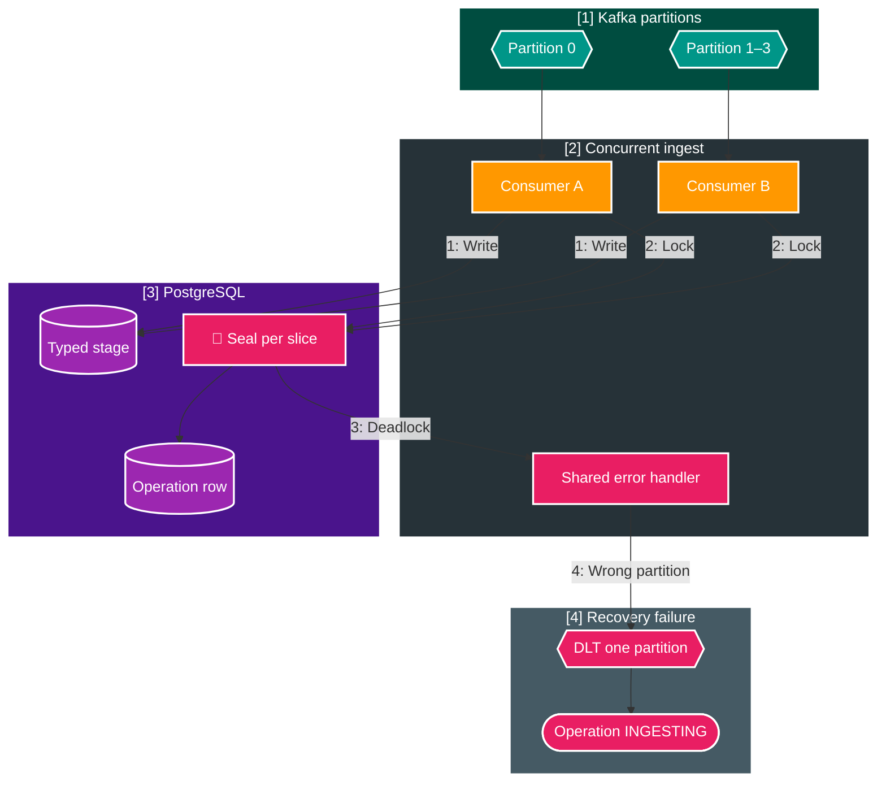
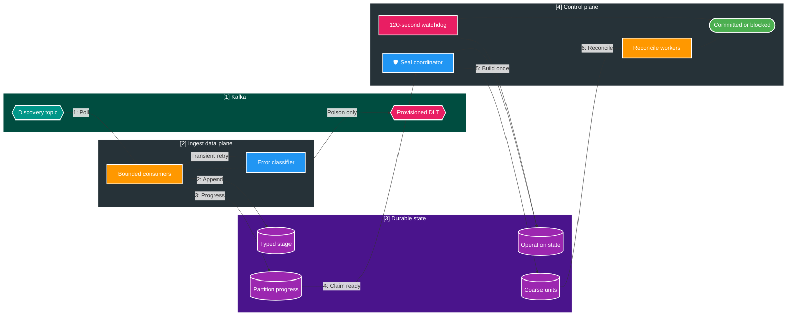

# FT-058 — Catalog Operation Reliability Hardening — Design

Owner: `catalog-service`
Brief: [01-brief.md](./01-brief.md)

## High Level Design

### As-Is: ingest transaction tự đánh giá global gate

Deadlock phát sinh vì các transaction cùng operation đã ghi stage/progress rồi cùng cố lấy exclusive row lock để
seal. Khi recovery publication cũng lỗi, Kafka reseek batch nhưng không có durable tiến trình nào đưa operation ra
khỏi `INGESTING` trước watchdog input-missing hiện tại.

### To-Be: ingest data plane và seal control plane độc lập

## Quyết định

1. `CatalogOperationStageStore` không gọi equality gate từ `ingest()` hoặc watermark transaction. Hai entry point
   chỉ commit input/manifest rồi trả control cho Kafka.
2. Seal coordinator là durable scheduled control plane. Nó claim một bounded tập operation `INGESTING` bằng
   `FOR UPDATE SKIP LOCKED`, kiểm tra committed partition progress, unresolved DLT và manifest rồi gọi one-time seal.
3. Reconciliation FT-057 giữ nguyên. FT-058 chỉ thêm retry metadata/deadline và terminal transition; không sửa
   primary election, delta, snapshot hoặc outbox SQL khi chưa có valid benchmark.
4. Error classifier chia lỗi thành non-retryable payload/contract và transient database/broker. Transient retry có
   exponential backoff, jitter và attempt cap; sau exhaustion operation bị block với failure evidence.
5. DLT được tạo/provision cùng topology source. Recoverer không được gửi tới partition không tồn tại.
6. Một watchdog chung enforce total operation deadline trên `INGESTING`, `RECONCILING` và `COMMITTING`; mọi
   timeout phải có terminal state và replay path, không chỉ log warning.

## Data ownership và contract

- Toàn bộ stage, operation, unit, retry metadata và outbox tiếp tục thuộc `catalog_db`.
- Không đổi payload, key hay version của `media.file.discovered.v2`, `media.subject.changed.v2` và
  `media.approval.watermark.v1`.
- Failure code mới là internal operation evidence; nếu public operation API expose tập enum đóng thì cập nhật
  contract trong cùng implementation trước khi code.

## Failure, retry và deadline

| Failure | Xử lý | Terminal evidence |
| --- | --- | --- |
| Malformed/unsupported event | DLT ngay theo non-retryable policy | `CATALOG_INPUT_DLT` |
| PostgreSQL deadlock/serialization | Retry exponential + jitter | block sau attempt/deadline exhaustion |
| DB connection/query timeout | Retry bounded; không tight loop | last error + retry count |
| DLT broker publication failure | Giữ source offset chưa commit và alert | không mất record |
| Unit statement failure | rollback canonical/outbox/checkpoint | retry fenced hoặc terminal block |
| Operation vượt 120 giây | ngừng claim work mới cho operation | terminal `BLOCKED` + deadline code |

## Performance decision

Mục tiêu release là 1M trong tối đa 120 giây với durability bình thường. `30–40K/s` chỉ được báo nếu đo được;
không tăng concurrency, transaction size hoặc timeout chỉ để đạt con số đó. Nếu reliable 1M vẫn vượt deadline,
kiến trúc kế tiếp phải đổi contract sang partition/shard completion để tạo overlap, không tiếp tục sửa function
reconciliation cùng shape.
