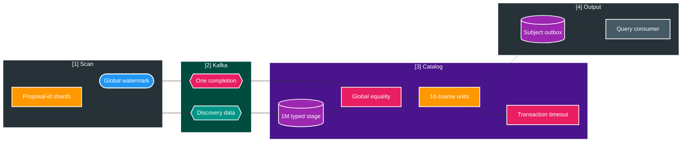

# FT-059 — Catalog Logical Shard Completion Contract — Design

Owner: `scan-service` + `catalog-service` + `platform/event-contracts`
Brief: [01-brief.md](./01-brief.md)
ADR: [ADR-006](../../adr/ADR-006-logical-completion-shards.md)

## High Level Design

### Kiến trúc hiện tại (As-Is): global barrier và coarse transaction



FT-058 chỉ mở reconciliation sau global equality. Ở workload 1M, mỗi unit khoảng 6.250 subjects; statement
timeout rollback toàn unit, durable checkpoint không tiến và retry lặp lại cùng transaction.

### Kiến trúc đích (To-Be): logical shard completion và bounded pages

```mermaid
flowchart LR
    subgraph SCAN["[1] Scan shards"]
        direction TB
        ROUTE["Subject-key router"]
        S0["Shard 0"]
        SN["Shard 1..N"]
    end
    subgraph KAFKA["[2] Kafka"]
        direction TB
        DATA{{"Discovery data"}}
        DONE{{"Shard completed"}}
    end
    subgraph CATALOG["[3] Catalog DB"]
        direction TB
        INPUT[("Typed input")]
        LEDGER[("Shard ledger")]
        GATE["Shard equality gate"]
        PAGES["Bounded pages"]
    end
    subgraph PIPE["[4] Continuous output"]
        direction TB
        CANON[("Canonical + outbox")]
        RELAY["Sliding relay"]
        QUERY["Query projection"]
        GLOBAL(["Catalog committed"])
    end
    ROUTE --> S0
    ROUTE --> SN
    S0 --> DATA
    SN --> DATA
    S0 --> DONE
    SN --> DONE
    DATA --> INPUT
    DONE --> LEDGER
    INPUT --> GATE
    LEDGER --> GATE
    GATE --> PAGES
    PAGES --> CANON
    CANON --> RELAY
    RELAY --> QUERY
    LEDGER --> GLOBAL
    RELAY --> GLOBAL
    style SCAN fill:#263238,stroke:#fff,stroke-width:2px,color:#fff
    style ROUTE fill:#2196F3,stroke:#fff,stroke-width:2px,color:#fff
    style S0 fill:#FF9800,stroke:#fff,stroke-width:2px,color:#fff
    style SN fill:#FF9800,stroke:#fff,stroke-width:2px,color:#fff
    style KAFKA fill:#004D40,stroke:#fff,stroke-width:2px,color:#fff
    style DATA fill:#009688,stroke:#fff,stroke-width:2px,color:#fff
    style DONE fill:#E91E63,stroke:#fff,stroke-width:2px,color:#fff
    style CATALOG fill:#4A148C,stroke:#fff,stroke-width:2px,color:#fff
    style INPUT fill:#9C27B0,stroke:#fff,stroke-width:2px,color:#fff
    style LEDGER fill:#9C27B0,stroke:#fff,stroke-width:2px,color:#fff
    style GATE fill:#2196F3,stroke:#fff,stroke-width:2px,color:#fff
    style PAGES fill:#4CAF50,stroke:#fff,stroke-width:2px,color:#fff
    style PIPE fill:#263238,stroke:#fff,stroke-width:2px,color:#fff
    style CANON fill:#9C27B0,stroke:#fff,stroke-width:2px,color:#fff
    style RELAY fill:#FF9800,stroke:#fff,stroke-width:2px,color:#fff
    style QUERY fill:#455A64,stroke:#fff,stroke-width:2px,color:#fff
    style GLOBAL fill:#4CAF50,stroke:#fff,stroke-width:2px,color:#fff
```



Completion marker và data nằm ở topic khác nhau nên không dựa vào arrival order. Catalog chỉ mở shard khi
manifest đã tồn tại và unique count bằng expected count. Shard được seal sớm sẽ đi qua page reconciliation,
outbox và relay trong khi shard khác vẫn ingest; Query nhận snapshot ngay từ page đầu tiên.

## Quyết định và So sánh (Trade-offs)

| Tiêu chí | FT-057/FT-058 As-Is | FT-059 To-Be | Boundary bằng chứng |
| --- | --- | --- | --- |
| Completion | Một global barrier cho 1M | Một marker cho mỗi logical shard + global terminal | To-Be chưa benchmark |
| Routing | Scan worker hash `proposal.id`; Catalog bucket nội bộ | Contract hash canonical subject key | Cần Java/SQL golden vectors |
| Failure domain | Khoảng 6.250 subjects/unit/transaction | Shard seal + page candidate 250–500 subjects | Page size phải calibration |
| Retry | Rollback và chạy lại toàn unit | Chạy lại page chưa checkpoint | Exact crash test bắt buộc |
| Overlap | Reconcile sau khi toàn input hội tụ | Ingest, reconcile, relay và Query chạy gối nhau | Báo phase timeline riêng |
| Concurrency | 16 units và 4 workers | 64 logical shards candidate, worker vẫn bounded riêng | Không đồng nhất shard với worker |
| Transport | Data + global watermark | Thêm tối đa O(shard) completion events | 64 events/operation candidate |

Chọn logical shard thay vì Kafka partition vật lý vì topic partition count có thể đổi và key remapping không
phải business invariant. Chọn subject key thay vì proposal ID để một aggregate không bị seal ở hai shard.

## Routing contract

Canonical input là Kafka partition key hiện hành:

```text
subjectKey = region + ":" + subjectType + ":" + identityKey
routingBucket = first 12 bits of MD5(UTF-8(subjectKey))       // 0..4095
completionShardId = floor(routingBucket * shardCount / 4096) // 0..shardCount-1
partitioningVersion = SUBJECT_KEY_MD5_12_RANGE_V1
```

- Không trim, lowercase hoặc normalize lại field sau khi event đã được tạo.
- `shardCount` v1 là power of two trong `1..256`; candidate mặc định `64` và immutable theo operation.
- MD5 chỉ dùng để phân bố ổn định, không dùng cho mục đích bảo mật.
- Catalog đã persist `routing_bucket`; shard là contiguous bucket range nên page query có thể dùng index range.
- Shared Java router nằm trong `platform/event-contracts`; SQL/golden-vector tests ngăn Scan và Catalog drift.

Golden vectors với `shardCount=64`:

| subjectKey | routingBucket | completionShardId |
| --- | ---: | ---: |
| `JOKE:VIDEO:START-001` | 1597 | 24 |
| `USE:VIDEO:USE:ACTRESS:TITLE:STUDIO` | 901 | 14 |
| `USE:ALBUM:album-001` | 2836 | 44 |

## Domain và data ownership

### Scan owner

- `scan_db` tiếp tục sở hữu proposal, decision, outbox, approval operation và shard ledger.
- New operation persist `partitioning_version`, `completion_shard_count` và processing version. Existing
  `scan_approval_operation_shard` được route theo subject bucket thay vì proposal ID cho processing version mới.
- Proposal cần persisted/generated routing bucket và index `(scan_run_id, routing_bucket, id)` để keyset theo
  shard không full-scan 1M rows ở mỗi claim.
- Worker concurrency vẫn cấu hình độc lập (candidate 4); 64 shard rows là durable work units, không tạo 64
  concurrent DB writers.
- Khi shard count đạt exact expected count, transaction cuối cùng checkpoint shard `COMPLETED` và insert
  `media.approval.shard.completed.v1` vào Scan outbox.

### Catalog owner

- `catalog_db` tiếp tục sở hữu typed input, shard/page ledger, canonical tables và outbox.
- Mỗi unique discovery row được gắn shard từ persisted `routing_bucket`; counter tăng theo shard sau dedupe.
- Shard ledger giữ expected/received count, manifest event, status, retry/deadline và output counters.
- Page ledger giữ keyset/range, lease/fence, attempt và cardinality. Canonical mutation + subject snapshot outbox
  + page checkpoint commit atomic; temporary/derived page state có thể rebuild từ durable typed input.
- Global operation chỉ `CATALOG_COMMITTED` khi mọi shard completed, tổng received bằng global expected, tổng
  output bằng unique changed subjects, unresolved DLT bằng 0 và mọi output đã broker-ack/durable-mark.

Không có cross-database join/write. Query chỉ consume `media.subject.changed.v2`; Query database và BT-09E
không bị sửa trong feature này.

## REST/event contract

- Không đổi REST API.
- Giữ nguyên `media.file.discovered.v2`, partition key và DLT semantics.
- Thêm [media.approval.shard.completed.v1](../../contracts/events/media.approval.shard.completed.v1.md),
  producer Scan, consumer Catalog, partition key `operationId:completionShardId`.
- Giữ [media.approval.watermark.v1](../../contracts/events/media.approval.watermark.v1.md) làm global terminal
  protocol; shard marker không thay `APPROVAL_COMMITTED` hoặc `CATALOG_COMMITTED`.
- Giữ `media.subject.changed.v2` làm full final snapshot. Catalog có thể publish sớm theo shard nhưng vẫn đúng
  một event cho mỗi `(operationId, subjectId)`.
- Protocol additive nhưng không trộn trong một operation: processing version cũ dùng global barrier; version mới
  bắt buộc đủ shard manifest theo routing version đã persist.

## Luồng lỗi, idempotency và consistency

| Failure | Hành vi |
| --- | --- |
| Marker đến trước data | Persist manifest; giữ shard `INGESTING` tới equality |
| Data đến trước marker | Dedupe/append/counter; không seal khi thiếu manifest |
| Duplicate marker cùng payload | No-op theo `(operationId, shardId, partitioningVersion)` |
| Marker conflict count/version | Block operation với `CATALOG_SHARD_MANIFEST_CONFLICT` |
| Unique data đến sau shard seal | Block operation với `CATALOG_SHARD_LATE_INPUT` |
| Duplicate data đến sau seal | No-op theo `eventId`; không đổi counter |
| Worker chết trước page commit | Rollback canonical/outbox/checkpoint; lease/fence reclaim |
| Worker chết sau page commit | Durable checkpoint bỏ qua page đã hoàn tất |
| Subject snapshot quá envelope | Rollback page rồi block subject/operation theo invariant hiện hành |
| Broker ACK trước outbox mark | Relay lại; consumer dedupe, global terminal tiếp tục chờ durable mark |
| Một shard hết retry/deadline | Shard và parent `BLOCKED`; shard khác không bị rollback |

Consistency vẫn là eventual giữa service, local atomic trong từng owner. Per-shard completion không nới lỏng
global exact cardinality, DLT gate hoặc subject version ordering.

## Hiệu năng, quan sát và bảo mật tối thiểu

- Clock Catalog giữ nguyên: first Catalog receive tới final output broker ACK; không trừ overlap hai lần.
- Báo shard count, records/subjects per shard p50/p95/max, ingest-to-seal, page duration p50/p95/max, retry,
  statement timeout, pool/lock wait, WAL/temp/buffers, relay lag/tail và total wall clock.
- Pressure gate giới hạn page claims theo DB pool/WAL/lock evidence; không mở một worker cho mỗi shard.
- `statement_timeout < lease`; global deadline vẫn 120 giây và phải đưa operation về terminal evidence.
- Log/metric dùng operation/shard/page ID; không đưa path, identity key hoặc payload vào metric label.
- Contract không chứa absolute filesystem path, credential hoặc dữ liệu ngoài payload hiện hành.
