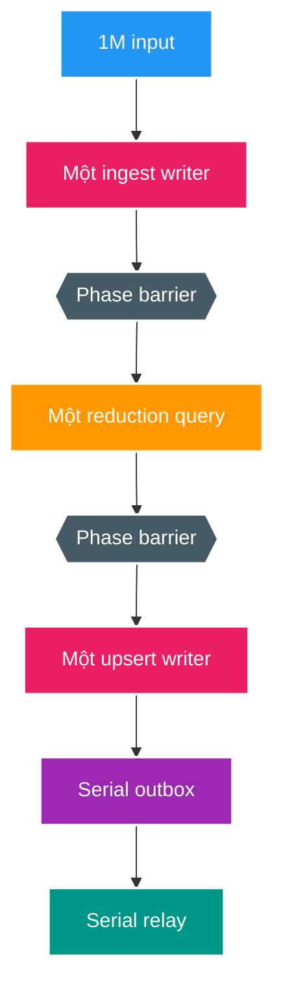
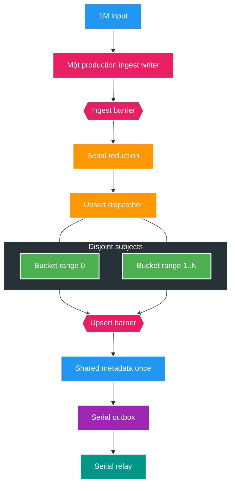

# FT-060 — Catalog Bounded Intra-Phase Parallel Data Plane — Design

Owner: `catalog-service`
Brief: [01-brief.md](./01-brief.md)

## High Level Design

### Kiến trúc hiện tại (As-Is): một DB writer xuyên từng phase

As-Is đạt exact cardinality nhưng mất `171.871 ms`. Hai phase một-writer ingest/upsert mất `131.374 ms`;
logical CPU còn dư nhưng một PostgreSQL backend không tận dụng được.

### Kiến trúc đích (To-Be): ingest ổn định, bounded fan-out/fan-in cho bulk upsert

## Quyết định và So sánh (Trade-offs)

| Tiêu chí | As-Is FT-059 physical | To-Be FT-060 candidate |
| --- | --- | --- |
| Phase concurrency | Một writer | Ingest 1; upsert 2, tối đa 4 writers |
| Ownership | Whole operation | Contiguous routing-bucket ranges |
| Cross-phase overlap | Không | Không |
| Shared master data | Trong monolithic upsert | Fan-in, synchronize đúng một lần |
| Correctness boundary | 64 logical shards | Giữ nguyên 64 shards; worker độc lập |
| Risk | Under-utilized CPU | WAL/index/connection contention |
| Selection | 171.871 ms baseline | Evidence 2 vs 4 workers, không chọn theo giả định |

Gate 25K đã bác bỏ parallel ingest qua production path: mỗi `stage.ingest` khóa cùng parent operation
`FOR UPDATE` rồi cập nhật `received_record_count`, nên worker disjoint theo subject vẫn chờ cùng một row.
FT-060 giữ serialization point này thay vì làm yếu telemetry gate. Tách immutable insert và progress fan-in là
thay đổi production riêng, chỉ được mở sau khi candidate upsert có evidence.

## Domain và data ownership

- `catalog-service` tiếp tục sở hữu toàn bộ input, canonical media và outbox tables.
- `routing_bucket` đã durable trên discovery input và là immutable range key `0..4095`.
- Worker range không đổi subject identity hoặc FT-059 completion shard; nó chỉ là execution partition.
- Benchmark scratch vẫn UNLOGGED/Testcontainers-only, không trở thành production source of truth.

## REST/event contract

Không đổi REST/Kafka contract. `media.file.discovered.v2`, `media.approval.shard.completed.v1`,
`media.subject.changed.v2` và global watermark giữ nguyên payload/version.

## Luồng lỗi, idempotency và consistency

- Upsert fan-out phải join toàn bộ futures; một range fail làm benchmark fail và phase sau không chạy.
- Bucket ranges không overlap và phủ đúng `0..4095`; worker count chỉ nhận `1`, `2` hoặc `4`.
- Canonical upsert range chạy một transaction/range. Shared master data chạy sau barrier trong transaction riêng.
- Benchmark reset toàn schema giữa các correctness repetitions; không reuse partial result.
- Production rollback chưa áp dụng vì candidate chưa đi vào runtime/migration.

## Hiệu năng, quan sát và bảo mật tối thiểu

- Thu cùng phase elapsed, WAL, temp, read/write bytes/time, deadlock, lock waiter, CPU, heap và GC như baseline.
- Báo speedup và write amplification của 2/4 workers so với 1 worker.
- Giữ payload synthetic sạch; log chỉ cardinality/resource, không log identity/path.
- Không đổi PostgreSQL durability hoặc che sampler failure.
