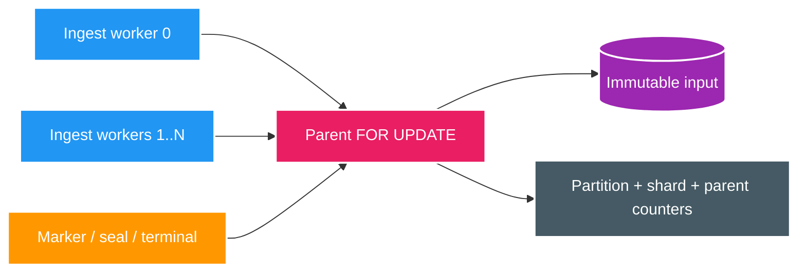
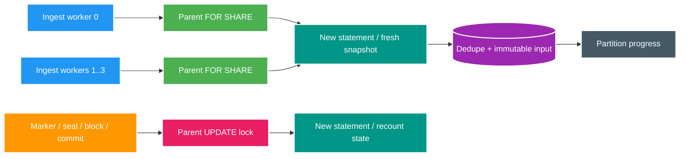

# FT-061 — Catalog Shared Ingest Fence — Design

Owner: `catalog-service`
Brief: [01-brief.md](./01-brief.md)
Compatibility owner: [ADR-006 logical completion shards](../../adr/ADR-006-logical-completion-shards.md)

## Root cause

`CatalogOperationBatchConsumer` chia Kafka poll thành bounded slices. `CatalogOperationStageStore.ingest` COPY
slice vào temp table rồi `CatalogOperationIngestStore` chạy một CTE: exclusive-lock parent, kiểm tra state,
dedupe/insert input và cộng partition/shard/parent counters. Exclusive parent lock khiến mọi slice cùng operation
tuần tự. FT-058 attribution cho thấy stage SQL chiếm khoảng `80,5%` ingest time; FT-060 bắt được parent lock wait.

## As-Is

## To-Be

## Quyết định

### Shared parent fence

V59 ingest thực hiện trong một transaction:

1. `SELECT ... FROM catalog_approval_operation WHERE operation_id IN (...) ORDER BY operation_id FOR SHARE`.
2. Sau khi statement 1 trả về, statement 2 đọc operation/shard state bằng snapshot `READ COMMITTED` mới,
   dedupe và insert durable input.

`FOR SHARE` tương thích giữa ingest workers nhưng xung đột với parent `UPDATE`/`FOR UPDATE`. Vì thế marker,
seal, deadline, manifest conflict và terminal transition không thể đi qua một input transaction đang commit.
Hai statements là bắt buộc: gộp lock và child-state read vào một statement có thể dùng snapshot tạo trước lúc
chờ lock, chính là visibility race đã gặp ở FT-059.

PostgreSQL 18 xác nhận `FOR SHARE` cho phép shared/key-shared lockers khác nhưng ngăn row `UPDATE/DELETE`, và
`READ COMMITTED` tạo snapshot mới cho từng command; successive commands trong cùng transaction có thể thấy commit
mới: [row-level locks](https://www.postgresql.org/docs/18/explicit-locking.html#LOCKING-ROWS),
[Read Committed](https://www.postgresql.org/docs/18/transaction-iso.html#XACT-READ-COMMITTED).

### Authority và progress

- `catalog_operation_discovery_input(event_id)` là dedupe/source of truth.
- `catalog_operation_ingest_partition` vẫn cộng unique rows; các Kafka consumers trong cùng generation sở hữu
  các source partitions disjoint.
- V59 bỏ per-slice mutation của `completion_shard.received_record_count` và parent `received_record_count` để
  không thay exclusive serialization bằng hot shard rows.
- Marker synchronization và seal đã recount durable input. Shard completion refresh parent count từ shard ledger;
  final convergence tiếp tục exact-match global manifest.
- V57 giữ query/counters hiện hành.

### Late input không lock upgrade

Nếu statement 2 thấy new unique input cho shard không còn `INGESTING`, nó không insert và atomically set child
shard `BLOCKED`. Nó không update parent khi đang giữ `FOR SHARE`, tránh hai late writers cùng upgrade thành
deadlock. Completion coordinator chạy propagation riêng: lock parent `FOR UPDATE`, đọc blocked child bằng statement
mới, rồi persist parent `BLOCKED`. Durable child state bảo đảm restart vẫn recover được.

### Terminal transition dùng fresh snapshot

`beginCommittingEligibleOperations` phải tách thành claim/verify:

1. lock đúng một candidate parent `FOR UPDATE SKIP LOCKED`;
2. statement kế tiếp re-evaluate manifest, shard status/count, DLT, workset và pending outbox;
3. chỉ khi vẫn eligible mới đổi `COMMITTING` và tạo final watermark atomically.

Nếu claim phải chờ ingest shared lock, bước verify luôn thấy input/shard state sau commit. False-negative chỉ làm
retry tick sau; false-positive terminal bị cấm.

## Lock graph

| Path | Lock order | Ghi chú |
| --- | --- | --- |
| V59 normal ingest | Parent `SHARE` → partition progress | Nhiều ingest tương thích |
| V59 late input | Parent `SHARE` → shard `UPDATE` | Không quay lại update parent |
| Marker | Parent `UPDATE` → shard | Chờ mọi ingest đang mở |
| Seal | Parent `UPDATE` → shard | Function recount ở statement sau claim |
| Block propagation | Parent `UPDATE` → read blocked shard | Restart-safe |
| Final convergence | Parent `UPDATE` → fresh verification | Không stale snapshot |

Không có path shard → parent và không có shared → parent-lock upgrade. Lock graph không có cycle nội tại.

## Control-flow partitions

| Partition | Kết quả |
| --- | --- |
| Batch `0` | No-op, không DB write/success metric giả |
| Batch `1`/đầy batch | Bounded mapping/COPY; shared fence rồi fresh ingest statement |
| Data trước marker | Insert; seal chờ manifest và exact recount |
| Marker trước data | Marker waits open ingest hoặc ingest waits marker; fresh statement thấy ledger |
| Duplicate/retry | `ON CONFLICT(event_id) DO NOTHING`; progress không đếm lại |
| Concurrent workers | Shared parent locks tương thích; partition progress disjoint |
| Ingest vs seal | Seal waits shared fence; ingest sau seal thấy terminal shard và bị loại |
| Late unique | Không insert; child rồi parent `BLOCKED` |
| Restart sau child block | Coordinator propagate durable child failure |
| Ingest vs final commit | Commit claim waits shared fence rồi re-verifies fresh state |

## Contract, ownership và compatibility

- Không đổi event/REST contract hoặc Scan. At-least-once, DLT và event-id idempotency giữ nguyên.
- Chỉ Catalog ghi `catalog_db`; không cross-database join/write.
- Không cần schema mới. Nếu phải replace database function, chỉ thêm migration sau V26; không sửa V25/V26.
- Không cần ADR mới vì logical-shard boundary và ownership của ADR-006 không đổi.
- Existing V59 operations phải drain trước mixed-version rollout; không để hai app versions dùng fence khác nhau
  trên cùng operation.

## Alternatives

| Phương án | Kết quả |
| --- | --- |
| Giữ `FOR UPDATE`, tăng worker | FT-060 đã chứng minh không scale |
| Bỏ parent fence hoàn toàn | Terminal/late-input race, loại |
| Shard-only fence | Không bao phủ mọi parent status writer, loại sau self-review |
| Advisory lock từ UUID hash | Collision correctness risk, loại |
| Parent `FOR SHARE` + fresh statement | Bao phủ mọi parent writer, bounded concurrency, **chọn** |

## GO/NO-GO

**GO có điều kiện để implement.** Trước benchmark phải chứng minh safety bằng deterministic ingest-vs-seal và
ingest-vs-final-commit IT; chứng minh liveness bằng blocked-child propagation sau restart. Thiếu một evidence thì
`NO-GO`, rollback về FT-059.
