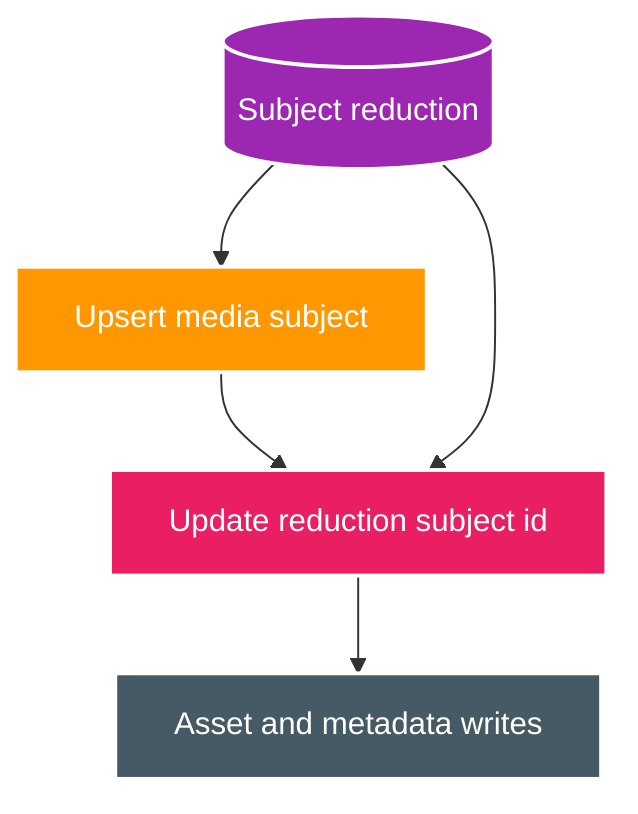
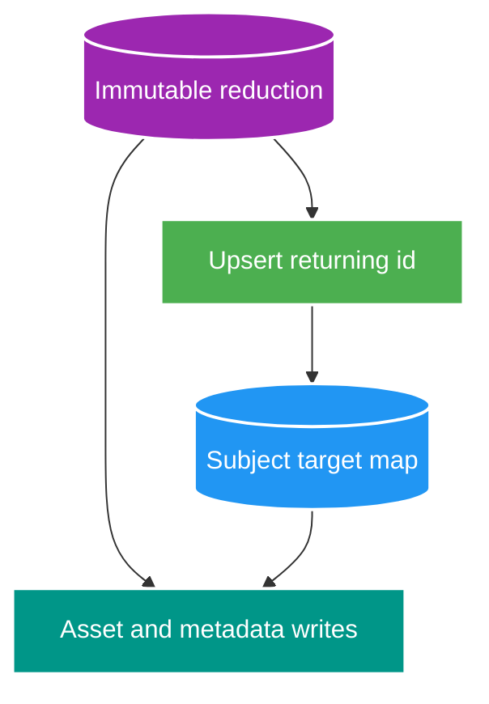

# FT-062 — Catalog Subject Target Mapping — Design

Owner: `catalog-service`  
Brief: [01-brief.md](./01-brief.md)

## As-Is: mutable reduction hydration

Mỗi range worker upsert subject rồi chạy một `UPDATE ... FROM media_subject` trên cùng reduction table. Hai
worker ghi các row khác nhau nhưng cùng heap/index pages, tạo write amplification và kéo dài phase. Đây cũng
không phải shape V23 production, nơi mapping nằm trong `tmp_catalog_target`.

## To-Be: immutable reduction và target mapping

Mỗi worker sở hữu một routing range. Data-modifying CTE upsert subject và `RETURNING` canonical identity + ID;
outer insert ghi `subject_key -> subject_id` vào target table. Downstream chỉ đọc target, không rewrite
reduction.

## Quyết định và trade-off

| Tiêu chí | FT-061 driver | FT-062 candidate |
| --- | --- | --- |
| Reduction | Có cột `subject_id` mutable | Immutable |
| Resolve canonical ID | Second join + UPDATE | Upsert `RETURNING` |
| Mapping | Nằm lẫn trong reduction | Target table riêng |
| Existing subject | Join sau upsert | `DO UPDATE RETURNING` |
| Parallel ownership | Routing range | Giữ nguyên routing range |
| Production similarity | Thấp hơn V23 | Khớp `tmp_catalog_target` của V23 |

Trade-off: conflict path thực hiện no-op-style update metadata/version giống benchmark hiện hành để buộc mọi
row conflict xuất hiện trong `RETURNING`. Đây là physical candidate, không thay production business semantics.

## Data ownership và contract

- Tất cả table vẫn thuộc `catalog-service`; target/reduction là UNLOGGED benchmark scratch.
- Không đổi REST, Kafka event, payload, completion contract hoặc database ownership.
- Không cần Flyway migration vì production V23 đã dùng temporary target mapping.

## Failure, idempotency và concurrency

- Routing bucket ranges disjoint; một subject chỉ đi qua một worker.
- Target `subject_key` là primary key; duplicate mapping fail thay vì silently overwrite.
- Worker exception fail cả phase; phase sau chỉ chạy sau fan-in thành công.
- Benchmark reset scratch/canonical tables giữa repetitions.

## PostgreSQL 18 evidence

- `INSERT ... ON CONFLICT DO UPDATE ... RETURNING` trả row insert và row update.
- Data-modifying CTE chia sẻ snapshot; output cần truyền qua `RETURNING`, không đọc lại base table trong cùng
  statement để suy luận effect.
- Nguồn chính thức: [INSERT](https://www.postgresql.org/docs/18/sql-insert.html),
  [WITH queries](https://www.postgresql.org/docs/18/queries-with.html).
