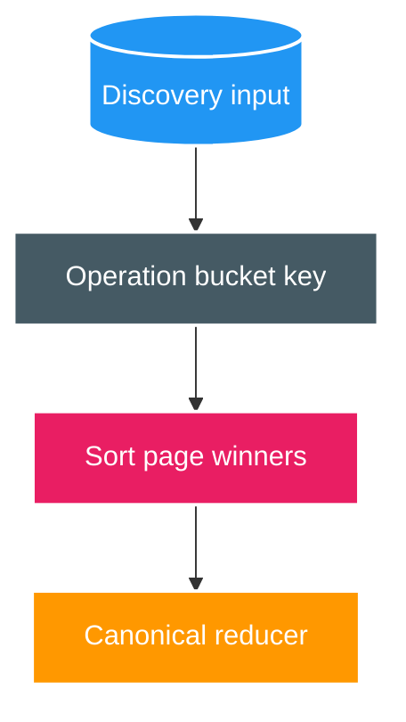
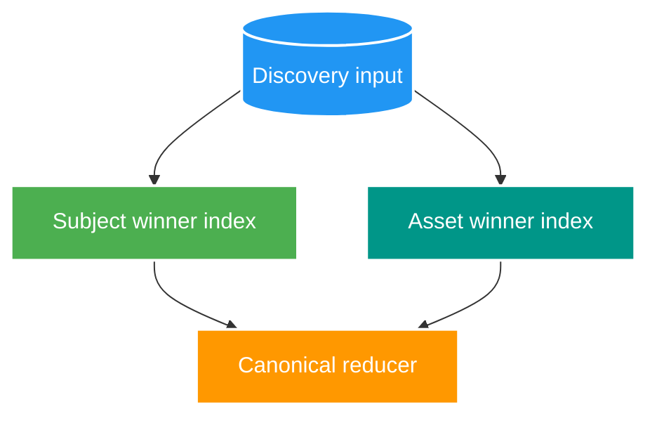

# FT-063 — Catalog Reconciliation Page Access Paths — Design

Owner: `catalog-service`  
Brief: [01-brief.md](./01-brief.md)

## As-Is: index order không khớp page query

V23 index dùng `(operation_id, routing_bucket, subject_key, ...)`; V59 unit chọn workset bằng subject key và có
thể trải nhiều routing bucket nên không giữ được winner order từ index.

## To-Be: page-aligned winner indexes

Hai index mới bắt đầu bằng đúng equality/filter keys rồi tiếp tục bằng `DISTINCT ON ... ORDER BY` keys. Reducer,
transaction và completion contract không đổi.

## Contract và ownership

- PostgreSQL Catalog vẫn là source of truth; mutation và outbox cùng transaction.
- Không đổi payload `media.subject.changed.v2`, watermark hoặc completion shard protocol.
- V28 chỉ thêm hai index; public DB function giữ nguyên.

## Trade-off và rollback

- Đổi thêm index maintenance/WAL ở ingest để giảm sort/heap work ở finalizer.
- Rollback bằng migration kế tiếp drop hai index; không sửa/xóa V28 sau khi apply.
