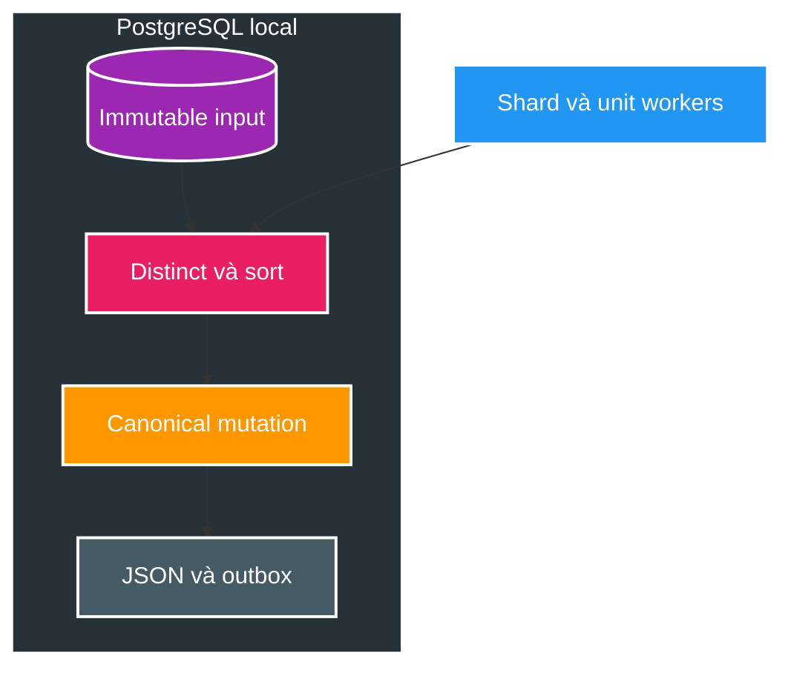

# FT-064 — Catalog Hybrid Streaming Reconciliation — Design

Owner: `catalog-service`  
Brief: [01-brief.md](./01-brief.md)  
Decision: [ADR-008](../../adr/ADR-008-catalog-hybrid-java-sql-reconciliation.md)

## As-Is: PostgreSQL vừa compute vừa persist

PostgreSQL phải sort/group input, thực thi business election và mutation trong cùng statement dài. Tăng worker tạo
thêm cạnh tranh CPU, buffer, WAL và lock trên một database local.

## To-Be: parallel Java reduction, serial set-based persistence

```mermaid
flowchart LR
    subgraph DBR["PostgreSQL read realm"]
        direction TB
        WORK[("Subject workset")]
        INPUT[("Discovery input")]
    end
    subgraph JVM["Java application realm"]
        direction TB
        GROUP["Group page 2.500"]
        FAN["Virtual-thread fan-out"]
        REDUCE(("Reduced winners"))
        GROUP --> FAN --> REDUCE
    end
    subgraph DBW["PostgreSQL write realm"]
        direction TB
        COPY[/"COPY temp staging"/]
        APPLY["Set-based mutation"]
        OUTBOX{{"Outbox và checkpoint"}}
        COPY --> APPLY --> OUTBOX
    end
    WORK -->|"1: Claim fenced page"| GROUP
    INPUT -->|"2: Read full subjects"| GROUP
    REDUCE -->|"3: One bounded result"| COPY
    style DBR fill:#4A148C,stroke:#fff,stroke-width:2px,color:#fff
    style WORK fill:#9C27B0,stroke:#fff,stroke-width:2px,color:#fff
    style INPUT fill:#9C27B0,stroke:#fff,stroke-width:2px,color:#fff
    style JVM fill:#263238,stroke:#fff,stroke-width:2px,color:#fff
    style GROUP fill:#FF9800,stroke:#fff,stroke-width:2px,color:#fff
    style FAN fill:#2196F3,stroke:#fff,stroke-width:2px,color:#fff
    style REDUCE fill:#009688,stroke:#fff,stroke-width:2px,color:#fff
    style DBW fill:#004D40,stroke:#fff,stroke-width:2px,color:#fff
    style COPY fill:#4CAF50,stroke:#fff,stroke-width:2px,color:#fff
    style APPLY fill:#FF9800,stroke:#fff,stroke-width:2px,color:#fff
    style OUTBOX fill:#E91E63,stroke:#fff,stroke-width:2px,color:#fff
```

## Data flow và transaction

1. Completion shard equality gate tạo durable workset theo `subject_key`, page mặc định 2.500 subject.
2. Reader lấy toàn bộ input của đúng unit; một subject không thể vắt qua hai page.
3. Java group tuần tự, fan-out reduction theo subject bằng virtual-thread executor và giữ output order deterministic.
4. Writer mở một transaction, kiểm tra owner/fence/deadline, COPY winner rows vào temp staging rồi chạy set-based
   canonical mutation, snapshot/outbox và checkpoint.
5. Failure trước checkpoint rollback toàn transaction; lease expiry cho phép retry toàn page idempotently.

## Contract và ownership

- `catalog_db` tiếp tục là source of truth duy nhất; không có cross-database access.
- `media.subject.changed.v2`, `media.approval.watermark.v1` và `media.approval.shard.completed.v1` không đổi.
- Domain state và transactional outbox vẫn atomic trong một transaction.
- Scan không biết reducer Java/SQL; processing version và partitioning version của FT-059 được giữ tương thích.

## Bounds và concurrency

- `subject-page-size=2500`, validation range `1..2500`; input query hard-cap `25.000 + 1` rows để phát hiện skew;
  chỉ giảm page theo evidence.
- Virtual threads chỉ chạy pure reduction, không giữ JDBC connection và không ghi DB song song.
- Một claimed unit tạo đúng một persistence transaction; existing operation lease/fence/retry/watchdog được giữ.
- Empty page là no-op; mismatch giữa workset và reduced subjects là failure, không checkpoint giả.

## Rollback

- Rollback application về reducer V23/V59; migration FT-064 chỉ thêm forward-compatible staging support/index nếu cần.
- Không sửa migration V1–V28 đã apply.
- Workset chưa checkpoint vẫn `PENDING` và được legacy reducer xử lý lại an toàn.
