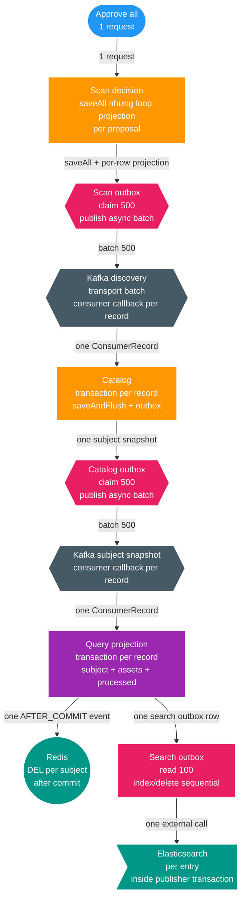
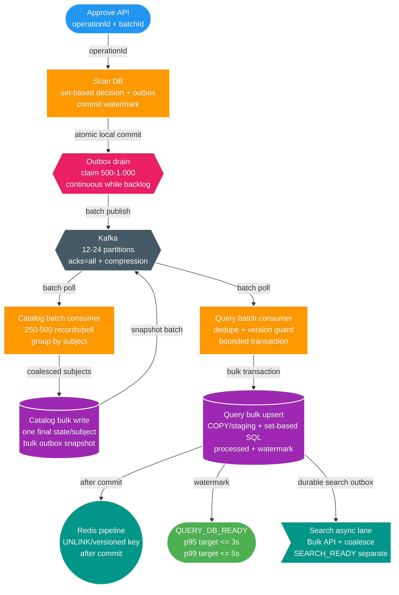
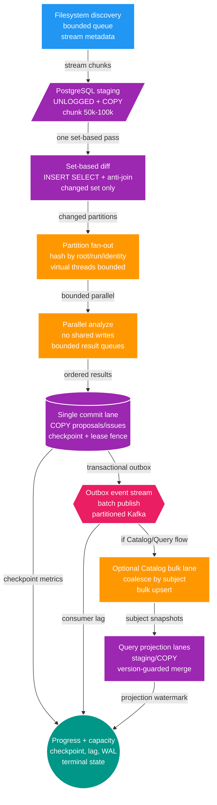

# Đánh giá hiệu năng approve 5.000 bản ghi

Ngày: 2026-08-13  
Phạm vi: `scan-service` → Scan outbox → Kafka → `catalog-service` → Catalog outbox → Kafka → `query-service`  
Mục tiêu: từ lúc gọi approve all đến khi dữ liệu hoàn tất đồng bộ tại Query trong 2–3 giây.

## Kết luận

Kiến trúc hiện tại **chưa đủ khả năng bảo đảm** SLO 5.000 bản ghi trong 2–3 giây. Điểm nghẽn chính không nằm ở `QuerySubjectCacheEntry`; record này chỉ là DTO serialize/deserialize cho detail cache. Nút thắt nằm ở việc toàn pipeline vẫn xử lý từng event với transaction và nhiều round-trip database riêng lẻ.

Đánh giá này là phân tích tĩnh từ source/configuration. Chưa chạy service, Docker, migration, build hoặc benchmark runtime; vì vậy chưa được phép tuyên bố SLO đã đạt.

## Critical path hiện tại

```text
Approve all
  → Scan ghi decision + outbox + review projection
  → Scan outbox relay
  → Kafka media.file.discovered.v2
  → Catalog xử lý từng event trong transaction riêng
  → Catalog ghi subject snapshot + outbox
  → Catalog outbox relay
  → Kafka media.subject.changed.v1
  → Query xử lý từng event trong transaction riêng
  → Query ghi projection + processed-event + search outbox
  → Redis invalidate từng subject
  → Search outbox gọi Elasticsearch
```

Để hoàn tất 5.000 record trong 3 giây, toàn pipeline phải duy trì tối thiểu khoảng `1.667 record/giây`; với 2 giây là `2.500 record/giây`. Con số này bao gồm cả hai service database, hai Kafka hop, dedupe, projection và invalidation.

## Điểm nghẽn đã xác định

## Audit bulk hiện trạng: đã có batch cục bộ, chưa có bulk xuyên pipeline

Không chính xác nếu nói toàn bộ dự án hoàn toàn không có batch. Dự án đã có một số mảnh bulk, nhưng chúng dừng ở transport hoặc gom entity trong memory; consumer và persistence quan trọng vẫn xử lý từng record.

| Lớp | Hiện trạng | Kết luận |
| --- | --- | --- |
| Approve Scan | `decisions.saveAll(newDecisions)` và `outbox.saveAll(newEvents)` | Gom nhiều entity, nhưng chưa phải set-based SQL; `projection.apply(...)` vẫn gọi từng proposal |
| Scan/Catalog outbox | Claim tối đa 500; gửi nhiều `publishAsync` rồi chờ acknowledgement | Có batch transport và async fan-out; vẫn có scheduler/fixed-delay và mark/claim DB riêng |
| Kafka consumer Catalog | `@KafkaListener` nhận một `ConsumerRecord`; gọi `service.handleV2(...)` | Callback per-record, transaction per-record |
| Catalog persistence | `saveAndFlush(subject)`, enqueue snapshot và processed event trong từng handler | Per-record aggregate load/flush/outbox; chưa coalesce theo subject trong Kafka batch |
| Kafka consumer Query | `@KafkaListener` nhận một `ConsumerRecord`; gọi `service.handle(...)` | Callback per-record, transaction per-record |
| Query persistence | `subjects.save`, `searchOutbox.save`, `processed.save` trong từng handler | Per-record projection; collection có thể delete/insert lại |
| Query cache | Một `DEL` Redis sau mỗi transaction | Per-subject network call, chưa pipeline |
| Search outbox | Lấy tối đa 100 nhưng gọi `search.index/delete` từng entry | Batch read nhưng external write tuần tự, lại giữ transaction |

### Vì sao `saveAll()` chưa đủ

`saveAll()` thường chỉ là vòng lặp gọi `save()` trên từng entity trong persistence context. Hibernate/JDBC có thể gom các statement thành JDBC batch nếu cấu hình đúng, nhưng vẫn khác hoàn toàn với một bulk/set-based operation:

- vẫn tạo và quản lý hàng nghìn entity;
- dirty checking vẫn chạy trên từng entity;
- quan hệ `@OneToMany`/`@ElementCollection` có thể tạo nhiều delete/insert;
- vẫn có thể phát sinh select để kiểm tra state hoặc version;
- không coalesce các thay đổi trùng cùng aggregate;
- khó giới hạn transaction và cô lập poison record.

Vì vậy cần phân biệt:

```text
saveAll()                 = batch persistence ở mức ORM
JDBC batch                = giảm số lần network round-trip tới DB
INSERT ... SELECT/COPY   = set-based bulk write
coalesce theo subject     = giảm số trạng thái cần ghi
Kafka batch consumer      = giảm transaction/dispatch overhead ở consumer
```

Mục tiêu 5.000 record trong 2–3 giây cần kết hợp cả năm lớp trên; chỉ thêm `saveAll()` hoặc tăng Kafka `concurrency` không giải quyết được.

### Vì sao Kafka đã async nhưng vẫn chậm

Producer hiện đã dispatch nhiều future bất đồng bộ trong một claimed batch. Đây là tối ưu đúng ở Scan/Catalog outbox. Tuy nhiên consumer listener vẫn nhận từng `ConsumerRecord`, và mỗi callback mở transaction riêng. Khi một batch producer gửi 500 event, phía consumer vẫn có thể thực hiện 500 transaction liên tiếp.

Kafka broker chỉ vận chuyển record; broker không tự gộp 500 message thành một transaction database cho Catalog hoặc Query. Muốn có bulk thật, phải đổi listener container sang batch listener và đổi application port để nhận một danh sách event bounded.

### Vì sao thiết kế hiện tại dễ xuất hiện như vậy

Các feature trước đây ưu tiên đúng boundary và reliability cục bộ:

- transactional outbox để không mất event;
- eventId dedupe và version guard;
- bounded claim/lease để tránh giữ transaction khi chờ Kafka;
- JPA entity aggregate để triển khai nhanh và dễ bảo toàn invariant;
- consumer per-record để retry/DLT dễ hiểu.

Đây là các quyết định hợp lý cho vertical slice và correctness, nhưng chưa đủ cho throughput SLO. Bước còn thiếu là một feature riêng thiết kế batch semantics: batch size, coalesce key, version ordering, partial failure/DLT, watermark và bulk persistence.

### 1. Approval vẫn tạo write amplification lớn

`ScanRunDecisionBatch` đọc proposals, tạo decision/outbox cho từng proposal và gọi `projection.apply(...)` cho từng record. `saveAll()` không bảo đảm một SQL statement duy nhất; JPA vẫn có thể phát sinh nhiều insert/update được JDBC batch lại.

Vị trí chính:

- `apps/scan-service/src/main/java/com/filemngt/v2/scan/application/decision/ScanRunDecisionBatch.java`
- `apps/scan-service/src/main/java/com/filemngt/v2/scan/application/decision/ScanReviewQueueDecisionBatch.java`

### 2. Outbox relay có fixed delay và chỉ xử lý bounded batch

Runtime hiện cấu hình batch 500 và delay 50 ms tại Scan và Catalog. 5.000 event cần khoảng 10 batch ở mỗi relay, tạo khoảng 0,5 giây delay lý thuyết cho mỗi relay trước khi tính claim DB, serialization, Kafka acknowledgement và cập nhật trạng thái published.

Vị trí chính:

- `apps/scan-service/src/main/resources/application.yml`
- `apps/catalog-service/src/main/resources/application.yml`
- `apps/scan-service/src/main/java/com/filemngt/v2/scan/application/outbox/ScanOutboxPublisher.java`
- `apps/catalog-service/src/main/java/com/filemngt/v2/catalog/application/CatalogOutboxPublisher.java`

Batch async hiện có là hướng đúng, nhưng scheduler chỉ chạy một batch rồi chờ fixed delay. Code fallback vẫn có default batch 20, cần bảo đảm mọi profile runtime không vô tình dùng giá trị này.

### 3. Catalog xử lý một transaction cho mỗi Kafka record

`CatalogFileDiscoveryService.handleV2()` thực hiện per-record:

- kiểm tra processed event và tombstone;
- lookup subject;
- hydrate aggregate và asset;
- `saveAndFlush(subject)`;
- tạo Catalog outbox;
- kiểm tra actress theo từng tên;
- ghi processed event;
- ghi log `INFO`.

Nếu nhiều file thuộc cùng subject, Catalog còn phát nhiều full snapshot liên tiếp của cùng aggregate. Đây là write amplification và event amplification nghiêm trọng.

Vị trí chính:

- `apps/catalog-service/src/main/java/com/filemngt/v2/catalog/application/CatalogFileDiscoveryService.java`
- `apps/catalog-service/src/main/java/com/filemngt/v2/catalog/application/CatalogSubjectOutboxService.java`

### 4. Query projection cũng per-record và ghi nhiều bảng

`QueryProjectionService.handle()` mở transaction riêng cho mỗi subject event, đọc processed/tombstone/subject, cập nhật subject/assets/collections, tạo search outbox và processed event.

Các thao tác `@ElementCollection` như `clear()`/`addAll()` có thể tạo delete/insert lại collection. Với 5.000 event, số SQL thực tế có thể lớn hơn nhiều lần số event.

Vị trí chính:

- `apps/query-service/src/main/java/com/filemngt/v2/query/application/QueryProjectionService.java`
- `apps/query-service/src/main/java/com/filemngt/v2/query/adapter/out/persistence/QuerySubjectEntity.java`
- `apps/query-service/src/main/java/com/filemngt/v2/query/adapter/out/persistence/QueryAssetEntity.java`

### 5. Redis invalidate từng key

`QueryDetailCacheInvalidator` gọi `cache.evict()` sau mỗi transaction. `RedisQueryDetailCache` thực hiện một lệnh delete riêng cho từng subject. Đây là 5.000 network round-trip nếu 5.000 subject bị thay đổi.

Vị trí chính:

- `apps/query-service/src/main/java/com/filemngt/v2/query/adapter/in/event/QueryDetailCacheInvalidator.java`
- `apps/query-service/src/main/java/com/filemngt/v2/query/adapter/out/cache/RedisQueryDetailCache.java`

### 6. Elasticsearch publisher không thể nằm trong SLO hiện tại

`SearchOutboxPublisher` chạy mỗi 1 giây, lấy tối đa 100 record và index tuần tự trong transaction. Nếu “Query hoàn tất” bao gồm Elasticsearch, riêng cơ chế hiện tại cần tối thiểu khoảng 50 vòng cho 5.000 record, chưa kể latency của Elasticsearch.

Vị trí chính:

- `apps/query-service/src/main/java/com/filemngt/v2/query/application/SearchOutboxPublisher.java`
- `apps/query-service/src/main/java/com/filemngt/v2/query/adapter/out/persistence/QuerySearchOutboxRepository.java`

### 7. Cấu hình observability hiện tại gây thêm tải

Catalog và Query đang bật `p6spy`, tracing sampling `1.0` và log `INFO` theo từng event. Trong workload 5.000 bản ghi qua hai hop, điều này tạo rất nhiều SQL log, span và file I/O.

Đây không phải lý do để bỏ observability; cần có performance profile riêng với logging/tracing được sampling và metric batch đầy đủ.

## Những thay đổi bắt buộc

### P0 — Batch processing xuyên suốt

Không chỉ publish Kafka theo batch; consumer và persistence cũng phải batch:

1. Kafka listener nhận `List<ConsumerRecord<...>>` với batch bounded khoảng 250–500 record.
2. Deserialize và dedupe bằng một set-based query.
3. Lookup subject, tombstone, actress và processed event bằng `IN`/temporary staging table.
4. Commit một transaction cho một bounded batch.
5. Cô lập poison record hoặc chia batch khi có lỗi; không làm mất at-least-once và DLT.
6. Giữ idempotency theo `eventId`, version guard và Kafka partition ordering.

Spring Kafka hỗ trợ batch listener qua `ConcurrentKafkaListenerContainerFactory.setBatchListener(true)` và listener nhận `List<ConsumerRecord<?, ?>>`. Batch error handling phải được thiết kế riêng, không bê nguyên xử lý per-record.

### P0 — Coalesce event tại Catalog theo subject

Các discovery event phải được group theo:

```text
region + subjectType + identityKey
```

Trong mỗi batch:

- load/lock mỗi subject một lần;
- áp dụng toàn bộ asset mutation;
- bầu primary một lần;
- tăng subject version một lần;
- phát một full snapshot cuối cùng cho mỗi subject.

Nếu 5.000 file thuộc 800 subject, Query chỉ xử lý khoảng 800 snapshot thay vì 5.000 event.

Đây là thay đổi behavior/throughput cần cập nhật event contract hoặc feature design trước khi code. Phải bảo toàn ordering, version monotonic và dedupe.

### P0 — Query bulk upsert

Query cần adapter persistence batch riêng, ưu tiên native SQL/JDBC batch hoặc PostgreSQL `COPY`:

- stage event vào bảng tạm hoặc staging table;
- bulk upsert `query_media_subject`;
- bulk upsert/delete `query_media_asset`;
- bulk replace actress/tag collection theo subject thay đổi;
- bulk insert processed-event;
- bulk insert search-outbox;
- dùng version guard để bỏ qua event cũ;
- xử lý tombstone trong cùng batch.

Không nên hydrate 5.000 JPA aggregate rồi để dirty checking xử lý từng collection.

### P0 — Completion watermark

HTTP approve phải có `approvalBatchId`/`operationId` và trạng thái durable:

```text
APPROVAL_COMMITTED
  → CATALOG_PROJECTED
  → QUERY_DB_READY
  → SEARCH_READY (nếu cần)
```

Event cần mang `batchId`. Query cập nhật watermark sau khi toàn bộ projection batch commit. API chỉ trả `COMPLETED` khi đạt watermark; nếu quá deadline thì trả trạng thái đang đồng bộ hoặc timeout rõ ràng.

Không được coi HTTP response sau khi Scan commit là bằng chứng Query đã hoàn tất.

### P1 — Redis pipeline

Gom toàn bộ subject ID thay đổi trong một batch và dùng Redis pipelining hoặc multi-key `UNLINK`. Invalidate sau commit; không rebuild cache trong critical path.

### P1 — Tách Query DB ready khỏi Search ready

Khuyến nghị SLO 2–3 giây áp dụng cho PostgreSQL projection + cache trước. Nếu bắt buộc Elasticsearch cũng phải ready:

- dùng Elasticsearch Bulk API;
- claim 500–1.000 operation mỗi lần;
- không giữ transaction PostgreSQL khi gọi Elasticsearch;
- coalesce operation mới nhất theo subject/version;
- mark từng bulk item;
- poll liên tục khi backlog còn.

### P1 — Tối ưu Scan write path

- bulk insert decision/outbox bằng JDBC/native SQL hoặc `COPY`;
- set-based update review projection;
- không load entity đầy đủ khi chỉ cần snapshot;
- kích hoạt worker ngay sau enqueue thay vì chờ scheduler 1 giây;
- giữ decision + outbox atomic trong cùng transaction.

## Runtime tuning sau khi đổi kiến trúc

Chỉ tuning sau khi có batch consumer/persistence:

- đặt `max.poll.records` khớp kích thước transaction;
- bắt đầu concurrency bằng số partition hữu dụng, hiện broker có 12 partition;
- tăng `batch.size`, bật compression và điều chỉnh `linger.ms` có kiểm soát;
- tắt P6Spy trong performance profile;
- giảm tracing sampling xuống mức phù hợp, giữ metric tổng hợp;
- chuyển log từng event từ `INFO` xuống `DEBUG`, log summary theo batch;
- tăng JDBC batch size và kiểm tra connection pool/DB lock contention;
- loại bỏ fixed delay khi backlog còn, chỉ sleep khi queue rỗng.

Tăng concurrency trước khi giảm số transaction có thể chỉ chuyển bottleneck sang PostgreSQL connection pool và lock contention.

## Ngân sách latency đề xuất

| Stage | Ngân sách p95 mục tiêu |
| --- | ---: |
| Scan approve + transactional outbox | 400–600 ms |
| Scan relay + Kafka | 150–250 ms |
| Catalog batch/coalesce + outbox | 600–800 ms |
| Catalog relay + Kafka | 150–250 ms |
| Query bulk projection + cache invalidation | 600–800 ms |
| Completion acknowledgement | 100–200 ms |
| Dự phòng | 200–400 ms |

Muốn đạt gần 2 giây cần coalesce theo subject và set-based/COPY write. JPA per-record không có đủ ngân sách latency.

## Kế hoạch xác minh bắt buộc

Chưa tuyên bố đạt SLO nếu thiếu các phép đo sau:

1. Workload 1, 500 và 5.000 record.
2. Đo timestamp tại approve request, Scan commit, Scan outbox published, Catalog consume/commit, Catalog outbox published, Query consume/commit, Query watermark.
3. Đo p50/p95/p99, consumer lag, outbox pending count/oldest age, số SQL statement, transaction duration, DB pool wait, Redis command latency và DLT.
4. Chạy duplicate, out-of-order, retry, poison event và restart giữa Kafka ack với mark-published.
5. So sánh profile observability bật/tắt P6Spy và sampling.
6. Xác minh `QUERY_DB_READY` độc lập với `SEARCH_READY`.

## Debt liên quan

Các debt hiện tại đã ghi nhận một phần vấn đề:

- `TD-013`: outbox publish và throughput/lease.
- `TD-016`: N+1 lookup và Search publisher giữ transaction trong external I/O.
- `TD-015`: Query DLT observation/replay.
- `TD-020`: thiếu SLO, alert và capacity evidence.

Feature mới cần cập nhật các debt này khi remediation được triển khai và benchmark đã có bằng chứng.

## Quyết định cần chốt trước khi triển khai

1. “Query hoàn tất” nghĩa là `QUERY_DB_READY` hay bắt buộc cả `SEARCH_READY`.
2. Có chấp nhận coalesce nhiều discovery event thành một subject snapshot cuối cùng hay không.
3. Ngưỡng SLO là p95 hay hard deadline cho mọi request.
4. Cho phép chạy benchmark runtime với JDK `corretto-25`, Kafka/PostgreSQL/Redis/Elasticsearch local hay chưa.

## Capacity và thiết kế hạ tầng triển khai

### Điều kiện tiên quyết

Không có cấu hình máy nào tự sửa được mô hình per-record transaction hiện tại. Các mức sizing dưới đây chỉ có ý nghĩa sau khi hoàn thành tối thiểu:

- Catalog batch consumer và coalesce theo subject;
- Query bulk upsert/version guard;
- Redis batch invalidation;
- outbox drain liên tục khi còn backlog;
- completion watermark `QUERY_DB_READY`;
- tắt P6Spy và log per-event trong performance profile.

SLO nên được định nghĩa là:

```text
p95 approve 5.000 record → QUERY_DB_READY ≤ 3 giây
p99 ≤ 5 giây
error rate < 0,1% trong cửa sổ đo
```

Đây là SLO steady state khi các dependency healthy. Trong lúc PostgreSQL, Kafka hoặc Availability Zone failover, hệ thống phải ưu tiên không mất/sai dữ liệu và eventual completion; không cam kết hard deadline 3 giây. Ví dụ, RDS Multi-AZ cluster có automatic failover nhưng tài liệu AWS nêu thời gian failover thường dưới 35 giây, lớn hơn nhiều SLO này.

### Capacity model cần đo

Trước khi chọn máy, benchmark phải thu thập:

- số subject distinct trong 5.000 approval;
- kích thước trung bình và p95 của hai loại Kafka event;
- số asset/tag/actress trung bình trên một subject snapshot;
- số byte WAL và số row write tại Scan, Catalog, Query;
- số IOPS và storage throughput p95 của từng database;
- CPU time/GC pause của từng consumer;
- Kafka consumer lag và thời gian drain backlog;
- Redis command count/latency;
- nếu nằm trong SLO, kích thước Elasticsearch bulk request và indexing latency.

Ví dụ, nếu event trung bình 5 KiB thì 5.000 event tạo khoảng 25 MiB dữ liệu logic trên mỗi Kafka hop. Hai hop là khoảng 50 MiB; với replication factor 3, broker phải xử lý thêm replication traffic. Nếu Catalog coalesce 5.000 file xuống 800 subject thì hop Catalog → Query giảm rất mạnh. Vì payload thực tế chưa được đo, sizing phải giữ ít nhất 30–50% headroom.

### Phương án A — Một server để benchmark hoặc triển khai cá nhân

Phương án này không có HA và không đủ điều kiện production, nhưng phù hợp để chứng minh code có thể đạt SLO trước khi trả chi phí cloud.

| Thành phần | Cấu hình khởi điểm |
| --- | --- |
| CPU | 16 physical core hoặc 24–32 vCPU hiệu năng ổn định |
| RAM | 64 GiB, ưu tiên 128 GiB nếu Elasticsearch/log stack chạy cùng máy |
| Storage | NVMe SSD 1–2 TB; random write bền vững tối thiểu khoảng 20k IOPS |
| Network | 10 GbE nếu media/storage nằm trên máy khác; loopback nếu tất cả cùng host |
| PostgreSQL | 24–32 GiB RAM budget; data/WAL trên NVMe |
| Kafka | 8–12 GiB RAM budget; log riêng khỏi PostgreSQL nếu có hai NVMe |
| Elasticsearch | 12–16 GiB RAM, heap 6–8 GiB; không đặt heap quá 50% memory container |
| Applications | 16–24 GiB tổng; Catalog và Query mỗi service 2 instance nếu muốn mô phỏng partition concurrency |

Không dùng HDD/SATA chậm, máy burstable hoặc volume network có IOPS không bảo đảm để kết luận SLO. Không chạy Logstash debug, P6Spy hoặc tracing 100% trong benchmark chuẩn.

### Phương án B — Production cloud cân bằng chi phí

Topology khuyến nghị dùng managed data services và application stateless chạy trên Kubernetes, ECS/Nomad hoặc VM autoscaling. Không bắt buộc Kubernetes nếu đội vận hành nhỏ.

```text
Internet
  → CDN/WAF/Load Balancer
  → Gateway replicas ở private application subnets
      → Scan replicas
      → Catalog replicas
      → Query replicas

Private data subnets, cùng region:
  PostgreSQL Multi-AZ
  Kafka 3 broker / 3 AZ
  Redis primary + replica / Multi-AZ
  Elasticsearch 3 data node / 2–3 AZ
```

Chỉ Load Balancer/Gateway được public. Catalog, Scan, Query, Kafka, PostgreSQL, Redis và Elasticsearch dùng private endpoint/security group. Application và data service phải ở cùng region; mục tiêu network RTT ứng dụng → database/Kafka dưới khoảng 1–2 ms trong steady state.

#### Application compute

| Workload | Replica tối thiểu | Request/limit khởi điểm mỗi replica | Ghi chú |
| --- | ---: | --- | --- |
| Gateway | 2 | 1–2 vCPU, 2–4 GiB RAM | Không làm blocking aggregation trong request |
| Scan API/outbox | 2 | 2–4 vCPU, 4–8 GiB RAM | Một replica có thể claim batch độc lập bằng `SKIP LOCKED` |
| Catalog consumer/outbox | 2 | 4 vCPU, 8 GiB RAM | Tổng consumer concurrency ban đầu 12, chia đều theo replica |
| Query consumer/API | 2 | 4 vCPU, 8 GiB RAM | Tách pool consumer khỏi HTTP nếu benchmark thấy tranh CPU/DB pool |
| Search publisher | 2 hoặc worker pool riêng | 2–4 vCPU, 4–8 GiB RAM | Chỉ cần trên critical path khi SLO bao gồm `SEARCH_READY` |
| Media Worker | theo workload riêng | 4–8 vCPU, 8–16 GiB RAM | Không để cạnh tranh resource với approve pipeline |

Không scale-to-zero các consumer thuộc critical path. Autoscaling theo CPU chỉ là phụ; tín hiệu chính phải gồm Kafka lag, oldest outbox age, batch processing latency và DB pool wait. Tổng consumer concurrency của một group không nên vượt số partition hữu dụng vì consumer dư sẽ idle.

Với container 8 GiB, heap Java nên bắt đầu khoảng 4–5 GiB, giữ phần còn lại cho native memory, thread stack, direct buffer và page cache. Không chốt GC/heap cuối cùng trước khi có allocation profile và GC pause evidence.

#### PostgreSQL

Phương án cân bằng chi phí ban đầu:

| Thuộc tính | Khuyến nghị khởi điểm |
| --- | --- |
| Compute | 8 vCPU, 32 GiB RAM, non-burstable |
| Availability | Multi-AZ writer/standby hoặc managed cluster tương đương |
| Storage | SSD provisioned 12k–20k IOPS, 500 MiB/s trở lên |
| Capacity | 200–500 GiB ban đầu, autoscaling storage có guard |
| Connection | Pool cố định; tổng pool application không vượt khoảng 60–70% `max_connections` |
| Backup | PITR, encrypted snapshot, restore drill |

Có thể đặt ba logical database `scan_db`, `catalog_db`, `query_db` trên cùng managed PostgreSQL để giảm chi phí, nhưng mỗi service vẫn chỉ dùng credential/database của chính nó. Nhược điểm là Scan/Catalog/Query tranh CPU, WAL và IOPS trên cùng writer.

Nếu benchmark cho thấy DB saturation hoặc cần cô lập blast radius để bảo vệ SLO, cấu hình khuyến nghị là:

- Scan PostgreSQL: 4–8 vCPU, 16–32 GiB;
- Catalog PostgreSQL: 8 vCPU, 32 GiB;
- Query PostgreSQL: 8 vCPU, 32 GiB;
- mỗi database có Multi-AZ và provisioned IOPS riêng.

Đây là phương án đắt hơn nhưng đúng ownership vật lý và scale độc lập. Không dùng read replica cho critical write projection; replica chỉ phù hợp với query eventual/read-only đã chấp nhận replica lag.

PostgreSQL 18 khuyến nghị `shared_buffers` bắt đầu khoảng 25% RAM trên máy DB chuyên dụng và thường không có lợi khi vượt 40%; `max_wal_size`, checkpoint và I/O concurrency phải được benchmark cùng bulk write. Không sao chép giá trị tuning từ máy khác mà không đo WAL/checkpoint stall.

#### Kafka

| Thuộc tính | Khuyến nghị khởi điểm |
| --- | --- |
| Broker | 3 broker ở 3 AZ |
| Compute | 2–4 vCPU, 8–16 GiB RAM mỗi broker |
| Storage | SSD 200–500 GiB mỗi broker; monitor disk latency/throughput |
| Topic partition | Giữ 12 partition ban đầu; tăng 24 chỉ khi benchmark chứng minh consumer/partition là bottleneck |
| Replication | `replication.factor=3`, `min.insync.replicas=2` |
| Producer | `acks=all`, idempotence, compression `lz4`/`zstd`, batching nhỏ có kiểm soát |
| Consumer | batch 250–500, tổng concurrency tối đa bằng partition active |
| Retention | Theo recovery/replay window; alert disk và under-replicated partition |

Với workload dự kiến, Kafka thường không phải nơi cần broker rất lớn; transaction database và event amplification nguy hiểm hơn. Managed Kafka 3 broker loại nhỏ/trung bình đã có throughput cao hơn đáng kể nhu cầu logic vài chục MiB/s, nhưng vẫn phải benchmark broker restart dưới peak load. AWS MSK Express, ví dụ, công bố khoảng 15,6 MiB/s ingress và 31,2 MiB/s egress cho mỗi broker `express.m7g.large`; đây chỉ là tham chiếu sizing, không phải lựa chọn bắt buộc.

Partition key hiện theo subject identity là đúng cho ordering. Nếu 5.000 event tập trung vào một subject, tăng partition không giúp vì toàn bộ event vẫn vào một partition; coalescing tại Catalog mới là giải pháp.

#### Redis

| Thuộc tính | Khuyến nghị khởi điểm |
| --- | --- |
| Topology | Primary + ít nhất 1 replica, Multi-AZ/automatic failover |
| Compute | 2 vCPU, 4–8 GiB RAM mỗi node |
| Policy | Cache-only; Query DB vẫn phục vụ được khi Redis lỗi |
| Write path | Pipeline hoặc multi-key `UNLINK`, không 5.000 lệnh tuần tự |

Redis không cần cluster sharding cho workload này nếu chỉ giữ detail cache nhỏ. Scale theo memory, eviction rate, command latency và network, không theo số record approve đơn thuần.

#### Elasticsearch

Nếu `SEARCH_READY` không nằm trong SLO 3 giây, Elasticsearch có thể chạy bất đồng bộ và ưu tiên reliability/backpressure. Nếu bắt buộc nằm trong SLO:

| Thuộc tính | Khuyến nghị khởi điểm |
| --- | --- |
| Data node | 3 node, mỗi node 4 vCPU/16 GiB RAM |
| Storage | SSD 200–500 GiB/node |
| Replica | Ít nhất 1 replica cho production |
| Indexing | Bulk API, 500–1.000 operation/request, điều chỉnh theo byte size |
| Heap | Auto sizing hoặc tối đa khoảng 50% memory node/container |

Elastic khuyến nghị tối thiểu hai AZ cho production, ba AZ cho hệ thống mission-critical, mỗi node production ít nhất 4 GiB RAM. Mỗi AZ phải có đủ capacity để chịu full workload khi một AZ bị mất; không dùng việc thêm AZ như cách cộng capacity vừa đủ.

### Phương án C — Production strict SLO và HA

Khi SLO là business-critical và burst approve có thể xảy ra đồng thời:

- ba application node, mỗi node 8–16 vCPU và 32–64 GiB RAM, trải ba AZ;
- tối thiểu hai replica mỗi service, Catalog/Query có thể ba replica;
- Scan, Catalog và Query dùng ba PostgreSQL managed cluster riêng;
- Kafka managed 3 broker/3 AZ, partition 24 nếu benchmark cần hơn 12 consumer lane;
- Redis Multi-AZ;
- Elasticsearch 3 node/3 AZ hoặc managed search service;
- capacity N+1: mất một application node/AZ vẫn đáp ứng traffic bình thường, nhưng không nhất thiết giữ SLO 3 giây trong failover;
- warm capacity, không phụ thuộc autoscaling khởi động kịp một burst chỉ kéo dài 2–3 giây.

### Network và storage boundary

- Không expose database/message broker/cache ra Internet.
- Dùng TLS in transit, encryption at rest, secret manager và credential riêng từng service.
- Security group/network policy chỉ cho phép đúng caller → dependency.
- Không dùng public NAT path giữa application và data service.
- Đồng bộ clock bằng NTP; completion watermark và trace timeline phụ thuộc timestamp chính xác.
- Media path local `D:/E:/G:` trong Compose không dùng được trên cloud. Scan/Media Worker cần storage plane riêng như NFS/SMB/EFS/FSx hoặc object storage phù hợp. Tuy nhiên thời gian filesystem scan không được tính vào SLO approve nếu proposals đã tồn tại trước khi gọi approve.

### Connection pool và backpressure

Điểm khởi đầu cho hai replica Catalog hoặc Query:

- 6 consumer thread/replica với topic 12 partition;
- Hikari pool 12–16 connection/replica;
- tối đa 1 bounded batch đang commit trên mỗi consumer thread;
- pause/poll backpressure khi DB pool wait hoặc batch latency vượt ngưỡng;
- không tạo virtual thread không giới hạn để che pool saturation;
- request HTTP và background consumer có bulkhead/pool budget rõ ràng nếu cùng process.

Các con số này phải điều chỉnh theo transaction duration. Nếu mỗi batch 500 record commit trong 200 ms, 12 lane có theoretical capacity cao hơn nhiều mục tiêu; nếu commit mất 1 giây, tăng lane có thể làm IOPS/lock contention tệ hơn.

### Alert và autoscaling gate

Tối thiểu phải có alert:

- approve → `QUERY_DB_READY` p95/p99;
- Scan/Catalog outbox oldest age và pending count;
- Kafka consumer lag theo partition;
- batch transaction p95, DB CPU, IOPS, WAL rate, checkpoint time, connection wait;
- Redis latency/error/eviction;
- Elasticsearch bulk reject/index latency nếu nằm trong SLO;
- DLT count, under-replicated partition và consumer rebalance;
- completion batch quá deadline hoặc không về terminal state.

Autoscaling application chỉ được coi là hoàn tất khi có load test chứng minh scale event không gây Kafka rebalance kéo dài hơn phần latency được tiết kiệm.

### Gate mua máy và release

Thực hiện theo thứ tự:

1. Benchmark implementation tối ưu trên một server 16 core/64 GiB để chứng minh bottleneck không còn ở code/per-record SQL.
2. Đo CPU, IOPS, WAL, event byte size và latency từng stage.
3. Từ peak đo được, cấp cloud capacity ở mức sử dụng mục tiêu không quá khoảng 60–70%, giữ 30–40% headroom.
4. Benchmark trên topology Multi-AZ thật; không lấy kết quả loopback/local làm capacity evidence production.
5. Chạy fault test broker restart, DB failover, Redis failover, consumer restart và poison event.
6. Chỉ công bố SLO sau khi workload 5.000 record đạt p95/p99 trong nhiều vòng, gồm cả warm/cold cache và observability production.

## Tài liệu tham khảo hạ tầng

- [AWS MSK Express broker best practices và throughput tham khảo](https://docs.aws.amazon.com/msk/latest/developerguide/bestpractices-express.html)
- [AWS RDS Multi-AZ PostgreSQL cluster](https://docs.aws.amazon.com/AmazonRDS/latest/UserGuide/multi-az-db-clusters-concepts.html)
- [AWS RDS Multi-AZ failover behavior](https://docs.aws.amazon.com/AmazonRDS/latest/UserGuide/multi-az-db-clusters-concepts-failover.html)
- [PostgreSQL 18 resource consumption](https://www.postgresql.org/docs/18/runtime-config-resource.html)
- [AWS ElastiCache Redis/Valkey replica scaling và Multi-AZ](https://docs.aws.amazon.com/AmazonElastiCache/latest/dg/Scaling.RedisReplGrps.html)
- [Elastic production deployment planning](https://www.elastic.co/guide/en/cloud/current/ec-planning.html/)
- [Elastic JVM heap sizing](https://www.elastic.co/guide/en/elasticsearch/reference/current/jvm-options.html)

## Sơ đồ kiến trúc và mức độ bulk

### Hiện trạng: batch cục bộ, consumer và projection per-record



Điểm cần chú ý: mũi tên `batch 500` ở outbox chỉ nói về claim/publish transport. Nó không biến Catalog hoặc Query thành batch consumer; hai consumer vẫn nhận một `ConsumerRecord` và mở transaction riêng.

### Kiến trúc mục tiêu: 5.000 record/giây tới `QUERY_DB_READY`



Ở sơ đồ này Kafka vẫn vận chuyển event theo partition/order, nhưng Catalog và Query đều xử lý bounded batch. `QUERY_DB_READY` không chờ Elasticsearch; search có watermark riêng để không kéo critical path xuống tốc độ của external index.

### Kiến trúc SC-01: 1 triệu record với staging, COPY và partition parallelism



SC-01 ở quy mô 1 triệu record không nên mở một transaction chứa toàn bộ 1 triệu record. Thiết kế đúng là stream vào staging, xử lý changed set theo chunk 50k–100k, phân tích song song có giới hạn, rồi ghi qua một commit lane được lease-fence. “Parallel analyze” và “single commit lane” là hai trách nhiệm khác nhau: phân tích có thể song song; source-of-truth checkpoint và terminal state phải tuần tự, có kiểm soát.
