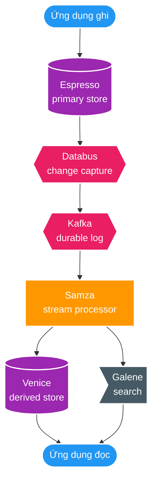
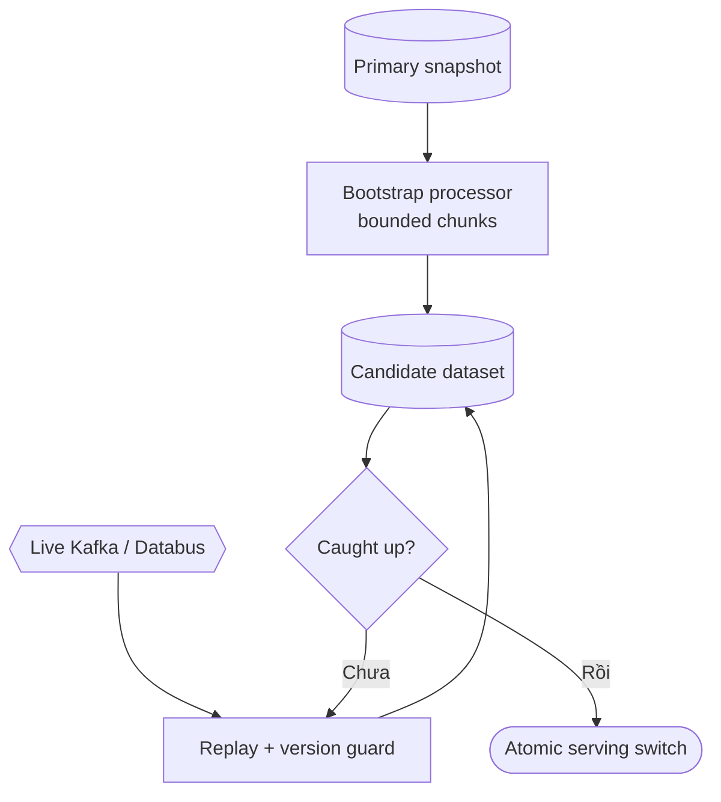
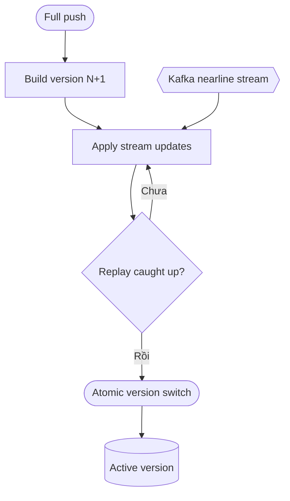
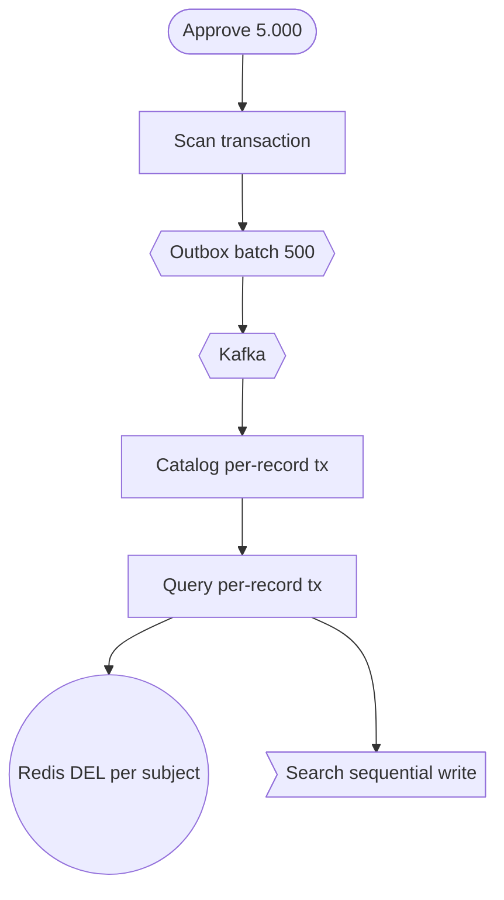
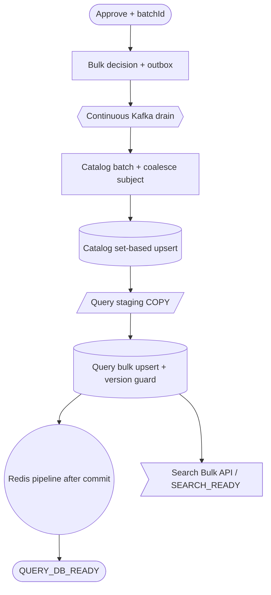

# LinkedIn xử lý pipeline dữ liệu lớn như thế nào?

Ngày: 2026-08-14

## Tóm tắt

LinkedIn tách source-of-truth, change capture, stream processing và derived serving stores.

- Espresso là source-of-truth phân tán.
- Databus/Kafka vận chuyển thay đổi theo partition, checkpoint và replay.
- Samza xử lý stream theo partition, giữ state cục bộ và changelog.
- Venice, cache và search là derived state, thường eventual consistency.

LinkedIn từng công bố Kafka đạt hơn 1 nghìn tỷ message/ngày và peak khoảng 4,5 triệu message/giây. Đây là throughput Kafka, không phải SLO end-to-end cho projection DB/search.

## 1. Kiến trúc tổng thể

Kafka/Databus là log durable, không thay thế database nguồn. Downstream có thể replay để xây lại state.

## 2. Họ vẫn dùng DB, Redis và search như thế nào?

- Primary store được partition theo key.
- Secondary index được cập nhật theo commit của base data khi cần invariant mạnh.
- Cache/search/derived view thường được cập nhật bất đồng bộ.
- Stream processor dùng cùng partition key để giảm remote lookup và lock contention.

| Lớp | Cách xử lý | Bài học cho dự án |
| --- | --- | --- |
| Primary DB | Transaction trên partition | Approve + outbox trong transaction cục bộ |
| Transport | Partition, batching, checkpoint | Relay/consumer bounded batch |
| Stream processor | Coalesce theo key | Catalog/Query gom theo subject |
| Derived store | Batch push hoặc streaming push | Query DB/Search có watermark riêng |
| Rebuild | Snapshot/bootstrap rồi replay | Staging/chunk/replay cho SC-01 |

Kafka producer batching không có nghĩa consumer đã bulk-write vào DB.

## 3. Bootstrap và replay

LinkedIn dùng snapshot/backup để dựng derived dataset mới, trong khi online stream vẫn chạy. Khi bắt kịp, replay update mới hơn rồi switch version.

## 4. Venice: batch và nearline

Venice nhận full push và streaming push. Version mới được dựng background, nearline update được replay trước khi switch serving.

## 5. Đối chiếu với dự án

### Hiện trạng

### Kiến trúc nên hướng tới

## 6. Bài học áp dụng

- Giữ PostgreSQL là source-of-truth của từng service; giữ transactional outbox và idempotency.
- Batch listener, dedupe set-based, coalesce theo subject và bulk upsert.
- Có batchId/watermark QUERY_DB_READY; tách SEARCH_READY.
- Rebuild bằng staging/chunk/replay, không dùng transaction khổng lồ.
- Chỉ tăng partition/concurrency sau benchmark p95/p99, lag, outbox age, DB pool wait và WAL/IOPS.

## Tài liệu công khai

- [Introducing Espresso](https://engineering.linkedin.com/espresso/introducing-espresso-linkedins-hot-new-distributed-document-store)
- [Kafka at LinkedIn](https://engineering.linkedin.com/apache-kafka/how-we_re-improving-and-advancing-kafka-linkedin)
- [Stream Processing Hard Problems Part 1](https://www.linkedin.com/blog/engineering/data-streaming-processing/stream-processing-hard-problems-part-1)
- [Stream Processing Hard Problems Part 2](https://www.linkedin.com/blog/engineering/archive/stream-processing-hard-problems-part-ii-data-access)
- [Open Sourcing Venice](https://www.linkedin.com/blog/engineering/open-source/open-sourcing-venice-linkedin-s-derived-data-platform)
- [Venice Hybrid](https://www.linkedin.com/blog/engineering/open-source/venice-hybrid-doing-lambda-better)
- [LinkedIn Databus](https://github.com/linkedin/databus)
