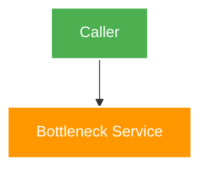
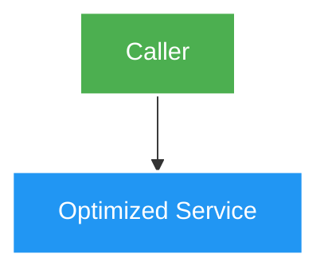

# <Feature title> — Design

Owner: <service>
Brief: [01-brief.md](./01-brief.md)

## High Level Design

<!--
Quy tắc sơ đồ Mermaid:
1. Với FEATURE / MODULE MỚI: Vẽ 1 sơ đồ High Level Design tổng quan trả lời câu hỏi kiến trúc chính.
2. Với REFACTOR / OPTIMIZE / PERFORMANCE: Bắt buộc phải có 2 sơ đồ Mermaid:
   - Sơ đồ 1: Kiến trúc hiện tại (As-Is / Current Architecture) — nêu rõ luồng cũ và điểm nghẽn/nợ kỹ thuật.
   - Sơ đồ 2: Kiến trúc đích (To-Be / Target Architecture) — nêu rõ giải pháp mới, cách phân tách và tối ưu.
   - Kèm bảng so sánh định lượng và phân tích trade-offs giữa hai kiến trúc.
3. Luôn tuân thủ skill mermaid-styling: flowchart TB/TD, quote mọi label, không dùng thẻ , ngắt dòng ngắn <= 15-18 ký tự, text trắng color:#fff và palette tương phản cao.
-->

### Kiến trúc hiện tại (As-Is) <!-- Bắt buộc nếu là Refactor / Optimize -->

### Kiến trúc đích (To-Be) / Thiết kế mới

## Quyết định và So sánh (Trade-offs)

## Domain và data ownership

## REST/event contract

## Luồng lỗi, idempotency và consistency

## Hiệu năng, quan sát và bảo mật tối thiểu
