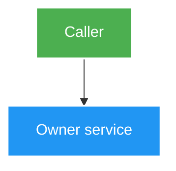

# <Feature title> — Design

Owner: <service>
Brief: [01-brief.md](./01-brief.md)

## High Level Design

<!-- Một Mermaid diagram trả lời câu hỏi kiến trúc chính của feature. Mặc định dùng flowchart TB/TD, tối đa 10–12 node, wrap label dài và dùng palette đậm/text trắng theo skill mermaid-styling. -->

## Quyết định

## Domain và data ownership

## REST/event contract

## Luồng lỗi, idempotency và consistency

## Hiệu năng, quan sát và bảo mật tối thiểu
