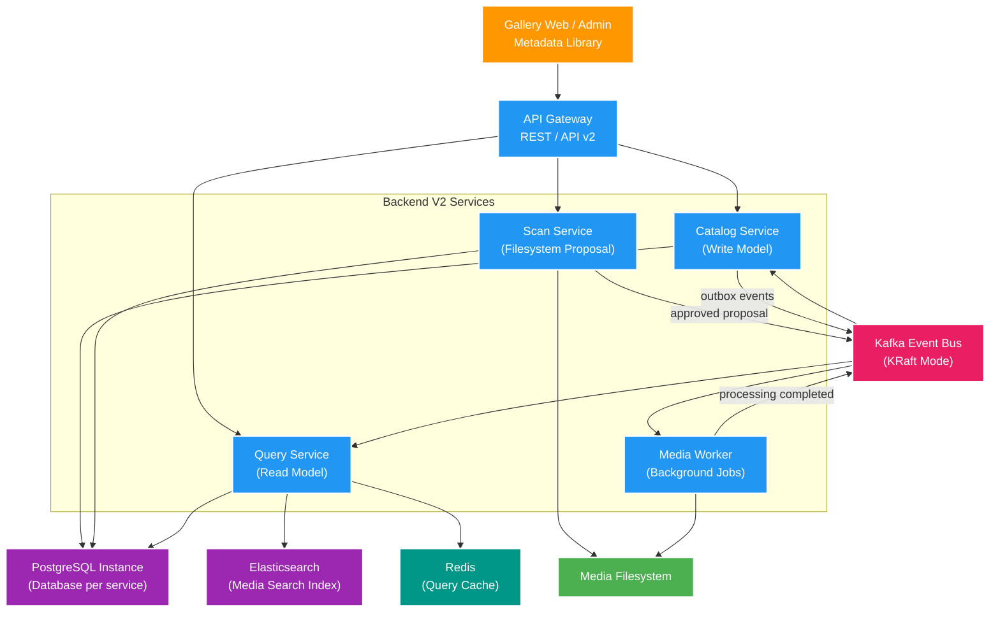
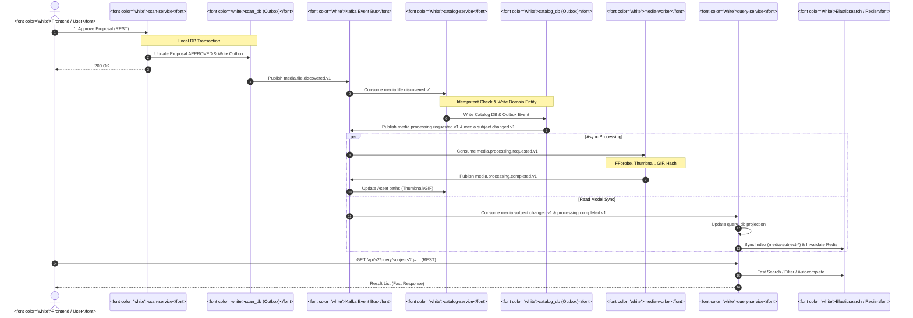

# Backend V2 — Deep-Dive High Level Design

Tài liệu giải thích chi tiết kiến trúc tổng thể, nhiệm vụ từng service, luồng dữ liệu usecase lõi và lý do lựa chọn các design pattern cho **Backend V2** (`file_mngt_microservice`).

---

## 1. Tổng quan & Mục đích Thiết kế (Goal & Motivation)

### 🎯 Mục đích hệ thống
1. **Bài toán nghiệp vụ**: Quản lý media chuẩn hóa (`media_subject`, `media_asset`, `actress`, `studio`, `tag`), giải quyết bài toán nhập liệu tự động từ filesystem (scan/parse), xử lý file nặng (thumbnail/GIF/hash), và tìm kiếm/hiển thị siêu tốc cho frontend.
2. **Bài toán kỹ thuật & Kiến trúc**: Triển khai mô hình **Microservices** chuẩn chỉnh, kết hợp **Event-Driven Architecture**, **CQRS-lite**, **Transactional Outbox**, tận dụng tính năng của **Java 25 & Spring Boot 4.0.3**.
3. **Chiến lược vận hành**: Chạy **song song với V1**, không can thiệp hay làm hỏng dữ liệu V1. Frontend sẽ chuyển dần qua API `/api/v2` theo từng phase.

---

## 2. Tổng quan Architecture (High-Level Design)

---

## 3. Chi tiết trách nhiệm từng Service (Service Boundaries)

| Service | Vai trò chính | Source of Truth / Storage |
| :--- | :--- | :--- |
| **`gateway-service`** | Single Point of Entry cho Frontend. Routing request sang `/api/v2/*`, sinh & inject `correlationId` vào HTTP/Kafka header. Không chứa Business Logic. | None (Stateless) |
| **`catalog-service`** | **Canonical Write Model**: Nguồn dữ liệu chuẩn (Write Source of Truth) cho Subject (Video/Album), Asset, Actress, Studio, Tag. | PostgreSQL (`catalog_db`) |
| **`scan-service`** | Quét Filesystem vật lý, áp dụng Parsing Strategies (JOKE, USE) để phân tích filename và tạo bản nháp (**Proposal**). | PostgreSQL (`scan_db`) + Filesystem |
| **`media-worker`** | Worker xử lý nền cho tác vụ nặng CPU/IO: Đọc technical metadata (FFprobe), cắt Thumbnail, tạo GIF preview, tính Hash MD5/SHA256. | Filesystem |
| **`query-service`** | **Read Model / Projection**: Lắng nghe Kafka Event để dựng Read Model tối ưu cho tìm kiếm, lọc, phân trang trên Frontend. | PostgreSQL (`query_db`) + **Elasticsearch** (Media Search) + **Redis** (Cache) |

---

## 4. Deep Dive Use-Case Flow: "Quét File Mới & Hiển Thị Lên Gallery"

Đây là luồng chính minh họa sự phối hợp toàn bộ hệ thống giữa Synchronous REST API, Transactional Outbox, Kafka Async Events, Background Processing và CQRS Projection:

### Sequence Diagram

### Chi tiết từng bước:

#### 1. Phase Ingestion & Scan (`scan-service`)
- `scan-service` quét thư mục vật lý, chạy Strategy Parser để trích xuất code/title.
- Dữ liệu chưa ghi trực tiếp vào DB chính mà lưu dưới dạng **Proposal** trong `scan_db`.
- Khi User bấm Approve qua API `/api/v2/scan/proposals/{id}/approve`:
  - `scan-service` mở **Local Transaction**: Cập nhật trạng thái Proposal thành `APPROVED`, đồng thời ghi một bản tin event `media.file.discovered.v1` vào bảng `outbox`.
  - Một **Outbox Relay (Scheduler/Polling)** đọc bảng `outbox` và push event sang Kafka.

#### 2. Phase Write Canonical Data (`catalog-service`)
- `catalog-service` consume topic `media.file.discovered.v1`.
- Áp dụng **Idempotent Consumer Pattern** (lưu `eventId` đã xử lý để chống duplicate event).
- Tạo hoặc cập nhật entity `media_subject` và `media_asset` trong `catalog_db`.
- Bắn 2 event ra Kafka via Outbox:
  - `media.subject.changed.v1`: Thông báo Subject có thay đổi dữ liệu.
  - `media.processing.requested.v1`: Yêu cầu xử lý file media nặng.

#### 3. Phase Heavy Processing Async (`media-worker`)
- `media-worker` consume `media.processing.requested.v1`.
- Sử dụng FFmpeg/FFprobe để:
  1. Trích xuất resolution, duration, codec.
  2. Capture Thumbnail ngẫu nhiên/chuẩn.
  3. Cắt chuỗi 3–5 giây làm animated GIF preview.
  4. Tính toán Checksum Hash (MD5/SHA256).
- Throttling Concurrency ở mức phù hợp để tránh nghẽn I/O ổ đĩa.
- Hoàn tất -> Emit event `media.processing.completed.v1`.
- `catalog-service` lắng nghe event này để bổ sung đường dẫn Thumbnail/GIF chuẩn hóa vào Asset.

#### 4. Phase Read Model Sync & Search Index (`query-service`)
- `query-service` consume cả `media.subject.changed.v1` và `media.processing.completed.v1`.
- **CQRS Projection**: Tổng hợp (Denormalize) thông tin Subject + Asset + Technical info thành một document phẳng trong `query_db`.
- Đẩy document này sang **Elasticsearch Index** (`media-subject-*`) để phục vụ full-text search, fuzzy search và autocomplete.
- Evict/Invalidate Redis cache nếu có.

#### 5. Phase User Query (Read Path)
- User truy cập Gallery Web -> Gọi `GET /api/v2/query/subjects?q=actress_name`.
- `gateway-service` forward sang `query-service`.
- `query-service` tra cứu:
  - **Hit Cache**: Trả về trực tiếp từ **Redis**.
  - **Miss Cache**: Tìm kiếm siêu tốc qua **Elasticsearch** (vừa hỗ trợ tiếng Việt/search không dấu/fuzzy) -> Hydrate thêm thông tin từ `query_db` -> Trả về cho FE và lưu vào Redis.

---

## 5. Lý do Lựa chọn các Pattern Thiết kế (Architecture Trade-offs)

1. **CQRS-lite (Command Query Responsibility Segregation)**:
   - **Usecase**: Hành vi **Ghi** (Write) đòi hỏi ACID, ràng buộc khóa ngoại (Subject, Asset, Actress, Studio, Tag). Hành vi **Đọc** (Read) trên Gallery lại yêu cầu query đè phẳng (flat denormalized) với phân trang, search từ khóa siêu nhanh trên hàng chục ngàn item.
   - **Giải pháp**: Tách Catalog làm Write Model và Query làm Read Model (phủ qua Elasticsearch). Write không bị nghẽn bởi Read; Read không bị ảnh hưởng bởi lock của Write.

2. **Transactional Outbox Pattern**:
   - **Usecase**: Tránh tình trạng dual-write problem (DB commit thành công nhưng push Kafka thất bại, làm mất đồng bộ dữ liệu giữa các microservice).
   - **Giải pháp**: Mọi Event phát ra đều được lưu cùng 1 Local Transaction vào bảng `outbox` của Database service đó trước, sau đó Outbox Relay mới publish lên Kafka.

3. **Database per Service**:
   - **Usecase**: Mỗi service quản lý dữ liệu độc lập, tránh việc `query-service` truy cập thẳng `catalog_db` gây tight-coupling schema.
   - **Triển khai**: Trong môi trường local development, dùng chung 1 PostgreSQL Instance nhưng tách biệt Database (`catalog_db`, `scan_db`, `query_db`) và User riêng biệt.

4. **Async Processing via Kafka Queue**:
   - **Usecase**: Sinh GIF và Thumbnail tốn nhiều thời gian (vài giây đến nửa phút mỗi file). Nếu xử lý Synchronous REST API sẽ gây ngắt kết nối (timeout).
   - **Giải pháp**: Tách hẳn sang `media-worker` xử lý bất đồng bộ qua Kafka work queue.

5. **Java 25 & Virtual Threads**:
   - Tối ưu hóa throughput cho các tác vụ I/O intensive (đọc/ghi DB, tiêu thụ Kafka Event, quét file ổ đĩa) mà không phải gánh chi phí tốn bộ nhớ thread pool của Platform Threads.
