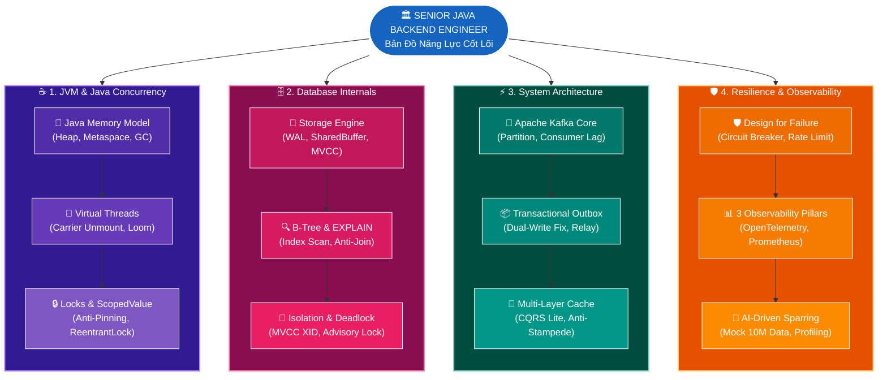
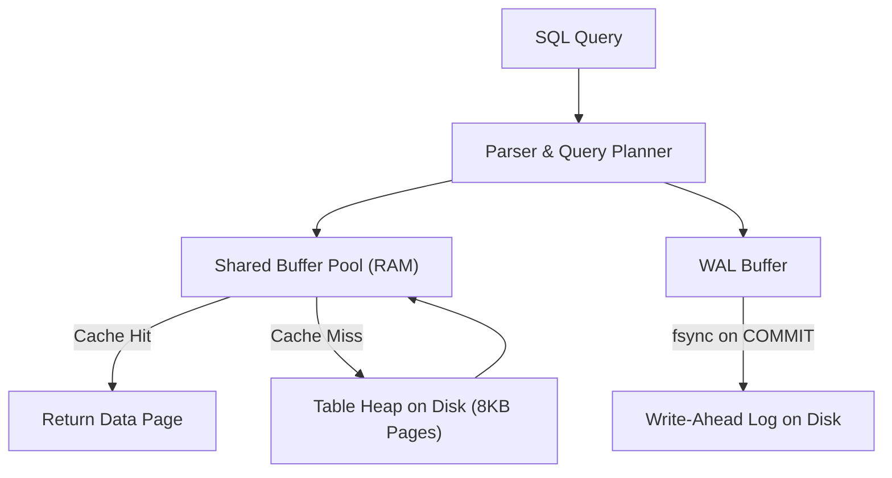
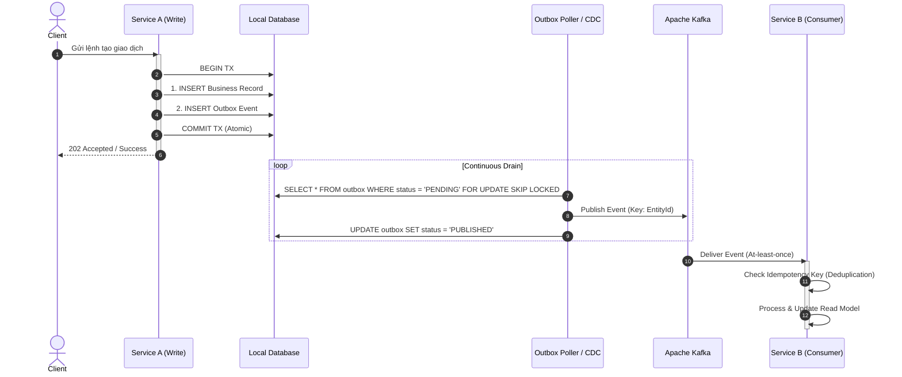

# 4 Trụ Cột Nền Tảng Senior Java Backend & Chiến Lược Thực Hành Trong Kỷ Nguyên AI

> **Mục tiêu tài liệu:** Định hình bản đồ năng lực cốt lõi cho kỹ sư Java Backend trên con đường bứt phá lên **Senior / Tech Lead**, giải quyết nỗi lo "học chay do dự án không có quy mô lớn", và hướng dẫn phương pháp biến AI thành công cụ đối trọng (Sparring Partner) để tự tạo môi trường thực chiến.

---

## 1. Định vị Senior Java Backend trong Kỷ nguyên AI

Trong bối cảnh AI (LLMs, Coding Agents) có thể viết code CRUD, sinh boilerplate và giải quyết các thuật toán cơ bản chỉ trong vài giây, ranh giới giữa Junior/Mid-level và Senior đã thay đổi hoàn toàn:

* **Junior / Mid-level:** Tập trung vào cú pháp, viết đúng logic nghiệp vụ theo task, dùng framework để hoàn thành tính năng.
* **Senior / Staff Engineer:** Sở hữu **Tư duy Kiến trúc (System Design)**, hiểu sâu **Bản chất dưới nắp ca-pô (First Principles)**, làm chủ **Sự đánh đổi (Trade-offs)** giữa tính nhất quán, độ trễ, tài nguyên và chi phí, đồng thời có khả năng **Thiết kế hệ thống chịu lỗi (Design for Failure)**.



> [!NOTE]
> **Không cần học Machine Learning / Tự train model:** Kỹ sư Java Backend không cần học toán cao cấp hay viết giải thuật Deep Learning. Trách nhiệm của Backend trong kỷ nguyên AI là **AI-Enabled Engineering**: tích hợp LLM APIs, Vector Database (`pgvector`), chuẩn hóa giao thức kết nối công cụ (`MCP - Model Context Protocol`), và dùng AI làm đòn bẩy nhân 5 lần năng suất cá nhân.

---

## 2. Trụ cột 1: JVM Internals, Java Modern & Concurrency Chuyên Sâu

Hiểu cách mã nguồn Java được thực thi trên máy ảo JVM và phần cứng vật lý là nền tảng để tối ưu hóa hiệu năng và xử lý sự cố.

### 2.1. Java Memory Model (JMM) & Garbage Collection
* **Memory Areas:** Phân biệt rõ Stack (thread-private, frame execution), Heap (Young Gen: Eden, Survivor; Old Gen), Metaspace (Class metadata, thay thế PermGen từ Java 8), và Off-heap/Direct Memory.
* **GC Collectors:**
  * **G1GC:** Garbage-First, phân chia heap thành các Region nhỏ, cân bằng giữa throughput và latency target (`-XX:MaxGCPauseMillis`).
  * **ZGC / Shenandoah:** Low-latency GC (< 1ms pause time), thực hiện concurrent compaction bằng Colored Pointers và Load Barriers.
* **Troubleshooting:** Kỹ năng đọc Thread Dump (phát hiện Deadlock, Thread Starvation) và Heap Dump (`jmap`, `jcmd`, Eclipse Memory Analyzer - MAT để tìm Memory Leak qua GC Roots).

### 2.2. Virtual Threads (Project Loom - JDK 21+)
* **Bản chất:** Virtual Threads là các luồng cấp người dùng (user-mode threads) siêu nhẹ (~ vài KB bộ nhớ) do JVM quản lý, được ánh xạ (mount/unmount) lên một số lượng nhỏ Carrier Threads (Platform/OS Threads) thuộc `ForkJoinPool`.
* **Cơ chế Unmount:** Khi gặp thao tác I/O blocking (Socket read/write, `Thread.sleep()`, JDBC call), Virtual Thread tự động unmount khỏi Carrier Thread, nhường CPU cho Virtual Thread khác xử lý.
* **Thread Pinning Hazard:** 
  * Xảy ra khi Virtual Thread thực hiện I/O bên trong khối `synchronized` hoặc gọi Native Method (JNI). Khi đó, JVM không thể unmount thread, dẫn đến chiếm giữ cứng Carrier Thread.
  * **Giải pháp Senior:** Thay thế toàn bộ `synchronized` blocks bằng `ReentrantLock` hoặc `StampedLock`.
* **No-Pooling Principle:** Không bao giờ đưa Virtual Threads vào ThreadPool. Tạo mới trên từng request (`Executors.newVirtualThreadPerTaskExecutor()`). Dùng `Semaphore` nếu cần giới hạn lượng concurrency truy cập tài nguyên hữu hạn (như Connection Pool).

### 2.3. Concurrency, Memory Visibility & Scoped Values
* **Memory Visibility & Reordering:** Hiểu rõ từ khóa `volatile` (thiết lập *happens-before* relationship, cấm CPU reordering qua Memory Barriers), CAS (Compare-And-Swap) và các cấu trúc `Atomic*`.
* **ThreadLocal vs ScopedValue:** `ThreadLocal` có nguy cơ rò rỉ bộ nhớ (Memory Leak) khi dùng trong ThreadPool và chi phí overhead lớn khi có hàng triệu Virtual Threads. JDK 21+ giới thiệu `ScopedValue` cho phép truyền dữ liệu context bất biến (immutable), tự động giải phóng theo phạm vi thực thi.

---

## 3. Trụ cột 2: Database Internals, Concurrency & Data Integrity

80% các điểm nghẽn (bottlenecks) và lỗi nghiêm trọng của hệ thống Backend đều xuất phát từ tầng Cơ sở dữ liệu.



### 3.1. PostgreSQL Storage & Query Engine
* **Write-Ahead Logging (WAL):** Mọi thay đổi dữ liệu đều được ghi tuần tự vào WAL trước khi flush trang dữ liệu (8KB Page) xuống đĩa. Đây là cơ sở đảm bảo tính Durability và Atomic Recovery khi server mất điện đột ngột.
* **Shared Buffers & Checkpointer:** Cơ chế cache trang dữ liệu trên RAM. Checkpointer định kỳ flush các Dirty Pages xuống đĩa để giới hạn dung lượng WAL cần replay khi restart.
* **MVCC (Multi-Version Concurrency Control):** PostgreSQL không khóa bảng khi đọc. Mỗi row chứa `xmin` và `xmax` (Transaction ID). Khi update, PostgreSQL tạo một row tuple mới (Append-only) và đánh dấu row cũ hết hạn. Cần hiểu cơ chế `VACUUM` / `AUTOVACUUM` để dọn Dead Tuples và chống Transaction ID Wraparound.

### 3.2. Indexing Deep-Dive & Tối ưu hóa Truy vấn
* **B-Tree Index Internals:** Cây B-Tree cân bằng, tìm kiếm với độ phức tạp O(log N). Hiểu rõ thứ tự các cột trong Composite Index (Leftmost Prefix Rule).
* **Scan Types:**
  * **Index Only Scan:** Dữ liệu lấy trực tiếp từ Index Leaf mà không cần chạm vào Table Heap (Visibility Map sạch).
  * **Bitmap Index Scan:** Quét Index để gom các Block Pointer trên RAM thành Bitmap, sau đó đọc Table Heap theo thứ tự tuần tự để tránh random I/O.
  * **Sequential Scan:** Quét toàn bộ bảng (thường xảy ra khi thiếu index, cardinality quá thấp, hoặc số dòng trả về chiếm > 10-20% bảng).
* **Phân tích Execution Plan:** Đọc và hiểu sâu `EXPLAIN (ANALYZE, BUFFERS)`: phát hiện Anti-Join, Hash Join vs Nested Loop, tràn bộ nhớ `work_mem` khiến phép Sort/Hash phải đổ ra đĩa (Disk Spill).

### 3.3. Isolation Levels, Locking & Deadlock
* **Transaction Isolation Levels:** Read Committed (mặc định), Repeatable Read (chống Non-repeatable Read bằng snapshot tại đầu transaction), Serializable (chống Phantom Read và Write Skew bằng SSI - Serializable Snapshot Isolation).
* **Pessimistic vs. Optimistic Locking:**
  * *Pessimistic (`SELECT ... FOR UPDATE`):* Phù hợp khi độ xung đột cao, cần giữ lock thực thể.
  * *Optimistic (`@Version` field):* Phù hợp khi độ xung đột thấp, rollback và retry khi phát hiện version thay đổi.
* **Distributed Locks:** Hiểu rõ sự khác biệt giữa PostgreSQL Advisory Locks / Database Lease vs Redis Redlock (cảnh giác với sự cố GC pause làm trôi lease TTL).

---

## 4. Trụ cột 3: Kiến trúc Hệ thống & Event-Driven Architecture

Khi hệ thống mở rộng từ Monolith sang Microservices hoặc xử lý khối lượng dữ liệu lớn, tính toàn vẹn và độ sẵn sàng của luồng dữ liệu trở thành yếu tố quyết định.



### 4.1. Apache Kafka & Xử lý Dữ liệu Bất đồng bộ
* **Core Architecture:** Topic, Partitions, Offset, Consumer Group. Hiểu rằng Partition chính là đơn vị mở rộng (unit of parallelism) và đơn vị bảo đảm thứ tự tuần tự (ordering guarantee theo Partition Key).
* **Consumer Rebalance & Lag:** Hiểu cơ chế Cooperative Sticky Assignor, cách xử lý Backpressure khi Consumer xử lý chậm dẫn đến Consumer Lag tăng cao.
* **Delivery Semantics & Idempotency:**
  * Kafka mặc định cung cấp *At-least-once Delivery* (có thể bị duplicate khi network drop ACK).
  * Consumer **bắt buộc phải có tính Idempotent (Khử trùng lặp)**: Dùng Unique Constraint, Deduplication Table hoặc Version Guard.

### 4.2. Transactional Outbox Pattern & Data Consistency
* **Vấn đề Dual-Write:** Khi một service vừa phải ghi Database vừa phải bắn message sang Kafka, nếu 1 trong 2 bước fail sẽ dẫn đến mất đồng bộ dữ liệu vĩnh viễn.
* **Giải pháp Outbox Pattern:** Ghi dữ liệu nghiệp vụ và Event vào bảng `outbox` trong **cùng 1 Local Transaction**. Một tiến trình Relay (hoặc Debezium CDC) sẽ đọc bảng `outbox` và bắn sang Kafka.
* **Lane-Fenced Outbox Relay:** Kỹ thuật chia outbox thành nhiều bucket/lane để nhiều worker có thể drain outbox song song bằng câu lệnh `SELECT ... FOR UPDATE SKIP LOCKED` mà không bị tranh chấp lock.

### 4.3. Caching Strategies & Read Projections (CQRS Lite)
* **Caching Patterns:** Cache-Aside (Lazy Loading), Write-Through, Write-Behind.
* **Cache Failures & Phòng chống:**
  * *Cache Stampede (Thundering Herd):* Dùng Mutex Lock (Distributed Lock) hoặc tính toán trước khi hết hạn (Probabilistic Early Expiration).
  * *Cache Penetration:* Query key không tồn tại đánh thẳng vào DB -> Dùng Bloom Filter hoặc cache giá trị `null` có TTL ngắn.
  * *Cache Avalanche:* Hàng loạt key hết hạn cùng thời điểm -> Thêm Random Jitter vào TTL.
* **CQRS Lite:** Tách riêng Write Model (chuẩn hóa 3NF trên RDBMS để bảo vệ invariant) và Read Model (denormalized trên Elasticsearch/Redis để query siêu tốc).

---

## 5. Trụ cột 4: Thiết kế Chịu Lỗi & Quan Sát Hệ Thống (Resilience & Observability)

Một hệ thống phân tán luôn có thể gặp lỗi bất kỳ lúc nào. Tư duy Senior là thiết kế hệ thống biết tự bảo vệ và khoanh vùng sự cố.

### 5.1. Design for Failure & Resilience Patterns
* **Circuit Breaker (Resilience4j):** Ngắt kết nối tạm thời khi downstream service gặp lỗi liên tục (chuyển trạng thái sang OPEN), trả về fallback để bảo toàn tài nguyên cho service gọi.
* **Rate Limiting & Throttling:** Thuật toán Token Bucket, Leaky Bucket để bảo vệ API khỏi bị quá tải hoặc spam.
* **Bulkhead Pattern:** Cô lập tài nguyên (Thread Pool, Connection Pool) riêng cho từng downstream service để khi một service bị sập không kéo sập toàn bộ hệ thống.
* **Retry with Exponential Backoff & Jitter:** Không retry dồn dập ngay lập tức làm chết server, mà tăng dần thời gian chờ kèm độ lệch ngẫu nhiên (Jitter).

### 5.2. Observability (OpenTelemetry, Prometheus, ELK)
* **Correlation ID & Context Propagation:** Mỗi request khi đi qua API Gateway phải được cấp một `X-Correlation-ID` (hoặc `traceparent` theo chuẩn W3C) và truyền xuyên suốt qua các tầng HTTP Headers và Kafka Record Headers.
* **The 3 Pillars of Observability:**
  * **Metrics (Prometheus/Grafana):** RED Method (Rate, Errors, Duration) và USE Method (Utilization, Saturation, Errors).
  * **Logs (ELK / OpenSearch):** Structured Logging (JSON format), log có context (traceId, entityId, executionTime).
  * **Traces (OpenTelemetry / Jaeger):** Span hierarchy, đo đạc chính xác thời gian thực thi của từng network call và query database.

---

## 6. Chiến Lược "AI-Driven Hands-on": Tự Luyện Senior Không Cần Dự Án Triệu Users

Bạn không cần phải đợi một dự án quy mô lớn ở công ty mới có thể tích lũy kinh nghiệm thực chiến. Hãy sử dụng các Agent AI làm môi trường giả lập:

### 🎯 Kỹ thuật 1: Dùng AI làm "Tech Lead khó tính" (Design Sparring Partner)
Thay vì bảo AI viết code, hãy bắt AI phản biện thiết kế của bạn.

> **Prompt mẫu cho AI:**  
> *"Tôi đang thiết kế tính năng trừ tồn kho cho sự kiện Flash Sale (10.000 requests/giây). Đề xuất của tôi là dùng Redis Decr kết hợp Transactional Outbox ghi vào DB. Hãy đóng vai một Principal Architect cực kỳ khó tính, hãy chỉ ra 5 điểm nghẽn (bottlenecks), nguy cơ race condition, và kịch bản mạng bị đứt (network partition) trong thiết kế này, sau đó bắt tôi giải trình từng điểm một."*

### 🎯 Kỹ thuật 2: Dùng AI sinh Mock Data 10.000.000 bản ghi để tối ưu DB thật
Dùng Docker dựng PostgreSQL trên máy local, sau đó nhờ AI viết script sinh dữ liệu:

```sql
-- Nhờ AI tạo bảng giả lập 10 triệu records có độ phân tán dữ liệu thực tế
INSERT INTO orders (id, customer_id, order_status, total_amount, created_at)
SELECT 
    gen_random_uuid(),
    (random() * 500000)::int,
    (ARRAY['PENDING', 'PAID', 'SHIPPED', 'CANCELLED'])[floor(random() * 4 + 1)],
    (random() * 1000)::numeric(10,2),
    NOW() - (random() * interval '365 days')
FROM generate_series(1, 10000000);
```

* **Bài tập tự luyện:**
  1. Viết câu query lọc theo `order_status` và `created_at` -> chạy `EXPLAIN (ANALYZE, BUFFERS)`.
  2. Tự thiết kế Composite Index / Partial Index để ép PostgreSQL dùng **Index Only Scan** hoặc **Bitmap Index Scan**, đo lường thời gian giảm từ 4.5s xuống < 15ms.

### 🎯 Kỹ thuật 3: Dùng AI mô phỏng lỗi thực tế để luyện Debugging & Profiling
* Yêu cầu AI viết các đoạn mã Java cố tình gây ra:
  * **Thread Pinning** trên Virtual Threads.
  * **Connection Leak** trên HikariCP.
  * **Deadlock** giữa 2 transactions cập nhật bảng chéo nhau.
* Dùng công cụ **JProfiler**, **VisualVM** hoặc `jstack` / `jcmd` kết nối vào JVM để bắt đúng dòng code gây nghẽn, sau đó tự tay refactor và kiểm chứng lại.

---

## 7. Bảng Tự Đánh Giá Năng Lực (Senior Backend Checklist)

| Hạng mục | Mức Mid-level | Mức Senior / Tech Lead | Tự đánh giá |
| :--- | :--- | :--- | :---: |
| **Java / JVM** | Dùng Stream, Spring annotations, chạy code chạy được. | Đọc Thread/Heap Dump, hiểu GC, tối ưu Virtual Threads, tránh Pinning & Memory Leak. | [ ] |
| **Database** | Viết JPA entity, viết SQL JOIN cơ bản. | Đọc `EXPLAIN BUFFERS`, thiết kế Index B-Tree chuẩn, kiểm soát Lock/Isolation Level, xử lý Slow Query. | [ ] |
| **Data Flow** | Gọi API đồng bộ (REST), dùng queue đơn giản. | Thiết kế Event-Driven, đảm bảo Idempotency, Transactional Outbox, xử lý Consumer Lag & DLT. | [ ] |
| **Architecture** | Làm đúng task theo Jira ticket. | Nhận diện Trade-offs (CAP, PACELC), tách biệt Write/Read Model, thiết kế High Availability. | [ ] |
| **Resilience** | Try-catch log lỗi. | Thiết kế Circuit Breaker, Rate Limiting, Correlation ID Tracing E2E, xây dựng SLO/SLI cảnh báo. | [ ] |

---

## 8. Tài liệu Liên kết Trong Dự án `file-mngt-be-v2`

Các chủ đề trên đều được triển khai bằng code và kịch bản thực tế trong dự án này:

* **Java Concurrency & Memory Model:** [Deep-Dive Concurrency](./deep-dive/java-concurrency/00-overview-mental-model.md)
* **Virtual Threads & Thread Pinning:** [Deep-Dive Virtual Threads](./deep-dive/virtual-threads/00-overview.md)
* **Database Internals & WAL/MVCC:** [Deep-Dive Database Internals](./deep-dive/database-internals/README.md)
* **Transactional Outbox & Kafka:** [Deep-Dive Transactional Outbox](./deep-dive/transactional-outbox/README.md)
* **Scale Capacity 1.000.000 Files:** [SC-01 Study Pack](./use-cases/scale-capacity/sc-01-scan-one-million-filesystem-entry/README.md)
* **Observability & Distributed Tracing:** [Deep-Dive Observability](./deep-dive/observability/README.md)
