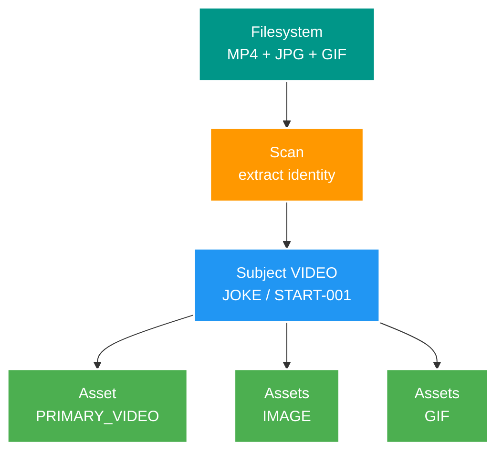
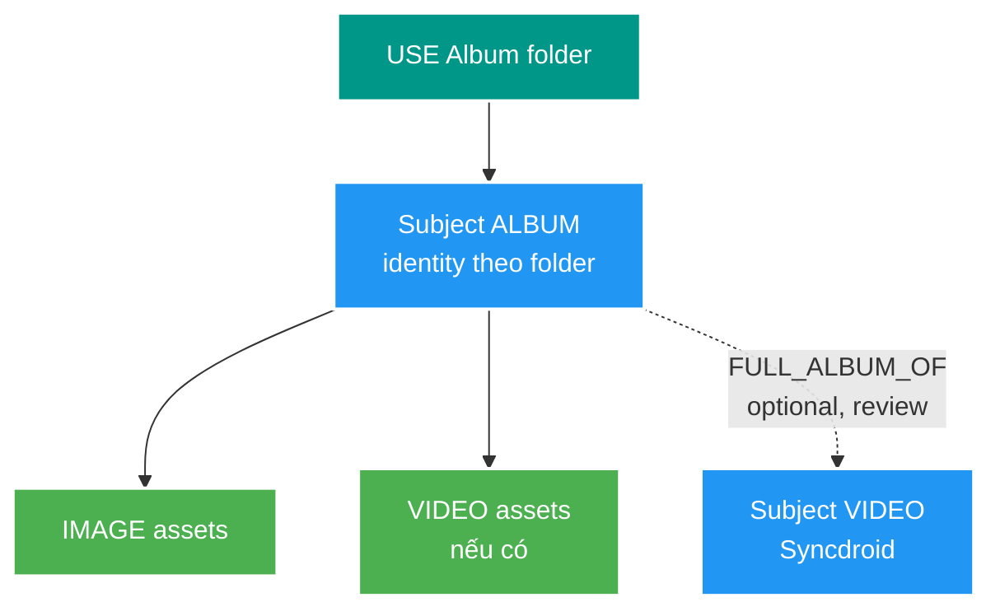

# 1. Business model

## Từ filesystem đến media có cấu trúc

Filesystem chỉ biết file và folder. Nó không tự biết các file dưới đây cùng thuộc một video:

```text
Root/Actress - [START-001].mp4
CoverPics/Actress - [START-001] (1).jpg
CoverPics/Actress - [START-001] (2).jpg
GifJoke/Actress - [START-001] (1).gif
```

Backend V2 chuyển chúng thành một `Subject` và nhiều `Asset`.



## Subject là gì?

`Subject` là đối tượng media logic được quản lý và hiển thị.

Hiện có hai loại:

| `subjectType` | Ý nghĩa |
| --- | --- |
| `VIDEO` | Một video chính cùng ảnh/GIF liên quan |
| `ALBUM` | Một album độc lập, có thể có hoặc không liên kết video |

Identity của Subject là bộ ba:

```text
(region, subjectType, identityKey)
```

Ví dụ `JOKE + VIDEO + START-001` khác `USE + VIDEO + START-001`, dù chuỗi key giống nhau.

## Asset là gì?

`Asset` là một file vật lý thuộc Subject.

| `role` | Ý nghĩa |
| --- | --- |
| `PRIMARY_VIDEO` | Video chính của Subject VIDEO; tối đa một file |
| `VIDEO` | Video bổ sung, chủ yếu dùng cho Album |
| `IMAGE` | Ảnh thuộc video/album |
| `GIF` | GIF thuộc video/album |

Asset không lưu absolute path. Locator canonical gồm:

```text
storageKey + relativePath
```

- `storageKey`: tên logic của root đã cấu hình, ví dụ `fixture-joke-video`.
- `relativePath`: đường dẫn tương đối trong root.
- Absolute path chỉ tồn tại trong cấu hình local của Scan/Worker, không đi qua API/Kafka.

## JOKE được nhận diện như thế nào?

JOKE dùng code trong dấu `[]` làm `identityKey`.

| File | Kết quả |
| --- | --- |
| `Actress - [START-001].mp4` | Subject `JOKE/VIDEO/START-001`, asset `PRIMARY_VIDEO` |
| `Actress - [START-001] (1).jpg` | Cùng Subject, asset `IMAGE` |
| `Actress - [START-001] (1).gif` | Cùng Subject, asset `GIF` |

Video, ảnh và GIF có thể được scan ở các root khác nhau. Chúng hội tụ vì có cùng identity Subject.

## USE được nhận diện như thế nào?

USE không có code ổn định như JOKE nên dùng basename chuẩn hóa.

Ví dụ:

```text
Syncdroid/Hibiki Natsume - A Title - Studio.mp4
FullPics/Hibiki Natsume - A Title - Studio (1).jpg
GifUse/Hibiki Natsume - A Title - Studio (1).gif
```

Scan bỏ extension, bỏ suffix số `(1)`, trim/thu gọn khoảng trắng và lowercase để tạo cùng `identityKey`.

Điều này giải quyết khác biệt trình bày nhỏ, nhưng chưa phải metadata Actress/Title/Studio đã được tách thành entity riêng.

## USE Album là case đặc biệt

Folder dưới root Album tạo Subject loại `ALBUM`. Folder là identity chính, không tự gộp vào video Syncdroid.



Một Album có thể là full album của một video Syncdroid, nhưng quan hệ đó là optional và cần review khi không chắc chắn. Quan hệ `FULL_ALBUM_OF` hiện mới là concept mục tiêu, chưa có table Catalog thực tế.

## Proposal và Issue

Scan không tự ghi thẳng Catalog vì parser có thể sai.

- `Proposal`: Scan hiểu được file và đề xuất Subject/Asset candidate.
- `Issue`: file không khớp profile hoặc không thể phân tích an toàn.
- `APPROVE`: chấp nhận proposal và phát event sang Catalog.
- `REJECT`: lưu quyết định từ chối, không phát event.

Đây là ranh giới quan trọng: Scan đưa ra đề xuất; Catalog mới là nơi dữ liệu trở thành canonical.

## Business đã có và chưa có

Đã có trong code/database:

- Region `JOKE`, `USE`.
- Subject `VIDEO`, `ALBUM`.
- Asset và locator.
- Scan proposal/issue/decision.

Chưa được triển khai canonical đầy đủ:

- Actress, Studio, Tag và alias.
- Quan hệ Album ↔ Video.
- Title/code/studio dưới dạng field/entity chuẩn hóa.
- Luật merge/split/relink Subject nâng cao.

FT013 không bổ sung các business entity này; nó chỉ bổ sung metadata kỹ thuật cho Asset hiện có.
