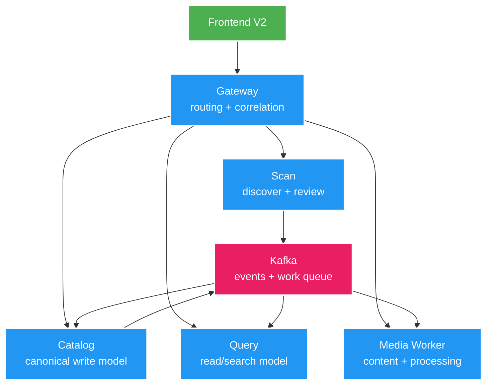
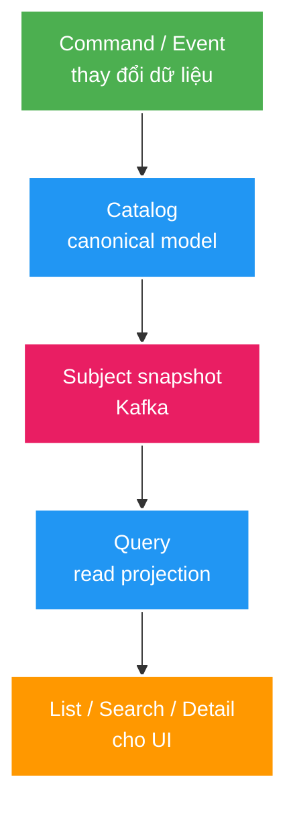

# 2. Kiến trúc và technical concept

## Kiến trúc tổng thể



## Năm service và ownership

| Service | Chịu trách nhiệm | Không được làm |
| --- | --- | --- |
| Gateway | Route API, correlation ID, timeout/CORS | Chứa business logic hoặc database |
| Scan | Đọc filesystem, parse, proposal/issue, decision | Ghi trực tiếp Catalog hoặc sửa file |
| Catalog | Subject/Asset canonical, business write, outbox | Scan filesystem hoặc ghi Query DB |
| Query | Projection, list/filter/search/detail/cache | Ghi ngược Catalog |
| Media Worker | Đọc/phát file và processing nền | Nhận raw path từ frontend hoặc ghi Catalog DB |

Ownership nghĩa là service khác phải gọi API hoặc nhận event, không được đọc trộm database.

## Monorepo nhưng vẫn là microservice

Toàn bộ code nằm trong một Git repository để dễ học và đổi contract, nhưng mỗi app vẫn là deployable riêng:

- Có main class và cấu hình riêng.
- Có process/port riêng.
- Có database ownership riêng.
- Giao tiếp bằng HTTP hoặc Kafka.
- Không chia sẻ JPA entity/repository.

`platform/event-contracts` chỉ chia sẻ DTO event. Việc ở cùng repo không biến năm service thành một application duy nhất.

## CQRS-lite

Catalog và Query giữ hai mô hình khác nhau:



- Catalog tối ưu cho tính đúng của business write.
- Query tối ưu cho UI đọc, filter, pagination và search.
- Query có thể chậm hơn Catalog một khoảng ngắn: đó là eventual consistency.
- Query hỏng hoặc mất dữ liệu vẫn có thể rebuild từ nguồn canonical/event.

## Transactional Outbox

Bài toán: nếu lưu database thành công nhưng Kafka publish thất bại thì event bị mất.

Giải pháp:

1. Cùng một transaction ghi business data và một row outbox.
2. Publisher nền đọc row chưa có `published_at`.
3. Kafka ack xong mới đánh dấu published.
4. Publish lỗi thì giữ `attempt_count` và `last_error` để retry.

Kafka vẫn có thể giao event nhiều lần, vì vậy consumer phải idempotent.

## Idempotency và DLT

- Producer retry cùng event phải giữ nguyên `eventId`.
- Consumer lưu `eventId` đã xử lý trong `processed_event`.
- Event trùng trở thành no-op.
- Lỗi tạm thời được retry hữu hạn.
- Lỗi vẫn không xử lý được chuyển sang topic `.DLT` để không chặn partition mãi mãi.

`DLT` là nơi chứa record lỗi kỹ thuật; nó không tự động đồng nghĩa dữ liệu business bị xóa hay thất bại vĩnh viễn.

## PostgreSQL, Redis và Elasticsearch khác nhau thế nào?

| Công nghệ | Vai trò | Có phải source of truth? |
| --- | --- | --- |
| PostgreSQL Catalog | Canonical Subject/Asset | Có |
| PostgreSQL Scan | Run/proposal/decision/outbox | Có trong boundary Scan |
| PostgreSQL Query | Projection có thể rebuild | Không phải canonical business |
| Redis | Cache detail tạm thời | Không |
| Elasticsearch | Search index | Không |
| Kafka | Event delivery/work queue | Không thay thế database owner |

Redis hoặc Elasticsearch tắt không được làm mất canonical data. Query có fallback PostgreSQL cho một số luồng.

## Root registry và bảo vệ filesystem

Frontend chỉ biết `subjectId` và `assetId`. Catalog lưu locator logic; Media Worker ánh xạ `storageKey` sang absolute root trong cấu hình local.

```text
storageKey = fixture-joke-video
relativePath = A - [JOKE-001].mp4
local registry = fixture-joke-video → D:/.../tests/fixtures/scan/joke-video
```

Worker chuẩn hóa path và xác minh file vẫn nằm trong root. Client không thể gửi `D:/secret/file` hoặc `../../...` để đọc tùy ý.

## Cấu trúc code trong một service

```text
adapter/in/   HTTP Controller hoặc Kafka Consumer
application/  Use case, transaction, orchestration
domain/       Khái niệm và invariant nghiệp vụ
adapter/out/  PostgreSQL, Kafka, HTTP client, filesystem
config/       Wiring và configuration kỹ thuật
```

Khi lần code, đi theo chiều input → application → output adapter. Không bắt đầu bằng việc đọc toàn bộ repository.

## Tài liệu nào có thẩm quyền?

- Kiến trúc: `docs/architecture/`.
- REST/Kafka: `docs/contracts/`.
- Quyết định dài hạn: `docs/adr/`.
- Feature đang làm: `docs/features/`.
- Trạng thái hiện tại: `docs/STATUS.md`.
- Manual này chỉ giúp hiểu, không định nghĩa contract mới.
