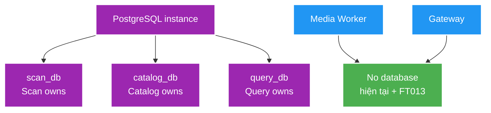
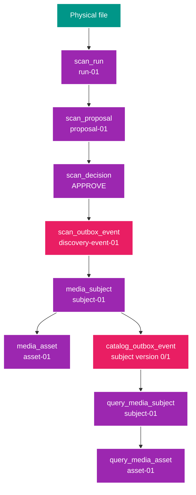
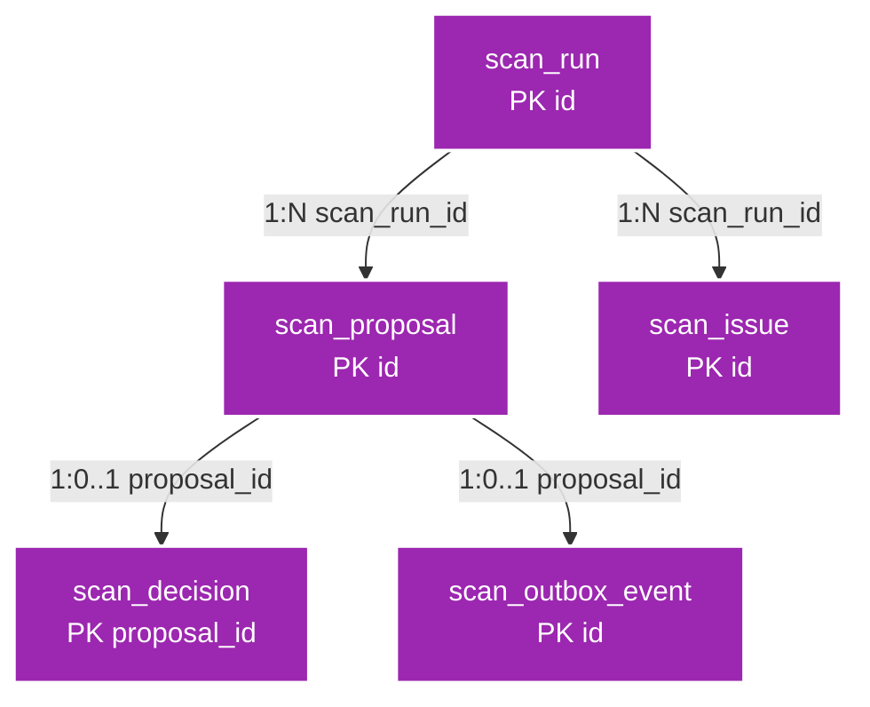
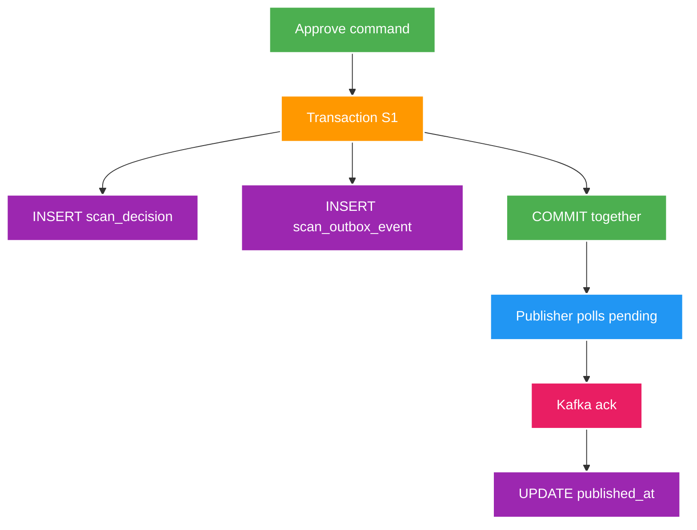
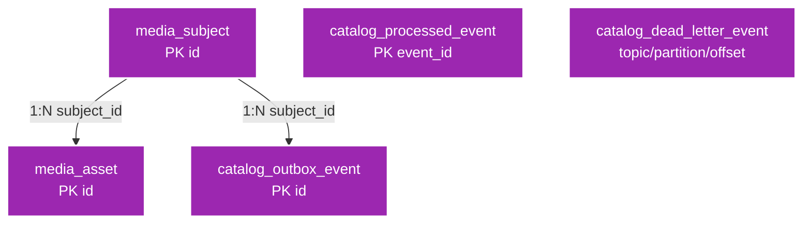
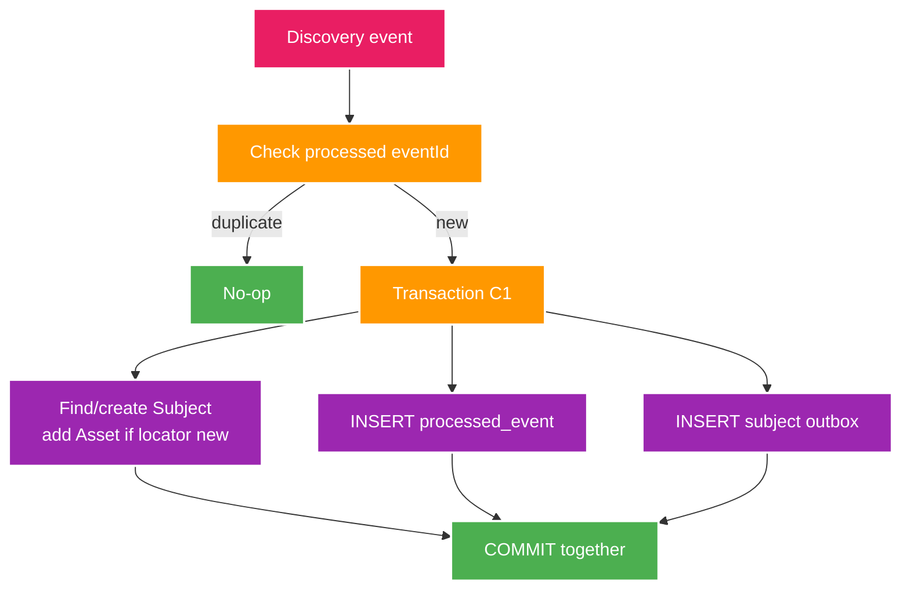
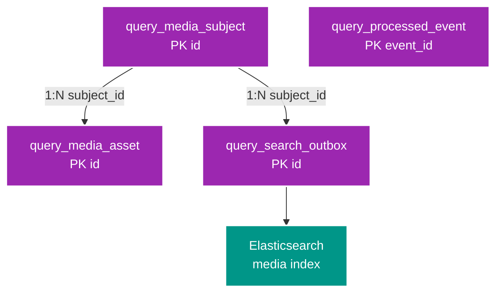
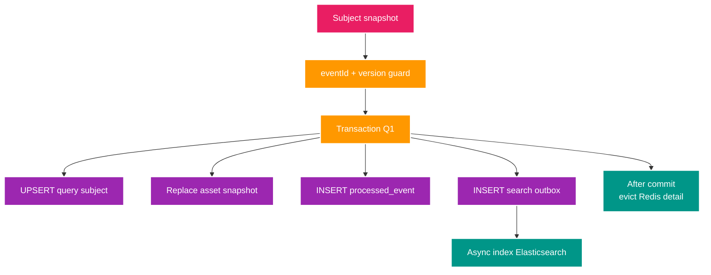
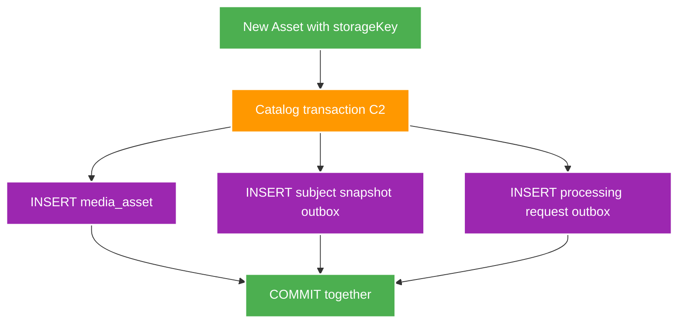
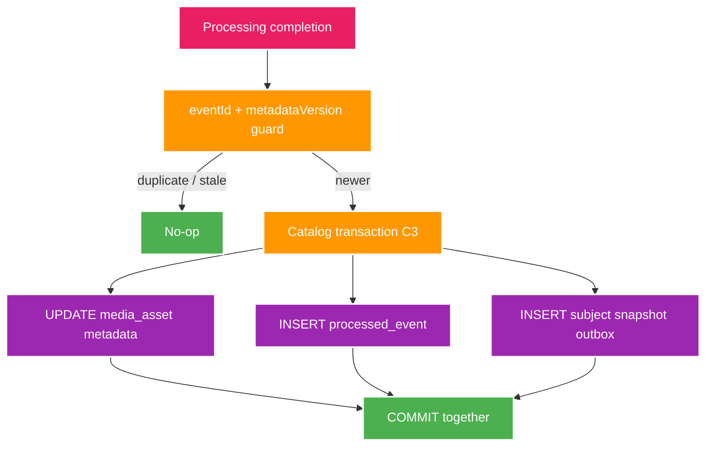

# 4. Database map chi tiết

Mục tiêu chương này không chỉ là biết có table nào, mà hiểu một file tạo row nào, transaction nào bảo vệ dữ liệu và ID nào đi xuyên service.

> Schema thực tế luôn lấy từ Flyway trong `apps/<service>/src/main/resources/db/migration/`. Manual này diễn giải schema hiện tại và phần FT013 dự kiến, không thay thế migration/contract.

## 1. Database ownership

Local dùng một PostgreSQL instance để nhẹ, nhưng mỗi service có database/user riêng.



`catalog_user` không đọc `query_db`; `query_user` không đọc `catalog_db`. Đồng bộ đi qua Kafka snapshot, không join chéo database.

## 2. Các ID đi xuyên hệ thống

Một file có nhiều ID vì mỗi ID trả lời một câu hỏi khác nhau.

| ID/version | Nơi tạo | Ý nghĩa | Đi sang đâu? |
| --- | --- | --- | --- |
| `scanRunId` | Scan | Một lần scan một root | Scan API/tables |
| `proposalId` | Scan | Candidate của một file | Decision + discovery event |
| discovery `eventId` | Scan | Identity event approve | Catalog processed-event |
| `subjectId` | Catalog | Media logic canonical | Event, Query, frontend |
| `assetId` | Catalog | File vật lý canonical | Event, Query, Media Delivery/Worker |
| `subjectVersion` | Catalog | Revision của full Subject snapshot | Query projection guard |
| processing request `eventId` | Catalog, FT013 | Một job metadata | Worker completion reference |
| completion `eventId` | Worker, FT013 | Một kết quả processing idempotent | Catalog processed-event |
| `projectionVersion` | Query | Subject version đã áp dụng | Chống snapshot cũ |

Không dùng filename/display title làm foreign key xuyên service. ID UUID ổn định; tên có thể sửa.

## 3. Data lineage của một file mẫu

Giả sử scan file:

```text
rootKey      = fixture-joke-video
relativePath = A - [JOKE-001].mp4
profile      = JOKE_VIDEO
```

Sau khi parse:

```text
region       = JOKE
subjectType  = VIDEO
identityKey  = JOKE-001
assetRole    = PRIMARY_VIDEO
storageKey   = fixture-joke-video
```



## 4. `scan_db` chi tiết

### Quan hệ table



### `scan_run`

| Column | Ý nghĩa |
| --- | --- |
| `id` | `scanRunId` |
| `root_key`, `profile` | Nguồn và parser được dùng |
| `status` | `RUNNING`, `COMPLETED`, `FAILED` |
| `started_at`, `finished_at` | Thời gian lifecycle |
| `scanned_file_count` | Số regular file đã thấy |
| `proposal_count`, `issue_count` | Kết quả parse |
| `last_error` | Lỗi fatal của run nếu có |

Unique partial index đảm bảo mỗi `root_key` chỉ có một run `RUNNING`.

### `scan_proposal`

| Column | Ý nghĩa |
| --- | --- |
| `id`, `scan_run_id` | Candidate và run cha |
| `source_relative_path` | Path tương đối, không phải absolute path |
| `profile` | Parser profile đã dùng |
| `candidate_type` | `VIDEO`, `ASSET` hoặc `ALBUM` |
| `identity_key` | Key parser đề xuất |
| `display_title` | Tên hiển thị candidate |
| `asset_role` | `PRIMARY_VIDEO`, `IMAGE`, `GIF` hoặc null |
| `evidence` | Evidence JSON tối thiểu cho review |

Unique `(scan_run_id, source_relative_path)` ngăn cùng file tạo hai proposal trong một run.

### `scan_issue`

Giữ `source_relative_path`, `code`, `detail` của file không parse được. Issue không tự tạo Catalog data.

### `scan_decision`

- PK chính là `proposal_id`: một proposal chỉ có một decision.
- `APPROVE` bắt buộc có `event_id`; `REJECT` bắt buộc không có event ID.
- Gửi lại cùng decision là idempotent; đổi decision sau khi chốt trả conflict.

### `scan_outbox_event`

| Column | Luồng |
| --- | --- |
| `id` | Event identity |
| `proposal_id` | Proposal nguồn; unique |
| `event_type`, `partition_key`, `payload` | Kafka record cần publish |
| `created_at` | Thời điểm ghi cùng decision |
| `published_at` | Null = còn pending; có giá trị = broker đã ack |
| `attempt_count`, `last_error` | Retry kỹ thuật, không cần enum status |

## 5. Scan transaction và publisher



Nếu process chết trước commit: cả decision/outbox đều không có. Nếu chết sau commit nhưng trước publish: outbox vẫn pending. Nếu publish thành công nhưng chết trước `published_at`: event được gửi lại, Catalog dedupe.

## 6. `catalog_db` chi tiết

### Quan hệ table hiện tại



### `media_subject`

| Column | Ý nghĩa |
| --- | --- |
| `id` | Canonical `subjectId` |
| `subject_type` | `VIDEO` hoặc `ALBUM` |
| `region` | `JOKE` hoặc `USE` |
| `identity_key` | Code/basename/folder identity |
| `display_title` | Tên hiển thị, có thể null |
| `created_at`, `updated_at` | Audit thời gian |
| `version` | Optimistic lock và snapshot revision |

Unique `(region, subject_type, identity_key)` làm nhiều file cùng identity hội tụ về một Subject.

### `media_asset`

| Column | Ý nghĩa |
| --- | --- |
| `id` | Canonical `assetId` |
| `subject_id` | Subject cha |
| `role` | `PRIMARY_VIDEO`, `VIDEO`, `IMAGE`, `GIF` |
| `storage_key` | Root logic; nullable cho asset legacy/manual |
| `relative_path` | Path trong root |
| `created_at` | Thời điểm Catalog ghi nhận |

Unique locator trong Subject là `(subject_id, COALESCE(storage_key, ''), relative_path)`. Partial unique index giới hạn một `PRIMARY_VIDEO` mỗi Subject.

### `catalog_processed_event`

Chứa `event_id + processed_at`. Catalog insert row này cùng transaction với business mutation. Nếu event ID đã có, consumer no-op.

### `catalog_outbox_event`

Hiện lưu full `media.subject.changed.v1` snapshot:

- `subject_id`, `subject_version`.
- `event_type`, `partition_key`, JSON `payload`.
- `published_at`, `attempt_count`, `last_error`.

Constraint hiện tại unique `(subject_id, subject_version)`. FT013 phải nới constraint vì cùng mutation cần một Subject snapshot và processing request cho từng Asset.

### `catalog_dead_letter_event`

Lưu record lỗi được quan sát theo `original_topic + original_partition + original_offset`, payload/error detail và thời điểm nhận. Nó phục vụ chẩn đoán/replay, không phải business state của Subject.

## 7. Catalog consumer transaction hiện tại

Khi nhận `media.file.discovered.v1`:



Nếu bất kỳ insert/update nào lỗi, transaction rollback toàn bộ; event chưa được đánh dấu processed.

## 8. `query_db` chi tiết

### Quan hệ table



### `query_media_subject`

Giữ cùng `subjectId`, business fields và `projection_version`. `projection_version` phải bằng Subject version mới nhất đã áp dụng, không phải version riêng tự tăng ở Query.

### `query_media_asset`

Giữ cùng `assetId`, `subject_id`, role và relative path để trả read DTO. Đây là snapshot copy; Query không sửa Asset canonical.

### `query_processed_event`

Dedupe theo Kafka `eventId`. Ngoài event ID, Query còn so `subjectVersion`; event khác ID nhưng version cũ cũng là no-op.

### `query_search_outbox`

| Column | Ý nghĩa |
| --- | --- |
| `subject_id`, `projection_version` | Snapshot cần index |
| `created_at`, `next_attempt_at` | Lịch publish/retry |
| `indexed_at` | Null khi chưa index thành công |
| `attempt_count`, `last_error` | Backoff/chẩn đoán |

Unique `(subject_id, projection_version)` tránh index cùng revision nhiều lần về mặt logic.

## 9. Query projection transaction và search/cache



PostgreSQL projection commit không phụ thuộc Elasticsearch/Redis đang sống. Search indexing retry riêng; cache eviction lỗi không rollback canonical projection.

## 10. Vì sao Catalog và Query lưu dữ liệu giống nhau?

| Catalog | Query |
| --- | --- |
| Quyết định dữ liệu đúng là gì | Tổ chức dữ liệu để UI đọc nhanh |
| Nhận command/business event | Nhận full snapshot |
| Có business invariant | Có projection/version guard |
| Source of truth | Rebuildable read model |
| Không phụ thuộc Elasticsearch | Đồng bộ Elasticsearch/Redis |

Nếu UI join trực tiếp Catalog với nhiều bảng/metadata/search ở request time, Catalog vừa làm write model vừa làm read model phức tạp. Query tách chi phí đọc/search khỏi write boundary.

## 11. Redis và Elasticsearch nằm ở đâu trong flow?

| Store | Nguồn | Khi lỗi/mất dữ liệu |
| --- | --- | --- |
| Redis detail cache | DTO từ `query_db`, key có TTL | Miss/error đọc PostgreSQL và cache lại |
| Elasticsearch | `query_search_outbox`; rebuild từ `query_db` | Query fallback degraded; Catalog không mất dữ liệu |

Cả hai đều nằm sau Query projection, không nhận write trực tiếp từ Catalog và không giữ Subject/Asset canonical.

## 12. FT013 thay đổi database flow như thế nào?

### Schema dự kiến

Catalog `media_asset` và Query `query_media_asset` thêm field nullable:

| Field | Ý nghĩa |
| --- | --- |
| `content_length` | Kích thước file byte |
| `media_type` | MIME type |
| `source_last_modified_at` | Mtime nguồn |
| `technical_metadata_version` | Processor/schema version đã áp dụng |
| `technical_metadata_updated_at` | Thời điểm Catalog áp dụng completion |

### Transaction tạo Asset sau FT013



Asset thiếu `storageKey` vẫn được Catalog lưu theo contract hiện tại nhưng không tạo processing request.

### Worker xử lý mà không có database

Worker consume request, đọc file, publish completion rồi mới hoàn tất listener. Nếu crash, Kafka có thể giao lại; thao tác read-only an toàn và completion identity ổn định.

### Transaction áp dụng completion



## 13. Ví dụ row trước và sau FT013

### Trước FT013 — Catalog

```text
media_subject
  id=subject-01, region=JOKE, type=VIDEO,
  identity_key=JOKE-001, version=0

media_asset
  id=asset-01, subject_id=subject-01,
  role=PRIMARY_VIDEO,
  storage_key=fixture-joke-video,
  relative_path=A - [JOKE-001].mp4
```

### Sau completion — Catalog

```text
media_subject
  id=subject-01, version=1

media_asset
  id=asset-01,
  content_length=4,
  media_type=video/mp4,
  source_last_modified_at=...,
  technical_metadata_version=1
```

### Sau snapshot — Query

```text
query_media_subject
  id=subject-01, projection_version=1

query_media_asset
  id=asset-01,
  content_length=4,
  media_type=video/mp4,
  technical_metadata_version=1
```

Giá trị `4` chỉ là ví dụ fixture nhỏ, không phải video thật.

## 14. Điều chưa có trong database

Các table sau chưa tồn tại và không được coi là thiết kế đã chốt:

- Actress, Studio, Tag, alias canonical.
- Subject relation `FULL_ALBUM_OF`.
- Worker job/artifact state.
- Import batch/checkpoint/reconciliation.
- Thumbnail/GIF/hash derivative locator chuyên biệt.

Chúng cần feature Brief/Design riêng trước khi thêm migration.

## 15. Cách tự lần một lỗi dữ liệu

Theo thứ tự, không query chéo trong application:

1. Có `scan_run` và đúng proposal/issue chưa?
2. Proposal có decision và outbox chưa?
3. Outbox đã có `published_at` hay đang có `last_error`?
4. Catalog đã có processed event, Subject và Asset chưa?
5. Catalog subject outbox đã publish snapshot chưa?
6. Query đã có processed event và projection version tương ứng chưa?
7. Search outbox đã có `indexed_at` chưa?
8. Redis/Elasticsearch chỉ kiểm tra sau khi PostgreSQL projection đúng.
9. Sau FT013: kiểm tra processing request, completion/DLT và metadata version trước khi kiểm tra Query.

Chuỗi này giúp xác định lỗi thuộc producer, Kafka delivery, consumer hay projection thay vì nhìn UI rồi đoán.
