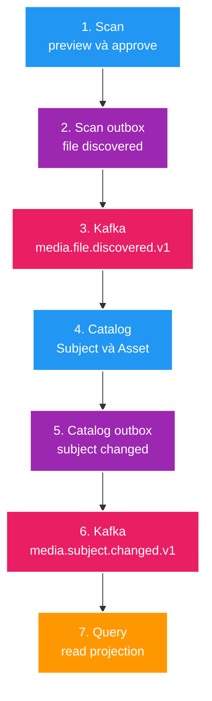

# 6. Đọc flow Scan → Catalog → Query bằng Grafana và Kibana

Tài liệu này dùng một lần chạy Scan E2E thật để đọc hệ thống đang hoạt động. Nó dành cho chủ dự án,
không phải context mặc định của AI Agent.

## Mục tiêu

Sau khi làm xong, bạn phải trả lời được bốn câu:

1. Scan đã tạo proposal và publish event chưa?
2. Catalog đã tạo đúng một Subject/Asset canonical chưa?
3. Query đã nhận `media.subject.changed.v1` và dựng projection chưa?
4. Nếu chậm hoặc thiếu dữ liệu, lỗi nằm ở service/đoạn nào?

## Flow cần đọc



`scan-service` chỉ biết scan/proposal. `catalog-service` mới là owner canonical của Subject/Asset.
`query-service` là projection để tìm/hiển thị nhanh. Hai bước Kafka đều at-least-once, vì vậy consumer
phải idempotent; có event lặp không đồng nghĩa có dữ liệu lặp.

## 1. Tạo một mẫu quan sát

Chạy stack observability và năm app, sau đó từ `tests/e2e` chạy:

```powershell
npm run scan:local:debug
```

Lệnh debug in request/response để bạn lưu bốn giá trị sau:

| Giá trị | Lấy ở đâu | Dùng để làm gì |
| --- | --- | --- |
| `scanRunId` | `StartScanPreview` | Xác định scan run ở Scan logs/API |
| `scanProposalId` | `ListScanProposals` | Xác định proposal được approve |
| `scanIdentityKey` | `ListScanProposals` | Tìm Subject ở Catalog/Query |
| `catalogSubjectId` | `WaitForCatalogSubject` | Tìm projection Query và log path |

Không cần xóa dữ liệu trước khi chạy. Scenario đã kiểm tra idempotency: approve lặp phải giữ cùng event,
và Catalog chỉ có một Subject/Asset phù hợp.

## 2. Đọc Grafana: hệ thống có đang di chuyển không?

Mở `http://localhost:18117` → folder `File Management V2` → dashboard
`File Management V2 overview`. Chọn time range bao quanh lúc vừa chạy E2E.

Đọc theo thứ tự:

1. **Services up** phải là `5` trước khi phân tích flow.
2. **HTTP requests / second** phải thấy traffic ở `scan-service`, `catalog-service`, `query-service`.
3. **HTTP latency p95**: nhìn service nào tăng trước; đây là chỗ cần mở log trước.
4. **Pending outbox work**: sau khi E2E hội tụ, `catalog_outbox_pending` và
   `query_search_outbox_pending` phải quay về `0` hoặc không còn giá trị pending.
5. **Active database connections/JVM heap**: chỉ dùng để phân biệt chậm do resource với chậm do event.

Dashboard không phải trace viewer. Nó trả lời “service nào, lúc nào, có backlog/resource bất thường không”,
rồi mới dùng Kibana để đọc chi tiết.

## 3. Đọc Kibana: bằng chứng theo từng service

Mở `http://localhost:18114` → Discover → data view `logs-file_mngt_v2-*`. Đặt time range hẹp quanh
lần chạy E2E. Lọc lần lượt:

| Câu hỏi | KQL gợi ý | Dấu hiệu đúng |
| --- | --- | --- |
| Scan có nhận request? | `service.name : "scan-service" and message : "*<scanRunId>*"` | Có completion log cho URL scan run |
| Catalog có được gọi? | `service.name : "catalog-service"` | Có request list/detail Canonical quanh cùng thời điểm |
| Query có projection? | `service.name : "query-service" and message : "*<catalogSubjectId>*"` | Có request detail Query cho subject vừa tạo |
| Có lỗi HTTP? | `http.response.status_code >= 500` | Không có kết quả trong time range |

Thay `<scanRunId>` và `<catalogSubjectId>` bằng ID thực tế. Nếu KQL field `message` không có kết quả,
tìm rộng bằng ID trong thanh search rồi mở document để xem trường ECS thực tế.

## 4. Cách khoanh vùng khi E2E fail

| Hiện tượng | Kiểm tra trước | Khả năng cao |
| --- | --- | --- |
| Scan hoàn thành nhưng Catalog không có Subject | Scan outbox metric/log, Kafka, Catalog DLT | Event chưa publish hoặc Catalog consumer lỗi |
| Catalog có Subject nhưng Query trả 404 | Catalog outbox published, Query log/DLT | `media.subject.changed.v1` chưa hội tụ hoặc Query consumer lỗi |
| Query detail có nhưng search thiếu | `query_search_outbox_pending`, `searchBackend` | Elasticsearch/outbox search chưa hội tụ; PostgreSQL fallback vẫn có thể đúng |
| p95 tăng, outbox không pending | JVM heap, DB connections, service log | Resource/DB/HTTP latency thay vì Kafka flow |

Thứ tự chẩn đoán là **owner data trước, event sau, projection cuối**. Đừng sửa Query khi Catalog chưa có
canonical Subject, và đừng xóa Kafka/Elasticsearch volume chỉ vì một E2E fail.

## Giới hạn hiện tại

FT014 mới correlation hóa **HTTP request**. Nó chưa có OpenTelemetry trace xuyên Kafka, nên không thể tìm
một trace ID duy nhất từ Scan HTTP request đến Query consumer. Với flow async hiện tại, dùng `scanRunId`,
`identityKey`, `catalogSubjectId`, time range và metric outbox để nối các bước. OpenTelemetry/Kafka tracing
là feature observability sau, không phải lỗi của flow hiện tại.

Sau khi đọc được một lần pass, cố tình tắt Elasticsearch profile hoặc Query consumer ở môi trường local riêng
để tự quan sát dashboard/log thay đổi; chỉ làm khi bạn chủ động muốn chẩn đoán, không cần cho flow bình thường.
