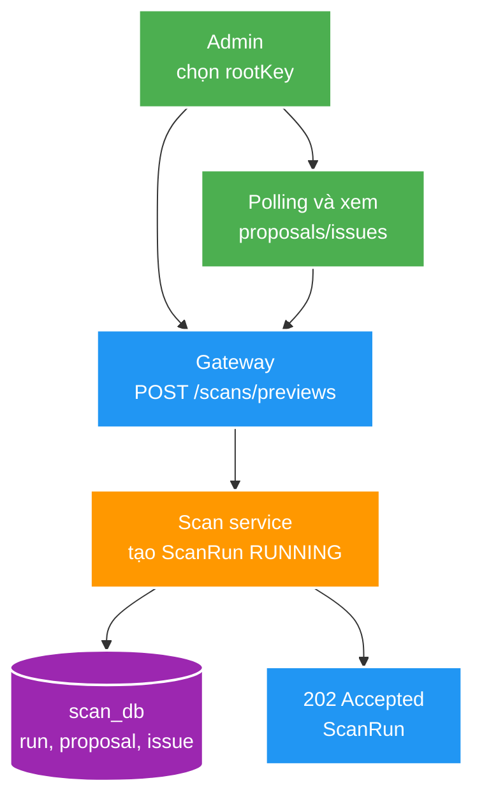
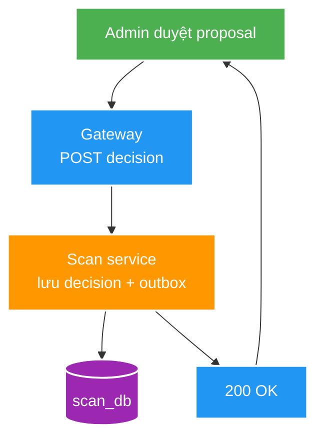
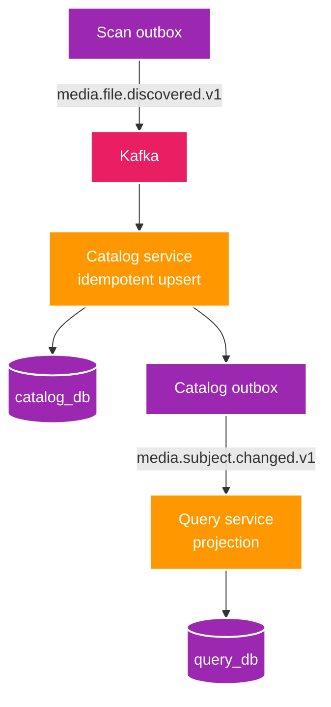
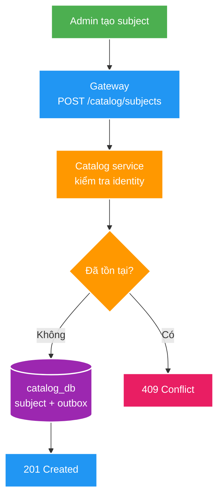
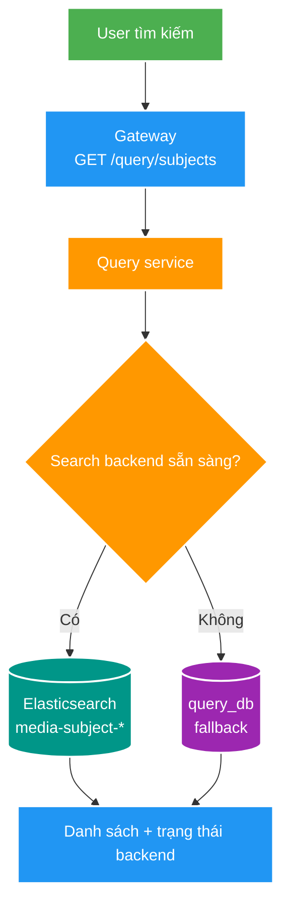
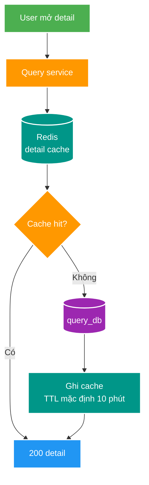
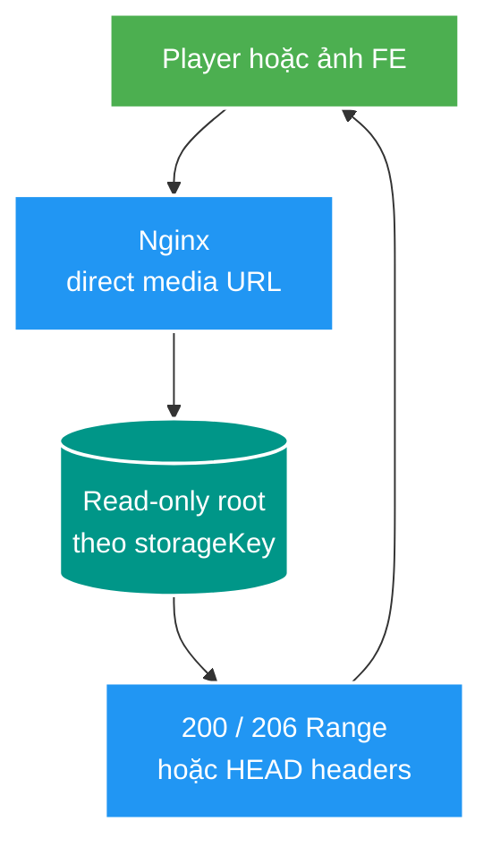
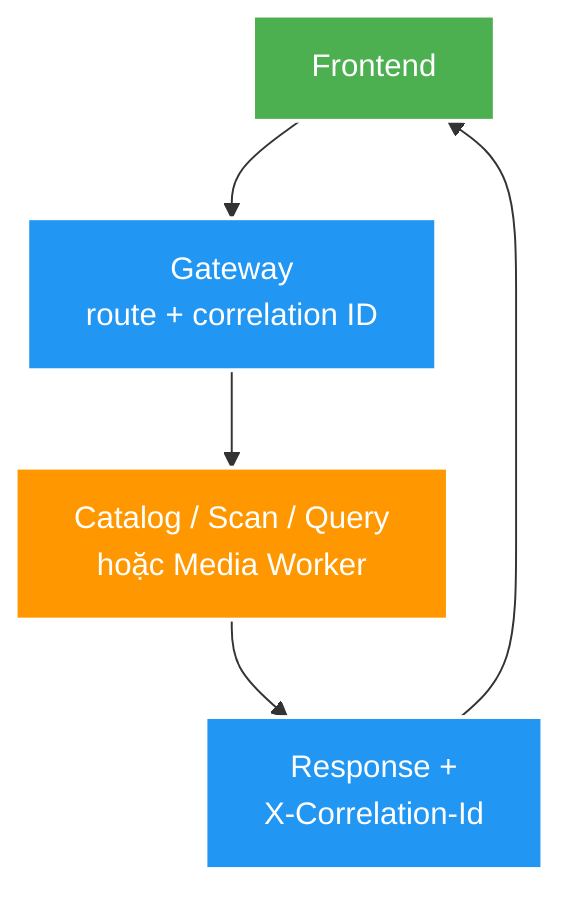

# Deep-dive các luồng API theo hành trình người dùng

Tài liệu này giải thích các API đã có của Backend V2 theo một hành trình nghiệp vụ hoàn chỉnh. Các màn hình Admin và Gallery được nhắc đến là **hành vi FE mục tiêu**; chúng không khẳng định FE V2 đã hoàn thiện.

## Hành trình tổng quát

| Bước | Hành vi FE mục tiêu | API/luồng hiện có | Owner | Dữ liệu chính |
| --- | --- | --- | --- | --- |
| 1 | Admin quét root đã cấu hình | Scan preview | `scan-service` | `scan_db` |
| 2 | Admin duyệt proposal | Scan → Kafka → Catalog → Query | `scan-service`, `catalog-service`, `query-service` | Outbox, Kafka, `catalog_db`, `query_db` |
| 3 | Admin tạo subject thủ công | Catalog subject lifecycle | `catalog-service` | `catalog_db` |
| 4 | User tìm kiếm, mở chi tiết | Query search và detail cache | `query-service` | Elasticsearch, Redis, `query_db` |
| 5 | User xem/phát media | Range media delivery | `media-worker` | Catalog + filesystem |
| 6 | FE gọi API | Gateway routing và correlation ID | `gateway-service` | HTTP header, log |

Các browser-facing business request đi qua Gateway `http://localhost:18100`. Direct service URLs vẫn hợp lệ cho vận hành, test và giai đoạn chuyển tiếp theo [gateway contract](../../../docs/contracts/http/gateway-routing-v1.md).

---

## 1. Scan preview

### Hành vi

Admin chọn một **root đã được cấu hình** bằng `rootKey`, bắt đầu scan read-only, polling `ScanRun`, rồi xem proposals và issues. API không nhận absolute path hay `targetPath` từ FE.



**Contract:** [scan-v1.yaml](../../../docs/contracts/openapi/scan-v1.yaml)

- Start: `POST /api/v2/scans/previews`, body `{"rootKey":"fixture-joke-video"}`.
- Polling: `GET /api/v2/scans/{scanId}`.
- Proposals: `GET /api/v2/scans/{scanId}/proposals`.
- Issues: `GET /api/v2/scans/{scanId}/issues`.
- `ScanRun.status`: `RUNNING`, `COMPLETED` hoặc `FAILED`.

**E2E:** [001-preview.e2e.http](../../../tests/e2e/scan/001-preview.e2e.http), chạy `npm run scan:local` trong `tests/e2e`.

---

## 2. Duyệt proposal và ingest bất đồng bộ

### Hành vi

Admin duyệt hoặc từ chối một proposal. Quyết định `APPROVE` được lưu cùng Scan outbox; Catalog nhận event, idempotent upsert canonical subject/asset; sau đó Catalog phát event cho Query dựng read model.





**Contract:**

- `POST /api/v2/scans/{scanId}/proposals/{proposalId}/decision`
- Body: `{"decision":"APPROVE"}` hoặc `{"decision":"REJECT"}`.
- Scan phát [media.file.discovered.v1](../../../docs/contracts/events/media.file.discovered.v1.md).
- Catalog phát [media.subject.changed.v1](../../../docs/contracts/events/media.subject.changed.v1.md).

Proposal decision idempotent: gửi lại cùng quyết định không tạo subject/asset trùng. Đây là eventual consistency; E2E hiện chờ Kafka convergence tối đa 10 giây, không phải một cam kết UI latency.

**E2E:** [001-preview.e2e.http](../../../tests/e2e/scan/001-preview.e2e.http), chạy `npm run scan:local`.

---

## 3. Tạo Catalog Subject thủ công

### Hành vi

FE Admin mục tiêu có thể tạo VIDEO hoặc ALBUM không qua scan. Subject định danh duy nhất theo bộ `(region, subjectType, identityKey)`, không phải chỉ `identityKey`.



**Contract:** [catalog-v1.yaml](../../../docs/contracts/openapi/catalog-v1.yaml)

```json
{
  "subjectType": "VIDEO",
  "region": "JOKE",
  "identityKey": "E2E-JOKE-001",
  "displayTitle": "E2E Test Subject Video"
}
```

`region` hiện chỉ nhận `JOKE` hoặc `USE`; `displayTitle` là field hiển thị tùy chọn. Xem chi tiết bằng `GET /api/v2/catalog/subjects/{subjectId}`.

**E2E:** [001-subject-lifecycle.http](../../../tests/e2e/catalog/001-subject-lifecycle.http), chạy `npm run catalog:local`.

---

## 4. Tìm kiếm và xem chi tiết

### Hành vi

Gallery/Media Library V2 sẽ gọi Query API. Search ưu tiên Elasticsearch alias `media-subject-*`; khi search backend không sẵn sàng, API phản hồi trạng thái degraded và dùng PostgreSQL fallback theo contract hiện tại. Detail dùng Redis cache-aside; TTL mặc định là 10 phút và có thể đổi qua `QUERY_DETAIL_CACHE_TTL`.





**Contract:** [query-v1.yaml](../../../docs/contracts/openapi/query-v1.yaml)

- Search: `GET /api/v2/query/subjects?search=JOKE-011&order=CREATED_AT&page=0&size=20`.
- Detail: `GET /api/v2/query/subjects/{subjectId}`.
- Theo dõi cache bằng Actuator metrics; không cam kết latency cố định như `<5ms` khi chưa benchmark.

**E2E:** [001-detail-cache.http](../../../tests/e2e/query/001-detail-cache.http), chạy `npm run query:cache:local`. Search E2E: `npm run scan:search:local`.

---

## 5. Xem và phát media qua Nginx

### Hành vi

HTML5 player hoặc thẻ ảnh tải trực tiếp URL Nginx. Nginx map `storageKey` logical sang root read-only và tự phục vụ static file, byte range, cache validation. Media Worker không nằm trên playback hot path; nó chỉ xử lý background job.



**Delivery contract:** [ADR-005](../../../docs/adr/ADR-005-nginx-direct-media-delivery.md). URL public tương thích V1 có dạng `http://localhost:8888/files/<drive>:/<path-encoded>`; V2 tạo URL từ locator và deployment root map, FE không ghép path thô. Request không qua Gateway hoặc Media Worker.

E2E Nginx direct delivery sẽ thay `media:local` của FT011 trong feature migration riêng.

---

## 6. Gateway và correlation ID

Gateway là entry point của browser-facing API. Nó định tuyến theo path, giữ nguyên method/path/query/body và canonicalize `X-Correlation-Id` rồi trả header đó về client. Correlation Kafka header, tracing và authentication không thuộc gateway HTTP contract v1.



**E2E:** [001-routing-correlation.http](../../../tests/e2e/gateway/001-routing-correlation.http), chạy `npm run gateway:local`.

---

## Chạy toàn bộ E2E local

Tham khảo [compose.yaml](../../../infra/compose/compose.yaml), [ADR-004 về port](../../../docs/adr/ADR-004-local-port-allocation.md), và [Swagger UI](http://localhost:18118).

```powershell
# Hạ tầng Docker
docker compose --env-file .env -f infra/compose/compose.yaml up -d

# Chạy 5 service bằng IntelliJ: Gateway, Catalog, Scan, Query, Media Worker
cd tests/e2e
npm run scan:local
npm run catalog:local
npm run query:cache:local
npm run media:local
npm run gateway:local
```

Nếu cần kiểm tra Elasticsearch search projection, chạy thêm `npm run scan:search:local`.
