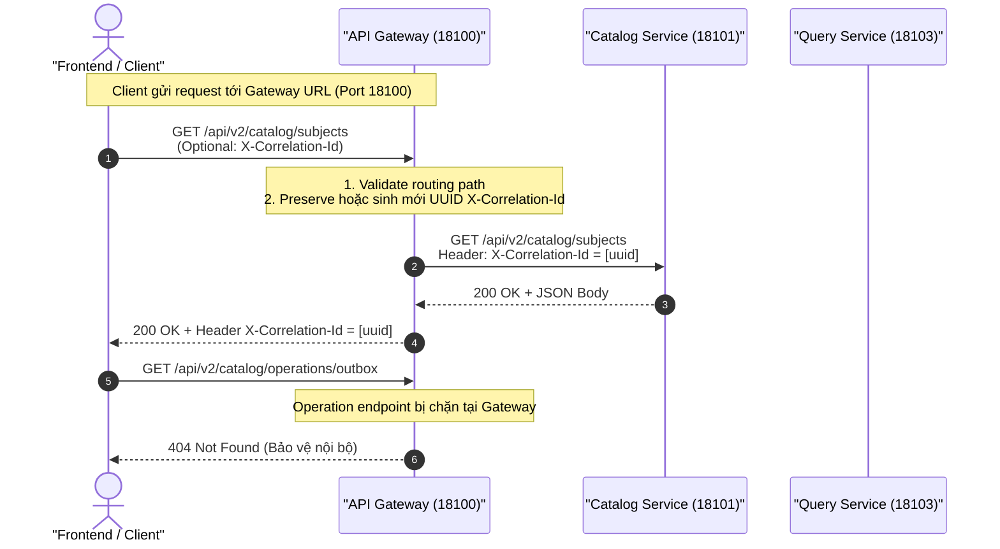
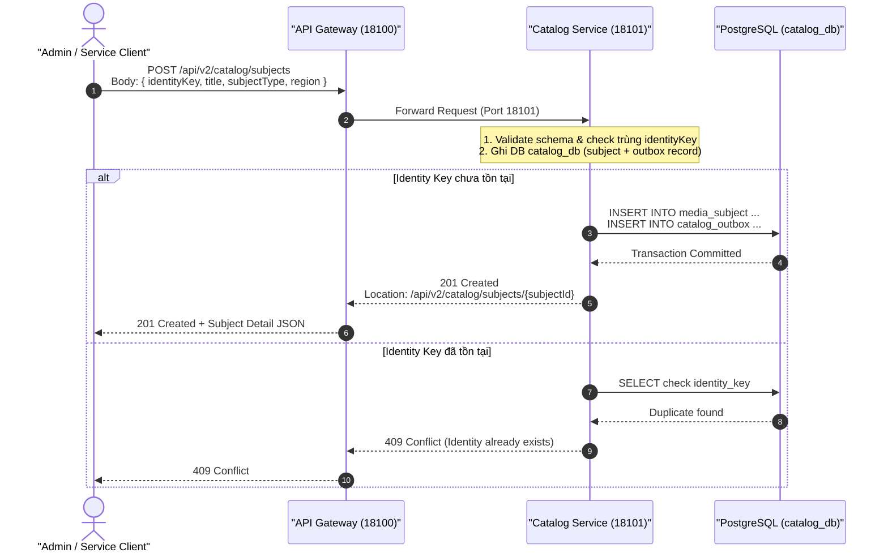
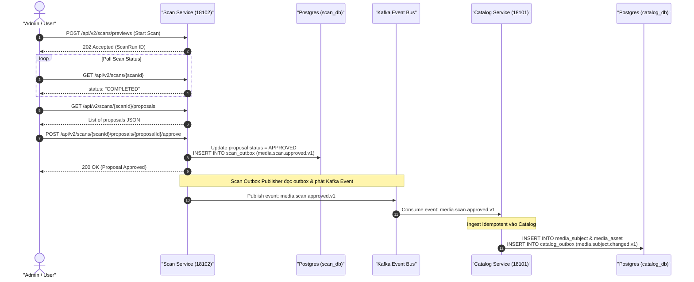
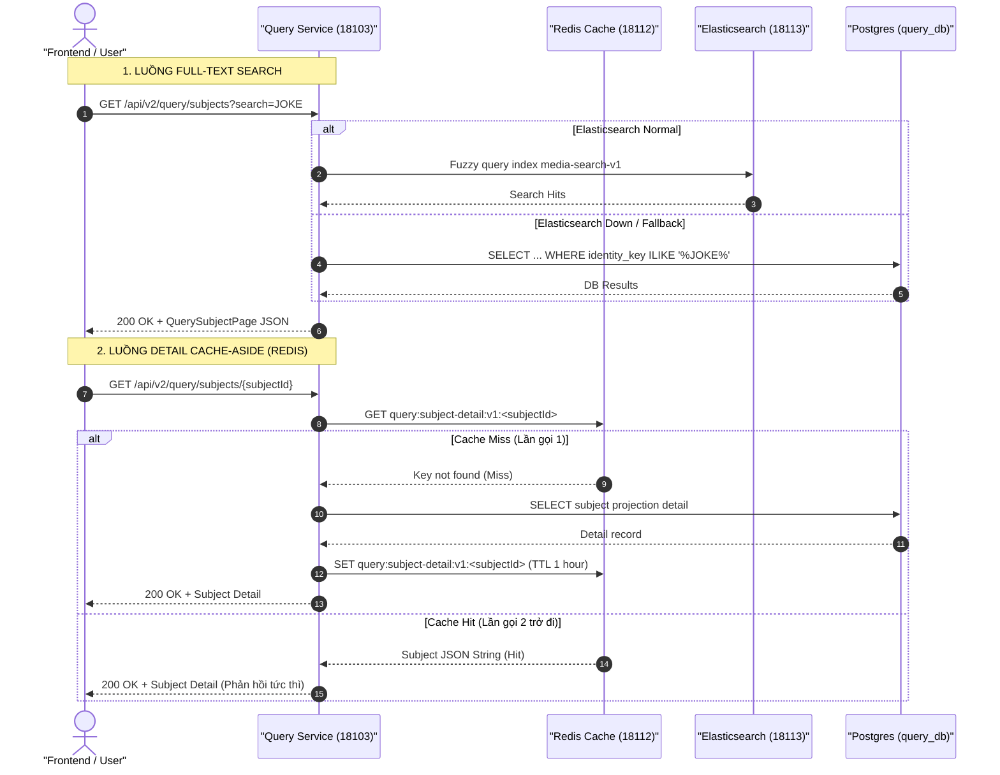
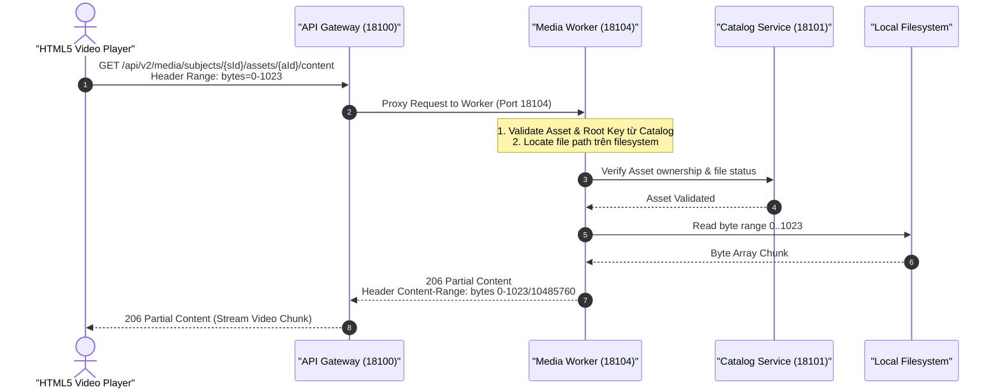

# Deep-Dive Các Luồng API Trong Hệ Thống Backend V2

Tài liệu này tổng hợp chi tiết chuyên sâu (Deep-Dive) toàn bộ các **Luồng API V2** hiện có trong hệ thống `file_mngt_microservice`.

---

## 1. Tổng quan Ma trận Luồng API (API Flow Matrix)

| STT | Tên luồng API | Primary Services | OpenAPI Contract | Event / Outbox | Data Store & Fixtures |
|:---:|---|---|---|---|---|
| **1** | **API Gateway Routing & Correlation ID** | [`gateway-service`](../../../apps/gateway-service/CONTEXT.md) | [gateway-routing-v1.md](../../../docs/contracts/http/gateway-routing-v1.md) | `X-Correlation-Id` Header | N/A |
| **2** | **Catalog Subject Lifecycle** | [`catalog-service`](../../../apps/catalog-service/CONTEXT.md) | [catalog-v1.yaml](../../../docs/contracts/openapi/catalog-v1.yaml) | `media.subject.changed.v1` (Outbox) | PostgreSQL (`catalog_db`) |
| **3** | **Filesystem Scan & Proposal Approval** | [`scan-service`](../../../apps/scan-service/CONTEXT.md), [`catalog-service`](../../../apps/catalog-service/CONTEXT.md) | [scan-v1.yaml](../../../docs/contracts/openapi/scan-v1.yaml) | `media.scan.approved.v1` (Outbox Kafka) | PostgreSQL (`scan_db`, `catalog_db`) |
| **4** | **Query Search & Redis Detail Cache** | [`query-service`](../../../apps/query-service/CONTEXT.md) | [query-v1.yaml](../../../docs/contracts/openapi/query-v1.yaml) | Ingest `media.subject.changed.v1` | PostgreSQL (`query_db`), Redis, Elasticsearch |
| **5** | **Media Content Serving (Streaming)** | [`gateway-service`](../../../apps/gateway-service/CONTEXT.md), [`media-worker`](../../../apps/media-worker/CONTEXT.md) | [media-delivery-v1.yaml](../../../docs/contracts/openapi/media-delivery-v1.yaml) | N/A | Filesystem (Media Roots) |

---

## 2. Chi tiết từng Luồng API (Deep-Dive API Flow)

---

### 🌊 Luồng 1: API Gateway Routing & Correlation ID Propagation

#### 1.1 Ý nghĩa Nghiệp vụ (Business Intent)
- [`gateway-service`](../../../apps/gateway-service/CONTEXT.md) làm Cổng vào tập trung duy nhất (`http://localhost:18100`) cho Frontend và Client.
- Chịu trách nhiệm theo [gateway-routing-v1.md](../../../docs/contracts/http/gateway-routing-v1.md):
  - Routing URL prefix `/api/v2/...` tới đúng Microservice phía sau.
  - Chuẩn hóa và lan truyền mã vết **Correlation ID** (`X-Correlation-Id`) xuyên suốt các HTTP call và Log traces.
  - Chặn không cho Client công khai truy cập các endpoint nội bộ (Actuator, Operations API).

#### 1.2 Sơ đồ Luồng (Sequence Diagram)


#### 1.3 Thông số API Call
- **OpenAPI Contract**: [catalog-v1.yaml](../../../docs/contracts/openapi/catalog-v1.yaml) & [query-v1.yaml](../../../docs/contracts/openapi/query-v1.yaml)
- **Endpoint công khai qua Gateway**:
  - `GET http://localhost:18100/api/v2/catalog/subjects`
  - `GET http://localhost:18100/api/v2/query/subjects`
  - `POST http://localhost:18100/api/v2/scans/previews`
- **Headers**:
  - `X-Correlation-Id`: String UUID (Tùy chọn, nếu không gửi Gateway tự tạo).

#### 1.4 Thực thi Test E2E & Kết quả mong muốn
- **File HTTP Client Test**: [tests/e2e/gateway/001-routing-correlation.http](../../../tests/e2e/gateway/001-routing-correlation.http)
- **Lệnh NPM CLI**:
  ```powershell
  cd tests/e2e
  npm run gateway:local
  ```
- **Kết quả mong muốn (Expected Output)**:
  - Status code: `200 OK`.
  - Header Response chứa `X-Correlation-Id` đúng với giá trị client gửi lên (hoặc UUID mới).
  - Request tới `/api/v2/catalog/operations/...` bị trả về `404 Not Found`.

---

### 📦 Luồng 2: Catalog Subject Canonical Lifecycle (Create & Detail)

#### 2.1 Ý nghĩa Nghiệp vụ (Business Intent)
- [`catalog-service`](../../../apps/catalog-service/CONTEXT.md) là **Canonical Write Model** — nguồn dữ liệu chuẩn duy nhất quản lý `media_subject` (Video / Album) và `media_asset` (Video file, Image, GIF).
- Đảm bảo tính toàn vẹn dữ liệu: Identity Key (Mã định danh nghiệp vụ) không được trùng lặp. Mỗi khi Subject tạo mới hoặc thay đổi, lưu event vào **Transactional Outbox** để sẵn sàng bắn Kafka event `media.subject.changed.v1`.

#### 2.2 Sơ đồ Luồng (Sequence Diagram)


#### 2.3 Thông số API Call
- **OpenAPI Contract**: [catalog-v1.yaml](../../../docs/contracts/openapi/catalog-v1.yaml)
- **Tạo mới Subject**:
  - `POST http://localhost:18100/api/v2/catalog/subjects`
  - Body mẫu:
    ```json
    {
      "identityKey": "E2E-JOKE-001",
      "title": "E2E Test Subject Video",
      "subjectType": "VIDEO",
      "region": "JAV"
    }
    ```
- **Lấy Chi tiết Subject**:
  - `GET http://localhost:18100/api/v2/catalog/subjects/{subjectId}`

#### 2.4 Thực thi Test E2E & Kết quả mong muốn
- **File HTTP Client Test**: [tests/e2e/catalog/001-subject-lifecycle.http](../../../tests/e2e/catalog/001-subject-lifecycle.http)
- **Lệnh NPM CLI**:
  ```powershell
  cd tests/e2e
  npm run catalog:local
  ```
- **Kết quả mong muốn (Expected Output)**:
  - Request Create lần 1: Status `201 Created`, Header `Location` chứa URI của Subject.
  - Request Create lần 2 trùng `identityKey`: Status `409 Conflict`.
  - Request Get Detail: Status `200 OK`, trả về chi tiết JSON object của subject.

---

### 🔬 Luồng 3: Filesystem Scan & Idempotent Proposal Approval (Scan → Outbox → Kafka → Catalog)

#### 3.1 Ý nghĩa Nghiệp vụ (Business Intent)
- Khởi động lượt scan folder đọc file vật lý (Read-only) trên ổ đĩa từ [`scan-service`](../../../apps/scan-service/CONTEXT.md).
- Parse tên file theo quy tắc (JOKE / USE) tạo danh sách **Proposals**.
- Admin xem danh sách proposals và thực hiện **Approve Proposal**.
- **Tính Idempotent & Event-Driven**: Khi Approve, `scan-service` ghi event vào Outbox (`scan_outbox`), Outbox Publisher đẩy Kafka event `media.scan.approved.v1`. [`catalog-service`](../../../apps/catalog-service/CONTEXT.md) nghe Kafka event và tự động Ingest thông tin vào `catalog_db`. Duyệt nhiều lần 1 proposal không làm nhân bản dữ liệu.

#### 3.2 Sơ đồ Luồng (Sequence Diagram)


#### 3.3 Thông số API Call
- **OpenAPI Contract**: [scan-v1.yaml](../../../docs/contracts/openapi/scan-v1.yaml)
- **Khởi chạy Scan**:
  - `POST http://localhost:18100/api/v2/scans/previews`
  - Body: `{"sourceRootKey": "fixture-joke-video", "targetPath": "/"}`
- **Xem danh sách Proposal**:
  - `GET http://localhost:18100/api/v2/scans/{scanId}/proposals`
- **Duyệt Proposal**:
  - `POST http://localhost:18100/api/v2/scans/{scanId}/proposals/{proposalId}/approve`

#### 3.4 Thực thi Test E2E & Kết quả mong muốn
- **File HTTP Client Test**: [tests/e2e/scan/001-preview.http](../../../tests/e2e/scan/001-preview.http)
- **Lệnh NPM CLI**:
  ```powershell
  cd tests/e2e
  npm run scan:local
  ```
- **Kết quả mong muốn (Expected Output)**:
  - `StartScan`: Status `202 Accepted`.
  - Polling `ScanRun`: `status: "COMPLETED"`.
  - `Approve`: Status `200 OK`. Gọi Approve lần 2 vẫn trả về `200 OK` (idempotent).
  - Tự động kiểm tra sau max 10s: Subject & Asset mới xuất hiện chính xác trong Catalog.

---

### ⚡ Luồng 4: Query Search & Redis Detail Cache (CQRS Read Model)

#### 4.1 Ý nghĩa Nghiệp vụ (Business Intent)
- Áp dụng mô hình **CQRS (Command Query Responsibility Segregation)** tại [`query-service`](../../../apps/query-service/CONTEXT.md):
  - `catalog-service` đảm nhận Ghi (Write Model).
  - `query-service` đảm nhận Đọc/Tìm kiếm (Read Model).
- Lắng nghe Kafka event `media.subject.changed.v1` để đồng bộ data sang `query_db` và **Elasticsearch**.
- **Full-Text Search & Fallback**: Khi client tìm kiếm từ khóa, `query-service` ưu tiên tra cứu Elasticsearch; nếu Elasticsearch offline, tự động fallback sang PostgreSQL `ILIKE` contains search mà không báo lỗi 500.
- **Cache-Aside Pattern với Redis**: Lần đầu lấy chi tiết Subject (`GET /api/v2/query/subjects/{id}`), đọc từ DB và lưu vào Redis Cache (`Cache Miss`). Các lần tiếp theo đọc trực tiếp từ Redis (`Cache Hit`).

#### 4.2 Sơ đồ Luồng (Sequence Diagram)


#### 4.3 Thông số API Call
- **OpenAPI Contract**: [query-v1.yaml](../../../docs/contracts/openapi/query-v1.yaml)
- **Tìm kiếm Subject (Search Projection)**:
  - `GET http://localhost:18100/api/v2/query/subjects?search=JOKE-011&order=CREATED_AT&page=0&size=20`
- **Lấy Chi tiết Subject (Detail Cache)**:
  - `GET http://localhost:18100/api/v2/query/subjects/{subjectId}`

#### 4.4 Thực thi Test E2E & Kết quả mong muốn
- **File HTTP Client Test**: [tests/e2e/query/001-detail-cache.http](../../../tests/e2e/query/001-detail-cache.http)
- **Lệnh NPM CLI Kiểm tra Cache**:
  ```powershell
  cd tests/e2e
  npm run query:cache:local
  ```
- **Lệnh NPM CLI Kiểm tra Elasticsearch Search**:
  ```powershell
  cd tests/e2e
  npm run scan:search:local
  ```
- **Kết quả mong muốn (Expected Output)**:
  - Cache Test: Gọi lần 1 `Cache Miss`, gọi lần 2 `Cache Hit`. Actuator metric `query.detail.cache.lookup` ghi nhận đúng `cache hit` tăng +1.
  - Search Test với `local-search` env: Trả về `searchBackend: "ELASTICSEARCH"`, `degraded: false`.

---

### 🎥 Luồng 5: Media Asset Content Delivery (Streaming Content)

#### 5.1 Ý nghĩa Nghiệp vụ (Business Intent)
- Cung cấp luồng đọc/phát file phương tiện (Video MP4, Ảnh Preview) từ [`media-worker`](../../../apps/media-worker/CONTEXT.md) cho giao diện Web Gallery V2.
- Yêu cầu bắt buộc:
  - Luồng truyền dữ liệu đi qua [`gateway-service`](../../../apps/gateway-service/CONTEXT.md) (`18100`) proxy sang `media-worker` (`18104`).
  - Hỗ trợ HTTP **Range Requests** (Header `Range: bytes=0-1023`) phục vụ tua video/stream từng phần (`206 Partial Content`).
  - Hỗ trợ HTTP **HEAD Request** để trình duyệt lấy `Content-Length` và `Content-Type` trước khi tải.

#### 5.2 Sơ đồ Luồng (Sequence Diagram)


#### 5.3 Thông số API Call
- **OpenAPI Contract**: [media-delivery-v1.yaml](../../../docs/contracts/openapi/media-delivery-v1.yaml)
- **Stream Content (Range GET)**:
  - `GET http://localhost:18100/api/v2/media/subjects/{subjectId}/assets/{assetId}/content`
  - Header: `Range: bytes=0-1023`
- **Kiểm tra Metadata (HEAD)**:
  - `HEAD http://localhost:18100/api/v2/media/subjects/{subjectId}/assets/{assetId}/content`

#### 5.4 Thực thi Test E2E & Kết quả mong muốn
- **File HTTP Client Test**: [tests/e2e/media/001-content-delivery.http](../../../tests/e2e/media/001-content-delivery.http)
- **Lệnh NPM CLI**:
  ```powershell
  cd tests/e2e
  npm run media:local
  ```
- **Kết quả mong muốn (Expected Output)**:
  - Request GET Range: Status `206 Partial Content`, Header `Content-Range: bytes 0-1023/...`, `Accept-Ranges: bytes`.
  - Request HEAD: Status `200 OK`, `Content-Type: video/mp4`, `Content-Length` chính xác với dung lượng file vật lý.

---

## 3. Tóm tắt Hướng dẫn Chạy Toàn bộ E2E Verification

Các file hạ tầng và port liên quan:
- File Docker Compose: [compose.yaml](../../../infra/compose/compose.yaml)
- Quy định Port: [ADR-004-local-port-allocation.md](../../../docs/adr/ADR-004-local-port-allocation.md)
- Swagger UI local: [http://localhost:18118](http://localhost:18118) (Xem [swagger-ui-openapi.md](../../operations/swagger-ui-openapi.md))

Để xác minh toàn bộ 5 luồng API trên ở môi trường local, thực hiện theo thứ tự:

1. **Khởi động Container Hạ tầng**:
   ```powershell
   docker compose --env-file .env -f infra/compose/compose.yaml up -d
   ```
2. **Khởi động 5 Application trong IntelliJ**: `GatewayApplication`, `CatalogApplication`, `ScanApplication`, `QueryApplication`, `MediaWorkerApplication`.
3. **Chạy các kịch bản E2E Test tại thư mục [tests/e2e](../../../tests/e2e/README.md)**:
   ```powershell
   cd tests/e2e
   npm run gateway:local
   npm run catalog:local
   npm run scan:local
   npm run query:cache:local
   npm run media:local
   ```
