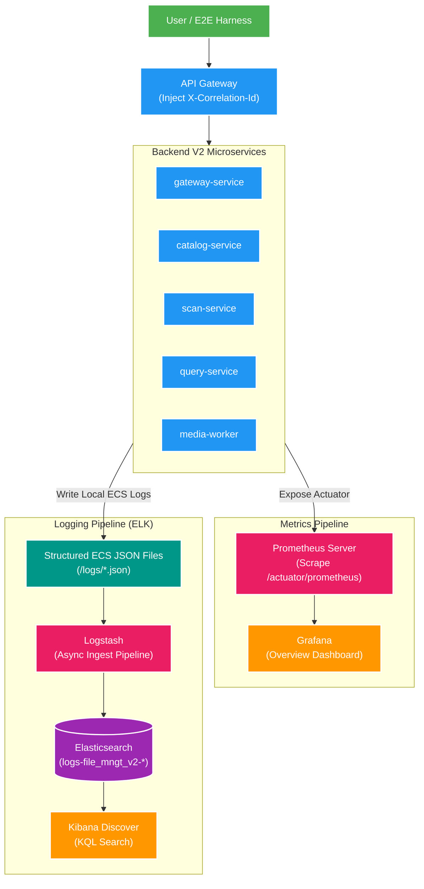
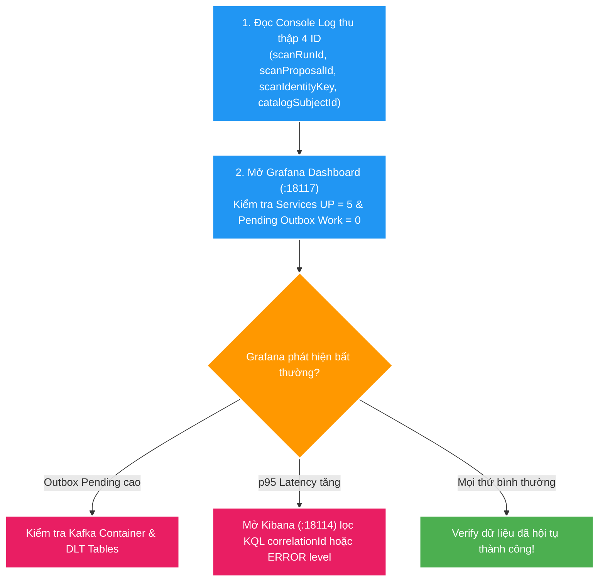

# 📊 Deep-Dive Observability Architecture & Operations

Tài liệu giải thích toàn bộ kiến trúc, cơ chế vận hành, quy trình tracing và định hướng phát triển của hệ thống **Observability** (Monitoring, Structured Logging, Metrics, Dashboard) trong dự án **Backend V2** (`file_mngt_microservice`).

---

## 1. Tổng quan & Triết lý Observability

### 🎯 Động lực bài toán
Trong kiến trúc Microservices và Event-Driven Architecture (EDA) của Backend V2:
1. **Phân tán Use Case**: Một tác vụ người dùng (như Approve Scan Proposal) trải qua nhiều service khác nhau: `gateway-service` → `scan-service` (Outbox) → Kafka → `catalog-service` (Outbox) → Kafka → `query-service` (Projection) & `media-worker`.
2. **Khó khăn khi chẩn đoán lỗi**: Nếu dữ liệu không hiển thị lên Gallery V2, lỗi có thể nằm ở REST API, Database transaction, Outbox Relay, Kafka Consumer, Elasticsearch Sync, hoặc Redis Cache.
3. **Mục tiêu Observability**: Cung cấp khả năng **khảo sát hệ thống thời gian thực (Real-time Inspection)** và **khoanh vùng sự cố siêu tốc (Fast Root-Cause Analysis)** mà không cần remote debug hay ghi log lộn xộn.

### 💡 Nguyên tắc thiết kế cốt lõi
- **Tách biệt 2 trụ cột độc lập**: 
  - **Metrics**: Đo lường sức khỏe, lưu lượng, độ trễ và backlog (Prometheus + Grafana).
  - **Structured Logs**: Tra cứu chi tiết dấu vết và exception theo request/correlation (Spring Boot ECS JSON + ELK Stack).
- **Không chặn luồng nghiệp vụ (Non-blocking & Opt-in)**:
  - Log được ghi file async; hỏng ELK không làm nghẽn REST API.
  - Metrics thu thập qua Scrape bất đồng bộ từ Actuator.
  - Đóng gói dưới dạng Compose profile `docker compose --profile observability up -d`.

---

## 2. Kiến trúc Tổng thể (High-Level Architecture)



---

## 3. Phân bổ Port Local (Port Allocation Mapping)

Tuân thủ **[ADR-004-local-port-allocation.md](file:///d:/Study/Project/file_mngt_microservice/docs/adr/ADR-004-local-port-allocation.md)**, các port dành riêng cho Observability Stack được cố định như sau:

| Component | Port Local | Protocol / Access URL | Nhiệm vụ chính |
| :--- | :---: | :--- | :--- |
| **Elasticsearch (Logs)** | `18113` | `http://localhost:18113` | Lưu trữ Logs Data Stream (`logs-file_mngt_v2-*`) |
| **Kibana** | `18114` | `http://localhost:18114` | Giao diện tra cứu log bằng KQL (Discover) |
| **Logstash** | `18115` | Internal / TCP `18115` | Pipeline nhận, parse ECS JSON và shipping log |
| **Prometheus** | `18116` | `http://localhost:18116` | Thu thập (Scrape) & lưu trữ Time-series Metrics |
| **Grafana** | `18117` | `http://localhost:18117` | Giao diện Dashboard quan sát tổng quan hệ thống |

---

## 4. Deep-Dive Trụ cột Metrics: Prometheus & Grafana

### 4.1. Thu thập Metrics với Micrometer & Spring Actuator
Tất cả 5 microservices đều tích hợp `micrometer-registry-prometheus`. Endpoint quản lý `/actuator/prometheus` được expose trực tiếp trên port riêng của service (không thông qua API Gateway để đảm bảo an toàn).

Prometheus Server định kỳ pull dữ liệu theo cấu hình `infra/observability/prometheus/prometheus.yml`:
```yaml
scrape_configs:
  - job_name: 'file-mngt-v2-services'
    metrics_path: '/actuator/prometheus'
    scrape_interval: 5s
    static_configs:
      - targets:
          - 'host.docker.internal:18100' # gateway-service
          - 'host.docker.internal:18101' # catalog-service
          - 'host.docker.internal:18102' # scan-service
          - 'host.docker.internal:18103' # query-service
          - 'host.docker.internal:18104' # media-worker
```

### 4.2. Grafana Dashboard (`File Management V2 overview`)
Dashboard tự động provision từ file `infra/observability/grafana/dashboards/v2-overview.json`. Trật tự đọc chỉ số ưu tiên:

1. **Services Up (`up`)**: Đảm bảo đủ 5/5 services đang hoạt động (`1`).
2. **HTTP Request Rate (`http_server_requests_seconds_count`)**: Theo dõi tổng lưu lượng request/giây trên từng service.
3. **HTTP Latency p95/p99 (`http_server_requests_seconds_bucket`)**: Phát hiện sớm service gặp hiện tượng nghẽn I/O hoặc DB lock.
4. **Pending Outbox Work (`catalog_outbox_pending`, `query_search_outbox_pending`)**:
   - Nếu `catalog_outbox_pending > 0` kéo dài: Outbox Relay Publisher đang gặp sự cố hoặc Kafka bị hỏng.
   - Nếu `query_search_outbox_pending > 0` kéo dài: Elasticsearch sync worker đang chậm.
5. **JVM & Resource Utilization**: Heap Memory (`jvm_memory_used_bytes`), Active DB Connections (`hikaricp_connections_active`).

---

## 5. Deep-Dive Trụ cột Logging: Spring Boot ECS + ELK

### 5.1. Cấu hình Spring Boot 4 ECS JSON Format
Dự án sử dụng tính năng **Spring Boot 4 Built-in Structured Logging** chuẩn Elastic Common Schema (ECS), không dùng plugin bên thứ 3:
```properties
# application.properties
logging.structured.format.file=ecs
logging.file.name=logs/${spring.application.name}.json
```

Mỗi log record có định dạng JSON chuẩn mực:
```json
{
  "@timestamp": "2026-08-02T14:00:00.123Z",
  "log.level": "INFO",
  "message": "Approved scan proposal scanProposalId=p-101",
  "service.name": "scan-service",
  "correlationId": "corr-550e8400-e29b-41d4-a716-446655440000",
  "process.thread.name": "http-nio-18102-exec-1",
  "log.logger": "com.filemngt.scan.application.ScanApplicationService"
}
```

### 5.2. Luồng Correlation ID MDC Propagation
Để truy vết một request xuyên suốt qua các REST calls:
1. `gateway-service` nhận request, kiểm tra header `X-Correlation-Id`. Nếu chưa có, Gateway sẽ tự sinh một UUID mới.
2. Gateway chuyển tiếp header `X-Correlation-Id` tới downstream services.
3. Mỗi service có một `CorrelationIdFilter` đưa giá trị header vào **SLF4J MDC (Mapped Diagnostic Context)**.
4. Mọi câu log được in ra từ Thread đó tự động đính kèm trường `correlationId`.

### 5.3. Pipeline Logstash & Elasticsearch Data Stream
- **Logstash Pipeline** (`infra/observability/logstash/pipeline/logstash.conf`):
  - Ingest từ các file JSON trong thư mục `/logs/*.json`.
  - Parse JSON payload và mapping tự động các trường ECS.
  - Gửi dữ liệu về Elasticsearch Index Data Stream: `logs-file_mngt_v2-*`.
- **Độc lập dữ liệu**: Index log `logs-file_mngt_v2-*` tách biệt hoàn toàn với Index tìm kiếm media `media-subject-search` của `query-service`.

### 5.4. Tra cứu trên Kibana Discover
Bảng tra cứu KQL (Kibana Query Language) thông dụng:

| Nhu cầu tra cứu | KQL Query gợi ý |
| :--- | :--- |
| **Trace toàn bộ 1 Request** | `correlationId : "corr-550e8400-e29b-41d4-a716-446655440000"` |
| **Lọc log lỗi 5xx** | `http.response.status_code >= 500` hoặc `log.level : "ERROR"` |
| **Theo dõi log của Service** | `service.name : "catalog-service"` |
| **Tìm theo ID Scan Run** | `service.name : "scan-service" and message : "*scanRunId*"` |

---

## 6. Quy trình Debug & Tracing Flow E2E (Scan → Catalog → Query)

Khi chạy kịch bản E2E debug:
```powershell
npm run scan:local:debug
```

Quy trình 4 bước chẩn đoán hệ thống:



---

## 7. Roadmap & Tính năng Phát triển trong Tương lai (Future Enhancements)

Để nâng cấp hệ thống Observability từ mức **Foundation** hiện tại lên mức **Enterprise Production-Ready**, các tính năng sau được lên kế hoạch phát triển ở các Phase tiếp theo:

### 🔮 1. Distributed Tracing xuyên Kafka (OpenTelemetry + Jaeger / Tempo)
- **Hiện trạng**: Correlation ID đã truyền qua HTTP Header nhưng chưa tự động propagate qua **Kafka Record Headers**.
- **Nâng cấp sắp tới**:
  - Tích hợp **OpenTelemetry Java Agent / Micrometer Tracing**.
  - Tự động inject `traceparent` (Trace ID / Span ID) vào Kafka Record Headers khi outbox relay publish event.
  - Tích hợp **Grafana Tempo / Jaeger** để vẽ sơ đồ Gantt Chart thời gian xử lý thực tế của từng bước async (từ lúc REST approve → Outbox relay → Kafka delivery → Consumer process → Worker FFmpeg).

### 🔮 2. Load Testing & Performance Baseline (k6 + JFR / JMH)
- **Nâng cấp sắp tới**:
  - Viết kịch bản sinh tải tự động bằng **k6** (mô phỏng 100-500 VUs đồng thời thực hiện Search & Scan).
  - Tích hợp **Java Flight Recorder (JFR)** và **JMC (Java Mission Control)** để profile bộ nhớ, Virtual Thread pinning và Garbage Collection dưới áp lực tải lớn.
  - Xác lập ngưỡng Latency SLO/SLA chính thức cho API V2.

### 🔮 3. Alerting Rules & Cảnh báo Tự động (Prometheus Alertmanager)
- **Nâng cấp sắp tới**:
  - Bổ sung container **Alertmanager** kết nối với Prometheus.
  - Cấu hình Alerting Rules:
    - `ServiceDownAlert`: Cảnh báo khi có 1 trong 5 service ngắt kết nối (`up == 0`) quá 30 giây.
    - `OutboxBacklogHigh`: Cảnh báo khi `catalog_outbox_pending > 100` trong 2 phút.
    - `HighErrorRate`: Cảnh báo khi tỷ lệ lỗi HTTP 5xx vượt 5% tổng lưu lượng.
  - Đẩy thông báo cảnh báo qua Telegram / Slack Webhook / Email.

### 🔮 4. Dynamic Log Level & Log Sampling
- **Nâng cấp sắp tới**:
  - Tận dụng Spring Boot Actuator `/actuator/loggers` để **thay đổi Log Level động** (ví dụ đổi từ `INFO` sang `DEBUG` cho riêng package `com.filemngt.scan`) thời gian thực mà không cần khởi động lại service.
  - Cấu hình **Log Sampling** tại Logstash để tiết kiệm không gian lưu trữ đĩa khi lên môi trường Production.

---

## 8. Bộ câu hỏi phỏng vấn Chuyên sâu (Senior/Lead Interview Q&A)

### ❓ Q1: Bản chất sự khác biệt giữa Metric (Prometheus) và Log (ELK) là gì? Tại sao không dùng 1 thứ cho tất cả?
- **Trả lời**: 
  - **Metric** là dữ liệu số học định lượng dạng chuỗi thời gian (*Time-series aggregations*). Dung lượng cực nhẹ, nén cao, dùng để trả lời câu hỏi: *“Hệ thống đang sống hay chết? Latency p95 hiện tại là bao nhiêu?”* ➔ Phù hợp để theo dõi sức khỏe và phát cảnh báo ngay lập tức.
  - **Log** là bản ghi sự kiện dạng văn bản đầy đủ ngữ cảnh (*Context-rich text*). Dung lượng lớn, tốn tài nguyên tìm kiếm, dùng để trả lời câu hỏi: *“Tại sao request bị lỗi 500? Nguyên nhân nổ NullPointerException ở dòng code nào?”* ➔ Phù hợp để chẩn đoán nguyên nhân gốc (Root-cause Analysis).
  - **Kết hợp**: Grafana báo động sự cố ➔ Kibana khoanh vùng nguyên nhân.

### ❓ Q2: Tại sao Prometheus chọn mô hình Pull (Scrape) thay vì Push (Service chủ động đẩy metric)?
- **Trả lời**: 
  - **Kiểm soát tải (Load Control)**: Prometheus tự điều phối tần suất scrape. Nếu hệ thống có hàng ngàn service cùng ngắt/bật đồng thời, Prometheus không bị nghẽn hay tràn bộ nhớ (OOM) như mô hình Push.
  - **Phát hiện sự cố tức thì**: Mô hình Pull phát hiện ngay lập tức trạng thái Target Down (`up == 0`) khi một service bị sập mà không cần chờ timeout hay heartbeat.
  - **Đơn giản hóa Application**: Phía Microservice chỉ cần mở static HTTP endpoint `/actuator/prometheus`, không cần cài client đẩy tin phức tạp.

### ❓ Q3: High Cardinality trong Prometheus Metric là gì? Tại sao lại nguy hiểm và dự án này phòng tránh như thế nào?
- **Trả lời**: 
  - **Khái niệm**: High Cardinality xảy ra khi một Label của Metric chứa quá nhiều giá trị duy nhất (như `userId`, `orderId`, `URL chứa path variable /users/123`).
  - **Nguy hiểm**: Prometheus tạo một Time-series riêng biệt cho mỗi tổ hợp label duy nhất. High Cardinality làm số lượng Time-series bùng nổ theo cấp số nhân trong RAM ➔ Gây cạn kiệt RAM Prometheus Server.
  - **Phòng tránh trong dự án**: Quy định cứng chỉ dùng label có cardinality thấp cố định (`service.name`, `http_method`, `normalized_uri`, `status`). Tuyệt đối không đưa ID, path động hoặc error stack trace vào Label.

### ❓ Q4: Cơ chế nào giúp Correlation ID lan truyền (Propagate) xuyên suốt qua các Thread trong Java Spring Boot mà không làm rò rỉ ID giữa các Request khác nhau?
- **Trả lời**: 
  - Dựa vào **SLF4J MDC (Mapped Diagnostic Context)**, sử dụng `ThreadLocal` bên dưới nền.
  - Khi HTTP Request đi qua `CorrelationIdFilter`, Filter đọc header `X-Correlation-Id`, đưa vào `MDC.put("correlationId", value)`. Mọi log record in ra trên Thread đó sẽ có correlation ID.
  - **Bắt buộc**: Trong khối `finally` của Filter phải gọi `MDC.clear()`. Vì Tomcat/Jetty dùng Thread Pool tái sử dụng Worker Thread, nếu không `clear()`, Correlation ID của Request cũ sẽ bị rò rỉ (leak) sang Request mới trên cùng Thread đó.

### ❓ Q5: Tại sao Logging lại dùng ECS JSON File + Logstash Ship thay vì để Application trực tiếp gửi log qua Network đến Elasticsearch/Logstash?
- **Trả lời**: 
  - Tránh rủi ro **Cascading Failure (Sập dây chuyền)**.
  - Nếu Logstash/Elasticsearch bị ngắt mạng, chậm hoặc sập, việc Application gửi log đồng bộ/bất đồng bộ qua Network có thể làm nghẽn I/O, tràn bộ nhớ đệm (Buffer Overflow) và treo toàn bộ API nghiệp vụ.
  - Thao tác ghi log ra đĩa local (OS buffered write) cực kỳ nhanh. Logstash chạy độc lập đọc file ngầm (**Decoupled**), giúp ứng dụng nghiệp vụ hoàn toàn cách ly với sự cố hạ tầng logging.

