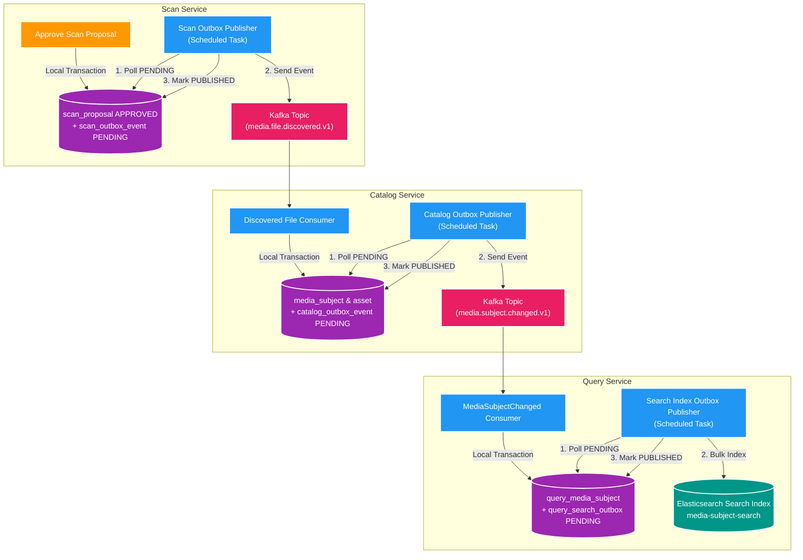

# 📦 Deep-Dive Transactional Outbox Pattern

Tài liệu giải thích chuyên sâu về mô hình **Transactional Outbox Pattern**: Ý tưởng cốt lõi, bài toán Dual-Write, các kịch bản sự cố khi không dùng, chi tiết ứng dụng trong hệ thống **Backend V2** (`file_mngt_microservice`) và lý do lựa chọn pattern này.

---

## 1. Ý tưởng Cốt lõi của Outbox Pattern

### 🧠 Đặt vấn đề: Vấn nạn "Dual-Write" (Ghi 2 nơi)
Trong kiến trúc Microservices & Event-Driven Architecture, một thao tác nghiệp vụ thường đòi hỏi **hai hành động song song**:
1. Ghi dữ liệu vào Database nghiệp vụ (như PostgreSQL RDBMS).
2. Phát (Publish) một Event bản tin ra Message Broker (như Apache Kafka) để thông báo cho các dịch vụ khác.

Vấn đề kỹ thuật: **Database và Kafka là 2 tài nguyên hệ thống hoàn toàn độc lập**. Không thể tạo một ACID Transaction duy nhất bao trùm cả PostgreSQL và Kafka (trừ khi dùng **Distributed Transaction / 2PC - Two-Phase Commit**, thứ vốn cực kỳ chậm, phức tạp và dễ gây deadlock).

```
   ┌─────────────────────────────────────────────────────────┐
   │                  Business Method                        │
   │                                                         │
   │   1. postgresDB.save(entity) ──► [Commit OK?]           │
   │   2. kafkaTemplate.send(event) ──► [Kafka Delivery OK?] │
   └─────────────────────────────────────────────────────────┘
        ▲
        └─► RỦI RO: Một trong hai bước thất bại làm mất tính nhất quán!
```

### 💡 Giải pháp Outbox Pattern
Thay vì gọi Kafka Publisher trực tiếp trong luồng xử lý API/Nghiệp vụ, ta **chuyển bản tin Event thành một dòng dữ liệu (record)** và ghi nó vào một bảng tạm gọi là **Outbox Table** (`catalog_outbox_event`, `scan_outbox_event`).

Bảng Outbox này nằm **trên cùng một Database với entity nghiệp vụ**. Do đó, việc ghi dữ liệu nghiệp vụ VÀ ghi bản tin event được thực thi trong **CÙNG 1 LOCAL ACID TRANSACTION**.
- Nếu nghiệp vụ thành công ➔ Event được ghi vào Outbox.
- Nếu nghiệp vụ bị Rollback ➔ Event trong Outbox tự động bị hủy bỏ theo.

Một tiến trình chạy ngầm (**Outbox Relay / Publisher Worker**) sẽ quét các dòng Event chưa phát trong bảng Outbox, gửi sang Kafka, và đánh dấu trạng thái `PUBLISHED` sau khi Kafka phản hồi thành công.

---

## 2. Kịch bản Thất bại nếu KHÔNG CÓ Outbox Pattern

Nếu không dùng Outbox Pattern mà gọi `kafkaTemplate.send(...)` trực tiếp trong code nghiệp vụ, hệ thống sẽ đối mặt với 3 kịch bản lỗi nghiêm trọng:

### ❌ Kịch bản 1: Commit DB thành công nhưng Bắn Kafka thất bại (Mất Event)
1. Service thực hiện `repository.save(entity)` ➔ DB `COMMIT` thành công.
2. Service gọi `kafka.send(event)` ➔ Ngay lúc này mạng đứt, Kafka Broker quá tải, hoặc ứng dụng bị OOM/Crash.
3. **Hậu quả**: Database đã thay đổi nhưng không có Event nào phát ra. Các downstream service (như `query-service`) không hề biết có thay đổi ➔ **Mất dữ liệu đồng bộ (Inconsistency)**.

### ❌ Kịch bản 2: Bắn Kafka thành công nhưng DB bị Rollback (Event Ma / Phantom Event)
1. Service gọi `kafka.send(event)` thành công trước.
2. Consumer nhận Event và lập tức xử lý (vd: cộng tiền, tạo record).
3. Service chuẩn bị `commit()` DB thì gặp lỗi vi phạm Unique Constraint hoặc lỗi Validation ➔ DB `ROLLBACK`.
4. **Hậu quả**: Event đã bay ra ngoài và downstream service đã xử lý dữ liệu không hề tồn tại trong Database gốc ➔ **Dữ liệu ma (Phantom State)**.

### ❌ Kịch bản 3: Timeout không rõ trạng thái (Network Ambiguity)
1. Service ghi DB thành công, gọi `kafka.send(event)` và chờ phản hồi ACK.
2. Mạng chập chờn khiến kết quả ACK bị Timeout Exception.
3. Application không thể biết Kafka đã nhận bản tin hay chưa. Nếu thử gửi lại (Retry) thì nguy cơ nhân đôi event; nếu không gửi lại thì nguy cơ mất event.

---

## 3. Các Trường hợp Thường Áp dụng Outbox Pattern

Outbox Pattern là tiêu chuẩn vàng (Industry Standard) được áp dụng bắt buộc trong các trường hợp:
1. **Event-Driven Microservices**: Khi các service cần giao tiếp bất đồng bộ qua Kafka/RabbitMQ nhưng vẫn yêu cầu sự tin cậy tuyệt đối giữa DB và Event.
2. **Kiến trúc CQRS (Command Query Responsibility Segregation)**: Đảm bảo dữ liệu vừa Ghi ở Command Side (`catalog-service`) chắc chắn sẽ được đồng bộ sang Read Side (`query-service`).
3. **Saga Pattern (Choreography-based Saga)**: Khi một chuỗi transaction phân tán cần phát event bước tiếp theo sau khi bước trước hoàn thành trong DB.

---

## 4. Chi tiết Ứng dụng Outbox Pattern trong Hệ thống Backend V2

Trong dự án `file_mngt_microservice`, Outbox Pattern được triển khai nhất quán ở **3 vị trí chiến lược**:



### 📍 Vị trí 1: `scan-service` (`scan_db`)
- **Tác vụ**: Khi User nhấn Approve 1 Proposal nhập liệu.
- **Thao tác**: `ScanDecisionService` mở Local Transaction:
  1. Update `scan_proposal` status = `APPROVED`.
  2. Insert bản tin `media.file.discovered.v1` vào `scan_outbox_event`.
- **Relay**: `ScanOutboxPublisher` định kỳ poll các bản tin `PENDING`, publish sang Kafka topic `media.file.discovered.v1`, sau đó cập nhật `status = PUBLISHED`.

### 📍 Vị trí 2: `catalog-service` (`catalog_db`)
- **Tác vụ**: Khi Catalog cập nhật thông tin Subject / Asset hoặc nhận file mới.
- **Thao tác**: `CatalogSubjectMutationService` mở Local Transaction:
  1. Upsert `media_subject`, `media_asset` và tăng `subject_version`.
  2. Insert bản tin `media.subject.changed.v1` vào `catalog_outbox_event`.
- **Relay**: `CatalogOutboxPublisher` poll `catalog_outbox_event`, publish sang Kafka topic `media.subject.changed.v1`, sau đó đánh dấu `PUBLISHED`.

### 📍 Vị trí 3: `query-service` (`query_db` ➔ Elasticsearch)
- **Tác vụ**: Cập nhật Search Index trên Elasticsearch khi Read Model PostgreSQL có thay đổi.
- **Thao tác**: `QueryProjectionService` mở Local Transaction:
  1. Upsert projection vào PostgreSQL `query_media_subject`.
  2. Insert bản tin đồng bộ vào `query_search_outbox`.
- **Relay**: `SearchIndexOutboxPublisher` batch poll `query_search_outbox`, gọi Bulk API đẩy sang Elasticsearch index `media-subject-search`, sau đó cập nhật `PUBLISHED`.

---

## 5. Giải quyết Bài toán gì & Vì sao Chọn Outbox Pattern trong Hệ thống?

### 🛡️ 1. Giải quyết triệt để bài toán Dual-Write & Mất dữ liệu
Bảo đảm 100% cam kết **At-Least-Once Event Delivery**: Nếu một thao tác ghi DB thành công, Event tương ứng chắc chắn sẽ được đẩy đến Kafka/Elasticsearch.

### 🔌 2. Khả năng chịu lỗi cao khi Hạ tầng gặp sự cố (Resilience)
- Nếu Kafka Broker hoặc Elasticsearch bị dừng/chậm/sập tạm thời:
  - **REST API vẫn phục vụ người dùng bình thường**: Người dùng Approve scan hay tạo Subject vẫn nhận phản hồi `200 OK` / `202 Accepted` và dữ liệu được commit an toàn vào Database.
  - Các bản tin Event sẽ **xếp hàng đệm (Backlog)** trong bảng Outbox Table.
  - Khi Kafka/Elasticsearch phục hồi, Outbox Publisher sẽ tự động quét và đẩy nốt toàn bộ dữ liệu backlog mà không mất bất kỳ một bản tin nào!

### 🧱 3. Tuân thủ Nguyên tắc Database-per-Service
Mỗi microservice sở hữu bảng Outbox riêng nằm trong chính Database của nó (`scan_db`, `catalog_db`, `query_db`), bảo vệ nguyên tắc cô lập dữ liệu và không truy cập chéo DB giữa các service.

### 🛠️ 4. Thiết kế Đơn giản, Phù hợp môi trường Local & Production
Thay vì phải cài đặt các công cụ CDC (Change Data Capture) phức tạp như Debezium hay Kafka Connect đòi hỏi cấu hình Postgres Logical Replication WAL phức tạp ở môi trường Local dev:
- Hệ thống áp dụng **Polling-based Outbox Relay** kết hợp Spring `@Scheduled` / Virtual Threads.
- Dễ cài đặt, dễ chạy E2E test, dễ theo dõi trực quan bằng SQL query hoặc Grafana dashboard (`catalog_outbox_pending`).

---

## 6. Tổng kết Đánh đổi (Trade-offs)

| Ưu điểm của Outbox Pattern trong dự án | Đánh đổi / Chi phí phải chấp nhận |
| :--- | :--- |
| **Bảo đảm 100% không mất Event** giữa DB & Kafka. | Phải tạo thêm bảng `outbox` trong Database. |
| **Resilience cao**: Kafka sập API vẫn nhận request. | Tăng tải I/O ghi DB (1 transaction ghi 2 bảng). |
| **Tách rời độ trễ**: REST API trả lời ngay không chờ Kafka. | Dữ liệu đồng bộ theo cơ chế **Eventual Consistency** (có trễ vài milisecond). |
| **Dễ debug**: Tra cứu trạng thái Outbox trực tiếp bằng SQL. | Consumer nhận event bắt buộc phải có cơ chế **Idempotent** chống trùng lặp. |

---

## 7. Bộ câu hỏi phỏng vấn Chuyên sâu (Senior/Lead Interview Q&A)

### ❓ Q1: Bản chất cốt lõi của bài toán Dual-Write là gì? Tại sao hai thao tác ghi DB và gửi Kafka không thể gộp thành 1 Transaction duy nhất?
- **Trả lời**: 
  - Bản chất là không thể tạo 1 ACID Transaction nguyên tử (Atomic) duy nhất bao trùm 2 hệ thống lưu trữ độc lập (PostgreSQL RDBMS và Kafka Broker) mà không dùng **2PC (Two-Phase Commit)**.
  - 2PC gây khóa tài nguyên mạng dài (Blocking Locks), hiệu năng cực kém và tạo rủi ro Deadlock lớn trong Microservices.
  - Outbox Pattern giải quyết bằng cách quy đổi 2PC thành **1 Local DB Transaction** duy nhất (Entity + Outbox record) cộng với **1 Async Relay Process**.

### ❓ Q2: Nếu Outbox Relay đọc Outbox Table và gửi Kafka thành công, nhưng ứng dụng bị crash trước khi cập nhật status `PUBLISHED` trong DB thì sao?
- **Trả lời**: 
  - Event sẽ bị phát lại (Duplicate Event) ở lần chạy tiếp theo của Outbox Relay. Đây là lý do Outbox Pattern cam kết **At-Least-Once Delivery** (Giao bản tin ít nhất 1 lần).
  - Để hệ thống không bị sai lệch dữ liệu, **Consumer nhận Event bắt buộc phải thiết kế Idempotent** (dựa vào `eventId` hoặc `subjectVersion` trong DB Consumer để dedupe).

### ❓ Q3: So sánh hai cơ chế Outbox Relay: Polling Publisher (Dùng SQL `@Scheduled`) vs CDC (Change Data Capture như Debezium/Kafka Connect)? Tại sao dự án chọn Polling?
- **Trả lời**:
  - **Polling Publisher**: Đơn giản, thuần SQL, không phụ thuộc hạ tầng ngoài, dễ triển khai ở local/testing. Nhược điểm: Tạo tải Polling DB và có độ trễ nhỏ (interval).
  - **CDC Debezium**: Đọc trực tiếp Postgres WAL (Write-Ahead Log) cực nhanh, gần như zero-latency, không tạo tải SQL query DB. Nhược điểm: Phụ thuộc plugin hạ tầng phức tạp, khó setup local/CI-CD.
  - **Lý do dự án chọn Polling**: Đáp ứng nguyên tắc *Pragmatic & Fit-for-purpose*, tối ưu cho môi trường Dev/Local, dễ chạy E2E harness và đủ nhanh cho tải hiện tại.

### ❓ Q4: Nếu bảng Outbox tích tụ hàng triệu bản tin (Backlog Spike) do Kafka sập vài giờ, làm sao để dọn dẹp và duy trì hiệu năng SQL Query của Outbox Relay?
- **Trả lời**:
  - Thêm Index trên `(status, created_at)` để query `WHERE status = 'PENDING'` luôn đạt tốc độ tối đa $O(\log N)$.
  - Triển khai **Outbox Cleanup Worker** chạy ngầm để xóa hoặc lưu trữ (archive) các bản tin đã `PUBLISHED` quá 24h-7 ngày.
  - Sử dụng **Partitioning** bảng Outbox theo ngày (Range Partitioning) hoặc **Table Truncation** định kỳ cho các partition cũ để tránh bùng nổ dung lượng đĩa và đòn bẩy Index.

### ❓ Q5: Event trong Outbox Pattern nên thiết kế theo dạng State-based Event (Snapshot) hay Fine-grained Event (Delta)? Ưu nhược điểm trong dự án này?
- **Trả lời**:
  - Dự án chọn **State-based Event (Snapshot)** (`media.subject.changed.v1` chứa trọn vẹn thông tin Subject & danh sách Assets).
  - **Ưu điểm**: Consumer (`query-service`) chỉ cần thực hiện Upsert/Reconcile snapshot mới nhất mà không bị phụ thuộc thứ tự tuyệt đối của hàng loạt event nhỏ; việc dedupe và retry cực kỳ đơn giản.
  - **Nhược điểm**: Kích thước Payload event lớn hơn so với Delta event (nhưng hoàn toàn chấp nhận được với dữ liệu media metadata).

