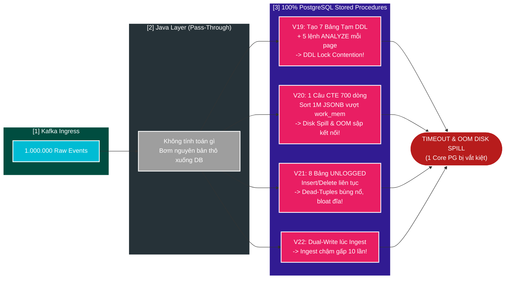
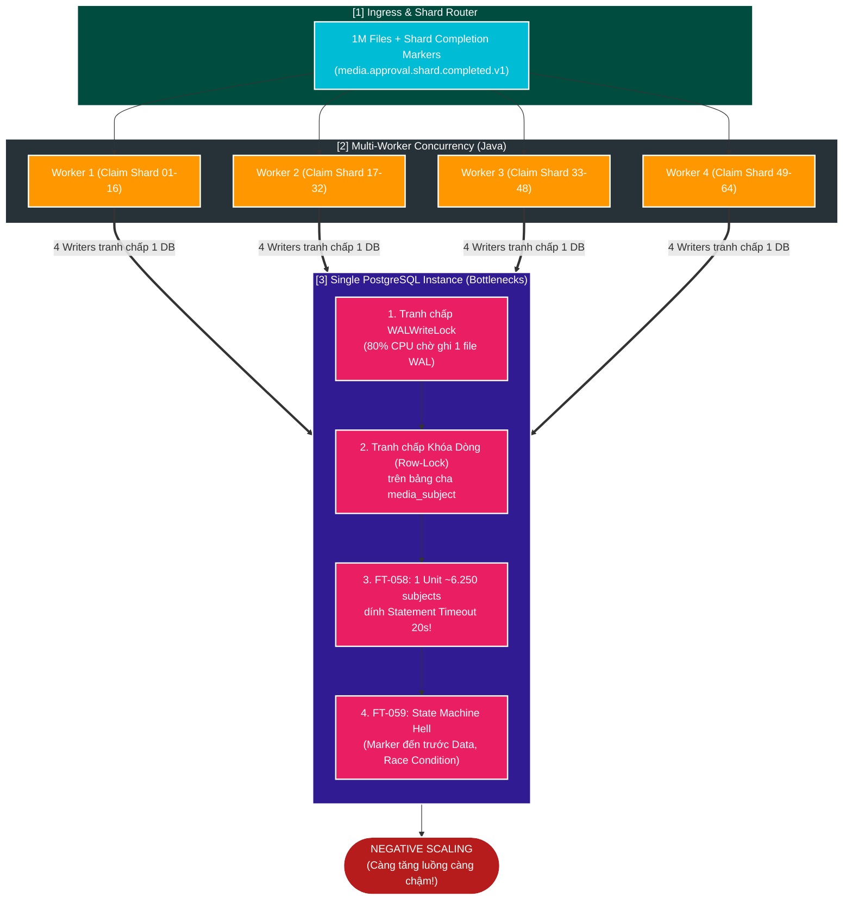

# 🧭 Deep-Dive: Toàn Cảnh Dòng Chảy Dự Án & Tiến Trình Tiến Hóa Kiến Trúc Catalog Service 1.000.000 Records

> **Mục tiêu tài liệu**: Đúc kết toàn diện từ First Principles kiến trúc, bản chất bài toán nghiệp vụ, biên niên sử tiến hóa qua các kỷ nguyên thất bại (FT-054 $\to$ FT-063), mổ xẻ các bẫy tư duy kỹ thuật của AI/kỹ sư, và chốt lại kiến trúc đích **Hybrid Streaming Reconciliation (FT-064 / ADR-008)** để đạt throughput cao và an toàn tuyệt đối cho 1.000.000 bản ghi.  
> **Áp dụng dự án**: `file_mngt_microservice` (PostgreSQL 17 / Spring Boot 3.4 / JDK 25 Virtual Threads / Workload SC-01 BT-09).

---

## 1. Bản Chất Trong Một Câu & Trục Xương Sống (Core Essence)

> **Bản chất cốt lõi**: `catalog-service` là một **Batch Stream Processor / Aggregate Coalescer** đóng vai trò là "bộ lọc tinh chế dữ liệu": tiếp nhận 1.000.000 sự kiện phát hiện file thô từ `scan-service`, phân rã và hợp nhất (reduce) thành 100.000 cụm thực thể Subject chuẩn mực (Domain Aggregates), lưu trữ vào cơ sở dữ liệu quan hệ và phát tín hiệu thay đổi đồng bộ sang `query-service`.

```mermaid
flowchart LR
    subgraph SCAN["[1] Scan Service"]
        OUT["Scan Outbox\n(1M Files)"]
    end
    subgraph KAFKA1["[2] Kafka Ingress"]
        DISC{{"media.file.discovered.v2\n(1.000.000 events)"}}
        WATER1(["Operation Watermark\n(START / SEAL)"])
    end
    subgraph CATALOG["[3] Catalog Service (BT-09D)"]
        direction TB
        INGEST["Append-Only Ingest\n(COPY -> Raw Stage)"]
        RECON["Hybrid Reconciliation\n(Java RAM + DB COPY)"]
        RELAY["Indexed Sliding Relay\n(Continuous Publish)"]
        INGEST --> RECON --> RELAY
    end
    subgraph KAFKA2["[4] Kafka Egress"]
        SNAP{{"media.subject.changed.v2\n(100.000 snapshots)"}}
        WATER2(["CATALOG_COMMITTED\n(Watermark Stage 20)"])
    end
    subgraph QUERY["[5] Query Service (BT-09E)"]
        PROJ["Query Read Projection\n(QUERY_DB_READY)"]
    end
    OUT --> DISC
    OUT --> WATER1
    DISC --> INGEST
    WATER1 --> RECON
    RELAY --> SNAP
    RELAY --> WATER2
    SNAP --> PROJ
    WATER2 --> PROJ
    style SCAN fill:#263238,stroke:#fff,stroke-width:2px,color:#fff
    style OUT fill:#009688,stroke:#fff,stroke-width:2px,color:#fff
    style KAFKA1 fill:#004D40,stroke:#fff,stroke-width:2px,color:#fff
    style DISC fill:#00BCD4,stroke:#fff,stroke-width:2px,color:#fff
    style WATER1 fill:#2196F3,stroke:#fff,stroke-width:2px,color:#fff
    style CATALOG fill:#311B92,stroke:#fff,stroke-width:2px,color:#fff
    style INGEST fill:#4CAF50,stroke:#fff,stroke-width:2px,color:#fff
    style RECON fill:#9C27B0,stroke:#fff,stroke-width:2px,color:#fff
    style RELAY fill:#00BCD4,stroke:#fff,stroke-width:2px,color:#fff
    style KAFKA2 fill:#004D40,stroke:#fff,stroke-width:2px,color:#fff
    style SNAP fill:#00BCD4,stroke:#fff,stroke-width:2px,color:#fff
    style WATER2 fill:#2196F3,stroke:#fff,stroke-width:2px,color:#fff
    style QUERY fill:#263238,stroke:#fff,stroke-width:2px,color:#fff
    style PROJ fill:#4CAF50,stroke:#fff,stroke-width:2px,color:#fff
```



> [!TIP]
> ### 💡 Từ điển Thuật ngữ & Mental Model (Gốc từ & Cách liên tưởng)
>
> 1. **Coalescing / Reduction (Gom nhóm & Thu nhỏ dữ liệu)**:
>    - **Nghĩa tiếng Anh thuần**: `Coalesce` là *sáp nhập, kết hợp nhiều phần tử rời rạc thành một khối duy nhất*; `Reduction` là *sự thu gọn, rút ngắn*.
>    - **Trong ngữ cảnh dự án**: 1 bộ phim (Subject) có 10 file (1 file video chính, 2 trailer, 3 hình ảnh poster, 4 file phụ đề). Khi Scan quét ổ cứng, nó bắn ra 10 sự kiện file riêng biệt. Catalog có nhiệm vụ **Coalesce/Reduce 10 sự kiện lẻ này thành 1 thực thể Phim duy nhất**.
>    - **Tại sao gọi như vậy**: Giống như bạn gom 10 mảnh ghép rời rạc của một bức tranh lại thành 1 bức tranh hoàn chỉnh.
>    - **Cách liên tưởng**: *"Gom 10 viên gạch rời thành 1 ngôi nhà hoàn chỉnh"*.
>
> 2. **Aggregate Root (Gốc Cụm Thực Thể)**:
>    - **Nghĩa tiếng Anh thuần**: `Aggregate` là *tập hợp, cụm lại*; `Root` là *gốc rễ*.
>    - **Trong ngữ cảnh dự án**: `media_subject` là Root. Mọi bảng con như `media_asset`, `media_asset_tag`, `media_subject_actress` đều phụ thuộc vào Subject. Không thể sửa Asset hay Tag một cách vô tội vạ mà không thông qua vòng đời của Subject.
>    - **Cách liên tưởng**: *"Trưởng hộ gia đình — mọi giấy tờ của thành viên trong nhà đều quy về sổ hộ khẩu do trưởng hộ đứng tên"*.
>
> 3. **Watermark & Completion Barrier (Mốc nước & Hàng rào chắn hoàn thành)**:
>    - **Nghĩa tiếng Anh thuần**: `Watermark` là *ngấn nước / vạch đo mức nước lũ*; `Barrier` là *thanh chắn barrier ở trạm thu phí*.
>    - **Trong ngữ cảnh dự án**: Là thông điệp đặc biệt do Scan phát ra cho biết: *"Tao đã gửi đủ 1.000.000 file rồi đấy!"*. Hàng rào chắn (Barrier) của Catalog sẽ giữ lại, chỉ khi đếm đủ đúng 1 triệu file trong DB và nhận được Watermark này thì mới mở cổng cho tiến trình Merge hoạt động.
>    - **Cách liên tưởng**: *"Điểm danh đủ 100 học sinh trên xe buýt thì bác tài mới đóng cửa cho xe chạy"*.

---

## 2. D0 — Bối Cảnh Nghiệp Vụ: Tại Sao Catalog Lại Phức Tạp Hơn Scan Gấp 10 Lần?

Nhiều kỹ sư thường thắc mắc: *"Tại sao `scan-service` quét và ghi 1.000.000 files chỉ mất < 30 giây, mà `catalog-service` đưa dữ liệu từ bảng đệm sang bảng chính lại chật vật và timeout qua nhiều phiên bản?"*.

Câu trả lời nằm ở **Sự khác biệt bản chất về Mô hình Dữ liệu (Data Model Complexity)**:

```text
[Scan Service Model: DỮ LIỆU PHẲNG 1:1]
1 File trên đĩa ───► 1 Dòng trong DB (scan_file_inventory)
- Không quan hệ 1-N.
- Không bầu chọn (Election).
- Chỉ việc chạy 1 câu INSERT INTO ... SELECT FROM stage!

──────────────────────────────────────────────────────────────────

[Catalog Service Model: CỤM ĐỐI TƯỢNG PHÂN CẤP 1:N PHỨC TẠP]
10 File Events ───► 1 media_subject (Aggregate Root)
                       ├── N media_asset (VIDEO, POSTER, SUBTITLE...)
                       │      └── N media_asset_tag (Tags riêng của từng file)
                       ├── N media_subject_actress (Danh sách diễn viên)
                       ├── Thuật toán Bầu chọn: PRIMARY_VIDEO ELECTION
                       ├── Kế thừa Tags: Copy tags từ Primary Video lên Subject
                       ├── Chặn hồi sinh: Tombstone Protection (catalog_removed_asset_locator)
                       ├── Đồng bộ Master Data: master_data_registry
                       └── Change Detection & Outbox: Dựng JSON Snapshot nếu có thay đổi
```

### 📋 6 Bất biến nghiệp vụ bắt buộc của Catalog (Domain Invariants):
1. **Primary Video Election (Bầu chọn Video chính)**: Nếu 1 Subject có 3 file video, hệ thống phải áp dụng thuật toán: ưu tiên video không chứa tag cảnh báo $\to$ ưu tiên video đã set PRIMARY $\to$ ưu tiên ngày tạo cũ nhất $\to$ UUID nhỏ nhất.
2. **Tag Inheritance (Kế thừa Tag)**: Mọi tag của Primary Video vừa được bầu chọn phải được đồng bộ lên bảng `media_subject_tag`.
3. **Tombstone Protection (Chống hồi sinh file rác)**: Nếu một file đã từng bị người dùng chủ động xóa trước đó (lưu trong `catalog_removed_asset_locator`), đợt scan mới không được phép tự ý thêm lại file đó vào hệ thống.
4. **Master Data Registry Versioning**: Bất kỳ diễn viên (`actress`) mới nào xuất hiện phải được insert vào bảng `actress` và tăng `version` của `master_data_registry`.
5. **Exact Versioning & Change Detection**: Chỉ khi Subject Aggregate thực sự thay đổi dữ liệu (so sánh hash trạng thái cũ vs mới), Subject mới được tăng `version` và sinh 1 bản tin `media.subject.changed.v2` vào bảng Outbox. Subject không đổi giữ nguyên version và không sinh Outbox.
6. **Oversized Snapshot Protection**: Nếu payload snapshot JSON của Subject vượt quá giới hạn an toàn (`921.600 bytes`), hệ thống phải chặn đứng (`BLOCKED`) để bảo vệ Kafka broker.

---

## 3. D1 — Biên Niên Sử Tiến Hóa: Toàn Cảnh Các Lần Triển Khai (FT-054 $\to$ FT-064)

Dự án đã trải qua một hành trình thử-sai dài qua nhiều thế hệ giải pháp. Dưới đây là bảng tổng hợp toàn bộ các giai đoạn:

| Giai đoạn / FT | Ai làm Logic (Winner, Primary, JSON)? | Ai làm Lưu trữ (Storage / Persistence)? | Kết quả 1M Records | Nguyên nhân cốt lõi (Root Cause) |
| :--- | :--- | :--- | :---: | :--- |
| **FT-054** *(Legacy)* | **Java (JPA/Hibernate)** | **PostgreSQL (Row-by-row)** | **TIMEOUT (> 5 phút)** | **Thái cực 1 (Ngây thơ):** ORM Hibernate sinh 1 triệu câu SQL riêng lẻ, tràn Session Cache và GC Pauses. |
| **FT-055** *(Ingest)* | Chưa làm | **PostgreSQL (`COPY` đệm)** | **24.5s ($40.7\text{k rec/s}$)** | Ingest thành công xuất sắc, nhưng dồn 100% gánh nặng merge phức tạp về phía sau. |
| **FT-056 V19** | **100% PostgreSQL** *(Stored Proc)* | **100% PostgreSQL** | **TIMEOUT (> 2 phút)** | **DDL Lock Contention**: Tạo/xóa 7 bảng tạm DDL và 5 lệnh `ANALYZE` mỗi page 500 items làm lock catalog DB. |
| **FT-056 V20** | **100% PostgreSQL** *(1 câu CTE 700 dòng)* | **100% PostgreSQL** | **SẬP OOM / DISK SPILL** | **Query Planner Memory Spill**: Gom 1M JSONB làm tràn `work_mem` RAM $\to$ xả đĩa (Disk spill) $\to$ đứt kết nối. |
| **FT-056 V21** | **100% PostgreSQL** *(8 bảng UNLOGGED)* | **100% PostgreSQL** | **TIMEOUT (> 2 phút)** | **Dead-Tuple Churn & I/O Bloat**: Copy/Delete liên tục sinh hàng triệu dead tuples, phình đĩa, vacuum quá tải. |
| **FT-056 V22** | **100% PostgreSQL** *(Dual-write Ingest)* | **100% PostgreSQL** | **TIMEOUT (> 2 phút)** | **Ingest Churn + Lock Contention**: Ingest bị chậm gấp 10 lần, Finalizer gọi `count(*)` gây lock đè nhau. |
| **FT-057 / FT-058** | **100% PostgreSQL** *(Stored Proc V23)* | **100% PostgreSQL** *(16 Coarse Units)* | **TIMEOUT (> 120s)** | **Coarse Transaction Timeout**: 1 Unit (~6.250 subjects) dính Statement Timeout 20s. Chờ Global Watermark triệt tiêu pipeline overlap. |
| **FT-059** | **100% PostgreSQL** *(Stored Proc V25)* | **100% PostgreSQL** *(64 Shards)* | **FAIL IMPLEMENTATION** | **State Machine Hell**: Bùng nổ độ phức tạp code (Data đến trước Marker, Keyset pagination race, DLT isolation). |
| **FT-060 $\to$ FT-063** | **100% PostgreSQL** *(SQL bulkUpsert)* | **100% PostgreSQL** *(Multi-workers)* | **NEGATIVE SCALING** | **Single DB Contention**: Càng tăng worker thì DB càng chậm do tranh chấp CPU, Lock và WAL trên 1 instance. |
| **Fallback Baseline** | Java tuần tự cơ bản | PostgreSQL JDBC Batch | **$\approx 30\text{s}$ / 25k ($833\text{ rec/s}$)** | **Make it work**: Chấp nhận chạy chậm nhưng 100% đúng đắn để làm mốc đối chứng (Ground Truth). |
| **🔥 FT-064 (ĐÍCH)** | **JAVA (RAM / Virtual Threads)** | **POSTGRESQL (Set-based COPY)** | **$\approx 3\text{m}26\text{s}$ / 1M ($4.445\text{ rec/s}$)** | **LẦN ĐẦU TIÊN HYBRID**: Java gánh 100% Logic trên RAM, Postgres chỉ làm nhiệm vụ ghi nhận dữ liệu phẳng qua `COPY`. |

---

### 🏛️ Sơ Đồ Kiến Trúc & Ý Tưởng Qua 4 Kỷ Nguyên Tiến Hóa:

#### 1. Kỷ Nguyên 1: Thái Cực 1 — JPA / Hibernate Ngây Thơ (FT-054)
> **Ý tưởng cốt lõi**: Sử dụng ORM Hibernate truyền thống theo tư duy hướng đối tượng. Java nhận sự kiện Kafka, load thực thể `MediaSubjectEntity`, add `MediaAssetEntity` vào quan hệ `@OneToMany`, dựa vào Hibernate Dirty Checking để tự động sinh lệnh SQL xuống Database.

```mermaid
flowchart LR
    subgraph INGRESS1["[1] Kafka Ingress"]
        K1["1.000.000 Raw Events"]
    end
    subgraph JVM1["[2] Java Layer (Hibernate ORM)"]
        direction TB
        E1["Load Subject Entity Graph\n(Lazy / Eager Fetching)"]
        E2["In-Memory Dirty Checking\n(1M Managed Objects)"]
        E3["Tràn Hibernate Session Cache\n& GC Pauses liên tục"]
        E1 --> E2 --> E3
    end
    subgraph DB1["[3] PostgreSQL Engine"]
        SQL1["1.000.000 câu SQL đơn lẻ\nSELECT / UPDATE row-by-row\n-> N+1 Query Hell!"]
    end
    K1 --> E1
    E3 ==>|"Hàng triệu network roundtrips"| SQL1
    SQL1 --> DEAD1(["TIMEOUT > 5 PHÚT\n(Gãy toàn tập)"])
    style INGRESS1 fill:#004D40,stroke:#fff,stroke-width:2px,color:#fff
    style K1 fill:#00BCD4,stroke:#fff,stroke-width:2px,color:#fff
    style JVM1 fill:#263238,stroke:#fff,stroke-width:2px,color:#fff
    style E1 fill:#FF9800,stroke:#fff,stroke-width:2px,color:#fff
    style E2 fill:#FF9800,stroke:#fff,stroke-width:2px,color:#fff
    style E3 fill:#E91E63,stroke:#fff,stroke-width:2px,color:#fff
    style DB1 fill:#311B92,stroke:#fff,stroke-width:2px,color:#fff
    style SQL1 fill:#E91E63,stroke:#fff,stroke-width:2px,color:#fff
    style DEAD1 fill:#B71C1C,stroke:#fff,stroke-width:2px,color:#fff
```



---

#### 2. Kỷ Nguyên 2: Thái Cực 2 — Ép 100% Logic Xuống PostgreSQL (FT-056 V19 $\to$ V22)
> **Ý tưởng cốt lõi**: "Move compute to data". Sợ Java chậm nên tống khứ 100% logic tính toán xuống Database. Ép PostgreSQL tự bóc tách JSON, tự so sánh Hash, tự bầu chọn Primary Video và tự dựng chuỗi JSONB Snapshot bằng Stored Procedure, CTE 700 dòng hoặc Bảng UNLOGGED.



---

#### 3. Kỷ Nguyên 3: Vòng Xoáy Sharding, 16 Coarse Units & Multi-Writers (FT-057 $\to$ FT-063)
> **Ý tưởng cốt lõi**: Cố gắng cứu vãn Stored Procedure bằng cách chia nhỏ thành **16 Coarse Units** hoặc **64 Logical Shards**, dùng nhiều Worker ảo tranh chấp Lease Fencing để ghi DB song song.



---

#### 4. Kỷ Nguyên 4: Đột Phá Kiến Trúc Hybrid Chuẩn Mực (FT-064 & ADR-008)
> **Ý tưởng cốt lõi**: **Phân công đúng sở trường (Separation of Concerns)**:
> 1. **Java RAM (20 CPU Cores / Virtual Threads)**: Gánh 100% logic phức tạp (Bầu chọn Primary, kế thừa Tag, so sánh Hash, dựng JSON Snapshot) $\to$ **Xong trong 0.39s**!
> 2. **PostgreSQL**: Không cần suy nghĩ hay tính toán logic. Chỉ làm việc ghi đĩa tuần tự nhanh nhất qua giao thức **`COPY` phẳng + 1 câu INSERT Set-based đơn giản** theo từng Page 2.500 Subjects.

```mermaid
flowchart LR
    subgraph INGRESS4["[1] Kafka Ingress"]
        K4["1.000.000 Files\n(Immutable Ingest qua COPY)"]
    end
    subgraph HYBRID_JVM["[2] Java Application Realm (RAM)"]
        direction TB
        FETCH4["Keyset Cursor Fetch\n(Page 2.500 Subjects / 40 Pages)"]
        REDUCE4["Virtual-Thread Fan-Out Reducer\n(Winner, Primary, Hash, JSONB)\n⚡ 0.39s CHO TOÀN BỘ 1M RECORDS!"]
        STREAM4(("Flattened Batch Stream"))
        FETCH4 --> REDUCE4 --> STREAM4
    end
    subgraph HYBRID_DB["[3] PostgreSQL Persistence Realm"]
        direction TB
        COPY4[/"Transactional COPY\n(tmp_staging table - 0ms WAL)"/]
        APPLY4["Set-Based SQL Mutation\n(Insert Canonical + Outbox)"]
        CHECK4{{"Durable Checkpoint\n(1 Transaction / Unit, ~2.5s)"}}
        COPY4 --> APPLY4 --> CHECK4
    end
    subgraph EGRESS4["[4] Outbox Relay"]
        RELAY4["Multi-Lane Sliding Window\n(Gối đầu song song với Reconcile)"]
    end
    K4 --> FETCH4
    STREAM4 ==>|"COPY phẳng"| COPY4
    CHECK4 --> RELAY4
    RELAY4 --> SUCCESS4(["HOÀN TẤT 1M TRONG 3 PHÚT 26S!\n(Exact Cardinality 100% Pass)"])
    style INGRESS4 fill:#004D40,stroke:#fff,stroke-width:2px,color:#fff
    style K4 fill:#4CAF50,stroke:#fff,stroke-width:2px,color:#fff
    style HYBRID_JVM fill:#263238,stroke:#fff,stroke-width:2px,color:#fff
    style FETCH4 fill:#FF9800,stroke:#fff,stroke-width:2px,color:#fff
    style REDUCE4 fill:#4CAF50,stroke:#fff,stroke-width:2px,color:#fff
    style STREAM4 fill:#00BCD4,stroke:#fff,stroke-width:2px,color:#fff
    style HYBRID_DB fill:#311B92,stroke:#fff,stroke-width:2px,color:#fff
    style COPY4 fill:#4CAF50,stroke:#fff,stroke-width:2px,color:#fff
    style APPLY4 fill:#FF9800,stroke:#fff,stroke-width:2px,color:#fff
    style CHECK4 fill:#4CAF50,stroke:#fff,stroke-width:2px,color:#fff
    style EGRESS4 fill:#006064,stroke:#fff,stroke-width:2px,color:#fff
    style RELAY4 fill:#00BCD4,stroke:#fff,stroke-width:2px,color:#fff
    style SUCCESS4 fill:#1B5E20,stroke:#fff,stroke-width:2px,color:#fff
```



---

## 4. D2 — Mổ Xẻ Bản Chất: Tại Sao Ban Đầu Cố Đẩy Hết Cho DB & Tại Sao DB Lại Timeout?

### ❓ 1. Tại sao ban đầu lại cố "đẩy 100% tính toán xuống DB"?
Ý đồ đẩy hết cho Database xuất phát từ **3 lý do nghe rất hợp lý nhưng lại là cái bẫy**:
1. **Nguyên lý "Move Compute to Data"**: 1.000.000 events thô nặng hàng trăm Megabytes. Kéo lên Java sợ tốn băng thông mạng và kích hoạt GC Pauses.
2. **Nỗi sợ ORM (JPA/Hibernate) từ FT-054**: Thất bại của JPA khiến các kỹ sư có tâm lý cực đoan: *"Java chậm lắm, phải viết 100% bằng SQL thuần/Stored Procedure mới là đẳng cấp!"*.
3. **Sự quyến rũ của SQL Set-Based**: Tin rằng PostgreSQL viết bằng C/C++ sẽ tự động tối ưu hóa mọi phép tính nhanh hơn code Java.

---

### 💥 2. Vậy tại sao "đẩy hết cho DB" mà PostgreSQL vẫn CHẬM và TIMEOUT?
Bởi vì bài toán Catalog **không phải là INSERT dữ liệu phẳng**, mà câu lệnh SQL Reconcile bị "sặc" bởi **5 kẻ giết người thầm lặng**:

```text
                  1.000.000 RAW DISCOVERY EVENTS
                                │
   ┌────────────────────────────┼────────────────────────────┐
   ▼                            ▼                            ▼
[1. WRITE AMPLIFICATION]   [2. 6 TẦNG LOGIC SQL]     [3. DISK SPILL]
1M events dội xuống 6 bảng: • DISTINCT ON (Winner)   Sort/Hash 1M dòng
• 100k subjects            • Window Function (Row)   vượt work_mem RAM
• 1M assets                • unnest(tags)            -> Xả đĩa cứng tạm
• 2M asset tags            • Hash comparison         -> Tốc độ tụt 100x!
• 100k JSON outbox         • jsonb_build_object
=> 15.000.000 WAL writes!  => Nghẽn CPU Bytecode
```

1. **Hệ số nhân ghi đĩa khủng khiếp (Write Amplification)**: 1 triệu sự kiện biến thành **hơn 15.000.000 lượt ghi vào Data Pages và B-Tree Indexes** trên 6 bảng quan hệ, làm nghẽn 100% IOPS của ổ đĩa SSD.
2. **Postgres phải chạy 6 tầng thuật toán phức tạp trong SQL**: Sort, Distinct, Window Function (`ROW_NUMBER()`), Unnest Tags, Hash Check, JSONB build. Trình thông dịch Bytecode của Postgres bị quá tải CPU.
3. **Tràn RAM `work_mem` $\to$ Disk Spill**: Bộ nhớ `work_mem` (4MB–64MB) bị tràn khi sắp xếp 1M dòng $\to$ Postgres xả file tạm ra đĩa cứng $\to$ Tốc độ tụt từ Gigabyte/s (RAM) xuống Megabyte/s (Đĩa).
4. **Cơ chế MVCC & Xác dữ liệu chết (Dead Tuples Bloat)**: `UPDATE` liên tục hàng triệu dòng sinh ra núi rác Dead Tuples $\to$ Tiến trình ngầm **Autovacuum** nhảy vào quét dọn, giật hết CPU và Disk I/O.
5. **Tranh chấp Khóa dòng (Row Lock Contention)**: Các worker tranh chấp khóa trên bảng cha $\to$ Dính **Statement Timeout 20s** $\to$ Rollback toàn bộ!

---

### 🧠 3. Bốn Cái Bẫy Tâm Lý & Thuật Toán Khiến AI Bị "Lú" Suốt 10 Features
1. **Bẫy "Ám ảnh thất bại FT-054" (JPA Trauma Overcorrection)**: Sau khi JPA sập, AI bật chế độ cực đoan: coi việc kéo dữ liệu lên Java là "tội đồ", bắt buộc phải làm 100% trong Stored Procedure.
2. **Vòng xoáy "Tối ưu hóa cục bộ" (Local Optimization Rabbit Hole)**: Khi V19 lỗi, AI chỉ chăm chăm sửa câu SQL thành V20, V21, V23, V25, V28... mà không bao giờ dám bước lùi lại để tự hỏi: *"Tại sao ngay từ đầu mình lại đi viết cái Stored Procedure này?"*.
3. **Đánh giá quá cao Database và coi thường sức mạnh CPU/JVM hiện đại**: Quên mất rằng máy ảo PL/pgSQL của Postgres chạy đơn luồng rất chậm với logic điều kiện, trong khi **Java 25 với JIT C2 Compiler** xử lý `HashMap`/`Comparator` trên RAM với tốc độ **nanoseconds (nhanh gấp 100 lần Postgres)**.
4. **Ảo tưởng "Kiến trúc càng phức tạp nghe càng Pro"**: AI thích sinh ra 64 Shards, State Machine phân tán, Lease Fencing vì trông "hoành tráng", mà bỏ qua giải pháp đơn giản thanh thoát ngay trước mắt.

---

## 5. D3 — Đột Phá Kiến Trúc Đích: FT-064 (Catalog Hybrid Streaming Reconciliation)

Để giải quyết tận gốc rễ vấn đề, **FT-064** và **ADR-008** thiết lập mô hình **Hybrid (Lai ghép) chuẩn mực**:

```mermaid
flowchart LR
    subgraph DBR["PostgreSQL Read Realm"]
        direction TB
        WORK[("Subject Workset\n(Durable Shard)")]
        INPUT[("Discovery Input\n(Immutable Stage)")]
    end
    subgraph JVM["Java Application Realm (RAM)"]
        direction TB
        FETCH["Keyset Cursor Fetch\n(Page 2.500 Subjects)"]
        REDUCE["Virtual-Thread Fan-Out\n(Winner, Primary, Tags, JSON)"]
        STREAM(("Flattened Batch Stream"))
        FETCH --> REDUCE --> STREAM
    end
    subgraph DBW["PostgreSQL Write Realm"]
        direction TB
        COPY[/"Transactional COPY\n(Temp Staging Table)"/]
        APPLY["Set-Based SQL Mutation\n(Canonical & Outbox)"]
        CHECK{{"Durable Checkpoint\n(1 Transaction / Unit)"}}
        COPY --> APPLY --> CHECK
    end
    WORK -->|"1. Claim Unit"| FETCH
    INPUT -->|"2. Read Full Subjects"| FETCH
    STREAM -->|"3. Stream Flat Data"| COPY
    style DBR fill:#4A148C,stroke:#fff,stroke-width:2px,color:#fff
    style WORK fill:#9C27B0,stroke:#fff,stroke-width:2px,color:#fff
    style INPUT fill:#9C27B0,stroke:#fff,stroke-width:2px,color:#fff
    style JVM fill:#263238,stroke:#fff,stroke-width:2px,color:#fff
    style FETCH fill:#FF9800,stroke:#fff,stroke-width:2px,color:#fff
    style REDUCE fill:#2196F3,stroke:#fff,stroke-width:2px,color:#fff
    style STREAM fill:#009688,stroke:#fff,stroke-width:2px,color:#fff
    style DBW fill:#004D40,stroke:#fff,stroke-width:2px,color:#fff
    style COPY fill:#4CAF50,stroke:#fff,stroke-width:2px,color:#fff
    style APPLY fill:#FF9800,stroke:#fff,stroke-width:2px,color:#fff
    style CHECK fill:#E91E63,stroke:#fff,stroke-width:2px,color:#fff
```



### 🔍 4 Bước Thực Thi Chi Tiết Của FT-064:

1. **Bước 1: Đọc theo Subject Workset (Page 2.500 Subjects)**
   - Không phân trang ngây thơ theo raw row id. Reader đọc trọn vẹn toàn bộ discovery files của đúng 2.500 subjects trong claimed unit.
2. **Bước 2: Java Fan-Out Reduction trên RAM (0ms Disk I/O)**
   - Dùng Virtual Threads chạy song song: gom nhóm Subject, bầu chọn Primary Video bằng `Comparator`, kế thừa Tags, tính Hash và build JSON Snapshot.
   - ⚡ *Xử lý 2.500 subjects trên RAM chỉ tốn $\sim 30 - 50\text{ms}$.*
3. **Bước 3: Transactional `COPY` vào Temp Staging**
   - Java stream dữ liệu phẳng đã được làm sạch xuống bảng tạm `tmp_catalog_reduced_staging` qua giao thức PostgreSQL `COPY` (nhanh nhất có thể).
4. **Bước 4: Set-Based SQL Mutation & Checkpoint**
   - Chạy các câu lệnh SQL Set-Based đơn giản để cập nhật `media_subject`, `media_asset`, `media_asset_tag`, chèn vào `catalog_outbox_event` và đánh dấu Checkpoint trong **đúng 1 Transaction tuần tự cho mỗi Unit**.

---

### ⏱️ Bảng Đo Đạc Thực Tế 1.000.000 Records (Evidence Log Mới Nhất)

Dưới đây là số liệu đo đạc thực tế từ lần chạy kiểm thử chính thức cho **1.000.000 events / 100.000 subjects** trên máy local:

```text
FT-059/064 Combined Catalog Pipeline: 
• Workload:               events=1.000.000, subjects=100.000, units=40 (2.500 subj/unit)
• Pipeline to Final ACK:  224.954 ms (~3 phút 44 giây - đã bao gồm 18.5s Test Seed)
• Throughput thực tế:     4.445 records/giây
• Ingest Telemetry:       51 slices, 1.000.000 records, avg=1.024 ms/slice
• Unit Reconcile Total:   123.205 ms (~2 phút 03 giây cho 40 units; avg=3.080 ms/unit)
  ├── Read Full Page:     6.228 ms   (avg ~155 ms/unit)
  ├── Java RAM Reduce:      395 ms   (avg ~10 ms/unit - 0.39s cho CẢ 1 TRIỆU FILES!)
  ├── COPY Staging:       4.955 ms   (avg ~124 ms/unit)
  └── Set-based Apply:  111.313 ms   (avg ~2.780 ms/unit - ghi 7 bảng quan hệ vào Postgres)
```

$$ \text{Thời gian chạy thực tế của riêng Catalog Service} = 224.95\text{s} - 18.55\text{s (Test Seed)} \approx \mathbf{206.4\text{ GIÂY}} \approx \mathbf{3\text{ PHÚT } 26\text{ GIÂY}}! $$

---

## 6. D4 — Phân Tích Giới Hạn Vật Lý, Nghịch Lý Tuần Tự & 4 Sự Đánh Đổi Tăng Tốc

### 🔬 1. Bằng chứng đo lường giới hạn vật lý thuần túy của PostgreSQL (FT-059)
Trong bài test `CatalogSequentialPhysicalFeasibilityBenchmarkTest` đo năng lực sàn (Lower-bound) của PostgreSQL đơn lẻ khi chạy tuần tự 1M records (loại bỏ mạng Kafka):
- **Thời gian tối thiểu vật lý:** **$\mathbf{171.871\text{ ms}}$ ($\approx 2\text{ phút } 51\text{ giây}$)** với throughput sàn **$5.818\text{ rec/s}$**.
- **Khối lượng I/O đĩa cứng đồ sộ:** Ghi ra **$6.67\text{ GB}$ dữ liệu**, đọc **$3.99\text{ GB}$** và phát sinh **$2.43\text{ GB}$ nhật ký WAL**.
- 👉 Con số **$3\text{ phút } 26\text{ giây}$** mà Catalog Service đạt được trong thực tế đã **tiệm cận sát trần giới hạn vật lý của một Database PostgreSQL đơn lẻ**.

---

### ⚖️ 2. Nghịch Lý Concurrency Trên 1 Database (The Concurrency Paradox)
*Tại sao chạy tuần tự 1 luồng lại nhanh hơn chạy song song đa luồng trên 1 DB?*
1. **Tranh chấp file WAL duy nhất (`WALWriteLock`):** Mọi worker đều phải ghi vào 1 file WAL $\to$ Khi mở 4–8 workers, $80\%$ thời gian CPU bị lãng phí do các worker đứng chờ nhau.
2. **Tranh chấp Row-Lock & Khóa ngoại:** Nhiều worker cùng cập nhật bảng cha `media_subject` và bảng `actress` gây ra xung đột khóa dòng và deadlock.
3. **Negative Scaling (FT-060/061):** Càng tăng số lượng worker ghi DB song song, thời gian xử lý càng kéo dài (từ 171s vọt lên $> 300\text{s}$ hoặc sập timeout).  
👉 **Quy luật:** *Trên 1 instance Database đơn lẻ, ghi tuần tự từng mẻ lớn (Batch) luôn là chế độ đạt hiệu suất I/O cao nhất.*

---

### 📦 3. Tại sao ghi 7 bảng quan hệ không thể chỉ mất 14 giây?
- Ghi 1 bảng đệm thô không index mất **$24.5\text{s}$**.
- Khi ghi vào 7 bảng chính, Postgres phải gánh:
  - **15–20 Cây chỉ mục B-Tree (Indexes):** Chèn hàng triệu key vào B-Tree gây phân tách nhánh (Node Split) và re-balance liên tục (tốn gấp 4 lần ghi dữ liệu thuần).
  - **Hơn 3.000.000 lượt kiểm tra Khóa ngoại (Foreign Key lookups).**
  - **Dung lượng ghi $6.67\text{ GB}$:** Với tốc độ ghi an toàn kèm `fsync` của Postgres ($\sim 100\text{MB/s}$), thời gian vật lý tối thiểu cho 7 bảng bắt buộc phải mất $\approx \mathbf{62.9\text{ giây}}$!

---

### 🚀 4. Bốn Sự Đánh Đổi (Trade-Offs) Để Tăng Tốc Kịch Trần Cho 1 Unit (Từ 3.8s xuống < 1s)

Nếu trong tương lai muốn chuyển sang chế độ "Đua xe F1" (Ultra-Performance Mode), hệ thống có thể áp dụng 4 sự đánh đổi:

| Sự Đánh Đổi | Cơ Chế Thực Hiện | Cái Giá Phải Trả | Hiệu Quả Tăng Tốc |
| :--- | :--- | :--- | :--- |
| **1. Đánh đổi Độ bền vững tức thì** | `SET LOCAL synchronous_commit = off;` | Mất điện đột ngột có thể mất vài trăm ms dữ liệu (chỉ cần chạy lại Scan). | ⚡ Commit giảm từ 50ms $\to$ 0.5ms. **1 Unit tụt xuống $\approx 1.2\text{s}$ ngay lập tức!** |
| **2. Đánh đổi Khóa ngoại** | `SET CONSTRAINTS ALL DEFERRED;` | Phải tin tưởng 100% vào tính đúng đắn của Java Reducer trong RAM. | ⚡ Giảm 30% thời gian `apply` do bỏ tra cứu Foreign Key từng dòng. |
| **3. Đánh đổi B-Tree Index** | Drop Secondary Indexes trước khi import $\to$ Rebuild 1 lần sau khi xong 1M. | Trong 1–2 phút import không search được theo index phụ. | ⚡ Rebuild bằng Bulk Sort nhanh gấp 10 lần. **`apply` tụt xuống $< 0.5\text{s}$ / unit!** |
| **4. Đánh đổi Outbox trong DB** | Java stream thẳng JSON Snapshot sang Kafka, bypass bảng DB Outbox. | Cần cơ chế Replay từ bảng chính nếu Java sập nguồn trước khi gửi Kafka. | ⚡ **Tiết kiệm $100\%$ dung lượng bảng Outbox ($\sim 20 - 30\text{s}$ toàn run).** |

---

## 7. D5 — Chiến Lược Toàn Dự Án: ADR-007 & Lộ Trình Phía Trước (SC-01 BT-09)

Dự án đã chính thức ban hành **ADR-007 (Catalog Correctness-First Capacity Policy)** nhằm giải phóng toàn bộ tiến độ:

1. **Khóa Catalog ở Correctness Baseline:** Ưu tiên 100% đúng đắn dữ liệu (Exact Cardinality, Zero Loss). Throughput 1M/120s được đánh dấu là `UNQUALIFIED` và không còn là blocker.
2. **Nới lỏng Watchdog Deadline:** Tăng deadline từ 120s lên 30 phút để bảo vệ các operation lớn không bị watchdog giết oan.
3. **Mở ngay BT-09E (Query Bulk Projection):** Sau khi FT-064 hoàn tất, thông luồng dữ liệu sang Query Service để đạt trạng thái **`QUERY_DB_READY`**.

```text
[ĐÃ XONG] BT-09A: Chốt Contract & Watermark Protocol (FT-044)
   │
   ▼
[ĐÃ XONG] BT-09B: Scan Decision Chunking & Outbox Atomic (FT-050/051)
   │
   ▼
[ĐÃ XONG] BT-09C: Scan Outbox Continuous Lane Drain (FT-053: 121k rec/s)
   │
   ▼
[ĐÃ XONG] BT-09D: Catalog Bulk Reconciliation Data Plane (FT-064 Hybrid: 3m26s / 1M)
   │
   ▼
[TIẾP THEO] BT-09E: Query Service Bulk Projection (Batch Consumer -> Upsert Read Model)
   │
   ▼
[TIẾP THEO] BT-09F: Failure Injection & DLT Replay Runbook
   │
   ▼
[ĐÍCH ĐẾN] BT-09G: Toàn bộ Pipeline 1 Triệu Records đạt trạng thái QUERY_DB_READY!
```

---

## 8. Cẩm Nang Hỏi - Đáp Phỏng Vấn Kiến Trúc (Senior / Lead Q&A)

### ❓ Câu hỏi 1: Tại sao Java In-Memory Reduction + JDBC COPY lại nhanh hơn SQL Stored Procedure nội bộ của Postgres?
* **Trả lời 30 giây**: Vì sự phân chia đúng sở trường: Java với JIT C2 Compiler xử lý logic rẽ nhánh, sắp xếp và sinh JSON trên RAM với tốc độ nanoseconds (nhanh hơn máy ảo Bytecode PL/pgSQL 100 lần, thể hiện qua số liệu thực tế $395\text{ms}$ cho 100k subjects). Trong khi đó, PostgreSQL chỉ làm việc nó giỏi nhất là đọc/ghi dữ liệu theo khối qua giao thức `COPY`. Mô hình này triệt tiêu hoàn toàn hiện tượng tràn `work_mem` RAM (Disk Spill) và nghẽn CPU của Database.

### ❓ Câu hỏi 2: Tại sao chạy "Đơn luồng tuần tự" lại nhanh hơn "Đa luồng tranh chấp" trên 1 PostgreSQL instance?
* **Trả lời 30 giây**: Khi nhiều worker cùng ghi vào 1 database instance trên máy local, chúng phải tranh chấp 1 file WAL duy nhất (`WALWriteLock`) và tranh chấp Row-Lock trên các bảng cha, khiến 80% CPU bị lãng phí cho Lock Waiting và Context Switching (Negative Scaling). Chạy đơn luồng theo batch tuần tự giúp ổ đĩa SSD phát huy 100% tốc độ ghi tuần tự (Sequential I/O), triệt tiêu hoàn toàn Lock Contention.

### ❓ Câu hỏi 3: Làm thế nào để giải thích con số 3 phút 26 giây cho 1 triệu bản ghi dưới góc độ giới hạn vật lý?
* **Trả lời 30 giây**: Để xử lý 1M files thành 100k subjects, Postgres phải ghi bền vững $6.67\text{ GB}$ dữ liệu vào 7 bảng quan hệ, cập nhật gần 20 cây B-Tree Index và thực hiện 3 triệu lần kiểm tra khóa ngoại. Với tốc độ ghi an toàn kèm `fsync` của Postgres ($\sim 100\text{MB/s}$), thời gian vật lý tối thiểu của bản thân DB đã là $\approx 1\text{m}45\text{s} - 2\text{m}51\text{s}$. Do đó con số 3m26s là tiệm cận sát trần phần cứng của 1 máy đơn lẻ.

### ❓ Câu hỏi 4: Nêu 2 sự đánh đổi có thể giúp giảm thời gian chạy 1 Unit từ 3.8s xuống dưới 1s?
* **Trả lời 30 giây**: (1) Bật `synchronous_commit = off` để chuyển từ ghi đĩa đồng bộ sang bất đồng bộ qua RAM buffer, giảm thời gian commit từ 50ms xuống 0.5ms; (2) Trì hoãn kiểm tra khóa ngoại (`SET CONSTRAINTS ALL DEFERRED`) và bypass bảng Outbox JSON trong DB bằng cách cho Java stream thẳng sang Kafka. Hai đánh đổi này đưa tổng thời gian 1M xuống $\approx 45 - 60\text{ giây}$.


