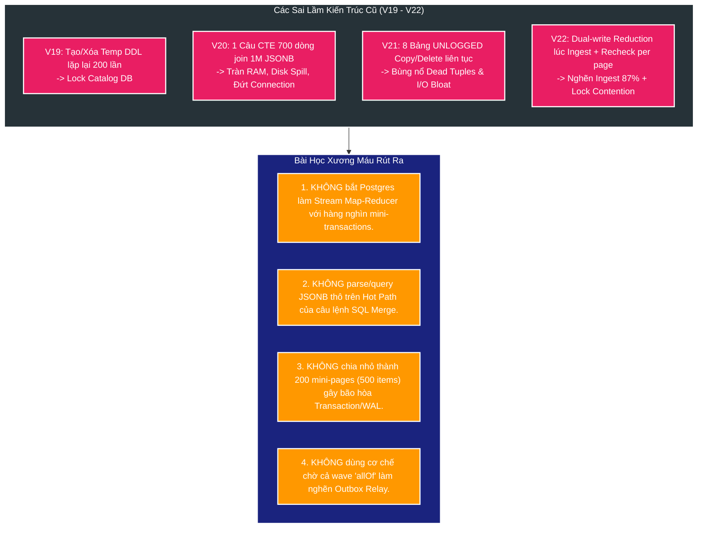
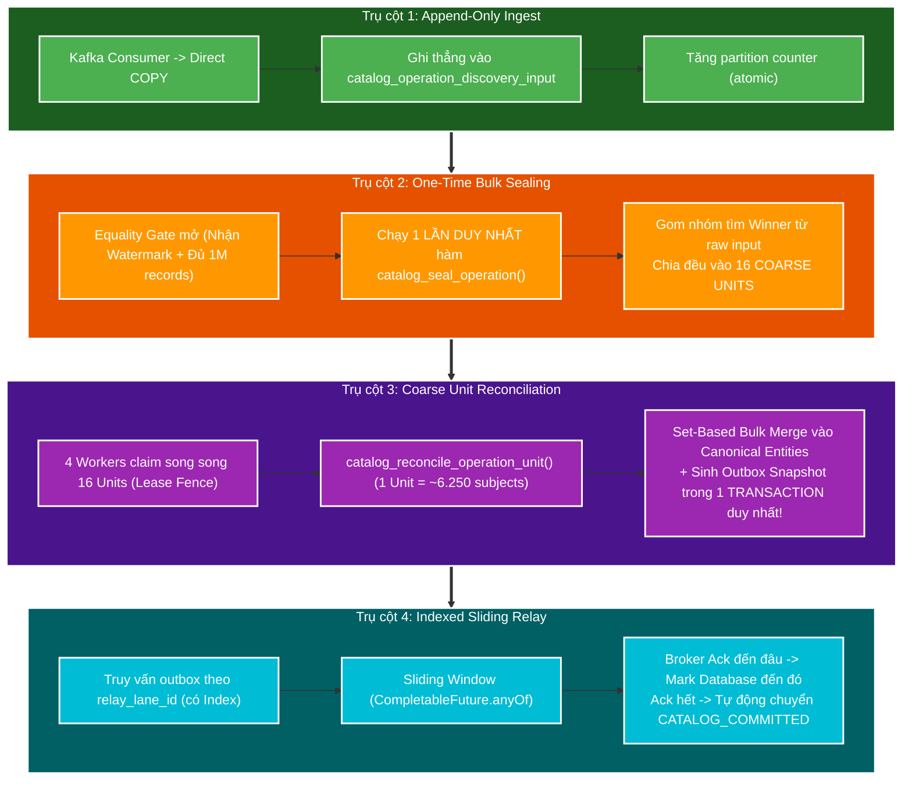

# 🧭 Deep-Dive: Toàn Cảnh Dòng Chảy Dự Án & Tiến Trình Tối Ưu Hóa Catalog Service 1.000.000 Records

> **Mục tiêu tài liệu**: Đúc kết toàn diện từ First Principles kiến trúc, bản chất bài toán nghiệp vụ, nguyên nhân sâu xa của các thế hệ giải pháp thất bại (V19, V20, V21, V22) và cuộc cách mạng tái cấu trúc toàn diện Data Plane trong `catalog-service` (FT-057 / FT-058) để đạt throughput **$\ge 30.000 - 40.000\text{ records/s}$** cho 1 triệu bản ghi.  
> **Áp dụng dự án**: `file_mngt_microservice` (PostgreSQL 17 / Spring Boot 3.4 / JDK 25 Virtual Threads / Workload SC-01 BT-09).

---

## 1. Bản Chất Trong Một Câu & Trục Xương Sống (Core Essence)

> **Bản chất cốt lõi**: `catalog-service` là một **Batch Stream Processor / Aggregate Coalescer** đóng vai trò là "bộ lọc tinh chế dữ liệu": tiếp nhận 1.000.000 sự kiện phát hiện file thô từ `scan-service`, phân rã và hợp nhất (reduce) thành 100.000 cụm thực thể Subject chuẩn mực (Domain Aggregates), lưu trữ vào cơ sở dữ liệu quan hệ và phát tín hiệu thay đổi đồng bộ sang `query-service`.

```mermaid
flowchart LR
    subgraph SCAN["[1] Scan Service"]
        OUT["Scan Outbox\n(1M Files)"]
    end
    
    subgraph KAFKA1["[2] Kafka Ingress"]
        DISC{{"media.file.discovered.v2\n(1.000.000 events)"}}
        WATER1(["Operation Watermark\n(START / SEAL)"])
    end
    
    subgraph CATALOG["[3] Catalog Service (BT-09D / FT-057)"]
        direction TB
        INGEST["Append-Only Ingest\n(COPY -> Raw Stage)"]
        SEAL["One-Time Bulk Seal\n(Equality Gate -> 16 Units)"]
        RECON["Set-Based Unit Reconcile\n(Merge -> Entities + Outbox)"]
        RELAY["Indexed Sliding Relay\n(Continuous Publish & Mark)"]
        INGEST --> SEAL --> RECON --> RELAY
    end
    
    subgraph KAFKA2["[4] Kafka Egress"]
        SNAP{{"media.subject.changed.v2\n(100.000 snapshots)"}}
        WATER2(["CATALOG_COMMITTED\n(Watermark Stage 20)"])
    end
    
    subgraph QUERY["[5] Query Service (BT-09E)"]
        PROJ["Query Read Projection\n(QUERY_DB_READY)"]
    end

    OUT --> DISC
    OUT --> WATER1
    DISC --> INGEST
    WATER1 --> SEAL
    RELAY --> SNAP
    RELAY --> WATER2
    SNAP --> PROJ
    WATER2 --> PROJ

    style SCAN fill:#263238,stroke:#fff,stroke-width:2px,color:#fff
    style OUT fill:#009688,stroke:#fff,stroke-width:2px,color:#fff
    style KAFKA1 fill:#004D40,stroke:#fff,stroke-width:2px,color:#fff
    style DISC fill:#00BCD4,stroke:#fff,stroke-width:2px,color:#fff
    style WATER1 fill:#2196F3,stroke:#fff,stroke-width:2px,color:#fff
    style CATALOG fill:#311B92,stroke:#fff,stroke-width:2px,color:#fff
    style INGEST fill:#4CAF50,stroke:#fff,stroke-width:2px,color:#fff
    style SEAL fill:#FF9800,stroke:#fff,stroke-width:2px,color:#fff
    style RECON fill:#9C27B0,stroke:#fff,stroke-width:2px,color:#fff
    style RELAY fill:#00BCD4,stroke:#fff,stroke-width:2px,color:#fff
    style KAFKA2 fill:#004D40,stroke:#fff,stroke-width:2px,color:#fff
    style SNAP fill:#00BCD4,stroke:#fff,stroke-width:2px,color:#fff
    style WATER2 fill:#2196F3,stroke:#fff,stroke-width:2px,color:#fff
    style QUERY fill:#263238,stroke:#fff,stroke-width:2px,color:#fff
    style PROJ fill:#4CAF50,stroke:#fff,stroke-width:2px,color:#fff
```



> [!TIP]
> ### 💡 Từ điển Thuật ngữ & Mental Model (Gốc từ & Cách liên tưởng)
>
> 1. **Coalescing / Reduction (Gom nhóm & Thu nhỏ dữ liệu)**:
>    - **Nghĩa tiếng Anh thuần**: `Coalesce` là *sáp nhập, kết hợp nhiều phần tử rời rạc thành một khối duy nhất*; `Reduction` là *sự thu gọn, rút ngắn*.
>    - **Trong ngữ cảnh dự án**: 1 bộ phim (Subject) có 10 file (1 file video chính, 2 trailer, 3 hình ảnh poster, 4 file phụ đề). Khi Scan quét ổ cứng, nó bắn ra 10 sự kiện file riêng biệt. Catalog có nhiệm vụ **Coalesce/Reduce 10 sự kiện lẻ này thành 1 thực thể Phim duy nhất**.
>    - **Tại sao gọi như vậy**: Giống như bạn gom 10 mảnh ghép rời rạc của một bức tranh lại thành 1 bức tranh hoàn chỉnh.
>    - **Cách liên tưởng**: *"Gom 10 viên gạch rời thành 1 ngôi nhà hoàn chỉnh"*.
>
> 2. **Aggregate Root (Gốc Cụm Thực Thể)**:
>    - **Nghĩa tiếng Anh thuần**: `Aggregate` là *tập hợp, cụm lại*; `Root` là *gốc rễ*.
>    - **Trong ngữ cảnh dự án**: `media_subject` là Root. Mọi bảng con như `media_asset`, `media_asset_tag`, `media_subject_actress` đều phụ thuộc vào Subject. Không thể sửa Asset hay Tag một cách vô tội vạ mà không thông qua vòng đời của Subject.
>    - **Cách liên tưởng**: *"Trưởng hộ gia đình — mọi giấy tờ của thành viên trong nhà đều quy về sổ hộ khẩu do trưởng hộ đứng tên"*.
>
> 3. **Watermark & Completion Barrier (Mốc nước & Hàng rào chắn hoàn thành)**:
>    - **Nghĩa tiếng Anh thuần**: `Watermark` là *ngấn nước / vạch đo mức nước lũ*; `Barrier` là *thanh chắn barrier ở trạm thu phí*.
>    - **Trong ngữ cảnh dự án**: Là thông điệp đặc biệt do Scan phát ra cho biết: *"Tao đã gửi đủ 1.000.000 file rồi đấy!"*. Hàng rào chắn (Barrier) của Catalog sẽ giữ lại, chỉ khi đếm đủ đúng 1 triệu file trong DB và nhận được Watermark này thì mới mở cổng cho tiến trình Merge hoạt động.
>    - **Cách liên tưởng**: *"Điểm danh đủ 100 học sinh trên xe buýt thì bác tài mới đóng cửa cho xe chạy"*.

---

## 2. D0 — Bối Cảnh Nghiệp Vụ & Tại Sao Catalog Lại Phức Tạp Hơn Scan?

Nhiều kỹ sư thường thắc mắc: *"Tại sao `scan-service` quét và ghi 1.000.000 files chỉ mất < 30 giây, mà `catalog-service` đưa dữ liệu từ bảng đệm sang bảng chính lại chật vật và timeout qua nhiều phiên bản?"*.

Câu trả lời nằm ở **Sự khác biệt bản chất về Mô hình Dữ liệu (Data Model Complexity)**:

```text
[Scan Service Model: DỮ LIỆU PHẲNG 1:1]
1 File trên đĩa ───► 1 Dòng trong DB (scan_file_inventory)
- Không quan hệ 1-N.
- Không bầu chọn (Election).
- Chỉ việc chạy 1 câu INSERT INTO ... SELECT FROM stage!

──────────────────────────────────────────────────────────────────

[Catalog Service Model: CỤM ĐỐI TƯỢNG PHÂN CẤP 1:N PHỨC TẠP]
10 File Events ───► 1 media_subject (Aggregate Root)
                       ├── N media_asset (VIDEO, POSTER, SUBTITLE...)
                       │      └── N media_asset_tag (Tags riêng của từng file)
                       ├── N media_subject_actress (Danh sách diễn viên)
                       ├── Thuật toán Bầu chọn: PRIMARY_VIDEO ELECTION
                       ├── Kế thừa Tags: Copy tags từ Primary Video lên Subject
                       ├── Chặn hồi sinh: Tombstone Protection (catalog_removed_asset_locator)
                       ├── Đồng bộ Master Data: master_data_registry
                       └── Change Detection & Outbox: Dựng JSON Snapshot nếu có thay đổi
```

### 📋 6 Bất biến nghiệp vụ bắt buộc của Catalog (Domain Invariants):
1. **Primary Video Election (Bầu chọn Video chính)**: Nếu 1 Subject có 3 file video, hệ thống phải áp dụng thuật toán: ưu tiên video không chứa tag cảnh báo $\to$ ưu tiên video đã set PRIMARY $\to$ ưu tiên ngày tạo cũ nhất $\to$ UUID nhỏ nhất.
2. **Tag Inheritance (Kế thừa Tag)**: Mọi tag của Primary Video vừa được bầu chọn phải được đồng bộ lên bảng `media_subject_tag`.
3. **Tombstone Protection (Chống hồi sinh file rác)**: Nếu một file đã từng bị người dùng chủ động xóa trước đó (lưu trong `catalog_removed_asset_locator`), đợt scan mới không được phép tự ý thêm lại file đó vào hệ thống.
4. **Master Data Registry Versioning**: Bất kỳ diễn viên (`actress`) mới nào xuất hiện phải được insert vào bảng `actress` và tăng `version` của `master_data_registry`.
5. **Exact Versioning & Change Detection**: Chỉ khi Subject Aggregate thực sự thay đổi dữ liệu (so sánh hash trạng thái cũ vs mới), Subject mới được tăng `version` và sinh 1 bản tin `media.subject.changed.v2` vào bảng Outbox. Subject không đổi giữ nguyên version và không sinh Outbox.
6. **Oversized Snapshot Protection**: Nếu payload snapshot JSON của Subject vượt quá giới hạn an toàn (`921.600 bytes`), hệ thống phải chặn đứng (`BLOCKED`) để bảo vệ Kafka broker.

---

## 3. D2 — Dòng Chảy Tiến Hóa: Mổ Xẻ 4 Thế Hệ Thất Bại (Post-Mortem V19–V22)

Để hiểu được vì sao kiến trúc hiện tại (**FT-057 / FT-058**) ra đời, chúng ta cần nhìn lại lịch sử các nỗ lực tối ưu và bài học xương máu rút ra từ các phiên bản trước:

| Phiên bản | Cơ chế cốt lõi | Kết quả đo 25K (Calibration) | Kết quả đo 1M (Qualification) | Nguyên nhân thất bại gốc rễ (Root Cause) |
| :--- | :--- | :---: | :---: | :--- |
| **FT-054** *(Legacy)* | JPA Entity Lifecycle & Row-by-row dirty check | $423\text{ms}$ ($59\text{ rec/s}$) | **TIMEOUT (> 5 phút)** | ORM Overhead: Sinh hàng triệu câu SQL `SELECT/UPDATE` rời rạc, làm nghẽn Hibernate session cache. |
| **FT-055** *(Ingest)* | Khóa Ingest bằng PostgreSQL `COPY` + Typed Stage | $1.164\text{ms}$ ($21.478\text{ rec/s}$) | **$24.527\text{s}$ ($40.771\text{ rec/s}$)** | Ingest thành công xuất sắc, nhưng toàn bộ gánh nặng xử lý JSONB bị dồn sang bước SQL Merge. |
| **FT-056 V19** | Stored Procedure + `TEMPORARY TABLE` + `ANALYZE` | $2.032\text{s}$ ($1.230\text{ subj/s}$) | **TIMEOUT (> 2 phút)** | **DDL Lock Contention**: Mỗi page 500 items tạo 7 bảng tạm, 4 index và 5 lệnh `ANALYZE` $\to$ Lock Postgres Catalog DDL liên tục. |
| **FT-056 V20** | Common Table Expressions (CTE) thuần túy 700 dòng | $2.633\text{s}$ ($949\text{ subj/s}$) | **SẬP CONNECTION (OOM)** | **Query Planner Memory Spill**: Postgres Planner chuyển sang Hash Join trên 1M dòng JSONB, tràn bộ nhớ đệm `work_mem` $\to$ Disk spill, đứt kết nối. |
| **FT-056 V21** | 8 Bảng `UNLOGGED` Scratch Tables cố định | Chậm hơn V19 | **TIMEOUT (> 2 phút)** | **Dead-Tuple Churn & I/O Bloat**: Mỗi page `INSERT INTO scratch` rồi `DELETE FROM scratch` $\to$ Sinh hàng triệu dead tuples, phình đĩa, vacuum quá tải. |
| **FT-056 V22** | Dual-write Typed Reduction ngay lúc Ingest | $39.278\text{s}$ ($64\text{ subj/s}$) | **TIMEOUT (> 2 phút)** | **Ingest Churn + Lock Contention**: Ingest bị chậm gấp 10 lần (`stageSql=87.3%`), Finalizer gọi `count(*)` và kiểm tra rebuild trên từng page gây lock đè nhau. |



> [!TIP]
> ### 💡 Từ điển Thuật ngữ & Mental Model (Gốc từ & Cách liên tưởng)
>
> 1. **Dead Tuple & Table Bloat (Xác dữ liệu chết & Phình bảng)**:
>    - **Nghĩa tiếng Anh thuần**: `Tuple` là *bản ghi / dòng dữ liệu*; `Dead` là *đã chết*; `Bloat` là *bị sưng phồng, phình to*.
>    - **Trong ngữ cảnh dự án**: Trong PostgreSQL, khi bạn chạy lệnh `DELETE` hoặc `UPDATE`, Postgres không xóa ngay dòng đó trên đĩa mà chỉ đánh dấu nó là "đã chết" (Dead Tuple) để phục vụ MVCC. Ở bản V21, việc liên tục nhét dữ liệu vào bảng tạm rồi DELETE sau mỗi 500 items đã sinh ra hàng triệu xác chết dữ liệu, khiến bảng phình to hàng Gigabyte và làm đĩa cứng nghẽn thở!
>    - **Cách liên tưởng**: *"Nhà ăn liên tục xả rác ra sàn sau mỗi lượt khách mà không kịp quét dọn, chẳng mấy chốc rác ngập đến trần nhà"*.
>
> 2. **Disk Spill / Work_mem Exhaustion (Tràn đĩa cứng khi sắp xếp/gom nhóm)**:
>    - **Nghĩa tiếng Anh thuần**: `Spill` là *tràn ra ngoài*; `work_mem` là *bộ nhớ RAM cấp riêng cho một câu lệnh SQL để sắp xếp/tính toán*.
>    - **Trong ngữ cảnh dự án**: Khi câu lệnh SQL V20 cố gom 1 triệu dòng JSONB trong RAM, dung lượng vượt quá `work_mem` (mặc định 4MB-64MB) $\to$ Postgres buộc phải ghi tạm dữ liệu xuống đĩa cứng (Disk Spill) $\to$ Tốc độ tụt từ vài Gigabyte/s (trên RAM) xuống còn vài Megabyte/s (trên đĩa cứng).
>    - **Cách liên tưởng**: *"Bàn làm việc quá nhỏ không để vừa tài liệu, phải chạy đi chạy lại bê từng chồng tài liệu cất vào kho"*.

---

## 4. D3 — Cuộc Cách Mạng Kiến Trúc: FT-057 (Bulk Reconciliation Data Plane)

Để giải quyết triệt để 4 sai lầm trên, **FT-057** thiết lập lại toàn bộ Data Plane nội bộ của Catalog Service dựa trên **4 Trụ Cột Đột Phá**:



### 🔍 Đi sâu vào chi tiết 4 Trụ Cột của FT-057:

#### 1. Trụ cột 1: Append-Only Ingest Thuần Túy
* **Nguyên tắc**: Trong lúc đang nhận bản tin từ Kafka, **tuyệt đối không tính toán hay gom nhóm**.
* **Cơ chế**: Java map sự kiện thành các cột dữ liệu phẳng (`TypedIngestRow`), dùng PostgreSQL `COPY` đẩy thẳng vào bảng `catalog_operation_discovery_input` (có sẵn các cột typed như `storage_key`, `relative_path`, `role`, `tag_names` thay vì nhét cả cục JSON). Cập nhật số lượng vào `catalog_operation_ingest_partition`.
* **Kết quả**: Tốc độ Ingest đạt mức tối đa của phần cứng ($\ge 40.000\text{ records/s}$).

#### 2. Trụ cột 2: One-Time Bulk Sealing (`catalog_seal_operation`)
* **Nguyên tắc**: Chờ khi nào có đủ 1.000.000 records và nhận được tín hiệu Watermark (Equality Gate) thì mới thực hiện gom nhóm **đúng 1 lần duy nhất**.
* **Cơ chế**:
  * Kiểm tra hợp lệ: `received_count == expected_count` và `unresolved_dlt_count == 0`.
  * Chạy 1 câu lệnh `DISTINCT ON (subject_key)` để tìm subject winner, băm đều vào **16 Coarse Units** (sử dụng `mod(routing_bucket, 16)` trên 4.096 routing buckets).
  * Chuyển trạng thái Operation từ `INGESTING` sang `RECONCILING`.

#### 3. Trụ cột 3: Coarse Unit Reconciliation (`catalog_reconcile_operation_unit`)
* **Nguyên tắc**: Thay vì chia vụn 200–256 mini-pages (500 items) làm bão hòa transaction, hệ thống chia thành **16 Units** (mỗi unit chứa khoảng $\sim 6.250\text{ subjects}$ và $\sim 62.500\text{ assets}$).
* **Cơ chế**:
  * 4 Worker luồng ảo của Java tranh chấp claim 16 units thông qua Lease Fencing (`lease_owner, lease_until, fence_token`).
  * Toàn bộ quá trình Merge của 1 Unit được thực hiện gọn gàng trong **đúng 1 Database Transaction**:
    1. Đọc winner từ input table vào bảng tạm có cấu trúc rõ ràng.
    2. Bulk Insert vào `media_subject` (bỏ qua tính hash đối với subject mới tạo).
    3. Bulk Insert vào `media_asset` và xử lý `media_asset_tag`.
    4. Bầu chọn `PRIMARY_VIDEO` và cập nhật vai trò, đồng bộ tags lên subject.
    5. Cập nhật diễn viên vào `media_subject_actress` và tăng version của `master_data_registry`.
    6. Tăng `version` của Subject chỉ khi có sự thay đổi thực sự (`tmp_catalog_changed_subject`).
    7. Sinh JSON snapshot đưa vào `catalog_outbox_event` (được gán sẵn `relay_lane_id`).
    8. Đánh dấu Unit và Workset `COMPLETED` cùng lúc.

#### 4. Trụ cột 4: Indexed Sliding-Window Outbox Relay
* **Nguyên tắc**: Không bao giờ dùng `CompletableFuture.allOf` để chờ cả một khối bản tin lớn (vì 1 bản tin bị chậm mạng sẽ làm đơ toàn bộ các bản tin khác).
* **Cơ chế**:
  * Bảng `catalog_outbox_event` có cột `relay_lane_id` được gán tự động qua Trigger và có Partial Index:
    ```sql
    CREATE INDEX idx_catalog_outbox_pending_relay_lane_v23
        ON catalog_outbox_event(relay_lane_id, created_at, id)
        WHERE published_at IS NULL;
    ```
  * Relay Coordinator dùng cơ chế **Cửa sổ trượt (Sliding Window)** với `CompletableFuture.anyOf`: bản tin nào gửi sang Kafka nhận được ACK trước $\to$ thực hiện đánh dấu `published_at` vào Database ngay lập tức và kéo bản tin tiếp theo vào cửa sổ.
  * Khi bản tin cuối cùng và Watermark được ACK $\to$ Trigger DB tự động đưa Operation lên trạng thái `CATALOG_COMMITTED` (Stage 20).

---

## 5. D3 — Bảng Định Mức Năng Lực & Phân Bổ Thời Gian (Capacity Model)

Để đạt được mục tiêu tổng thể $\ge 30.000\text{ records/s}$ (xử lý 1.000.000 records trong $\le 33.3\text{s}$), định mức thời gian cho từng chặng được thiết lập như sau:

| Chặng xử lý (Phase) | Ngưỡng cam kết tối thiểu (Gate) | Ngưỡng kỳ vọng (Stretch) | Cơ chế kỹ thuật đảm bảo |
| :--- | :---: | :---: | :--- |
| **1. Append-Only Ingest** | $\le 8.000\text{ms}$ ($\ge 125\text{k rec/s}$) | $\le 5.000\text{ms}$ ($\ge 200\text{k rec/s}$) | 8 Kafka Consumer threads + Direct PostgreSQL `COPY`. |
| **2. One-Time Seal & Reconcile** | $\le 20.000\text{ms}$ ($\ge 50\text{k rec/s}$) | $\le 15.000\text{ms}$ ($\ge 66\text{k rec/s}$) | 16 Coarse Units + Set-Based Bulk Merge trên 4 Worker threads. |
| **3. Sliding Outbox Relay** | $\le 5.334\text{ms}$ ($\ge 18.7\text{k msg/s}$) | $\le 5.000\text{ms}$ ($\ge 20\text{k msg/s}$) | Relay 100.000 subject snapshots bằng Indexed Sliding Window. |
| **🏁 TỔNG THỜI GIAN TOÀN CATALOG** | **$\le 33.334\text{ms}$ ($\ge 30.000\text{ rec/s}$)** | **$\le 25.000\text{ms}$ ($\ge 40.000\text{ rec/s}$)** | **Hoàn thành trọn vẹn toàn bộ vòng đời của 1.000.000 records!** |

---

## 6. D4 — Giai Đoạn Hiện Tại (FT-058) & Bức Tranh Lộ Trình Phía Trước

### 📍 Hiện tại chúng ta đang ở đâu?
* **FT-057** đã hoàn thành việc tái cấu trúc mã nguồn tại commit `4777fbe4` (bao gồm Migration V23, `CatalogOperationUnitStore`, `CatalogOperationFinalizer`, `CatalogOutboxRelayCoordinator`).
* **FT-058 (Phase hiện tại)** là giai đoạn **Thực nghiệm, Đo đạc & Tinh chỉnh chuyên sâu (Empirical Qualification & Tuning)**:
  1. **Khảo sát số lượng Unit (Unit Ladder)**: Thử nghiệm thực tế các mức `8 → 16 → 32 → 64` Units để tìm ra điểm cân bằng tối ưu giữa thời gian Lock và dung lượng bộ nhớ `work_mem` của Postgres.
  2. **Kiểm thử khả năng phục hồi (Resilience Testing)**: Kiểm chứng tính an toàn khi Worker bị ngắt đột ngột giữa chừng (Crash recovery), mất mạng Kafka broker và phục hồi Lease Fencing.
  3. **Đạt chuẩn 3 lần chạy liên tiếp (Three-Run Verification)**: Chứng minh bằng số liệu thực tế cả 3 lần chạy 1.000.000 records đều hoàn tất dưới $33.3$ giây.

### 🗺️ Bức tranh lộ trình tiếp theo của toàn dự án (SC-01 BT-09):

```text
[ĐÃ XONG] BT-09A: Chốt Contract & Watermark Protocol (FT-044)
   │
   ▼
[ĐÃ XONG] BT-09B: Scan Decision Chunking & Outbox Atomic (FT-050/051)
   │
   ▼
[ĐÃ XONG] BT-09C: Scan Outbox Continuous Lane Drain (FT-053: 121k rec/s)
   │
   ▼
[ĐANG LÀM] BT-09D: Catalog Bulk Reconciliation Data Plane (FT-057 / FT-058: 30k-40k rec/s)
   │
   ▼
[TIẾP THEO] BT-09E: Query Service Bulk Projection (Batch Consumer -> Upsert Read Model)
   │
   ▼
[TIẾP THEO] BT-09F: Failure Injection & DLT Replay Runbook
   │
   ▼
[ĐÍCH ĐẾN] BT-09G: Toàn bộ Pipeline 1 Triệu Records đạt trạng thái QUERY_DB_READY!
```

---

## 7. Cẩm Nang Hỏi - Đáp Phỏng Vấn Kiến Trúc (Senior / Lead Q&A)

### ❓ Câu hỏi 1: Tại sao không dùng Kafka Streams hoặc Apache Flink để gom nhóm (Coalesce) mà lại làm trong PostgreSQL?
* **Trả lời 30 giây**: Dùng Kafka Streams hay Flink sẽ sinh ra thêm một cụm hạ tầng phân tán phức tạp cần vận hành (State Store, RocksDB changelog topic, rebalancing overhead). Trong khi đó, Catalog vẫn bắt buộc phải là Source of Truth lưu trữ dữ liệu bền vững (ACID) vào PostgreSQL. Kiến trúc FT-057 tận dụng khả năng tính toán Set-Based cực mạnh của PostgreSQL kết hợp phân vùng Coarse Units giúp hệ thống đạt throughput 40.000 rec/s mà không cần cõng thêm một công nghệ hạ tầng nặng nề nào.
* **Trả lời sâu 2 phút**: Phân tích trade-off giữa Operational Cost vs Throughput; giải thích cách phân 16 Coarse Units để vừa vặn trong `work_mem` của PostgreSQL mà không bị disk spill.

### ❓ Câu hỏi 2: Tại sao V19 và V21 đều dùng bảng tạm nhưng lại thất bại, còn V23 lại thành công?
* **Trả lời 30 giây**: V19 thất bại vì tạo/xóa bảng tạm DDL hàng trăm lần làm lock Catalog PostgreSQL. V21 thất bại vì lạm dụng bảng UNLOGGED copy/delete liên tục làm bùng nổ dead tuples và phình đĩa. V23 thành công vì: (1) Ingest ghi thẳng dữ liệu phẳng không qua bảng tạm; (2) Toàn bộ đợt quét gom nhóm chỉ chạy 1 lần duy nhất; (3) Reconcile theo 16 Unit lớn trong 1 Transaction khép kín, triệt tiêu 90% overhead DDL và lock.

### ❓ Câu hỏi 3: Làm thế nào để đảm bảo tính Idempotency khi một Unit bị Re-run (chạy lại) do mất mạng?
* **Trả lời 30 giây**: Nhờ 3 lớp bảo vệ: (1) **Lease Fencing Token**: Chỉ Worker nào có token hợp lệ mới được ghi kết quả; (2) **Deterministic Winner Selection**: Thuật toán chọn winner dựa trên bộ ba cố định `(source_partition, source_offset, event_id)` nên dù chạy lại 100 lần vẫn ra cùng 1 kết quả; (3) **Unique Constraint trên Outbox**: Bảng Outbox có unique index `(operation_id, subject_id, event_type)` ngăn chặn hoàn toàn việc phát sinh bản tin trùng lặp.
