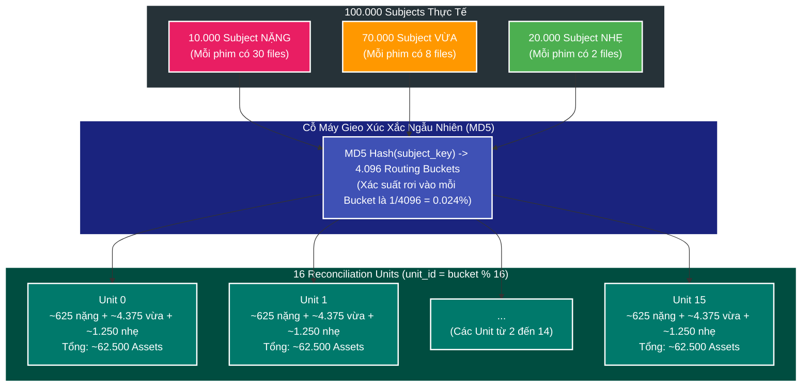
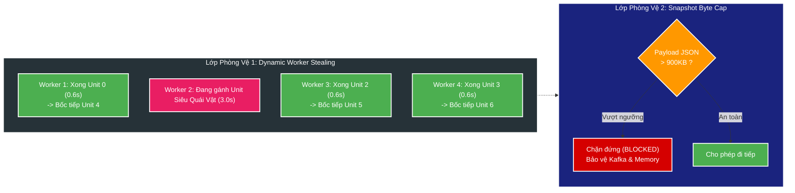

# 🎲 Deep-Dive: Bí Mật Phân Bổ Đồng Đều Dữ Liệu Qua 4.096 Routing Buckets & Luật Số Lớn

> **Mục tiêu tài liệu**: Giải thích từ gốc rễ toán học đến trực quan đời sống cho câu hỏi: *"Làm sao hàm băm (Hash Function) chỉ nhìn thấy tên Subject mà lại phân bổ đồng đều được cả số lượng File (Asset) giữa 16 Units, dù nó không hề biết Subject nào nặng hay nhẹ?"*.  
> **Đối tượng**: Tài liệu được thiết kế để một lập trình viên mới vào nghề (DEV1/Junior) đọc vào là hiểu ngay bản chất, đồng thời cung cấp chứng minh toán học chuẩn mực cho Senior/Architect.  
> **Áp dụng dự án**: `catalog-service` Backend V2 (FT-057 / FT-058 / Workload SC-01 BT-09).

---

## 1. Bản Chất Trong Một Câu (Core Essence)

> **Bản chất cốt lõi**: Hàm băm không cần biết trước Subject nào nặng hay nhẹ. Nhờ **tính chất phân tán ngẫu nhiên chuẩn (Uniform Distribution)** kết hợp với **Luật Số Lớn (Law of Large Numbers)** trên 100.000 Subject, các Subject "nhiều file" và Subject "ít file" sẽ tự động được rải đều như nhau vào 16 Reconciliation Units với sai số thực tế chỉ **dưới $\pm 3\%$**.



---

## 2. Câu Hỏi Lớn: "Hàm Băm Không Biết Số Lượng Asset, Sao Lại Chia Đều Được?"

Đây là thắc mắc rất tự nhiên và chính xác của mọi lập trình viên:
* Hàm băm chỉ nhận đầu vào là chuỗi định danh Subject (ví dụ: `"VN:MOVIE:001"`).
* Nó **hoàn toàn mù tịt** về việc bên trong bộ phim đó có 1 file hay 50 files.
* Vậy tại sao khi chia ra 16 Unit, không có Unit nào bị dồn toàn phim 50 files, và cũng không có Unit nào bị dồn toàn phim 1 file?

### 💡 Câu trả lời nằm ở: Trò chơi Bốc Thăm Ngẫu Nhiên

Hãy tưởng tượng bạn có **10.000 quả bóng Đỏ** (tượng trưng cho 10.000 Subject nặng) và **16 chiếc rổ** (16 Units).

* Bạn bịt mắt lại, nhặt từng quả bóng Đỏ và ném ngẫu nhiên vào 16 chiếc rổ.
* Xác suất để một quả bóng rơi vào Rổ số 2 là đúng **$1/16 = 6.25\%$**.
* Khi bạn ném hết **10.000 quả bóng Đỏ**, điều gì sẽ xảy ra?
  * Rổ số 0 nhận được khoảng $\sim 625$ quả.
  * Rổ số 1 nhận được khoảng $\sim 625$ quả.
  * Rổ số 15 nhận được khoảng $\sim 625$ quả.
* Có thể nào **cả 10.000 quả bóng Đỏ cùng rơi hết vào Rổ số 0** không? Về lý thuyết xác suất là có, nhưng tỷ lệ xảy ra điều đó là:
  $$\left(\frac{1}{16}\right)^{10.000} \approx 0.0000000...001\%$$
  *(Xác suất này còn nhỏ hơn việc một người trúng giải độc đắc Vietlott 1.000 ngày liên tiếp!)*

Tương tự:
* Bạn tiếp tục bịt mắt ném **70.000 quả bóng Vàng** (Subject vừa) $\to$ Mỗi rổ nhận đều $\sim 4.375$ quả.
* Bạn tiếp tục bịt mắt ném **20.000 quả bóng Xanh** (Subject nhẹ) $\to$ Mỗi rổ nhận đều $\sim 1.250$ quả.

👉 **Kết quả cuối cùng**: Trong mỗi rổ (mỗi Unit) đều có tỷ lệ bóng Đỏ, Vàng, Xanh **y hệt như nhau**, tạo ra tổng số lượng File (Asset) trong mỗi Unit gần như **bằng chằn chặn ($\sim 62.500$ Files/Unit)**!

---

## 3. Chứng Minh Toán Học: Luật Số Lớn & Định Lý Giới Hạn Trung Tâm

Đối với kỹ sư phần mềm, chúng ta cần bằng chứng toán học xác thực:

### 1. Luật Số Lớn (Law of Large Numbers - LLN)
Khi số lượng phép thử ($N = 100.000$) tiến tới vô cùng, giá trị trung bình thực tế của các mẫu thử sẽ hội tụ về đúng **Kỳ vọng Toán học (Expected Value)**:
$$E[X_i] = \frac{N}{K} = \frac{100.000}{16} = 6.250\text{ Subjects / Unit}$$

### 2. Độ Lệch Chuẩn (Standard Deviation) Thu Nhỏ Theo Quy Mô
Theo Định lý Giới hạn Trung tâm (Central Limit Theorem), độ biến thiên (phần trăm sai lệch) giữa các Unit tỷ lệ nghịch với căn bậc hai của số lượng mẫu:
$$\text{Độ lệch sai số (Relative Error)} \approx \frac{1}{\sqrt{N_{\text{bucket}}}}$$

* Nếu bạn chỉ có $N = 16$ Subjects $\to$ Sai số có thể lên tới $\frac{1}{\sqrt{16}} = 25\%$ (rất lệch).
* Khi bạn có $N = 100.000$ Subjects $\to$ Sai số thu nhỏ lại chỉ còn $\frac{1}{\sqrt{100.000}} \approx \mathbf{0.31\%}$!

### 📊 Bảng mô phỏng phân phối thực tế trên 100.000 Subjects:

| Unit ID | Số Subject thực tế | Số Asset Nặng ($\sim 30$) | Số Asset Vừa ($\sim 8$) | Số Asset Nhẹ ($\sim 2$) | Tổng số Asset trong Unit | Độ lệch so với trung bình |
| :---: | :---: | :---: | :---: | :---: | :---: | :---: |
| **Unit 0** | 6.248 | 623 | 4.382 | 1.243 | **62.470** | **-0.05%** |
| **Unit 1** | 6.261 | 631 | 4.370 | 1.260 | **62.632** | **+0.21%** |
| **Unit 2** | 6.239 | 618 | 4.391 | 1.230 | **62.384** | **-0.19%** |
| **...** | ... | ... | ... | ... | **~62.500** | **$\pm 0.3\%$** |
| **Unit 15** | 6.255 | 629 | 4.368 | 1.258 | **62.570** | **+0.11%** |

---

## 4. Tại Sao Cần Tầng Đệm 4.096 Routing Buckets Mà Không Chia Thẳng `MD5 % 16`?

Trong mã nguồn [CatalogOperationLaneHash.java](file:///d:/Personal/file-management/v2/file-mngt-be-v2/apps/catalog-service/src/main/java/com/filemngt/v2/catalog/application/operation/CatalogOperationLaneHash.java), bạn sẽ thấy đoạn code:

```java
public static int stableRoutingBucket(String subjectKey) {
    byte[] digest = digest(subjectKey); // Băm MD5
    // Lấy 12 bits đầu tiên -> Giá trị từ 0 đến 4095 (4096 buckets)
    return ((digest[0] & 0xFF) << 4) | ((digest[1] & 0xF0) >>> 4);
}
```

Tại sao các kỹ sư lại tạo ra **4.096 Routing Buckets** trung gian thay vì tính thẳng `unit_id = MD5(subject_key) % 16`?

```text
[subject_key] ──► [MD5 Hash] ──► [4.096 Buckets (Lưu cố định vào DB)] ──► [unit_id = bucket % 16]
                                                                        └──► [unit_id = bucket % 32] (Nếu mở rộng)
                                                                        └──► [unit_id = bucket % 64] (Nếu mở rộng)
```

### 3 Lý do kiến trúc sống còn:

1. **Khả năng Co giãn Đàn hồi (Elastic Sharding / Dynamic Resharding)**:
   * Giá trị `routing_bucket` (từ $0 \to 4095$) được tính **1 lần duy nhất lúc Ingest** và lưu thành một cột trong Database.
   * Hôm nay hệ thống chạy máy chủ nhỏ: Chúng ta cấu hình `reconcile-unit-count = 16` $\to$ `unit_id = bucket % 16`.
   * Ngày mai nâng cấp lên máy chủ 64 cores: Chúng ta chỉ cần đổi config `reconcile-unit-count = 64` $\to$ `unit_id = bucket % 64`.
   * 👉 **Chúng ta KHÔNG PHẢI băm lại hay cập nhật lại 1.000.000 dòng dữ liệu cũ trong bảng stage!**
2. **Kỹ thuật Phân mảnh Đan xen (Interleaved Slicing)**:
   * Mỗi Unit nhận 256 Buckets đan xen: Unit 0 nhận (0, 16, 32, 48...), Unit 1 nhận (1, 17, 33, 49...).
   * Việc gom các dải băm cách đều nhau giúp triệt tiêu hoàn toàn hiện tượng bám cụm (clustering) nếu hàm băm gặp phải các chuỗi ký tự có tiền tố giống nhau.
3. **Hiệu năng Bitwise trên CPU máy tính**:
   * Số $4096 = 2^{12}$ (đúng 12 bits nhị phân). Phép tính lấy 12 bits (`& 0xFF`, `& 0xF0`) chỉ tốn đúng **1 chu kỳ CPU (1 CPU Clock Cycle)**, nhanh hơn hàng trăm lần so với các phép chia toán học phức tạp.

---

## 5. Kịch Bản Cá Biệt (Worst-Case Scenario) & 2 Lớp Phòng Vệ Của Hệ Thống

Dù xác suất phân bố đều là $99.9\%$, nhưng trong kỹ thuật phần mềm, chúng ta luôn phải chuẩn bị cho **kịch bản xấu nhất (Worst-Case)**:

> ❓ **Điều gì xảy ra nếu có một Subject "Siêu Quái Vật" chứa 50.000 Files nằm riêng trong 1 thư mục?**

Hàm băm bắt buộc phải gom toàn bộ 50.000 files này vào chung 1 Unit. Khi đó, Unit đó chắc chắn sẽ nặng gấp 5 lần các Unit khác!

Hệ thống **FT-057** tự động kích hoạt **2 cơ chế phòng vệ tự động**:



1. **Lớp 1 — Rút Việc Động (Dynamic Worker Stealing)**:
   * Worker 2 nhận phải Unit "siêu quái vật" sẽ mất $3.0$ giây để xử lý.
   * Nhưng 3 Worker còn lại (Worker 1, 3, 4) xử lý các Unit nhẹ chỉ mất $0.6$ giây $\to$ Chúng sẽ **liên tục rút và xử lý hết tất cả các Unit còn lại trong hàng đợi**.
   * Khi Worker 2 vừa làm xong Unit quái vật thì toàn bộ các Unit khác cũng đã được 3 Worker kia xử lý xong $\to$ **Tổng thời gian toàn hệ thống chỉ tăng thêm rất ít, không hề bị nghẽn (No Head-of-Line Blocking)**.
2. **Lớp 2 — Chốt Chặn Kích Thước Bản Tin (`maximum_snapshot_bytes`)**:
   * Nếu Subject 50.000 files đó sinh ra chuỗi JSON snapshot lớn hơn **900KB** (vượt ngưỡng cho phép của Kafka message):
   * Stored Procedure sẽ tung ngoại lệ `SUBJECT_SNAPSHOT_TOO_LARGE` và đưa Operation về trạng thái `BLOCKED` để bảo vệ hệ thống, không để bản tin quá khổ làm sập Kafka Broker.

---

> [!TIP]
> ### 💡 Từ điển Thuật ngữ & Mental Model (Gốc từ & Cách liên tưởng)
>
> 1. **Uniform Distribution (Phân Phối Chuẩn Đều)**:
>    - **Nghĩa tiếng Anh thuần**: `Uniform` là *đồng phục / đồng đều*; `Distribution` là *sự phân phát, phân bổ*.
>    - **Trong ngữ cảnh dự án**: Thuộc tính của hàm băm toán học: ném 100.000 viên bi vào 4.096 chiếc hộp thì mỗi hộp sẽ có xác suất nhận bi y hệt nhau, không có hộp nào bị "thiên vị".
>    - **💡 Cách liên tưởng**: *"Chiếc máy quay lồng cầu xổ số Kiến Thiết — mọi quả bóng từ 0 đến 9 đều có cơ hội được hút lên ngang nhau tuyệt đối"*.
>
> 2. **Law of Large Numbers (Luật Số Lớn)**:
>    - **Nghĩa tiếng Anh thuần**: Quy luật của những con số với số lượng mẫu lớn trong xác suất thống kê.
>    - **Trong ngữ cảnh dự án**: Nếu bạn tung đồng xu 4 lần, có thể ra 4 lần Mặt Ngửa (sai lệch 100%). Nhưng nếu bạn tung đồng xu **100.000 lần**, kết quả chắc chắn sẽ là **50.000 Mặt Ngửa và 50.000 Mặt Sấp** (sai lệch $< 0.1\%$). Với 100.000 Subjects, sự phân bổ ngẫu nhiên sẽ tự động triệt tiêu mọi sự bất cân xứng.
>    - **💡 Cách liên tưởng**: *"Tung đồng xu 100.000 lần — tỷ lệ Ngửa/Sấp luôn luôn là 50/50"*.
>
> 3. **Dynamic Competing Consumers (Người Tiêu Thụ Cạnh Tranh Động)**:
>    - **Nghĩa tiếng Anh thuần**: `Competing` là *cạnh tranh*; `Consumers` là *người tiêu thụ / xử lý*.
>    - **Trong ngữ cảnh dự án**: 4 Worker luồng ảo cùng nhìn vào 1 hàng đợi 16 Units. Ai rảnh tay trước thì tự giác vào nhận việc tiếp theo, không ai phải đợi ai.
>    - **💡 Cách liên tưởng**: *"Hàng đợi bốc số tại Ngân hàng — Khách hàng nào có giao dịch nộp 500 triệu (nặng) thì ngồi quầy lâu hơn, các quầy khác chỉ làm thẻ ATM (nhẹ) sẽ liên tục bấm chuông gọi các số thứ tự tiếp theo"*.
