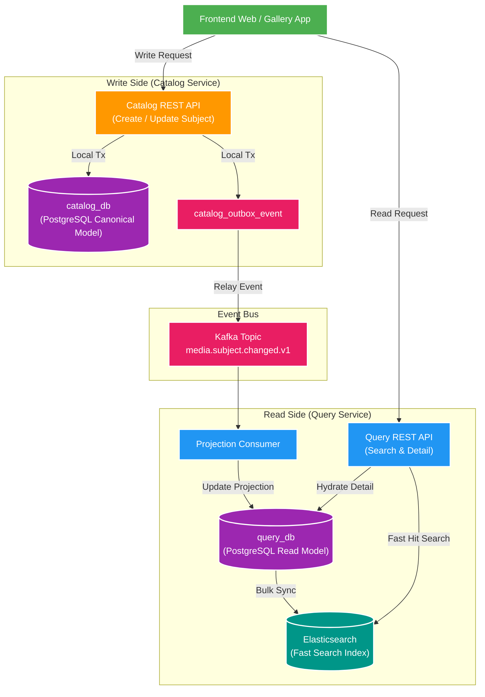

# 📖 CQRS Lite & Eventual Consistency Overview

Tài liệu giải thích mô hình **CQRS Lite** trong Backend V2, lý do tách biệt Write Side (`catalog-service`) và Read Side (`query-service`), khoảng trễ **Eventual Consistency** và cách xử lý trong thực tế.

---

## 1. CQRS Lite là gì? Tại sao không query trực tiếp Write DB?

Trong kiến trúc Monolith truyền thống, ứng dụng thường dùng chung 1 Database và 1 Data Model cho cả việc Ghi (Create/Update) và Đọc (Search/Filter/List).Khi dữ liệu phình to và lượng truy vấn đọc tăng gấp 50-100 lần lượng ghi, việc JOIN nhiều bảng trên Write DB sẽ gây ra:
- **Lock contention**: Các lệnh UPDATE/INSERT làm khóa hàng/khóa bảng, khiến các lệnh SELECT bị treo.
- **Query Complexity**: Phải JOIN liên tục giữa `media_subject` và `media_asset` kèm phân trang, sắp xếp phức tạp.

### Mô hình CQRS Lite trong Backend V2

---

## 2. Bản chất của Eventual Consistency (Nhất quán sau cùng)

### 2.1. Đánh đổi giữa Strong Consistency và Availability/Performance
- **Strong Consistency (Nhất quán mạnh)**: Bắt buộc client chờ ghi xong ở cả DB Đọc và DB Ghi mới trả về thành công. Làm tăng Latency và giảm sức chịu tải.
- **Eventual Consistency (Nhất quán sau cùng)**: Khi Ghi thành công ở `catalog-service`, API trả lời 바로 `200 OK`. Event truyền qua Kafka và cập nhật Read Projection sau vài milisecond.

### 2.2. Xử lý UI UX khi gặp khoảng trễ (Replication Lag)
Trên giao diện Frontend:
1. **Optimistic UI Update**: Giao diện tự thêm item mới vào danh sách tạm thời trước khi Query API trả về.
2. **Polling / WebSocket Notification**: Lắng nghe SSE/WebSocket notification khi Event snapshot đã được Query Service xử lý xong.

---

## 3. Bản so sánh Canonical Write Model vs Read Projection

| Tiêu Chí | Canonical Write Model (`catalog_db`) | Read Projection (`query_db`) |
| :--- | :--- | :--- |
| **Mục đích** | Đảm bảo tính toàn vẹn dữ liệu gốc (SSOT) | Phục vụ truy vấn đọc & tìm kiếm siêu tốc |
| **Cấu trúc Dữ liệu** | Chuẩn hóa Normalized (3NF): `media_subject`, `media_asset` | Làm phẳng Denormalized: 1 bản ghi chứa sẵn JSON assets |
| **Chế độ Quyền** | Write-Heavy (Chỉ Catalog Service được sửa) | Read-Heavy (Query Service chỉ đọc & cập nhật từ Event) |
| **Chỉ mục Index** | Chỉ mục B-Tree trên Primary Key & Identity Key | Chỉ mục GIN, Text Search & Elasticsearch Inverted Index |
