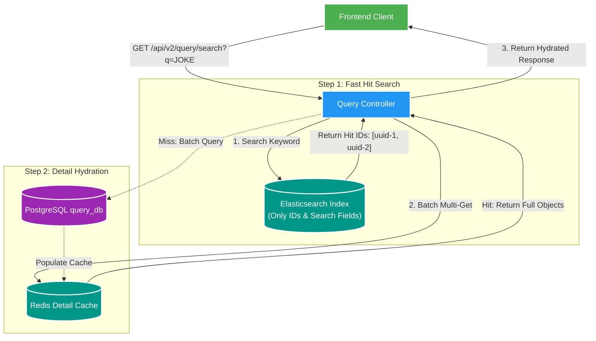

# ⚡ Dual-Store Search: Fast Hit & Hydration Pattern

Tài liệu chi tiết về chiến lược tìm kiếm 2 lớp: **Elasticsearch Fast Hit ID** kết hợp với **PostgreSQL / Redis Detail Hydration** trong `query-service`.

---

## 1. Vấn đề của việc lưu Full Text & Metadata trong Elasticsearch

Nếu lưu toàn bộ thông tin chi tiết (Full JSON object, Assets list, Thumbnail paths) vào Elasticsearch:
- **Tốn dung lượng RAM & Index Size**: Cluster Elasticsearch phải tốn Heap Memory lớn để giữ toàn bộ RAM Cache cho tài liệu.
- **Mapping Explosion**: Thay đổi cấu trúc trường nhỏ ở DB ép phải Reindex toàn bộ Elasticsearch Cluster.
- **Stale Data Risk**: Nếu sync không kịp, thông tin chi tiết trên Elasticsearch dễ bị trễ so với PostgreSQL.

---

## 2. Mô hình Fast Hit Search & Hydration Pattern

Backend V2 áp dụng **Fast Hit & Hydration**:
1. **Elasticsearch Fast Hit**: Elasticsearch chỉ lưu các trường phục vụ Search/Filter (`identityKey`, `title`, `tags`, `subjectId`). Kết quả trả về chỉ gồm danh sách các `subjectId` phù hợp.
2. **Detail Hydration**: `query-service` lấy danh sách `subjectId` từ Elasticsearch, sau đó **Hydrate** (lấy chi tiết) từ Redis Cache (hoặc PostgreSQL `query_db` khi Cache Miss).

---

## 3. Cơ chế Graceful Degradation (Fallback an toàn)

Nếu Cluster Elasticsearch bị sự cố (Down / Timeout):
- `query-service` tự động bắt ngoại lệ và kích hoạt **Fallback Mode**.
- Chuyển sang tìm kiếm trực tiếp bằng PostgreSQL ILIKE / Text Search trên `query_media_subject`.
- API vẫn phản hồi bình thường cho Frontend (chỉ trễ hơn vài ms), đảm bảo **Zero Downtime**.
